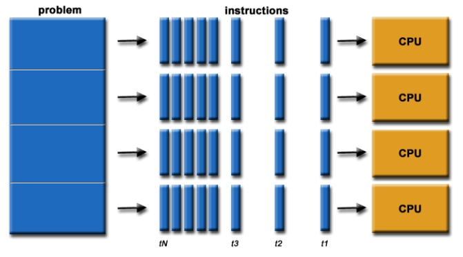

# 1. 对象拷贝

- 浅拷贝shallow copy

  - 重新分配内存，创建**新的拷贝对象**

  - 拷贝对象和原对象，**共享的是引用，不是内存**。换言之，**拷贝对象和原对象的内存地址不同，但是他们的元素的内存地址相同**

  - **原对象obj1**和**拷贝对象obj2**，其中之一变化，会分两种情况：

    1. obj1变化的元素是**可变对象**（比如list，str，dict等），变化是**元素本身增加或者减少元素，**obj2也会跟着变换。

       ```python
       import copy
       obj1=[1,[5,6,7],8,9]
       obj2=copy.copy(obj1)
       obj1[1].append(12)
       
       # obj2躺着变化
       print(obj1,obj2)
       print(id(obj1[1]), id(obj2[1]))
       ```

    2. obj1变化的元素是**不可变对象**（比如tuple），这个元素变化会导致元素的内存地址也变化，换言之，obj1元素地址变了，但是obj2还是原来的地址

       ```python
       import copy
       obj1=[1,[5,6,7],(8,9)]
       obj2=copy.copy(obj1)
       obj1[2]+=(10,11)
       
       # obj2不会变化，并且obj2[2]还是原来的地址，但是obj1[2]地址已经变了
       print(obj1,obj2)
       print(id(obj1[2]), id(obj2[2]))
       ```

    总结：**原对象obj1**和**拷贝对象obj2**，其中之一变化，另一个的变化情况。本质是看变化本身，拷贝以后，它们元素的地址是相同的，所以关键在于，**这种变化会不会引起变化的元素的地址改变**

  - python实现浅拷贝：

    1. copy.copy
    2. 数据类型本身的构建器：`int()`、`list()`等等

- 深拷贝deep copy

  - 依然重新分配内存，创建**新的拷贝对象**
  - 但是既不共享内存，也不共享引用。换言之，**拷贝以后，毫不相干**


# 2. 闭包 

闭包是关于函数的概念，它表示：函数返回的不是运行后的值（如果有返回值），而是**返回一个待运行（待调用）的函数**

# 3. 装饰器

**装饰器通过闭包实现**

基本前提概念：

1. **函数也是对象，可以当做参数传给另一个函数**
2. 函数可以**嵌套**：**函数里定义函数，函数返回函数**

装饰器就是两部分：

- 装饰函数
- 原函数

**装饰器总结一句话：**

- **将原函数当做参数传给装饰函数，装饰函数再返回一个函数闭包当成原函数**

- python中的语法糖@，功能就是这个
  ```python
  # 装饰函数
  def my_decorator(func):
      def wrapper():
          print('wrapper of decorator')
          func()
      return wrapper
  
  # 原函数
  # 等效于：greet = my_decorator(greet)
  @my_decorator
  def greet():
      print('hello world')
  
  greet()
  ```

# 4. 迭代器和生成器

**可迭代对象：**

- 任何实现了迭代器协议的对象，即具有 `__iter__()` 方法的对象，该方法**返回一个迭代器对象**
- 在 Python 中，许多内置的数据类型和数据结构都是可迭代的，包括但不限于：
  1. 序列类型：列表（list）、元组（tuple）、字符串（string）、范围（range）等；
  2. 集合类型：集合（set）、冻结集合（frozenset）等；
  3. 映射类型：字典（dict）等；
  4. 文件对象：打开的文件对象（file object）等。

**迭代器：**

- 实现了**迭代器协议**的对象，即**实现了 `__iter__()` 和 `__next__()` 方法的对象**，其中 **iter**() 方法返回迭代器对象本身，而 **next**() 方法返回**迭代器的下一个元素**

-  next方法返回迭代器下一个元素，直到报错（ StopIteration ）

**生成器：**

- 节省内存版本的迭代器
  1. **只能迭代一次的可迭代对象**
  2. **生成器不会把所有值存储在内存中**
- 创建生成器两种办法：
  1. `(x for x in range(3))`不用`[]`而是`()`
  2. 函数+`yield`关键字
- 自定义函数得到生成器：
  - `yield`用法和`return`类似
  - 调用这个函数，函数并不会运行，而是返回一个生成器对象
  - `for`使用生成器的时候，函数才会从中断的地方（就是yield）继续

# 5. python协程

## 5.1 并发和并行

**并发（Concurrency）**：

- 计算机程序，它的**多个任务或事件能被同时执行**
- 何为**”同时“**，两种情况：
  1. 交错（重叠）执行
  2. 同时执行


**并行（Parallelism）**：

- 仍然是，计算机程序，它的**多个任务或事件能被同时执行**
- 只不过，并行里的**”同时“**，**只能是同时执行**



**注意：**

- 并发和并行，都指向**同一目标**：都是说**某个程序的多个任务可以“同时”执行**。但它们**对"同时"的定义略有不同**
- 网上有些不严谨理解：并发编程里的“同时”就是多任务交替执行，看起来“同时”，但实际上，**并发编程也有并行的情况**，也就是**多个任务在不同处理器真正同时执行**。

**并发和并行都可以真正的“同时”，他们的区别究竟是什么？**

1. 并发编程和并行编程之间的区别，考虑的**不仅仅是多个任务在某个时刻是否同时执行**

2. 关键的区别在于设计和目标：

   - **并发编程**：

     更多地**强调任务之间的独立性和交错执行**，而不是**是否在同一时刻真正同时执行**。并发编程通常涉及到**任务之间的通信、同步和资源共享**等问题，因为它们可能在同一时间轴上交错执行，需要确保数据的一致性和正确性。

   - **并行编程**：

     更多地**强调同一时刻真正的同时执行多个任务**，利用**多核处理器**或者**分布式计算环境**的能力提高系统的性能和吞吐量。在并行编程中，任务的并行执行是显而易见的，因为它们在不同的处理器上并行执行。

   并行编程通常比并发编程更复杂，因为它需要更多地考虑**数据分布、同步、通信**等问题

## 5.2 python并发编程

