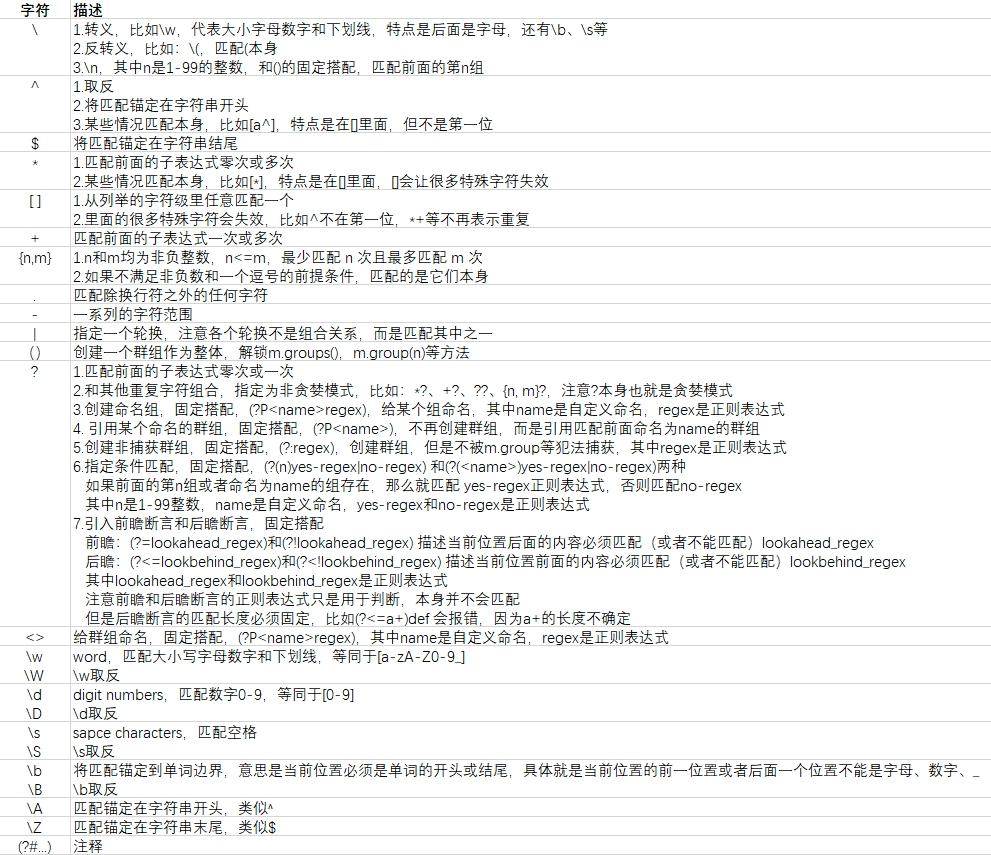
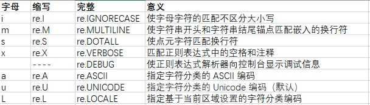

# 概述

参考：

1. [Regular Expressions: Regexes in Python (Part 1) – Real Python](https://realpython.com/regex-python/)
2. [re — Regular expression operations — Python 3.12.1 documentation](https://docs.python.org/3/library/re.html#functions)

正则表达式，Regular Expression，简称为RegExp或Regex

- 定位：

  是一种**匹配字符串的语言规则**，主流编程语言都支持这种规则，比如python、java、c++、php、go等，大多数 Unix 工具和许多文本编辑器也支持

正则表达式的逻辑，就是**在文本中找到匹配某种模式（规律）的部分，对这一部分执行某种操作**

广泛意义的正则表达式包括： 

1. 模式（规则）：核心，用正则表达式语言来描述需要的规律，包括：

   - 普通字符：例如**字母、数字、标点符号等**，它们代表自身
   - 元字符：特殊用处的字符，例如 `^`、`.`、`*`、`+`、`?`、`|` 等，用于描述匹配规则

   注意，**正则表达式写完是需要编译的，可以显式的编译一种模式，重复使用。还可以将模式写在操作里，在操作前都会自动编译**。

   显式编译正则表达式：`pattern = re.compile(<regex>, flags=0)`

   编译在具体操作里自动，比如：`match_obj = re.search(<regex>, <string>)`

2. 操作：

   - 匹配

     `re.match(<regex>, <string>, flags=0)`

     `re.fullmatch(<regex>, <string>, flags=0)`

   - 查找

     `re.search(<regex>, <string>, flags=0)`

     `re.findall(<regex>, <string>, flags=0)`

     `re.finditer(<regex>, <string>, flags=0)`

   - 分割

     `re.split(<regex>, <string>, maxsplit=0, flags=0)`

   - 替换

     `re.sub(<regex>, repl, <string>, count=0, flags=0)`

     `re.subn(<regex>, repl, <string>, count=0, flags=0)`

   - 针对特殊字符，不转义（不发挥特殊作用），只当它是普通字符

     `re.escape(<regex>)`

# 1. 模式

正则表达式的核心

## 1.1 普通字符

- a-z
- A-Z
- 0-9

## 1.2 元字符



标志符



# 2. 操作函数

# 3. 必知逻辑

1. 正则表达式本身也是字符串，如果里面有转义字符并且前面没有`r`，那么它会先被python解析器转义，转义以后的字符串才给正则表达式编译

   ```python
   s = r'foo\bar'
   #python会先转义，对Python来说，\\转义成\
   pattern = '\\'
   
   #所以正则表达式编译的是\，语法错误
   re.search(pattern, s) 
   ```

2. 一般情况，一个位置匹配一个普通字符

   ```python
   s = 'foo123bar'
   re.search('123', s)
   <_sre.SRE_Match object; span=(3, 6), match='123'>
   ```

3. `[ ]`表示一个**字符集**，但是只匹配其中的任意一个

   ```c++
   [a-z] // 匹配所有的小写字母 
   [A-Z] // 匹配所有的大写字母 
   [a-zA-Z] // 匹配所有的字母 
   [0-9] // 匹配所有的数字 
   [0-9\.\-] // 匹配所有的数字，句号和减号 
   [ \f\r\t\n] // 匹配所有的白字符
   ```

   - `^`在里面的第一位表示取反，非第一位代表本身

   - `-`在里面表示一个范围，比如：`[a-z]`代表从a-z集合中任意匹配一个，`\-`反转义表示本身

   - 某些特殊字符在`[]`中失效，匹配字符本身

     ```python
     re.search('[)*+|]', '123*456')
     <_sre.SRE_Match object; span=(3, 4), match='*'>
     
     re.search('[)*+|]', '123+456')
     <_sre.SRE_Match object; span=(3, 4), match='+'>
     ```

4. `\`有3种场景：

   - 转义：`\w`、`\W`、`\d`、`\D`、`\s`、`\S`、`\b`、`\B`、`\A`、`\Z`特殊作用：

     - `\w`：word，匹配大小写字母数字和下划线，等同于`[a-zA-Z0-9_]`

     - `\W`：是`\w`的相反，等同于`[^a-zA-Z0-9_]`

     - `\d`：digit numbers，匹配数字，等同于`[0-9]`

     - `\D`：是`\d`的相反，等同于`[^0-9]`

     - `\s`：sapce characters，匹配空格

     - `\S`：是`\s`的相反

     - `\A`：匹配锚定在字符串开头，类似`^`

     - `\Z`：匹配锚定在字符串末尾，类似`$`

     - `\b`：将匹配锚定到**单词边界**，简单说就是，当前位置必须位于**单词的开头或结尾**，换句话说，**当前位置的前一位置或者后面一个位置不能是字母、数字、_**

       ```python
       re.search(r'\bbar', 'foo bar')
       <_sre.SRE_Match object; span=(4, 7), match='bar'>
       
       re.search(r'\bbar', 'foo.bar')
       <_sre.SRE_Match object; span=(4, 7), match='bar'>
       
       print(re.search(r'\bbar', 'foobar'))
       None
       
       re.search(r'foo\b', 'foo bar')
       <_sre.SRE_Match object; span=(0, 3), match='foo'>
       
       re.search(r'foo\b', 'foo.bar')
       <_sre.SRE_Match object; span=(0, 3), match='foo'>
       
       print(re.search(r'foo\b', 'foobar'))
       None
       ```

     - `\B`：将匹配项锚定到非单词边界的位置

       ```python
       print(re.search(r'\Bfoo\B', 'foo'))
       None
       print(re.search(r'\Bfoo\B', '.foo.'))
       None
       
       re.search(r'\Bfoo\B', 'barfoobaz')
       <_sre.SRE_Match object; span=(3, 6), match='foo'>
       ```

   - 反转义，让一些本来有特殊作用的字符失去作用

     ```python
     re.search('.', 'foo.bar')
     <_sre.SRE_Match object; span=(0, 1), match='f'>
     
     #反转义
     re.search('\.', 'foo.bar')
     <_sre.SRE_Match object; span=(3, 4), match='.'>
     
     re.search(r'\\', s)
     <_sre.SRE_Match object; span=(3, 4), match='\\'>
     ```

   - `\n`，和`()`固定搭配，其中**n是1-99的整数**，匹配前面的第n组

     ```python
     regex = r'(\w+),\1'
     m = re.search(regex, 'foo,foo')
     
     <_sre.SRE_Match object; span=(0, 7), match='foo,foo'>
     m.group(1)
     'foo'
     
     m = re.search(regex, 'qux,qux')
     <_sre.SRE_Match object; span=(0, 7), match='qux,qux'>
     m.group(1)
     'qux'
     
     m = re.search(regex, 'foo,qux')
     print(m)
     None
     ```

5. `^`作用有3场景：

   - 取反：需要在`[]`中第一位，比如`[^a-zA-Z]`代表从非大小写字母集合中任意匹配一个

   - 普通字符：出现在`[]`但不是第一位

     ```python
     re.search('[#:^]', 'foo^bar:baz#qux')
     <_sre.SRE_Match object; span=(3, 4), match='^'>
     ```

   - 匹配锚定在字符串开头，`^`写在开头，比如`^once`只匹配那些以 once 开头的字符串

6. `$`是匹配锚定在字符串结尾，比如`one$`

7. 描述字符重复出现，可以用`*`、`+`、`{}`、`?`并且都是贪婪模式：

8. `*`代表**零次或多次**

9. `+`代表**一次或多次**

10. `{n,m}`要求m和n都是非负整数，有多种变形`{n}`、`{n,}`、`{,n}`、`{n,m}`、`{,}`、有两种场景：

    1. 满足m和n都是非负整数，且`n<=m`，表示重复次数`n =< x <= m`

    2. 如果不满足非负数和一个逗号的前提条件，匹配的是它们符号本身

       ```python
       re.search('x{}y', 'x{}y')
       <_sre.SRE_Match object; span=(0, 4), match='x{}y'>
       
       re.search('x{foo}y', 'x{foo}y')
       <_sre.SRE_Match object; span=(0, 7), match='x{foo}y'>
       re.search('x{a:b}y', 'x{a:b}y')
       <_sre.SRE_Match object; span=(0, 7), match='x{a:b}y'>
       re.search('x{1,3,5}y', 'x{1,3,5}y')
       <_sre.SRE_Match object; span=(0, 9), match='x{1,3,5}y'>
       re.search('x{foo,bar}y', 'x{foo,bar}y')
       <_sre.SRE_Match object; span=(0, 11), match='x{foo,bar}y'>
       ```

11. `.`匹配除换行符之外的任何字符

    ```python
    s = 'foo13bar'
    print(re.search('1.3', s)) #None
    ```

12. `-`代表分割一系列字符，但是在`[]`内，如果出现在第一位或者最后一位，或者在前面加`\`可以不让它转义，匹配它本身

    ```python
    re.search('[-abc]', '123-456')
    <_sre.SRE_Match object; span=(3, 4), match='-'>
    
    re.search('[abc-]', '123-456')
    <_sre.SRE_Match object; span=(3, 4), match='-'>
    
    re.search('[ab\-c]', '123-456')
    <_sre.SRE_Match object; span=(3, 4), match='-'>
    ```

13. 贪婪模式和非贪婪模式

    - 贪婪模式：尽可能长的匹配。单独使用 `*` 、 `+` 和 `?`时，还有`{m,n}`，都是贪婪模式，比如

      ```python
      re.search('<.*>', '%<foo> <bar> <baz>%')
      <_sre.SRE_Match object; span=(1, 6), match='<foo>'>
      
      '''
      单独使用重叠元字符*，代表0个或者多个
      这种情况下，>究竟是<foo>、<bar>、<baz>中哪一个？
      贪婪模式这时候就体现出特点了，它会匹配到最后的<bar>里的>
      '''
      
      re.search('a{3,5}', 'aaaaaaaa')
      <_sre.SRE_Match object; span=(0, 5), match='aaaaa'>
      ```

    - 非贪婪模式：尽可能短的匹配

- `?`有多种含义

  - 匹配前面的正则表达式的零次或一次重复

    ```python
    re.search('foo-?bar', 'foobar')                     
    <_sre.SRE_Match object; span=(0, 6), match='foobar'>
    
    re.search('foo-?bar', 'foo-bar')                    
    <_sre.SRE_Match object; span=(0, 7), match='foo-bar'>
    
    print(re.search('foo-?bar', 'foo--bar'))            
    None
    ```

  - 非贪婪模式：组合`*?`、`+?`、`??`、`{m,n}?`

    ```python
    re.search('<.*?>', '%<foo> <bar> <baz>%')
    
    <_sre.SRE_Match object; span=(1, 6), match='<foo>'>
    
    re.search('ba?', 'baaaa')
    <_sre.SRE_Match object; span=(0, 2), match='ba'>
    
    re.search('ba??', 'baaaa')
    <_sre.SRE_Match object; span=(0, 1), match='b'>
    
    re.search('a{3,5}?', 'aaaaaaaa')
    <_sre.SRE_Match object; span=(0, 3), match='aaa'>
    ```

- `()`表示一个整体，里面是子字符串，或者说一个子正则表达式

  ```python
  re.search('(bar)+', 'foo bar baz')
  <_sre.SRE_Match object; span=(4, 7), match='bar'>
  
  re.search('(bar)+', 'foo barbar baz')
  <_sre.SRE_Match object; span=(4, 10), match='barbar'>
  
  re.search('(bar)+', 'foo barbarbarbar baz')
  <_sre.SRE_Match object; span=(4, 16), match='barbarbarbar'>
  
  re.search('(ba[rz]){2,4}(qux)?', 'bazbarbazqux')
  <_sre.SRE_Match object; span=(0, 12), match='bazbarbazqux'>
  
  re.search('(ba[rz]){2,4}(qux)?', 'barbar')
  <_sre.SRE_Match object; span=(0, 6), match='barbar'>
  
  re.search('(foo(bar)?)+(\d\d\d)?', 'foofoobar')
  <_sre.SRE_Match object; span=(0, 9), match='foofoobar'>
  
  re.search('(foo(bar)?)+(\d\d\d)?', 'foofoobar123')
  <_sre.SRE_Match object; span=(0, 12), match='foofoobar123'>
  
  re.search('(foo(bar)?)+(\d\d\d)?', 'foofoo123')
  <_sre.SRE_Match object; span=(0, 9), match='foofoo123'>
  ```

  同时解锁`m.groups()`方法、`m.group(n)`方法、`m.group(0)`方法、`m.group()`方法

  `m.groups()`返回一个tuple，里面是所有匹配的字符串

  `m.group(n)`返回的是匹配的第n组字符串

  **编号是从 1 开始的**，并且没有任何编号为零的组，因此 `m.group(0)`和`m.group()` 具有特殊含义：

  ```python
  m = re.search('(\w+),(\w+),(\w+)', 'foo,quux,baz')
  <re.Match object; span=(0, 12), match='foo,quux,baz'>
  
  m.groups()
  ('foo', 'quux', 'baz')  tuple类型
  
  m = re.search('(\w+),(\w+),(\w+)', 'foo,quux,baz')
  m.groups()
  ('foo', 'quux', 'baz')
  
  m.group(1)
  'foo'
  m.group(2)
  'quux'
  m.group(3)
  'baz'
  
  m.group(0)
  'foo,quux,baz'
  m.group()
  'foo,quux,baz'
  ```
