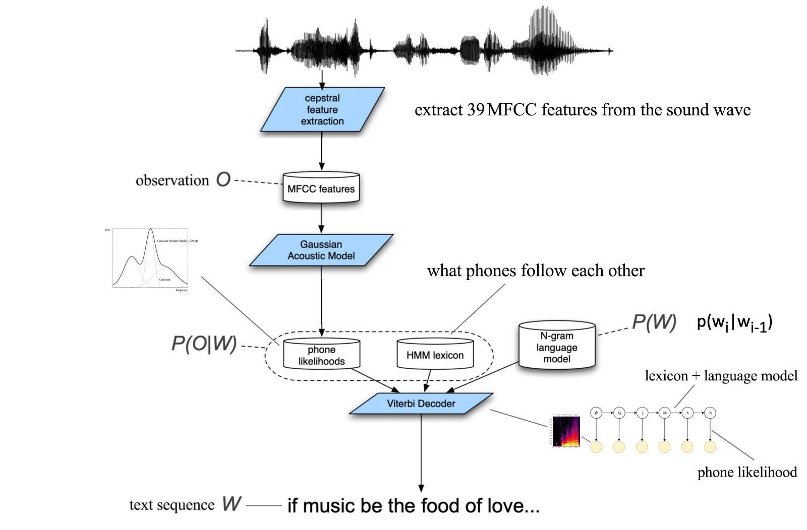
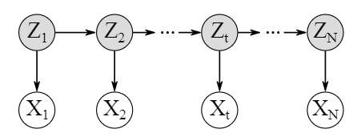
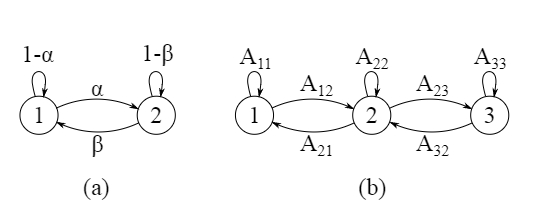
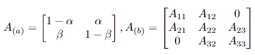

# 1. 概述

参考：

[语音识别中的HMM-GMM模型：从一段语音说起 - 知乎 (zhihu.com)](https://zhuanlan.zhihu.com/p/63753017)

[Vamsi Eswara's answer to What is a simple explanation of the Hidden Markov Model algorithm? - Quora](https://www.quora.com/What-is-a-simple-explanation-of-the-Hidden-Markov-Model-algorithm/answer/Vamsi-Eswara?ch=10&oid=16055449&share=d12f7479&srid=3GOFIA&target_type=answer)

[Deepthi Sen 对隐马尔可夫模型算法的简单解释是什么的回答？ - 知乎 --- Deepthi Sen's answer to What is a simple explanation of the Hidden Markov Model algorithm? - Quora](https://www.quora.com/What-is-a-simple-explanation-of-the-Hidden-Markov-Model-algorithm/answer/Deepthi-Sen?srid=ObLE&share=1)

理解：

1. 目前很多state-of-the-art模型还是以HMM结构为主，比如chain model

2. 语音识别是针对每个音素都建立一个HMM模型，而不是所有音素用一个HMM模型描述。

3. 训练HMM-GMM模型需要的是音素级别的标注

4. HMM模型做语音识别，构想如下：

   音频特征作为观测值，音素作为隐变量，水平箭头代表真实标签

   

# 2. HMM

隐马尔可夫模型（Hidden Markov Model, HMM）

参考：

https://zhuanlan.zhihu.com/p/29938926

https://scholar.harvard.edu/files/adegirmenci/files/hmm_adegirmenci_2014.pdf

[隐马尔可夫模型算法的简单解释是什么？ - 知乎 --- What is a simple explanation of the Hidden Markov Model algorithm? - Quora](https://www.quora.com/What-is-a-simple-explanation-of-the-Hidden-Markov-Model-algorithm)

**理解：**

- 隐马尔可夫模型是一种表示**观测序列**概率分布的工具
- 涉及到**两种类型**的随机过程：**一个是可观测的序列**，另一个是不可观测的**隐含状态序列**
- HMM 假设存在一个隐藏的马尔可夫链，该链中的**状态不可直接观测**到，但是**每个状态下会有一个观测值**被生成。
- HMM 可以用来**对许多序列数据建模**，例如语音识别、自然语言处理、生物信息学等领域

两个序列：

**可观测序列和不可观测的隐状态序列**

1. 可观测序列$\{X_1,...,X_N\}$，其中观测值$X_t$是随机过程产生
2. 隐状态序列$\{Z_1,...,Z_N\}$，这个过程的状态$Z_t$不能**直接**观测

基本假设（马尔可夫链假设）：

**隐状态序列是一个马尔可夫链**，满足马尔可夫假设，**未来状态的概率只与当前状态有关**，与过去的状态无关，符合马尔可夫性质。
$$
P(Z_t|Z_{t-1},...,Z_1)=P(Z_t|Z_{t-1})
$$
**n阶马尔可夫模型**，意思就是当前状态$Z_t$取决于**前n个状态**，以上公式的模型代表**一阶马尔可夫模型**

**联合概率公式**：
$$
P(Z_{1:N},X_{1:N})=P(Z_1)P(X_1|Z_1)\prod_{t=2}^NP(Z_t|Z_{t-1})P(X_t|Z_t)\\
=P(Z_1)\prod_{t=2}^NP(Z_t|Z_{t-1})\prod_{t=1}^NP(X_t|Z_t)
$$
五个要点：

1. **状态数量K**，状态数量和具体现象相关。可以编码状态$Z_t$是一个**K x 1的二进制向量**，比如第i个位置非0，代表第i个状态

2. 不同的观测值数量$\Omega$，跟状态数一样。可以编码状态$X_t$是一个**$\Omega \times 1$的二进制向量**，比如第i个位置非0，代表第i个观测值

3. 状态转移模型A，也叫**状态转移概率分布**、**状态转移矩阵**。**K x K矩阵A**

   $A_{i,j}$代表状态 $Z_{t-1,i}$ 转移到状态 $Z_{t,j}$ 的转移概率，其中$i,j\in\{1,...,K\}$

   简单说，每个状态变量$Z_t$都有**k个状态值**，状态矩阵首先一点：肯定是$Z_{t-1}$转移到$Z_t$，第二个索引 i 和 j 分别指代它们是从**哪个状态值转移到另外哪一个状态值的概率**

   所以：状态转移矩阵A，都**每一行之和等于1**。换句话说，**$Z_{t-1}$的同一个状态值转移到$Z_t$的不同同一个状态值之和为1.**

   

   （a）2个状态数量	（b）3个状态数量

   $Z_{t-1}$和$Z_t$都有K个状态值

   

4. 观测模型B，也叫发射概率。$\Omega \times K$矩阵B，$B_{k,j}$描述，给定状态$Z_t$的状态值是第 j 个，观测$X_t$的观测值是第k个的概率。（给定状态，求观测）

5. 初始状态分布，$\pi$，K x 1向量，$\pi_i$表示初始状态$Z_1$等于第 i 个状态值的概率

给定五个要点，一个隐马尔可夫模型就可以确定 $\lambda=(A,B,\pi)$

## 2.1 马尔可夫链

简单说：给定当前状态的情况下，**未来状态的概率分布只依赖当前状态**，而不依赖于过去状态的详细历史

就是一种计算概率的简单**假设**，也叫**马尔可夫假设**：

$q(x_t|x_{t-1},...,x_0)=q(x_t|x_{t-1})$

## 2.2 三个基本问题

1. 评估观察序列概率。给定模型$\lambda=(A,B,\pi)$和观察序列，计算在模型下，观测序列出现的概率（**前向后向算法**）
2. 模型参数学习问题。给定（一组）观察序列，估计模型参数（**基于EM算法的鲍姆-韦尔奇算法**）
3. 预测问题。给定模型参数和观察序列，求解最可能的状态序列（**维特比算法**）。

## 2.3 HMM应用

HMM 的应用之一是**根据观察序列来预测状态变化的隐藏序列。**

参考：[GMM-HMM 模型在 ASR 中如何工作？ - 知乎 --- How does GMM-HMM model work in ASR? - Quora](https://www.quora.com/How-does-GMM-HMM-model-work-in-ASR)