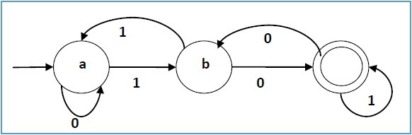

# 1. 概述

参考：

[WFST简介 - 李理的博客 (fancyerii.github.io)](https://fancyerii.github.io/books/wfst/)

**加权有限状态转换机**，Weighted Finite State Transducer

- 描述和处理序列数据的数学模型
- 处理序列数据的工具
- 语音识别常用的解码方法

基本思路：

- 将语音信号转换为一系列**状态**，每个状态代表**可能的音单元或音素**
- 使用 WFST 图来表示这些**状态之间的转换关系**
- 搜索 WFST 图，可以找到**最可能的语音单元序列**，然后进一步将其转换为**文字序列**，从而完成语音识别任务
- 语音识别中，权重通常用来表示概率
- 传统的语音识别模型的组件比如HMM、发音词典、语言模型等都可以用WFST来表示

# 2.确定有限自动机

Deterministic Finite Automaton, DFA

一个确定有限自动机由一个五元组$(Q,\Sigma,\sigma,q_0,F)$表示，其中：

- Q 是一个有限的状态集合
- $\Sigma$ 是字母表
- $\sigma$ 是状态转移函数：$\sigma:Q\times\Sigma\rightarrow Q$
- $q_0$ 是初始状态，$q_0\in Q$
- F 是终止状态的集合，$F\subseteq Q$（子集）

说明：

1. 状态转移矩阵很关键，它提供了规则：**在当前状态下，输入何种字符（字母表中的元素）会进入何种状态**
2. 字母表也很关键，它里面的**字符可以有很多的组合**，成为**字符串**。比如$\Sigma=\{a,b,c,d\}$，**任何可重复的组合**在一起成为字符串，比如abcc，bcccdd等等
3. 通过初始状态、状态转移函数、终止状态集合（**字符串消耗完停在终止状态**），可以**判断字母表里的某种组合的字符串是否DFA识别的语言**

比如一个确定的DFA：

画图：

对于DFA图来说：

- **点**代表**状态**
- **边**代表**状态之间的跳转**，边上的**字符**代表**跳转的输入**。**字符是字母表里的元素，状态跳转需要输入字符**
- 状态点上画一条**入边**来表示它是**初始状态**
- **终止状态**用两个圈表示

根据**字符串最后一步达到的状态在终止状态集合**的要求：

- 举例，可以发现，字符串”1101011”是上面DFA识别语言中的一个字符串，而”100”不是
- **理论上**，可以得到**状态机识别的语言**：遍历**所有可能的字符串**，然后用上面的方法**判断这个字符串是否被DFA接受**，接受的话加到识别的集合里
- **实际上**，无法这样操作，因为通常DFA**识别的字符串是无穷的**

总结：

- DFA的一个用途可以是**“识别”一种语言**——或者说，**判断一个字符串是否属于这个语言**

# 3. 非确定有限自动机

Non-deterministic Finite Automaton，NFA

对DFA扩展：

- DFA每个状态遇到任何一个输入有且仅有一个跳转(边)，简单说，**在当前状态下，给定一个输入字符，只有一种跳转可能**
- 那么，如果一个状态遇到一个输入可以(也可能只有一条)有多余一条边，或者说，**在当前状态，给一个输入字符，有多个可能的跳转状态**。
- 那么问题来了：扩展后，给定输入字符，究竟跳转到哪一种状态？答案是，**同时都跳转**
- 至于其他的，判断是否**识别字符串**，规则一样，就看**最后的跳转状态是否在终止状态集合**

理解：

- NFA是“包含”DFA的，或者说DFA是一种特殊的NFA
- 任意给定一个DFA，可以构造一个NFA
- 特别的，且有些反直觉的，**对于任意一个NFA，都可以构造出一个与之等价的DFA来**

**动机**：

1. 提出一个语言规则，**给定一个DFA去判断**它能否识别这个语言很简单，但是**设计构造出一个识别这个语言的DFA**就会很难

   比如，字母表$\Sigma=\{1,2\}$，一种语言规则L={w|w的最后一个字符是1}

2. **设计构造出一个识别这个语言的DFA**很难，但是设计构建一个NFA却很容易，甚至可以把构造的过程变成固定的“流程”。（当然前提是这个语言规则确实可以用NFA/DFA来识别）

3. **对于任意一个NFA，都可以构造出一个与之等价的DFA来**

# 4. 加权有限状态转换机

