# 1. MFCC和fbank

- mel频率倒谱系数
- Fbank是滤波器组特征

- 流程：

  预加重、分桢、加窗，傅里叶变换、计算功率谱、滤波器组、离散余弦变换

- 两者区别：

  fBank特征已经很贴近人耳的响应特性，但是仍有一些不足，其相邻的特征高度相关（相邻滤波器组有重叠），因此当我们用HMM对音素建模的时候，几乎总需要首先进行倒谱转换，通过这样得到MFCC特征。
  **计算量**：MFCC是在FBank的基础上进行的，所以MFCC的计算量更大。
  **特征区分度**：FBank特征相关性较高，MFCC具有更好的判别度，所以大多数语音识别论文中用的是MFCC，而不是FBank。

- 傅里叶变换

  用于将**周期连续函数**分解为**一系列正弦和余弦函数的和**

  $T$是周期，$w$是角速度，$f$是频率，它们关系如下：
  $$
  T=\frac{2\pi}{w}=\frac{1}{f}
  $$
  

# 2. 强制对其Forced Alignment

参考：

https://nvidia.github.io/NeMo/blogs/2023/2023-08-forced-alignment/#formulating-the-problem

给定音频和文本，确定每个单词(音素)的起止位置的过程。将文本与朗读时间进行匹配的任务称为“强制对齐”

- ASR模型推理，输出（V x T）的概率矩阵，V是toekn数量，T是时间步
- 强制对齐（解码）并不是直接去每个时间步概率最大的token
- 而是**维特比算法**

## 2.1 维特比算法理解

1. 列出输出文本，对应的所有的token组合

   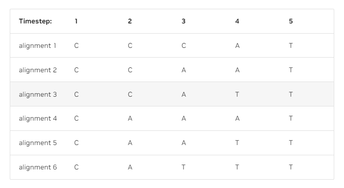

2. 求出组合的联合概率

3. 联合概率最大的就是对齐输出

4. 注意图冗余：就是在某个时间步中，同一个token节点，累积的联合概率小的，后面的节点组合的概率不可能超过前面的，所以是冗余的，可以去掉

   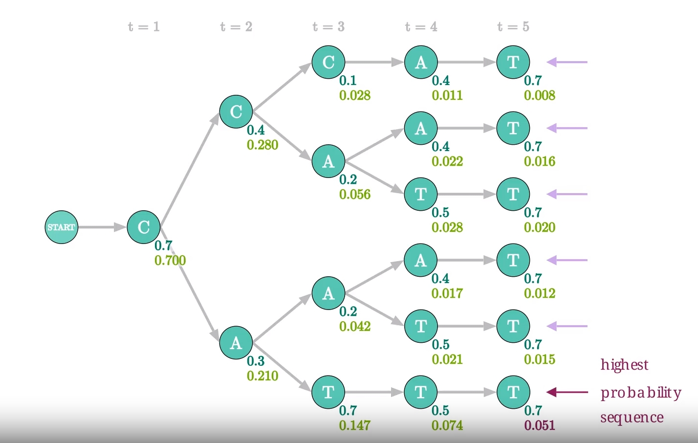

t=3这一步，两个A节点的联合概率（红色数字），上面的A节点大于下面A节点。那么下面部分的联合概率不可能超过下面的部分。

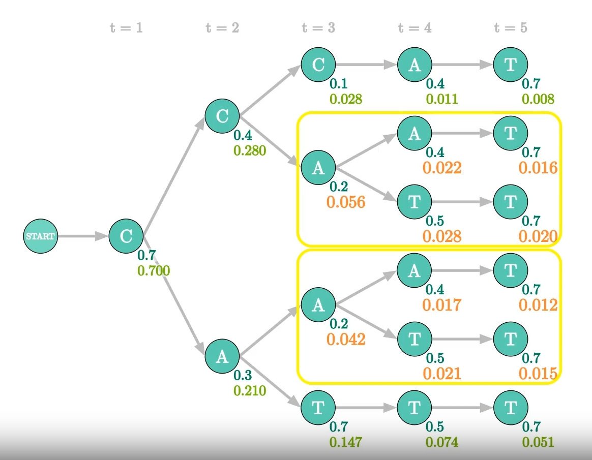

这种情况下，下面A节点就是冗余的，不用计算

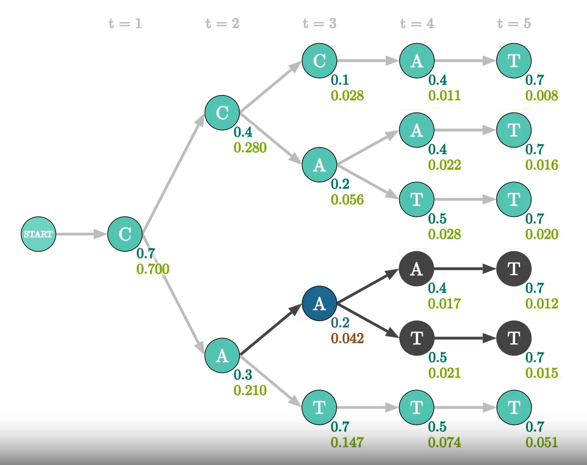

去掉所有冗余的节点（黑色和蓝色部分）

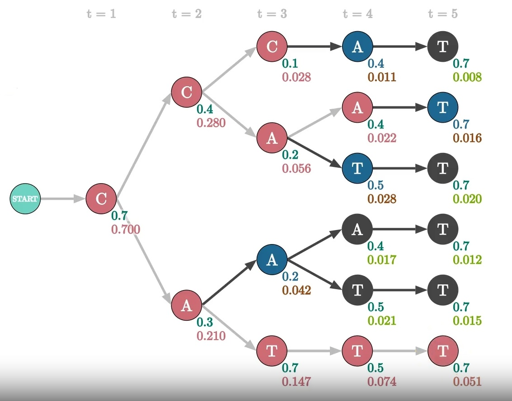

合并：将丢弃的节点隐藏在未丢弃的节点后面，将树图转换为新的形状。

这种情况，就是通过沿着**未丢弃的边缘（浅灰色）**向后追踪到起始标记来恢复具有该概率的确切路径。S(3, 5) -> S(1, 1)

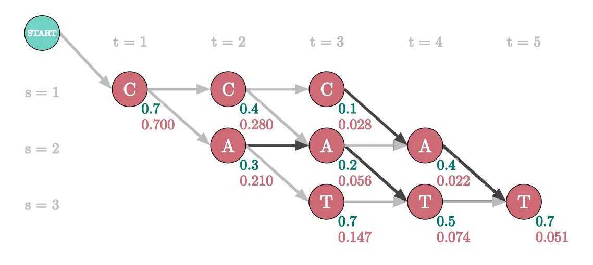

这个就是维特算法的V x T矩阵

## 2.2 维特比算法流程

填充V x T矩阵

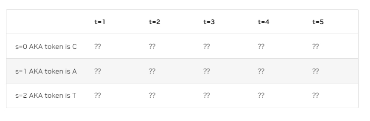

里面的内容是v(s, t)最大联合概率，p(s, t)是ASR模型输出概率，公式：
$$
v(s,t)=\max(\\v(s, t-1)*p(s, t), \\v(s-1, t-1)*p(s, t)\\)
$$
对于第一列：$v(s=1,t=1)=p(s=1,t=1)$，其他$v(s>1,t=1)$设置为0

对于公式中的$v(s, t-1)$和$v(s, t-1)$无法访问，那么就按照公式计算其中能访问，当最大值。都不能计算就设置为0。

### 2.2.1 维特比算法解码CTC输出

如果ASR模型输出是CTC损失，无非就是V x T矩阵**每个token之间添加一个空白符。**

并且V x T矩阵计算公式也会变换

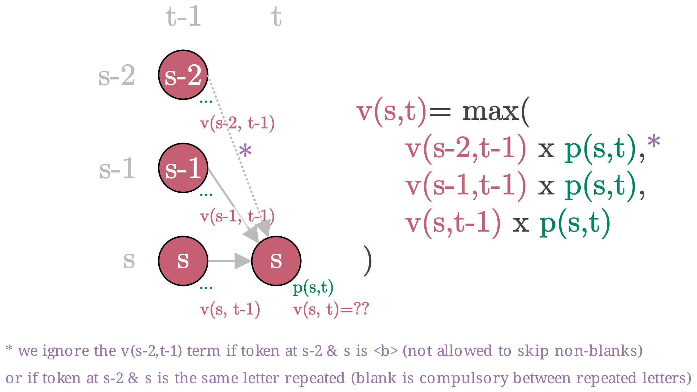

# 3. CTC

严格来说是一种损失函数，致力于解决输入输出都是序列的对其问题，并且输入长度大于输出长度。

基本说明

- **输出是V x T矩阵**，V是token数量，其中token中需要加一个**空白符**（跟空格有区别）
- 约束（解码成文本的过程）：
  1. 连续重复的token合并
  2. 但是连续重复，但是中间有空白符，不合并

思路

- V x T矩阵是模型的输出，没一列的和为1，代表每个时间步中，token的概率：

  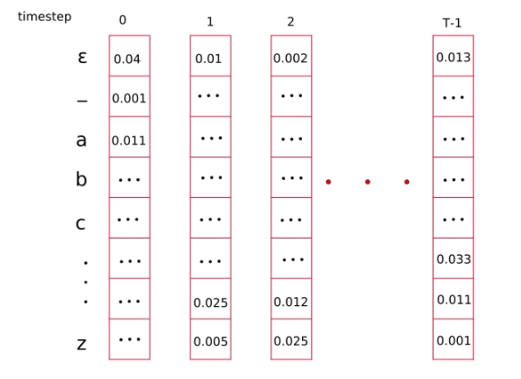

- 在上面的**约束条件下**，列举所有的可能性，解码输出后的文本对于目标（比如cat、door）

- 对所有可能的联合概率求和，**优化使其最大**

## 3.1 前向后向算法

1. 如果**V x T矩阵是模型输出矩阵**，那么还需构建一个**概率矩阵S x T**：

   目标输出标签长度是M，比如door，M=4，那么在每个token中间以及开头结尾加上空白符，那么S=2*M+1，$[\epsilon,d,\epsilon,o,\epsilon,o,\epsilon,r,\epsilon]$

   里面的值还是模型输出的概率：$y(s,t)$

   

2. 在上面的**约束条件下**，列举所有的可能性，解码输出后的文本对于目标（比如cat、door）

   

正式介绍前向后向算法：

1. 构建前向概率矩阵S x T，里面每个值是前向变量$\alpha(s,t)$

   

   分两种情况

   - $\alpha(s,t)$中$seq(s)=\epsilon$或者$seq(s)=seq(s-2)$

     这种情况不能连跳两级，因为这样构成的序列不能解码成目标文本

     $\alpha(s,t)=(\alpha(s-1,t-1)+\alpha(s,t-1))*y(s,t)$

   - 其他的情况，都可以条两级

     $\alpha(s,t)=(\alpha(s-2,t-1)+\alpha(s-1,t-1)+\alpha(s,t-1))*y(s,t)$

2. 构建后向概率矩阵S x T，里面每个值是后向变量$\beta(s,t)$

   

3. 概率：

   $P(seq,t)=\sum_{s=0}^S\frac{\alpha_{s,t}\beta_{s,t}}{y_{s,t}}$

4. 模型总损失：

   $l=-\sum_{t=0}^{T-1}\log P(seq,t)$

## 3.2 beam search

softmax输出

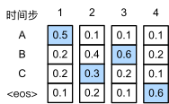

**束搜索**

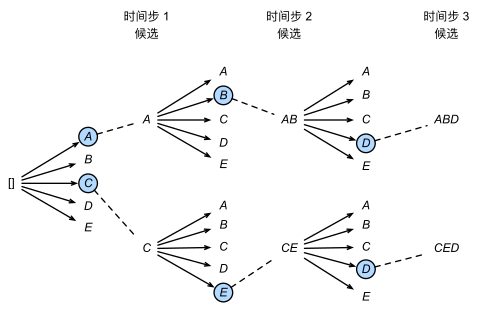

- 超参量：束宽beam size，其实就是直观描述，**k代表分出多少束，最终有多少候选**
- 第一个时间步：从|y|个token里选择k个概率大token
- 之后每一个时间步其实都是从**k|y|**个token里**选择k个概率大token**

# 4. CTC模型的问题

1. 发音字典和语言模型的依赖性较强，没有语言模型，显式的对文本建模

2. 需要假设，输出序列的每个标签在给定输入序列的条件下是独立的

   独立性假设的存在使得CTC模型能够在没有人工标注的对齐信息的情况下进行学习。

# 5. HMM

隐马尔可夫模型（Hidden Markov Model, HMM）

参考：

https://zhuanlan.zhihu.com/p/29938926

**理解：**

- 隐马尔可夫模型是一种表示**观测序列**概率分布的工具
- 涉及到**两种类型**的随机过程：**一个是可观测的序列**，另一个是不可观测的**隐含状态序列**
- HMM 假设存在一个隐藏的马尔可夫链，该链中的**状态不可直接观测**到，但是**每个状态下会有一个观测值**被生成。
- HMM 可以用来**对许多序列数据建模**，例如语音识别、自然语言处理、生物信息学等领域

两个序列：

**可观测序列和不可观测的隐状态序列**

1. 可观测序列$\{X_1,...,X_N\}$，其中观测值$X_t$是随机过程产生
2. 隐状态序列$\{Z_1,...,Z_N\}$，这个过程的状态$Z_t$不能**直接**观测

基本假设（马尔可夫链假设）：

**隐状态序列是一个马尔可夫链**，满足马尔可夫假设，**未来状态的概率只与当前状态有关**，与过去的状态无关，符合马尔可夫性质。
$$
P(Z_t|Z_{t-1},...,Z_1)=P(Z_t|Z_{t-1})
$$
**n阶马尔可夫模型**，意思就是当前状态$Z_t$取决于**前n个状态**，以上公式的模型代表**一阶马尔可夫模型**

**联合概率公式**：
$$
P(Z_{1:N},X_{1:N})=P(Z_1)P(X_1|Z_1)\prod_{t=2}^NP(Z_t|Z_{t-1})P(X_t|Z_t)\\
=P(Z_1)\prod_{t=2}^NP(Z_t|Z_{t-1})\prod_{t=1}^NP(X_t|Z_t)
$$
五个要点：

1. **状态数量K**，状态数量和具体现象相关。可以编码状态$Z_t$是一个**K x 1的二进制向量**，比如第i个位置非0，代表第i个状态

2. 不同的观测值数量$\Omega$，跟状态数一样。可以编码状态$X_t$是一个**$\Omega \times 1$的二进制向量**，比如第i个位置非0，代表第i个观测值

3. 状态转移模型A，也叫**状态转移概率分布**、**状态转移矩阵**。**K x K矩阵A**

   $A_{i,j}$代表状态 $Z_{t-1,i}$ 转移到状态 $Z_{t,j}$ 的转移概率，其中$i,j\in\{1,...,K\}$

   简单说，每个状态变量$Z_t$都有**k个状态值**，状态矩阵首先一点：肯定是$Z_{t-1}$转移到$Z_t$，第二个索引 i 和 j 分别指代它们是从**哪个状态值转移到另外哪一个状态值的概率**

   所以：状态转移矩阵A，都**每一行之和等于1**。换句话说，**$Z_{t-1}$的同一个状态值转移到$Z_t$的不同同一个状态值之和为1.**

   

   （a）2个状态数量	（b）3个状态数量

   $Z_{t-1}$和$Z_t$都有K个状态值

   

4. 观测模型B，也叫发射概率。$\Omega \times K$矩阵B，$B_{k,j}$描述，给定状态$Z_t$的状态值是第 j 个，观测$X_t$的观测值是第k个的概率。（给定状态，求观测）

5. 初始状态分布，$\pi$，K x 1向量，$\pi_i$表示初始状态$Z_1$等于第 i 个状态值的概率

给定五个要点，一个隐马尔可夫模型就可以确定 $\lambda=(A,B,\pi)$

## 5.1 马尔可夫链

简单说：给定当前状态的情况下，**未来状态的概率分布只依赖当前状态**，而不依赖于过去状态的详细历史

就是一种计算概率的简单**假设**，也叫**马尔可夫假设**：

$q(x_t|x_{t-1},...,x_0)=q(x_t|x_{t-1})$

## 5.2 三个基本问题

1. 评估观察序列概率。给定模型$\lambda=(A,B,\pi)$和观察序列，计算在模型下，观测序列出现的概率（**前向后向算法**）
2. 模型参数学习问题。给定观察序列，估计模型参数（**基于EM算法的鲍姆-韦尔奇算法**）
3. 预测问题。给定模型参数和观察序列，求解最可能的状态序列（**维特比算法**）。

# 6. 前向后向算法和维特比算法

# 7. BPE字节对编码

- 基于子词的分词方法
- 从数据集中学习如何分词token
- 核心在于词频率，先分解在合并 

# 8. BERT、Transformer、GPT的优点是什么

1. 并行度，自注意力的优势
2. 自注意力编码的时候，计算了前后的信息，提取的特征信息，相比RNN，LSTM，记忆会更好
3. 一种解决方案：微调，无监督数据训练，提取文本特征

# 9. 语音合成

1. **tacotron1/2**

   典型的seq2seq模型，带有注意力机制

   tacotron2替换了CBHG模型，用了1维卷积和LSTM，减少了全连接层

2. transformerTTS，代入transformer架构中，训练速度和推理速度快了

3. FastSpeech1/2：

   - **FastSpeech1：**有点类似知识蒸馏的思想，通过其他的TTS模型获取文本因素持续时间。没有注意力，也没有seq2seq架构。transformer的encoder结构。速度非常快。

   - FastSpeech2：真正的端到端，文本到语音，而不是梅尔特征谱。

     使用forced alignment对其得到的持续时间

4. AlignTTS，一样的需要对齐

5. VITS，效果最好，对抗训练

# 10. 轻量化模型

1. squeezeNet

   增加1和3尺寸的卷积，减少参数量，其实增加了计算量

2. shuffleNet v1

   组卷积，增加1尺寸的计算量

   通道混洗

3. shuffleNet v2

   四个原则，开始考虑内存访问和计算量，这是推理加速的关键：

   - 卷积通道数相同
   - 分组卷积
   - 网络碎片，通道数不要分散
   - 逐元素的操作计算量大

   加入残差和concat连接，加上混洗

4. MobileNET v1

   可分离卷积，其实就是分组卷积和逐元素卷积

5. mobile Net v2

   残差连接内部结构改善，先增加通道数，但是用分组卷积，然后通道数降下来，用逐元素卷积。

   残差连接最后一层不用激活函数，会过滤有用信息

6. GhostNet

   特殊结构块

   倾向于用concat，