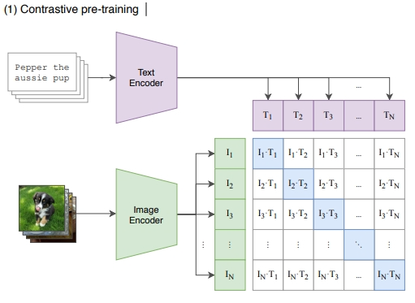

参考：

1. [openai/CLIP: CLIP (Contrastive Language-Image Pretraining), Predict the most relevant text snippet given an image (github.com)](https://github.com/OpenAI/CLIP)
1. [CLIP 论文逐段精读【论文精读】_哔哩哔哩_bilibili](https://www.bilibili.com/video/BV1SL4y1s7LQ/?spm_id_from=333.999.0.0&vd_source=5a1ce44ffe3923badc10b4b00217e698)
1. [CLIP 论文逐段精读【论文精读】 - 哔哩哔哩 (bilibili.com)](https://www.bilibili.com/read/cv26779607/?spm_id_from=333.999.0.0&jump_opus=1)
1. [How to Train Really Large Models on Many GPUs?](https://lilianweng.github.io/posts/2021-09-25-train-large/)

OpenAI 的 DALLE-E 和 Stability AI 的 Stable Diffusion 等生成模型集成了 CLIP，对输入文本进行编码，以生成文本到图像

自然语言信息作为监督

传统方法：

监督信息是预先固定的标签。如果有新的种类怎么办？给模型搜集新种类的图片训练。

如果训练数据不是图像和标签的形式，而是**图像和描述文本的形式**。

新形式的数据更容易获取。

以文本信息作为图像的监督信息，预训练模型，让模型学习图像和文本句子的匹配

在识别图像时，不再需要标签也不需要训练，只需要输入给模型，就能有答案。**zero-shot learning**

简单说，CLIP做的事情就是Zero-Shot Learning with Language Supervision

模型架构

预训练架构

