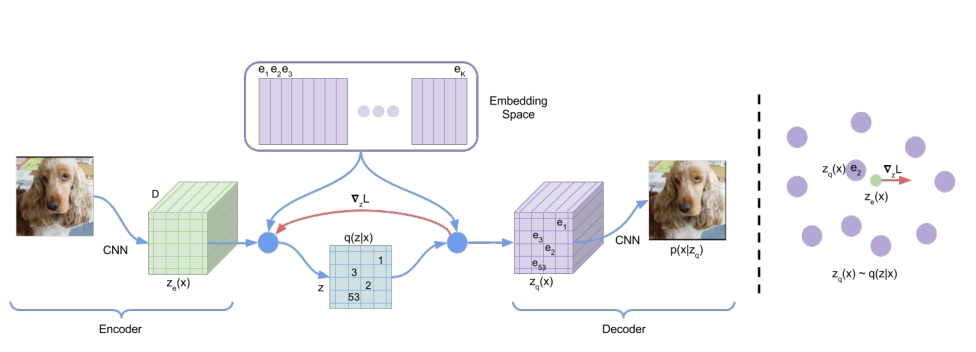
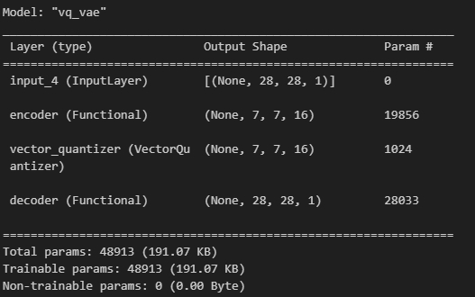
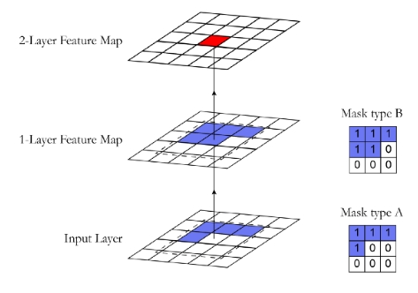

1. 论文：[Neural Discrete Representation Learning](https://arxiv.org/pdf/1711.00937.pdf)

2. 代码：[Vector-Quantized Variational Autoencoders (keras.io)](https://keras.io/examples/generative/vq_vae/)

3. 代码：https://juliusruseckas.github.io/ml/vq-vae.html

# 1. 概述

Vector-Quantized Variational Autoencoders

理解：

- 无（自）监督模型。三部分组成：**编码器、潜在空间、解码器**。输入输出都是真实图像。
- VQVAE跟VAE（Variational Autoencoders）不一样，它不是一种生成模型，或者说，它自己本身不能通过解码器随机生成图像
- 跟AE（Autoencoders）作用更相似，是一种图像重建模型。论文里的说法，作用是给图像生成有用的特征表示：$z_q$，算是一种图像"降维"方法(准确说，维度没变，尺寸变小了)
- **Vector-Quantized**的意思就是：特征表示$z_q$是多个向量组成(矩阵，二维张量)，所谓”**离散的**“。这跟AE和VAE不一样（它们编码器生成的特征是一个向量，所谓"**连续的**"）
- 配合自回归生成模型（比如：PixelCNN），可以生成高质量的图像、视频和语音，并进行高质量的说话人转换和音素的无监督学习
- 老实说，VQVAE和VAE，其实没什么关系

# 2. 模型架构

要点：

1. 模型有三部分：编码器、潜在空间（向量量化层）、解码器

2. 编码器和解码器都是卷积神经网络（本质来说全连接层也可以），分别是上采样和下采样。MNIST数据集构建的VQVAE模型

   

3. 潜在空间有个Embedding Space，也叫codebook，是**可学习的矩阵**，形状：$(num\_embeddings, embedding\_dim)$。

   注意论文声称Embedding Space可学习，实际上，它并不会变化，训练前后还是初始化的矩阵。因为从Embedding Space到$z_q$有个argmin函数，它**不可导**。虽然声称损失函数里的第二项$||sg[z_e(x)]-z_q(x)||_2^2$可以优化Embedding Space，但后向传播从$z_q$回到Embedding Space依然是不可计算梯度的，整个训练期间，Embedding Space是无法计算梯度的。当然，这样的损失函数，虽然$z_q$在Embedding Space不可导，深度学习框架里也不会报错，计算的梯度为none。

   论文里提供的损失函数提供了一个Straight-Through Estimator的思路，但只用来处理**重建损失函数**，网络后向传播不会计算$z_q$的梯度，用$z_e$梯度替代的整个$z_q$的梯度，这种办法可以帮助求解编码器参数的梯度，然后学习。

4. 潜在空间的前向计算：

   - 编码器输出$z_e$形状：$(batch\_size, height, width, channel)$，Embedding Space形状：$(num\_embeddings, embedding\_dim)$

   - 将$z_e$拉平为：$(batch\_size*height*width, channel)$，这里可以认为编码器输出的特征$z_e$有$batch\_size*height*width$个，换句话说，**每个像素点都有一个特征向量**

     具体做法是，从Embedding Space矩阵里为每个特征向量找一个距离最近的向量。距离度量方式是：L2-normalized distance，欧几里德距离。这里有个细节：**$z_e$的通道数channel和Embedding Space矩阵的embedding_dim必须相等:$channel=embedding\_dim$。**

   - 从mbedding Space矩阵里为拉平后的$z_e$每个特征向量找一个距离最近的向量，得到是$z_q$，模型的主角，形状是：$(batch\_size*height*width, channel)$，在输入到解码器之前，形状再变换为：$(batch\_size, height, width, channel)$

5. 真正的细节其实只有3个

   - $z_e$每个像素点都会有一个特征，所谓"离散"的特征
   - $z_e$的通道数channel和Embedding Space矩阵的embedding_dim必须相等:$channel=embedding\_dim$
   - 设计Embedding Space动机是可学习的，实际设计的损失函数后向传播无法计算Embedding Space梯度。但不影响模型的目的。

工程细节：

1. 在潜在空间的前向计算里，有个操作：从mbedding Space矩阵里为拉平后的$z_e$每个特征向量找一个距离最近的向量。距离最近怎么计算，距离已经说过了，是欧几里得距离，并不难。难在"最小"，将特征向量跟Embedding Space里所有向量计算距离，选择其中最小的，作为组成$z_q$，最小的函数是**argmin函数**，它没有梯度，没有梯度怎么计算训练呢？解决办法是**Straight-Through Estimator**

2. Straight-Through Estimator的想法很简单但有效：对于一些不可导函数，前向传播的时候不涉及求梯度，依然用这个函数参与计算，但在反向传播的时候，可以设计一个**近似梯度**

   导致模型无法计算梯度的是argmin，论文没有直接解决这个函数，而是针对$z_q$进行了Straight-Through Estimator处理：**不计算$z_q$的梯度，用$z_e$代替。**

   在pytorch和tensorflow中，实现前向传播用原函数计算，梯度计算用用另外的替代，也很方便。

   pytorch：张量的`.detach()`方法就是代表不计算梯度。`z_q=z_e+(z_q-z_e).detach()`在后向传播时，相当于将`z_q-z_e`当常量，只会计算`z_e`梯度。

   tensorflow用`tf.stop_gradient`实现这个目的

   参考：

   [论文：Estimating or Propagating Gradients Through Stochastic Neurons for Conditional Computation](https://arxiv.org/abs/1308.3432)

   [Straight-through estimator (STE) 解读](https://zhuanlan.zhihu.com/p/570322025)

3. 两个损失函数：

   - 重建损失：对数极大似然$log(p(x|z_q(x)))$，比较笼统，实际用的是MSE(Mean Squared Error)，对于$z_q(x)$部分，实际是：$z_e(x)+sg[z_q(x)-z_e(x)]$

   -  discrete codes损失：$||sg[z_e(x)]-z_q(x)||_2^2+\beta||sg[z_q(x)]-z_e(x)||_2^2$

     其中$sg$是stop gradient的意思

     $z_q(x)$后向传播到Embedding Space，无法计算梯度，但是也不会报错，只是更新不了Embedding Space矩阵

# 3. 生成图像

VQVAE模型本身不是生成模型，无法随机生成图像。

如果没有仔细读论文，没有完全理解模型，可能会说，从Embedding Space随机拿向量出来给解码器不就可以生成图像吗？

注意前面已经提到过：**$z_e(x)$里每个像素点都会从Embedding Space里拿一个距离最近的向量组成$z_q(x)$**，所以$z_q(x)$不是单个向量，而是多个向量。这是模型命名里Vector-Quantized的由来，也是区别于AE和VAE的地方。作者认为潜在向量$z_q(x)$是”离散“的，这是避免VE模型中图像模糊的关键。

所以单从Embedding Space随机拿一个向量是不够的，得从里面拿一个**”合适“的组合**才能生成有意义的图像

那怎么办呢？论文里提到配合PixelCNN模型可以随机生成图像。

PixelCNN模型是什么？

它是一个真正的生成模型，和VAE一样可以随机生产图像，但是它的**机制是自回归**

它并没有明确的模型结构，骨干网络是CNN，核心在于它自回归的机制如何生成图像。

自回归简单说，就是过去的元素去预测现在的元素，在图像生成里，就是**使用过去的像素，预测下一个像素**

那CNN怎么实现"使用过去的像素，预测下一个像素"呢？CNN的机制是卷积核在图像从左到右，从上到下扫一遍，每个卷积核窗口计算的时候是可以看到整个窗口的像素点的。那该怎么办呢？

PixelCNN的核心思想是在CNN的卷积核计算时加一个掩码，这一点非常类似多头注意力计算注意力权重屏蔽未来的掩码。它设计了两种掩码类型：

掩码类型 A：此掩码仅应用于第一个卷积层。 它通过将掩码中的中心像素归零来限制对像素的访问。 这样保证模型不会访问它即将预测的像素（下图中的红色部分）。

掩码类型 B：此掩码应用于所有后续卷积层，并通过允许从像素到自身的连接来放宽掩码 A 的限制。 这对于解释第一层的像素预测很重要。

其中值为1代表参与计算，值为0代表计算屏蔽。

PixelCNN模型的输入输出是原始图像。凭借带掩码的CNN，模型学会了使用过去的像素，预测下一个像素。

具体在推理过程，PixelCNN模型如何随机生成图像呢？首先随机初始化一个”假图像“，然后输入到模型，输出还是一个”假图像“，目的是预测第一个像素点，然后拿到这个预测的像素点覆盖初始化输入的"假图像"，再输入到模型。循环输入输出覆盖过程，直到预测全部像素，就完成了”真图像“的生成过程。

理解了这两点，PixelCNN就理解了全部

再说说VQVAE+PixelCNN如何随机生成图像，分5步：

1. 先拿一个数据集训练VQVAE模型
2. VQVAE推理模式，将数据集里所有图像输入到VQVAE，编码器输出$z_e(x)$，计算它们与Embedding Space里每个向量最小距离的**索引**，也就是$q(z|x)$
3. 用数据集所有图像编码器特征在Embedding Space中最小距离的索引(组合)，训练PixelCNN模型
4. PixelCNN推理下，随机一个初始化索引输入，输出的是”有意义“的索引组合
5. PixelCNN生成的索引，再从VQVAE的Embedding Space找到对应的”离散“潜在向量，也就是$z_q(x)$，把它扔给VQVAE的解码器，就可以生成”有意义“的图像

那问题来了？PixelCNN自己就是生成图像，干嘛要给VQVAE当工具呢？

原因其实是PixelCNN的自回归机制生成图像太慢了？假设一张图片是3通道，224\*224，意味着PixelCNN生成一张图片，模型推理的次数是：224\*224\*3，碰到图像尺寸再大一点，简直是灾难。

VQVAE的作用是什么？

1. 量化机制，导致图像的潜在向量不再是”连续“的（单个），而是”离散的“，这可以帮助重建高质量的图像
2. 图像降维，准确说是降低尺寸，VQVAE获得的图像特征$z_q(x)$，它是编码器输出$z_e(x)$中每个像素点在Embedding Space的最小距离对应的特征组合，如果$z_e(x)$的尺寸是$(batch\_size, height, width, channel)$，最终$z_q(x)$的尺寸也是是$(batch\_size, height, width, channel)$。当然这里的高宽和通道都不是原始图像的高宽通道，编码器会下采样。

前面VQVAE+PixelCNN随机生成图像的步骤中，如果用所有图像的$z_q(x)$来训练PixelCNN，其实对于PixelCNN慢没什么用，虽然编码器下采样后的高宽会变小，但是通道数一般是增大的，所以最终推理次数其实可能相差不大。

但是如果用来训练PixelCNN的所有图像编码器特征在Embedding Space中最小距离的索引(组合)呢？

$z_e(x)$的尺寸是$(batch\_size, height, width, channel)$，它在Embedding Space的索引的形状是$(batch\_size*height*width, )$向量，再转换就是$(batch\_size, height, width)$

用它来训练PixelCNN的好处就提现出来了，PixelCNN生成一个索引，就是$(height, width)$，下采样后的尺寸，没有了通道数，次数就大大减少了。

VQVAE+PixelCNN随机生成图像，可以稍微加速PixelCNN的生成过程，并且图像的质量更高