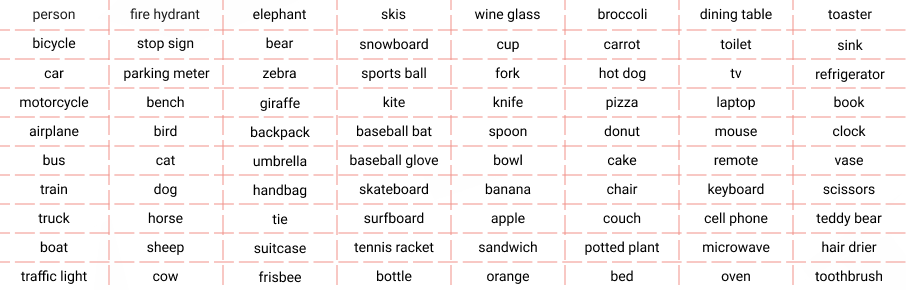
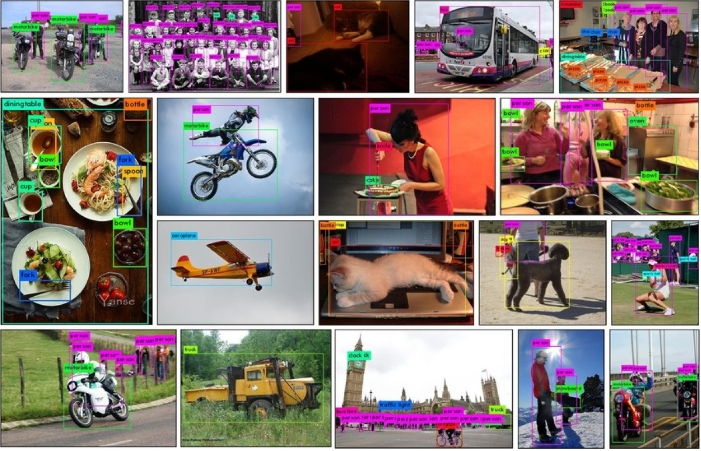
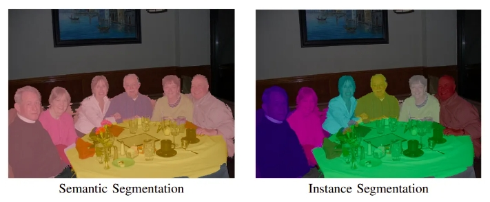
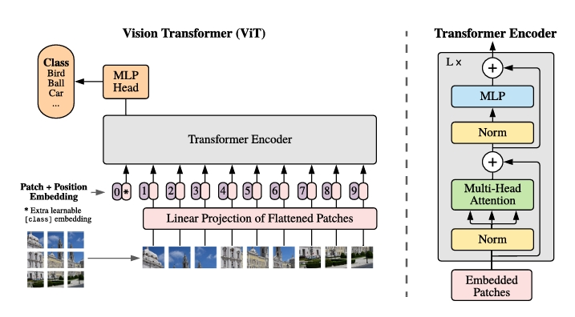
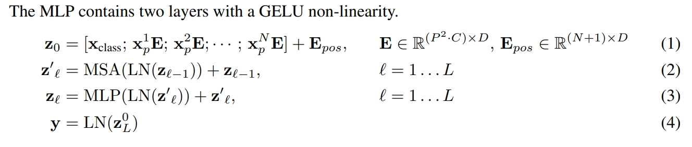
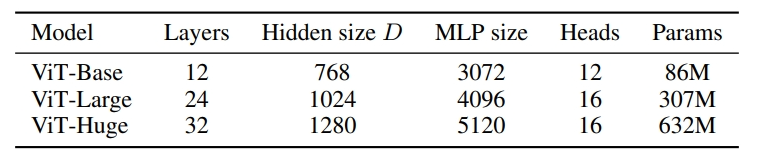
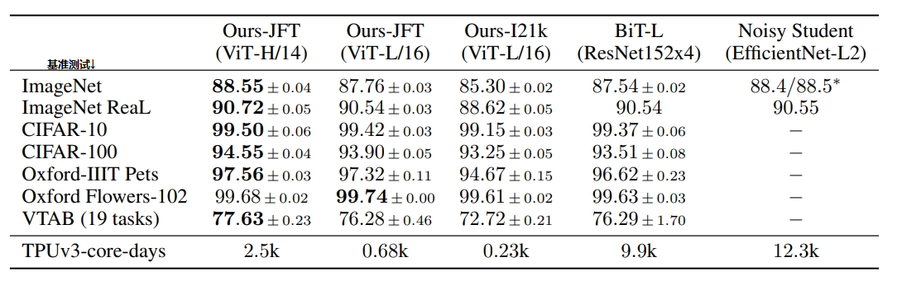
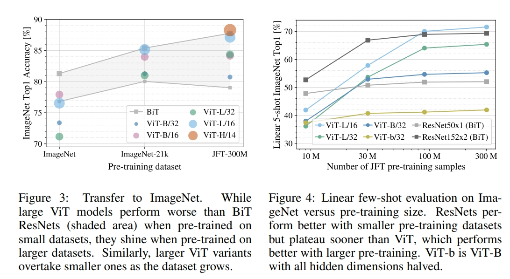
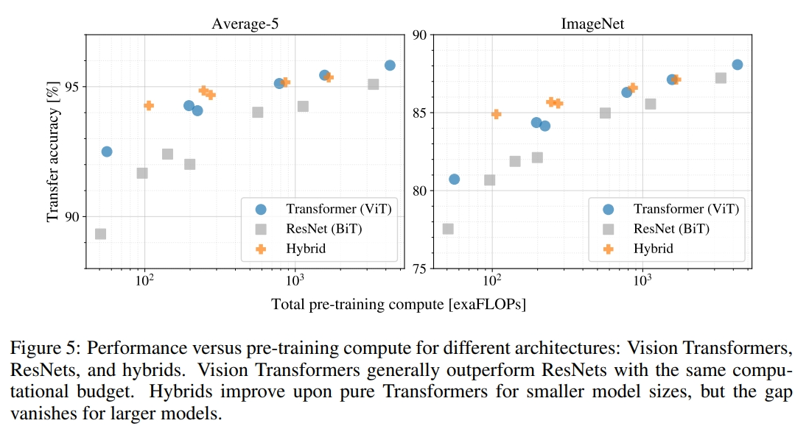
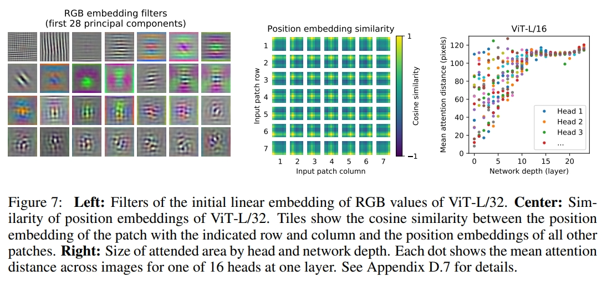

注意力应用于池化

参考：

1. [超强总结！50种视觉注意力机制深度研究！199篇参考文献！](https://zhuanlan.zhihu.com/p/505470134)
2. [计算机视觉Attention注意力机制综述！清华、南开出品！共27页185篇参考文献！](https://zhuanlan.zhihu.com/p/434367821)
3. [论文Visual Attention Methods in Deep Learning: An In-Depth Survey](https://arxiv.org/pdf/2204.07756v1.pdf)
4. [论文Attention Mechanisms in Computer Vision: A Survey](https://arxiv.org/pdf/2111.07624.pdf)
5. https://zhuanlan.zhihu.com/p/577078070
6. [【快速入门系列】视觉注意力机制](https://zhuanlan.zhihu.com/p/350760243)

ViT，不再依赖CNN

1. [论文：An Image is Worth 16x16 Words: Transformers for Image Recognition at Scale](https://arxiv.org/abs/2010.11929)
2. [论文：ViT特性 Intriguing Properties of Vision Transformers](https://proceedings.neurips.cc/paper_files/paper/2021/file/c404a5adbf90e09631678b13b05d9d7a-Paper.pdf)

# 1. CV数据集

- **ImageNet**

  Image Database for Object Recognition

  **有标记的（超）大型数据集**

  ImageNet Large Scale Visual Recognition Challenge（ILSVRC）竞赛使用的数据集。每年都在更新和拓展。

  任务包括：

  1. 图像分类
  2. 目标检测：分类和位置
  3. 目标定位：单目标的目标检测

  两个版本：

  - ImageNet-1K：大概130万张**标记图像**，1000个分类，约133GB。目前大多数说的**ImageNet就是代指ImageNet-1K**

  - ImageNet-21K：清理后ImageNet-21K-P，大概1100万张图像，大概10k个分类

    参考：

    [Review — ImageNet-21K Pretraining for the Masses ](https://sh-tsang.medium.com/review-imagenet-21k-pretraining-for-the-masses-25a6b19e5ee8)

    [ImageNet21K/dataset_preprocessing/processing_instructions.md at main · Alibaba-MIIL/ImageNet21K --- ImageNet21K/dataset_preprocessing/processing_instructions.md](https://github.com/Alibaba-MIIL/ImageNet21K/blob/main/dataset_preprocessing/processing_instructions.md)

- **COCO**

  参考：

  [Introduction to the COCO dataset | SuperAnnotate](https://www.superannotate.com/blog/coco-dataset-introduction)

  [COCO Dataset: All You Need to Know to Get Started ](https://www.v7labs.com/blog/coco-dataset-guide)

  [COCO - Common Objects in Context (cocodataset.org)](https://cocodataset.org/#home)

  Common Objects in Context

  **有标记的大型数据集**，同样是竞赛数据集，持续更新

  80个分类，330k图像，其中超过200k有标记

  

  任务包括：

  1. 目标检测**Object detection**：

     

  2. 实例分割**Instance Segmentation**：识别图像中的**每个**单独**对象**的像素级别分割，并给每个对象分配一个唯一的标识符。

     

  3. 关键点检测Keypoint detection：定位人物关键点，例如物体的角点或人身体的关节。这些关键点通常用于表示图像中的对象或人。它们可用于各种应用，例如对象跟踪、运动分析和人机交互。超过 200,000 张图像和 250,000 个标有关键点的人物实例的 x 和 y 坐标，例如右肘、左膝和右脚踝。

     

  4. 全景分割Panoptic Segmentation：涉及识别和分割图像中的**所有对象（things）和背景（stuff）**。这是迈向自动驾驶或增强现实等现实世界视觉系统的重要一步。全景分割注释提供完整的场景分割，根据 80 个“things”和 91 个“stuff”类别识别图像中的项目

     

  5. 密集姿势Dense pose

     密集姿势是一项计算机视觉任务，用于估计图像中物体或人的 3D 姿势。这是一项具有挑战性的任务，因为它不仅需要检测物体，还需要估计物体每个部分的位置和方向，例如头部、手臂、腿部等。

     将人物图像中的像素映射到人体的 3D 模型。这些注释为数据集中超过 39,000 张照片提供，并包含超过 56,000 个标记的人物。每个人都会获得一个实例 ID、指示该人身体的像素之间的映射以及模板 3D 模型。

     

  6. 语义分割**Semantic Segmentation**：像素级别分类，预定义的分类，例如树木、招牌、行人、道路、建筑物、汽车、天空等。应用包括：医疗诊断**Medical Diagnostics**、地理传感**GeoSensing**、自动驾驶**Autonomous Driving**。

     

  7. 图像标注**Image Captioning**

     

- **CIFAR**

  

# 2. ViT

参考：

1. [代码](https://github.com/google-research/vision_transformer/tree/60104c1e50b9847c0b476ed783b4e84dbc64e77a?tab=readme-ov-file)
2. [模型](https://github.com/google-research/vision_transformer/blob/60104c1e50b9847c0b476ed783b4e84dbc64e77a/vit_jax/models_vit.py)

**vision transformer**

将图片划分为很多**图片块patch**，比如224\*224的图片，每个patch的尺寸是16\*16，那么就有196个patch，加上全连接层，加上一个<cls>标记token，加上可学习的位置编码，输入给transformer encoder，用<cls>位置特征做分类任务。**有监督训练**，交叉熵损失。

在 **ImageNet-21k （开源）数据集或者JFT-300M数据集（google不开源）上预训练**，达到甚至超过其他数据集上最好（SOTA,state of the art）的基准模型（**ImageNet、 ImageNet-ReaL、 CIFAR-100、VTAB**）

## 2.1 动机

要点：

1. 当前CV（计算机视觉）领域，注意力机制应用方法，要么是attention+CNN，要么是attention替代CNN中的组件但保持整体结构（比如ResNet有不同stage，用attention替代block里的一些操作）。
2. ViT证明：不必依赖CNNs，直接将图像划分为**图像块（patch）**输入到纯transformer也可以用在图像分类，并表现良好
3. **在大规模数据集（ImageNet-21k、JFT-300M）做预训练，在中小型数据集上做基准测试（ImageNet, CIFAR-100, VTAB），ViT能获得和最好的卷积神经网络相媲美的结果。并且计算资源相对少**（TPUv 3 + 2500 天 ）。

## 2.2 网络架构

- 图像+transformer结合

  transformer和自注意力在NLP领域的效果，**如何在CV领域引用transformer（自注意力）**？首先需要解决的问题就是transformer的输入序列长度，自注意力的计算复杂度和系列长度成正比，图片的像素点很大，如果直接将图片铺平然后当做序列输入，长度太大

  很多思路：

  - [Non-local neural networks](https://openaccess.thecvf.com/content_cvpr_2018/papers/Wang_Non-Local_Neural_Networks_CVPR_2018_paper.pdf)：ResNet输出特征图(14\*14)当transformer输入
  - [ Stand-alone self-attention in vision models](https://proceedings.neurips.cc/paper_files/paper/2019/file/3416a75f4cea9109507cacd8e2f2aefc-Paper.pdf)：孤立自注意力，不用整张图输入到transformer，而是一个窗口
  - [Stand-alone axial-attention for panoptic segmentation](https://arxiv.org/pdf/2003.07853.pdf)：轴自注意力，先在高度(dimension)上执行自注意力，然后在宽度(dimension)上执行自注意力。

  问题是，这些自注意力操作比较特殊，没有硬件加速，很难构建成很大的模型，跟传统残差网络仍有差距。

  transformer已经是一个标准的网络架构，具备**高拓展性**，有很多高效的实现。

  有没有可能直接将图片输入给transformer，尽量少的修改transformer？

- **架构**

  

  1. transformer（encoder部分）提取特征，本身transformer没有任何修改
  
  2. 针对视觉图片的修改是：将图片划分为很多**图片块patch**，比如**224\*224的图片，每个patch的尺寸是16\*16，那么就有196个patch。**
  
     ```python
     def img_to_patch(x, patch_size, flatten_channels=True):
         """
         Inputs:
             x - torch.Tensor representing the image of shape [B, C, H, W]
             patch_size - Number of pixels per dimension of the patches (integer)
             flatten_channels - If True, the patches will be returned in a flattened format
                                as a feature vector instead of a image grid.
         """
         B, C, H, W = x.shape
         x = x.reshape(B, C, H//patch_size, patch_size, W//patch_size, patch_size)
         x = x.permute(0, 2, 4, 1, 3, 5) # [B, H', W', C, p_H, p_W]
         x = x.flatten(1,2)              # [B, H'*W', C, p_H, p_W]
         if flatten_channels:
             x = x.flatten(2,4)          # [B, H'*W', C*p_H*p_W]
         return x
     ```
  
     
  
  3. 把图片块当成是NLP里的token，**通过一个全连接层**
  
  4. 还添加一个<cls>标记token（可学习的随机张量）在开始位置，借鉴BERT
  
  5. 添加位置编码(**可学习的**)，和图片块经过全连接层输出**逐元素相加**
  
  6. 输入给transformer
  
  7. <cls>标记位置提取的特征用来做分类任务，交叉熵损失函数
  
  ```python
  # transformer encoder block
  class AttentionBlock(nn.Module):
  
      def __init__(self, embed_dim, hidden_dim, num_heads, dropout=0.0):
          """
          Inputs:
              embed_dim - Dimensionality of input and attention feature vectors
              hidden_dim - Dimensionality of hidden layer in feed-forward network
                           (usually 2-4x larger than embed_dim)
              num_heads - Number of heads to use in the Multi-Head Attention block
              dropout - Amount of dropout to apply in the feed-forward network
          """
          super().__init__()
  
          self.layer_norm_1 = nn.LayerNorm(embed_dim)
          self.attn = nn.MultiheadAttention(embed_dim, num_heads,
                                            dropout=dropout)
          self.layer_norm_2 = nn.LayerNorm(embed_dim)
          self.linear = nn.Sequential(
              nn.Linear(embed_dim, hidden_dim),
              nn.GELU(),
              nn.Dropout(dropout),
              nn.Linear(hidden_dim, embed_dim),
              nn.Dropout(dropout)
          )
  
  
      def forward(self, x):
          inp_x = self.layer_norm_1(x)
          x = x + self.attn(inp_x, inp_x, inp_x)[0]
          x = x + self.linear(self.layer_norm_2(x))
          return x
  
  # ViT
  class VisionTransformer(nn.Module):
  
      def __init__(self, embed_dim, hidden_dim, num_channels, num_heads, num_layers, num_classes, patch_size, num_patches, dropout=0.0):
          """
          Inputs:
              embed_dim - Dimensionality of the input feature vectors to the Transformer
              hidden_dim - Dimensionality of the hidden layer in the feed-forward networks
                           within the Transformer
              num_channels - Number of channels of the input (3 for RGB)
              num_heads - Number of heads to use in the Multi-Head Attention block
              num_layers - Number of layers to use in the Transformer
              num_classes - Number of classes to predict
              patch_size - Number of pixels that the patches have per dimension
              num_patches - Maximum number of patches an image can have
              dropout - Amount of dropout to apply in the feed-forward network and
                        on the input encoding
          """
          super().__init__()
  
          self.patch_size = patch_size
  
          # Layers/Networks
          self.input_layer = nn.Linear(num_channels*(patch_size**2), embed_dim)
          self.transformer = nn.Sequential(*[AttentionBlock(embed_dim, hidden_dim, num_heads, dropout=dropout) for _ in range(num_layers)])
          self.mlp_head = nn.Sequential(
              nn.LayerNorm(embed_dim),
              nn.Linear(embed_dim, num_classes)
          )
          self.dropout = nn.Dropout(dropout)
  
          # Parameters/Embeddings
          # cls token随机初始化
          self.cls_token = nn.Parameter(torch.randn(1,1,embed_dim))
          # 可学习
          self.pos_embedding = nn.Parameter(torch.randn(1,1+num_patches,embed_dim))
  
  
      def forward(self, x):
          # Preprocess input
          x = img_to_patch(x, self.patch_size)
          B, T, _ = x.shape
          x = self.input_layer(x)
  
          # Add CLS token and positional encoding
          cls_token = self.cls_token.repeat(B, 1, 1)
          x = torch.cat([cls_token, x], dim=1)
          #广播机制，位置编码扩展，batch里的位置编码相同
          x = x + self.pos_embedding[:,:T+1]
  
          # Apply Transforrmer
          x = self.dropout(x)
          x = x.transpose(0, 1)
          x = self.transformer(x)
  
          # Perform classification prediction
          cls = x[0]
          out = self.mlp_head(cls)
          return out
  ```
  
  
  
  
  
  **有监督学习**，这是CV里的基准网络是有监督训练，数据集有标签。NLP中无监督学习，因为BERT设计了一个掩码的语言模型任务。

## 2.3 效果

在中型数据集（ImageNet）上训练，不加强约束，ViT的效果不如最好的卷积网络(ResNet)。这是因为卷积神经网络具备两个**归纳偏置（inductive biases）**，可以认为是一种先验知识：

1. 局部性  locality
2. 平移不变性 translation equivariance

ViT没有这些先验知识，所以，当训练的数据量不足时，不能很好地泛化。

但是ViT在足够大的数据集（14M-300M images）训练表现更好。大规模训练会战胜归纳偏置的先验知识：**先在大规模数据集预训练，然后迁移到数据较少的任务，表现会很好。**

比如：在 **ImageNet-21k （开源）数据集或者JFT-300M数据集（google不开源）上预训练**，达到甚至超过其他数据集上最好（SOTA,state of the art）的基准模型（**ImageNet、 ImageNet-ReaL、 CIFAR-100、VTAB**）

## 2.4 消融实验

操作对比：

1. transformer输出特征后的操作

   - <cls>标记位置的特征去完成分类
   - 所有特征进行**全局池化操作**然后去分类

   **效果差不多**

2. 位置编码

   - 不加位置编码

   - 1D（绝对位置编码，可学习的）
   - 2D
   - 相对位置编码

   **不加位置编码比较差，其他三种位置编码差不多**

## 2.5 大尺寸微调

预训练模型图片是224\*224，图片被分为196个16\*16的图像块，学习到位置编码是固定的。

如果大尺寸图片微调，位置编码可能不够用，一个想法是对位置编码进行插值操作`torch.nn.functional.interpolate`。

## 2.6 实验

对比**ResNet, ViT, Hybrid ViT** (CNN(比如ResNet50)抽取特征图，不是图片直接 patch 化)，**在不同大小数据集预训练，然后评估基准任务**

**在考虑预训练的计算成本时，ViT表现很好，在大多数识别基准上以较低的预训练成本达到了最先进的水平**

- 预训练数据集，分类任务：

  - ImageNet 1k，1.3M images，1000类
  - ImageNet-21k，14M images，21000类
  - JFT，303M high-resolution images，18000类

- 下游数据集，分类任务：

  - ImageNet原始验证集
  - CIFAR-10/100
  - Oxford-IIIT Pets
  - Oxford Flowers-102

- 模型变体

  

  注意：模型的patch size也会相应变化进行实验

  

  在 JFT-300M 数据集上预训练的 Vision Transformer 模型在所有数据集上都优于基于 ResNet 的基准模型，同时预训练所需的计算资源要少得多。在较小的公共 ImageNet-21k 数据集上预训练的 ViT 也表现良好。

分析：

1. ViT到底需要多少数据才能训练好？

   

   至少需要ImageNet-21k，ImageNet-1k是不够的

2. 相同计算量下，ResNet, ViT, Hybrid ViT表现对比

   

   ViT预训所需的计算资源要比ResNet少得多

## 2.7 可视化

- 第一层 linear projects of flattened patches输出的嵌入层

  跟卷积神经网络差不多

- 位置编码（可学习）

  更近的图像patch往往具有更相似的位置嵌入。同一行/列的patch具有相似的位置嵌入。

- 每个像素点上的注意力权重：**不同层上的不同注意头上所有像素点上平均注意力权重（两个像素点距离\*两两个点计算的注意力权重）**，注意力权重可以反映注意力作用大小

  y轴就是代表**注意力关注的像素平均距离**：给距离一个（注意力）权重，算平均距离

  自注意力在开始的时候就注意到了全局信息（开始的层里，关注到的平均像素距离比较大）



## 2.8 展望

1. **ViT如何去处理检测和分割任务**。后续确实除了模型，检测：ViT-FRCNN，分割：SETR。注意在此之前，**DETR模型是使用了Transformer架构来完成目标检测任务**，已经提出来。一起都证明了，**transformer是可以当成视觉领域通用的骨干网络**
2. 如何让ViT以自监督方式预训练。后续**MAE模型用自监督训练 ViT 效果很好**。

## 2.9 implement

参考：

1. [Tutorial 15: Vision Transformers — UvA DL Notebooks v1.2 documentation](https://uvadlc-notebooks.readthedocs.io/en/latest/tutorial_notebooks/tutorial15/Vision_Transformer.html)
2. [Vision Transformer (ViT) (labml.ai)](https://nn.labml.ai/transformers/vit/index.html)
