# 1.概述

seq2seq是一种输入输出都是序列数据的应用(任务)，比如机器翻译

encoder-decoder是解决这个问题的一种网络框架

之后将注意力机制引入到encoder-decoder中

再后面，提出了transformer模型，是encoder-decoder框架下的集大成者，引入了注意力机制，自注意力，残差网络。

# 2. 扩展：language model语言模型

参考：

1. https://builtin.com/data-science/beginners-guide-language-models

- **什么是语言模型**

  1. NLP中的一个（最）通用任务

  2. 具体就是：给定文本序列：$\pmb{x_1},\pmb{x_2},...,\pmb{x_T}$，**语言模型的目标就是估计序列的联合概率**
     $$
     P(\pmb{x_1},\pmb{x_2},...,\pmb{x_T})
     $$

- **语言模型有什么用**

  一个理想的语言模型就能够基于模型**本身生成自然文本**。

   与猴子使用打字机完全不同的是，语言模型中提取的文本是有意义的，可以将作为自然语言（例如，英语文本）来传递。 只需要基于前面的对话片断中的文本， 就足以生成一个有意义的对话。

- **语言模型的类型**

  1. 概率方法

     应用条件概率公式：
     $$
     P(\pmb{x_1},\pmb{x_2},...,\pmb{x_T})=\prod_{t=1}^TP(\pmb{x_t}|\pmb{x_1},...,\pmb{x_{t-1}})
     $$
     计算词出现的**频率代替概率**，其中$n(\pmb{x_i},\pmb{x_j})$和$n(\pmb{x_j})$是连续单词和单个单词的出现次数：
     $$
     P(\pmb{x_i}|\pmb{x_j})=\frac{n(\pmb{x_i},\pmb{x_j})}{n(\pmb{x_j})}
     $$
     **(一阶)马尔可夫假设**进行近似：**系统的未来状态只依赖于其当前状态，而与过去的状态无关。**
     $$
     P(\pmb{x_{t+1}}|\pmb{x_t},...,\pmb{x_1})=P(\pmb{x_{t+1}}|\pmb{x_t})
     $$
     

     **n-gram**模型，**每个词依赖前n-1个词**，就是n-1阶马尔可夫假设

     概率方法有3点问题:

     - **只有前面的n个单词影响下一个单词的概率分布。**复杂的文本具有深厚的上下文，可能对下一个单词的选择产生决定性影响。**n可能要很大才行。**
     - 随着n增加，可能的排列数量会急剧增加，必须计算和存储所有出现的概率。
     - 不出现的 n-gram 会产生稀疏性问题，概率分布的粒度可能非常低。单词概率几乎没有不同的值，因此大多数单词具有相同的概率。

  2. 基于神经网络的模型

     - 循环神经网络RNNs
     - (1D)卷积神经网络CNNs
     - 基于自注意力的BERT，GPT

## 2.1 循环神经网络

参考：

1. https://towardsdatascience.com/the-fall-of-rnn-lstm-2d1594c74ce0

- 要点
  1. 基础是全连接层（MLP，深度神经网络），额外加入**隐藏状态的概念**
  2. 数据是按序列顺序输入，而非并行输入
  3. **每个时刻（序列位置）都会有一个隐藏状态，且上一时刻隐藏状态会影响当前隐藏状态。**这种机制有点类似“记忆”的概念


$$
\pmb{h_t}=\phi(W_{hh}\pmb{h_{t-1}}+W_{hx}\pmb{x_t}+\pmb{b_t})
$$
如果还需要输出：
$$
\pmb{o_t}=W_{hq}\pmb{h_t}+\pmb{b_q}
$$
注意：

1. **`nn.RNN`里是只到隐藏层，如果需要输出层需要自己在后面加全连接层**
2. RNNs(包括GRU,LSTM)等网络是**按照时间步维度依次输入网络**，所以数据输入一般都需要将**时间维度和批量维度换位置**

## 2.2基于循环神经网络的字符级语言模型


**语言模型本质是是一个依靠之前序列信息预测当前信息的任务**

设计网络考虑两点：

1. 输入数据X和输出数据Y，$X_i$预测$Y_i$，所以**输出Y序列**其实是**输入X序列**向右偏移一个单位
2. 模型支持任务的输入和输出

# 3. encoder-decoder框架

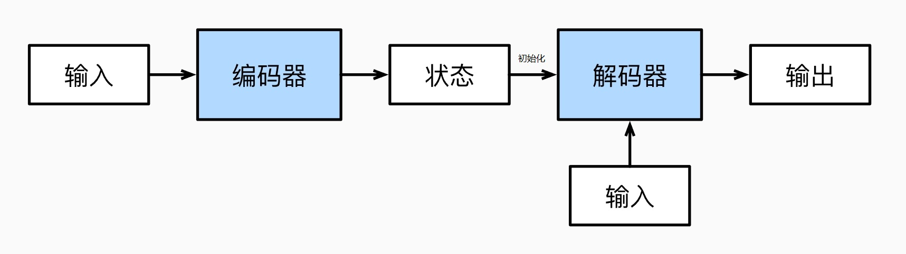

编码器可以认为**提取输入序列的信息(编码器输出隐藏状态)，给解码器提供初始隐藏层状态**

解码器可以认为是一个**语言模型**

```python
from torch import nn

class Encoder(nn.Module):
    """编码器-解码器架构的基本编码器接口"""
    def __init__(self, **kwargs):
        super(Encoder, self).__init__(**kwargs)

    def forward(self, X, *args):
        raise NotImplementedError

class Decoder(nn.Module):
    """编码器-解码器架构的基本解码器接口"""
    def __init__(self, **kwargs):
        super(Decoder, self).__init__(**kwargs)

    def init_state(self, enc_outputs, *args):
        raise NotImplementedError

    def forward(self, X, state):
        raise NotImplementedError
        
class EncoderDecoder(nn.Module):
    """编码器-解码器架构的基类"""
    def __init__(self, encoder, decoder, **kwargs):
        super(EncoderDecoder, self).__init__(**kwargs)
        self.encoder = encoder
        self.decoder = decoder

    def forward(self, enc_X, dec_X, *args):
        enc_outputs = self.encoder(enc_X, *args)
        dec_state = self.decoder.init_state(enc_outputs, *args)
        return self.decoder(dec_X, dec_state)
```

## 3.1 基于循环神经网络


3个要点：

1. 编码器和解码器都选择循环神经网络为基础，处理可变序列数据
2. 加入特定结束词元(token)<eos>，开始词元<bos>
3. **编码器和解码器之间的连接关系**又发展两种思路
   - 使用循环神经网络编码器最终的隐状态来初始化解码器的隐状态。[Sequence to sequence learning with neural networks](https://proceedings.neurips.cc/paper/2014/file/a14ac55a4f27472c5d894ec1c3c743d2-Paper.pdf)
   - 编码器最终的隐状态在每一个时间步都作为解码器的输入序列的一部分。[Learning phrase representations using rnn encoder-decoder for statistical machine translation](https://arxiv.org/pdf/1406.1078.pdf)，这种思路下，和解码器输入数据每个时间步concat都是**编码器最终隐藏状态的最后一层**，都是一样的。这也是注意力机制改进的地方。

以下网络两种思路都实现：

```python
import collections
import math
import torch
from torch import nn

#编码器
class Seq2SeqEncoder(Encoder):
    """用于序列到序列学习的循环神经网络编码器"""
    def __init__(self, 
                 vocab_size,   	#token维度
                 embed_size, 	#嵌入维度
                 num_hiddens, 	#隐藏层维度
                 num_layers,	#GRU层数
                 dropout=0, 
                 **kwargs
                ):
        super(Seq2SeqEncoder, self).__init__(**kwargs)
        # 嵌入层
        self.embedding = nn.Embedding(vocab_size, embed_size)
        self.rnn = nn.GRU(embed_size, num_hiddens, num_layers,
                          dropout=dropout)

    def forward(self, X, *args):
        # 输出'X'的形状：(batch_size,num_steps,embed_size)
        X = self.embedding(X)
        # 在循环神经网络模型中，第一个轴对应于时间步
        X = X.permute(1, 0, 2)
        # 如果未提及状态，则默认为0
        output, state = self.rnn(X)
        # output的形状:(num_steps,batch_size,num_hiddens)最后一层所有时间步的隐藏状态
        # state的形状:(num_layers,batch_size,num_hiddens)最后时刻所有层的隐藏状态
        return output, state

#解码器    
class Seq2SeqDecoder(Decoder):
    """用于序列到序列学习的循环神经网络解码器"""
    def __init__(self, vocab_size, embed_size, num_hiddens, num_layers,
                 dropout=0, **kwargs):
        super(Seq2SeqDecoder, self).__init__(**kwargs)
        self.embedding = nn.Embedding(vocab_size, embed_size)
        self.rnn = nn.GRU(embed_size + num_hiddens, num_hiddens, num_layers,
                          dropout=dropout)
        self.dense = nn.Linear(num_hiddens, vocab_size)
	
    # 使用编码器最后一个时间步的隐状态来初始化解码器的隐状态
    # enc_outputs=encoder(X)--->output, state
    def init_state(self, enc_outputs, *args):
        #需要初始化的是state，最后时刻所有层的隐藏状态
        return enc_outputs[1]
	
    #编码器最后时间步的隐藏状态最后一层(上下文变量)在所有的时间步与解码器的输入进行拼接（concatenate）
    def forward(self, X, state):
        # 输出'X'的形状：(batch_size,num_steps,embed_size)
        X = self.embedding(X).permute(1, 0, 2)
        # 广播context，使其具有与X相同的num_steps
        context = state[-1].repeat(X.shape[0], 1, 1)
        X_and_context = torch.cat((X, context), 2)
        output, state = self.rnn(X_and_context, state)
        output = self.dense(output).permute(1, 0, 2)
        # output的形状:(batch_size,num_steps,vocab_size)
        # state的形状:(num_layers,batch_size,num_hiddens)
        return output, state

#示例
X = torch.zeros((4, 7), dtype=torch.long)
#编码器
encoder = Seq2SeqEncoder(vocab_size=10, embed_size=8, num_hiddens=16,num_layers=2)
encoder.eval()
# output的形状:(num_steps,batch_size,num_hiddens)最后一层所有时间步的隐藏状态
# state的形状:(num_layers,batch_size,num_hiddens)最后时刻所有层的隐藏状态
output, state = encoder(X)

#解码器
decoder = Seq2SeqDecoder(vocab_size=10, embed_size=8, num_hiddens=16,num_layers=2)
decoder.eval()
# 编码器的输出给解码器初始化
#使用编码器最后一个时间步的隐状态来初始化解码器的隐状态
state = decoder.init_state(encoder(X))

# state有两个作用，提现两个思路
# 1.编码器最后时刻所有层：state，作为解码器初始状态。这也要求编码器和解码器的隐藏状态维度一致。
# 2.编码器最后时刻最后一层：state[-1],与解码器输入序列每个时间步连接（concatenate）
output, state = decoder(X, state)
```

## 3.2 注意力机制+循环神经网络

- 注意力机制

  注意力机制已经详细介绍，以下4个要点

  1. 核心是query、key、value，**一般query是一个**。**key和value是多个，并且成对存在。**
  2. 类比心理学家对人类注意力的研究。**query代表自主提示，key代表非自主提示，value代表实体**
  3. 注意力机制的思路是：通过一个key和多个query计算**注意力权重**，注意力权重（向量）分别对应多个value实体的重要性。注意力权重和value实体内积，得到**上下文**
  4. 一个key和多个value计算注意力权重分两步，分别是：**注意力评分函数，softmax函数**

  

- encode-decoder中的注意力机制

  简单说，就是指明了，query、key、value是什么？

  2个要点：

  1. **编码器最后时刻的所有层的隐藏状态**还是用来初始化解码器的隐藏状态(不变)

  2. 解码器输入序列还是拼接点东西，但不再拼接**编码器最后时刻最后一层的隐藏状态**，因为这样，输入序列每个时刻拼接的状态是一样的。

     现指明：解码器前时刻的隐藏状态$\pmb{h_{dt-1}}$作为query，**编码器隐藏状态所有时刻的最后一层**$\pmb{h_{1:t}}$作为key和value。一个query和多个key先计算注意力权重，然后和value相乘得到一个上下文$\pmb{c_i}$（context）。$\pmb{c_i}$和解码器输入序列中当前时刻数据$x_i$拼接

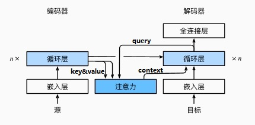

```python
import math
import torch
from torch import nn

# 对X处理，根据valid_len里的数据，非有效长度，用value屏蔽
def sequence_mask(X, valid_len, value=0):
    """在序列中屏蔽不相关的项"""
    maxlen = X.size(1)
    mask = torch.arange((maxlen), dtype=torch.float32,
                        device=X.device)[None, :] < valid_len[:, None]
    X[~mask] = value
    return X

# 对X的最后一个轴上进行softmax操作，但是只要部分参与操作
# 因为文本序列长度本身是不定的，RNN/GNU等其实也是可以处理不定长，但是一般都要求文本序列长度固定。
# 过长的序列会被截断，过短的序列会用零填充
# 用零填充的部分不应该参与softmax操作
def masked_softmax(X, valid_lens):
    # X:3D张量，valid_lens:1D或2D张量
    if valid_lens is None:
        return nn.functional.softmax(X, dim=-1)
    else:
        shape = X.shape
        if valid_lens.dim() == 1:
            valid_lens = torch.repeat_interleave(valid_lens, shape[1])
        else:
            valid_lens = valid_lens.reshape(-1)
        # 最后一轴上被掩蔽的元素使用一个非常大的负值替换，从而其softmax输出为0
        X = sequence_mask(X.reshape(-1, shape[-1]), valid_lens,
                              value=-1e6)
        return nn.functional.softmax(X.reshape(shape), dim=-1)

#注意力评分函数：加性注意力
class AdditiveAttention(nn.Module):
    def __init__(self, key_size, query_size, num_hiddens, dropout, **kwargs):
        super(AdditiveAttention, self).__init__(**kwargs)
        self.W_k = nn.Linear(key_size, num_hiddens, bias=False)
        self.W_q = nn.Linear(query_size, num_hiddens, bias=False)
        self.w_v = nn.Linear(num_hiddens, 1, bias=False)
        self.dropout = nn.Dropout(dropout)

    def forward(self, queries, keys, values, valid_lens):
        queries, keys = self.W_q(queries), self.W_k(keys)
        # 在维度扩展后，
        # queries的形状：(batch_size，查询的个数，1，num_hidden)
        # key的形状：(batch_size，1，“键－值”对的个数，num_hiddens)
        # 使用广播方式进行求和
        features = queries.unsqueeze(2) + keys.unsqueeze(1)
        features = torch.tanh(features)
        # self.w_v仅有一个输出，因此从形状中移除最后那个维度。
        # scores的形状：(batch_size，查询的个数，“键-值”对的个数)
        scores = self.w_v(features).squeeze(-1)
        # softmax操作，只有非零填充部分参数
        self.attention_weights = masked_softmax(scores, valid_lens)
        # values的形状：(batch_size，“键－值”对的个数，值的维度)
        return torch.bmm(self.dropout(self.attention_weights), values)
```

```python
#编码器没有变化

# 带有注意力机制解码器的基本接口
class AttentionDecoder(Decoder):
    def __init__(self, **kwargs):
        super(AttentionDecoder, self).__init__(**kwargs)

    @property
    def attention_weights(self):
        raise NotImplementedError

#带注意力的解码器接口
class Seq2SeqAttentionDecoder(AttentionDecoder):
    def __init__(self, vocab_size, embed_size, num_hiddens, num_layers,
                 dropout=0, **kwargs):
        super(Seq2SeqAttentionDecoder, self).__init__(**kwargs)
        #注意力评分函数
        self.attention = d2l.AdditiveAttention(
            num_hiddens, num_hiddens, num_hiddens, dropout)
        self.embedding = nn.Embedding(vocab_size, embed_size)
        #=================注意这里================================
        #这里初始化多了一个num_hiddens就是因为注意力机制的输出在-1轴上concat
        self.rnn = nn.GRU(
            embed_size + num_hiddens, num_hiddens, num_layers,
            dropout=dropout)
        self.dense = nn.Linear(num_hiddens, vocab_size)
	
    #解码器初始化细节
    # 使用编码器最后一个时间步的隐状态来初始化解码器的隐状态
    # enc_outputs=encoder(X)--->output, state
    def init_state(self, enc_outputs, enc_valid_lens, *args):
        # outputs的形状为(batch_size，num_steps，num_hiddens).
        # hidden_state的形状为(num_layers，batch_size，num_hiddens)
        outputs, hidden_state = enc_outputs
        return (outputs.permute(1, 0, 2), hidden_state, enc_valid_lens)
	
    #编码器传给解码器：
    # enc_outputs的形状为(batch_size,num_steps,num_hiddens)所有时刻最后一层隐藏状态
    # hidden_state的形状为(num_layers,batch_size,num_hiddens)最后时刻所有层隐藏状态
    def forward(self, X, state):
        enc_outputs, hidden_state, enc_valid_lens = state
        
        #常规的一步，数据输入到rnn，批量维度和时间步维度调换
        # 输出X的形状为(num_steps,batch_size,embed_size)
        X = self.embedding(X).permute(1, 0, 2)
        outputs, self._attention_weights = [], []
        
        #===========细节===================================
        #nn.GRU和nn.RNN是可以并行计算的，输入序列。
        #但是这里需要每个token配置不同注意力，所以还是顺序输入
        for x in X:
            #==========注意力机制设置query===================
            #第一个hidden_state[-1]是编码器最后时刻最后一层的隐藏状态
            #之后，解码器会计算hidden_state[-1]，就是解码器最后时刻最后一层的隐藏状态
            # query的形状为(batch_size,1,num_hiddens)
            query = torch.unsqueeze(hidden_state[-1], dim=1)
            
            # context的形状为(batch_size,1,num_hiddens)
            #===============注意力机制设置key和value=========================
            #key和value是enc_outputs，编码器所有时刻最后一层的隐藏状态
            context = self.attention(query, enc_outputs, enc_outputs, enc_valid_lens)
            
            #======================注意力机制连接============================
            # 在特征维度上连结
            #连接的对象是注意力机制计算的context和解码器输入序列的当前时刻x
            x = torch.cat((context, torch.unsqueeze(x, dim=1)), dim=-1)
            # 将x变形为(1,batch_size,embed_size+num_hiddens)
            
            #======================解码器初始化================================
            #解码器初始化：hidden_state
            #第一个hidden_state是编码器最后时刻所有层的隐藏状态
            #解码器最后的输出覆盖了hidden_state，它会有两个作用
            #1.作为下一个计算context的query
            #作为下一次解码器的隐藏状态
            out, hidden_state = self.rnn(x.permute(1, 0, 2), hidden_state)
            outputs.append(out)
            self._attention_weights.append(self.attention.attention_weights)
        # 全连接层变换后，outputs的形状为
        # (num_steps,batch_size,vocab_size)
        
        #nn.RNN本身只到隐藏状态，需要自己添加全连接层
        outputs = self.dense(torch.cat(outputs, dim=0))
        return outputs.permute(1, 0, 2), [enc_outputs, hidden_state,
                                          enc_valid_lens]

    @property
    def attention_weights(self):
        return self._attention_weights

#示例
#编码器
encoder = d2l.Seq2SeqEncoder(vocab_size=10, embed_size=8, num_hiddens=16,num_layers=2)
encoder.eval()

#解码器带注意力机制
decoder = Seq2SeqAttentionDecoder(vocab_size=10, embed_size=8, num_hiddens=16,
                                  num_layers=2)
decoder.eval()

X = torch.zeros((4, 7), dtype=torch.long)  # (batch_size,num_steps)

#编码器的输出给解码器
# enc_outputs=encoder(X)--->output, state
# outputs的形状为(batch_size，num_steps，num_hiddens).
# hidden_state的形状为(num_layers，batch_size，num_hiddens)
#outputs的批量维度和时间步维度调换位置，方便输入到RNN
#(outputs.permute(1, 0, 2), hidden_state)
state = decoder.init_state(encoder(X), None)

# 编码器的outputs和hidden_state都有作用：
# 1.编码器最后时刻所有层：state，作为解码器初始状态。这也要求编码器和解码器的隐藏状态维度一致。
# 2.编码器所有时刻最后一层：outputs,作为key和value
#解码器自己的隐藏状态最后时刻最后一层作为query
#注意力机制计算的context和x连接
output, state = decoder(X, state)
output.shape, len(state), state[0].shape, len(state[1]), state[1][0].shape
```

## 3.3 Transformer：自注意力，多头注意力，掩码多头注意力，位置编码，残差网络，层规范化，前馈网络

参考：

1. [很棒的网站哈佛nlp：The Annotated Transformer](http://nlp.seas.harvard.edu/2018/04/03/attention.html)
2. [The Illustrated Transformer]([The Illustrated Transformer – Jay Alammar – Visualizing machine learning one concept at a time. (jalammar.github.io)](http://jalammar.github.io/illustrated-transformer/))
3. [Transformer Coding Details](https://kikaben.com/transformers-coding-details/)
4. [How to code The Transformer in Pytorch](https://towardsdatascience.com/how-to-code-the-transformer-in-pytorch-24db27c8f9ec)
5. [The Illustrated Transformer](http://jalammar.github.io/illustrated-transformer)
6. [Language Modeling with nn.Transformer and Torchtext](https://pytorch.org/tutorials/beginner/transformer_tutorial.html)
7. [论文Transformers without Tears: Improving the Normalization of Self-Attention](https://arxiv.org/abs/1910.05895)
8. [PyTorch Transformer PyTorch 变压器](https://pytorch.org/docs/stable/generated/torch.nn.Transformer.html)

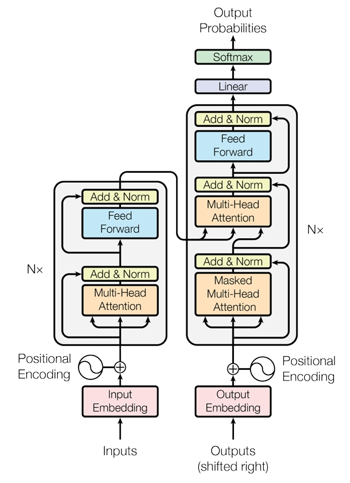

5个要点：

1. **处理序列数据的网络不再是RNN，而是自注意力。只需要指定注意力机制中的query、key、value、就可以用多头注意力来实现自注意力。序列数据中所有单词既是key也是value，序列中单个单词依次作为query。**

2. transformer中没有RNNs等模型，所以严谨来说，**并没有隐藏状态一说的，也不存在编码器的输出作为解码器的初始化状态。**严格来说，**编码器的输出应该是特征，作为key、value，与解码器提供的query计算注意力**。

   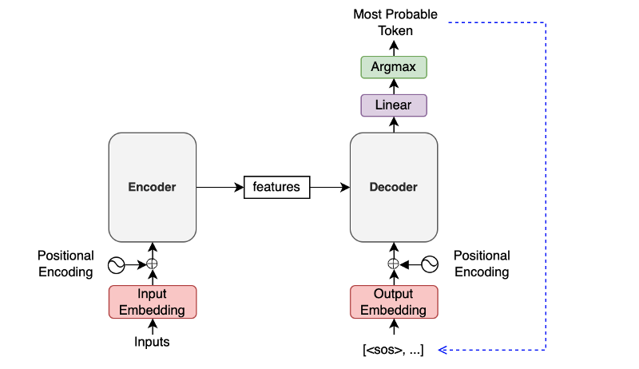

3. **transformer中encoder-decodr连接同样依靠注意力机制计算的context。但解码器的输入不再是context和输入序列在最后一轴上concat，而是以context直接作为解码器块中的输入流动**

4. transformer中encoder-decodr连接中的注意力机制：**编码器第最后一层transformer块的所有输出序列作为key和value，解码器的输入序列的每一个token分别作为query。解码器不同层都会和编码器连接，query会因为不同层而不同，但是key、value一直都是编码器最后一层的所有输入序列。**

5. 解码器中处理序列数据的是**掩码自注意力**，同样是多头注意力实现，指定的query、key、value和编码器是一样的。不同点在于：**输入序列中某个token作为query，并不是所有序列作为key、value计算context，只有序列中作为query的token之前时刻的所有tokens作为key、value。**这种机制是为了保证机器翻译中的解码器token只能看到自己的过去，而不能看到未来

### 训练与推理

- 训练

  解码器本质是一个语言模型，根据之前时刻的token预测下一时刻的token

  所以训练数据集有三部分：

  1. 编码器的输入序列：源文本序列
  2. 解码器的输入序列：目标文本序列
  3. 解码器label序列：目标文本序列向右偏移一个时间步，在开头加一个`SOS`的token

- 预测（推理）

  要点：

  - 训练过程编码器和解码器都是并行输出。也就是输入序列，输出也是序列。

  - 推理过程中，**编码器输入序列依旧并行计算特征**。**解码器却是一个个token依次输入并预测输出**。这是encoder2decoder架构的共性。原因是什么？推理过程中：**解码器其实没有输入，只能在训练阶段加入一个标识开始的token（`SOS`）,这样才能让`SOS`作为解码器的输入，解码器的输出再作为输入，直到结束或者达到最大序列长度**。过程：
    1. The encoder extracts features from an input language sentence.
       编码器从输入语言句子中提取特征。
    2. The first decoder input is the `SOS` (the start-of-sentence token).
       第一个解码器输入是 `SOS` （句子开头标记）。
    3. The decoder outputs the last projection.
       解码器输出最后的投影。
    4. The most probable token joins the decoder input sequence at the end.
       最可能的标记在末尾加入解码器输入序列。
    5. Steps 3 and 4 repeat.
       重复步骤 3 和 4。
    6. Finish when the most probable next token is `EOS` (end-of-sentence).
       当最可能的下一个标记是 `EOS` （句子结束）时结束。
    
    需要注意的是：步骤里的输入包括：key、value、query。并且原则依然是**query不能看到未来的value和key**。
  
  

### 3.3.1 多头注意力

3个要点：

1. 多个注意力头**并行计算**，拼接输出，最后固定输出
2. **多头注意力的定位是注意力机制的实现方式，不涉及注意力机制的用途。所以注意力机制中的query、key、value是没有指定的，留下参数，根据用途指定。**
3. 头尾加上全连接层


公式：
$$
\pmb{h_i}=f(W_i^{(q)}\pmb{q},W_i^{(k)}\pmb{k},W_i^{(v)}\pmb{v})
$$

$$
W_o\begin{bmatrix} \pmb{h_1} \\ \pmb{h_2} \\ \vdots \\ \pmb{h_h} \end{bmatrix}
$$

其中$h_i$是每个注意力头的输出context，形状是**(batch_size, num_queries, feature_value)**

函数$f$包括注意力评分函数和注意力权重函数Softmax

```python
import math
import torch
from torch import nn

# 为了多注意力头的并行计算而变换形状
# 输入X的形状:(batch_size，查询或者“键－值”对的个数，num_hiddens)
# 其中num_hiddens包含n个注意力头的隐藏层
# 这是没办法并行来直接输入给注意力评分函数，因此对形状变换
# (b,k,h)-->(b,k,n,h/n)-->(b,n,k,h/n)-->(b*n,k,h/n)
def transpose_qkv(X, num_heads):
    # 输入X的形状:(batch_size，查询或者“键－值”对的个数，num_hiddens)
    # 输出X的形状:(batch_size，查询或者“键－值”对的个数，num_heads，
    # num_hiddens/num_heads)
    X = X.reshape(X.shape[0], X.shape[1], num_heads, -1)

    # 输出X的形状:(batch_size，num_heads，查询或者“键－值”对的个数,
    # num_hiddens/num_heads)
    X = X.permute(0, 2, 1, 3)

    # 最终输出的形状:(batch_size*num_heads,查询或者“键－值”对的个数,
    # num_hiddens/num_heads)
    return X.reshape(-1, X.shape[2], X.shape[3])


# 逆转transpose_qkv函数的操作
def transpose_output(X, num_heads):
    X = X.reshape(-1, num_heads, X.shape[1], X.shape[2])
    X = X.permute(0, 2, 1, 3)
    return X.reshape(X.shape[0], X.shape[1], -1)

#注意力评分函数：缩放点积注意力
class DotProductAttention(nn.Module):
    def __init__(self, dropout, **kwargs):
        super(DotProductAttention, self).__init__(**kwargs)
        self.dropout = nn.Dropout(dropout)
    #多头注意力中：输入形状：(batch_size*num_heads, num_steps, num_hiddens/num_heads)

    # queries的形状：(batch_size，查询的个数，d)
    # keys的形状：(batch_size，“键－值”对的个数，d)
    # values的形状：(batch_size，“键－值”对的个数，值的维度)
    # valid_lens的形状:(batch_size，)或者(batch_size，查询的个数)
    def forward(self, queries, keys, values, valid_lens=None):
        d = queries.shape[-1]
        # 设置transpose_b=True为了交换keys的最后两个维度
        scores = torch.bmm(queries, keys.transpose(1,2)) / math.sqrt(d)
        # softmax操作，只有非零填充部分参数
        #形状：(batch_size，查询的个数，“键－值”对的个数)
        #多头注意力中形状：(batch_size*num_heads, num_steps, num_steps)
        self.attention_weights = masked_softmax(scores, valid_lens)
        return torch.bmm(self.dropout(self.attention_weights), values)

# 多头注意力
class MultiHeadAttention(nn.Module):
    def __init__(self, key_size, query_size, value_size, num_hiddens,
                 num_heads, dropout, bias=False, **kwargs):
        super(MultiHeadAttention, self).__init__(**kwargs)
        self.num_heads = num_heads
        # 注意力评分函数
        self.attention = DotProductAttention(dropout)
        self.W_q = nn.Linear(query_size, num_hiddens, bias=bias)
        self.W_k = nn.Linear(key_size, num_hiddens, bias=bias)
        self.W_v = nn.Linear(value_size, num_hiddens, bias=bias)
        self.W_o = nn.Linear(num_hiddens, num_hiddens, bias=bias)

    def forward(self, queries, keys, values, valid_lens):
        # queries，keys，values的形状:
        # (batch_size，查询或者“键－值”对的个数，num_hiddens)
        # valid_lens　的形状:
        # (batch_size，)或(batch_size，查询的个数)
        # 经过变换后，输出的queries，keys，values　的形状:
        # (batch_size*num_heads，查询或者“键－值”对的个数，num_hiddens/num_heads)
        # (batch_size*num_heads, num_steps, num_hiddens/num_heads)
        
        queries = transpose_qkv(self.W_q(queries), self.num_heads)
        keys = transpose_qkv(self.W_k(keys), self.num_heads)
        values = transpose_qkv(self.W_v(values), self.num_heads)

        if valid_lens is not None:
            # 在轴0，将第一项（标量或者矢量）复制num_heads次，
            # 然后如此复制第二项，然后诸如此类。
            valid_lens = torch.repeat_interleave(
                valid_lens, repeats=self.num_heads, dim=0)

        # output的形状:(batch_size*num_heads，查询的个数，
        # num_hiddens/num_heads)
        output = self.attention(queries, keys, values, valid_lens)

        # output_concat的形状:(batch_size，查询的个数，num_hiddens)
        output_concat = transpose_output(output, self.num_heads)
        return self.W_o(output_concat)
```

### 3.3.2 自注意力

3个要点：

1. 注意力机制的产物，**不需要额外去实现，只需要指定query、key、value分别是什么**，套用就可以
2. **序列数据中所有单词既是key也是value，序列中单个单词依次作为query。**
3. 自注意力指定query、key、value，使得其**用途是一种处理序列数据的基础网络**，和卷积神经网络CNNs、循环神经网络RNN是一个级别的网络

- 自注意力套用在多头注意力

  **第二个单词作为query**

  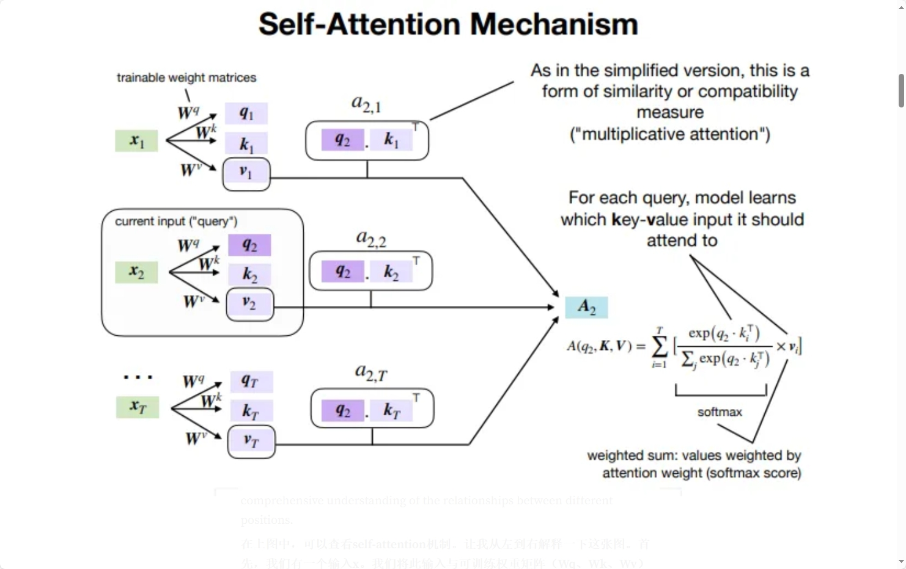

### 3.3.3 位置编码

3个要点：

1. 自注意力处理序列数据忽略了顺序信息，位置编码的解决办法是**对序列的每个位置和所有维度进行标记**

   

2. 编码设计方案：
   $$
   p_{i,2j}=sin(\frac{i}{10000^{2j/d}})\\
   p_{i,2j+1}=cos(\frac{i}{10000^{2j/d}})
   $$
   其中，$i$是行，也就是编码标记序列中第$i$个单词。$j$是列，也就是编码第$j$维。$d$是序列数据中词元本身的维度。$p_{i,2j}$编码标记的是序列数据的第在$i$个单词的第$2j$维(偶数维)，同样的，$p_{i,2j+1}$编码标记的是序列数据的第在$i$个单词的第$2j+1$维(奇数维)。

   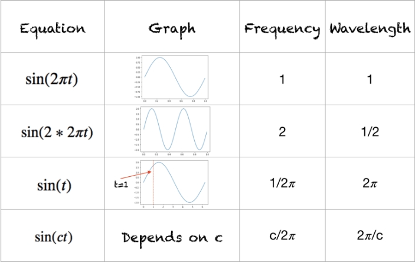

3. 位置编码和序列数据结合：逐元素相加

   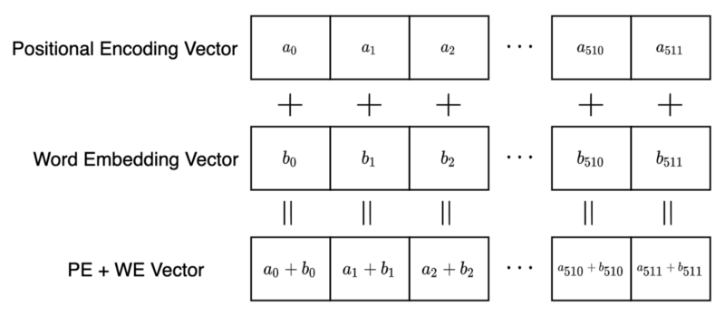

```python
# 位置编码
class PositionalEncoding(nn.Module):
    def __init__(self, num_hiddens, dropout, max_len=1000):
        super(PositionalEncoding, self).__init__()
        self.dropout = nn.Dropout(dropout)
        # 创建一个足够长的P
        self.P = torch.zeros((1, max_len, num_hiddens))
        X = torch.arange(max_len, dtype=torch.float32).reshape(
            -1, 1) / torch.pow(10000, torch.arange(
            0, num_hiddens, 2, dtype=torch.float32) / num_hiddens)
        self.P[:, :, 0::2] = torch.sin(X)
        self.P[:, :, 1::2] = torch.cos(X)

    def forward(self, X):
        X = X + self.P[:, :X.shape[1], :].to(X.device)
        return self.dropout(X)
```

### 3.3.4 掩码多头注意力

3个要点：

1. 本质是**多头注意力实现的自注意力**
2. 之所以**掩码**，**自注意力处理解码器的输入序列**有个考虑：序列中的数据$\pmb{x_t}$作为query，计算注意力的**key和value是整个序列**。这意味着，**序列中的$\pmb{x_t}$计算注意力可以看到未来的数据。**这在编码器中是合理的，因为它的用途是提取信息。**解码器的用途是预测的，计算注意力能看到未来是不合理的。**
3. 解决办法是：掩码实现：序列中的数据$\pmb{x_t}$作为query计算注意力，假设当前序列的长度是t。也就是**后面时刻的序列数据不作为key、value，注意，当前时刻的key、value是包括的！**

比如：解码器输入序列是`[<SOS>, 'Bonjour', 'le', 'monde', '!']`，`'Bonjour'` 位置的注意力计算不应使用 `'le', 'monde', '!'` 位置的分数。因此，后续的注意力掩码是 `[1, 1, 0, 0, 0]` 。

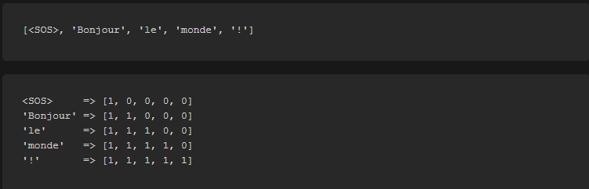

### 3.3.5 前馈网络

3个要点：

1. 名字新网络很简单，本质是：**全连接层1+激活函数(relu)+全连接层2**
2. 全连接层之前，先变换输入形状：(b,n,d)-->(b\*n,n)。全连接层之后形状再变换回来：(b\*n,n)-->(b,n,d)
3. pytorch实现的全连接层接口`torch.nn.Dense`输入如果是3D，可以直接对最后一维执行全连接层操作，可以免去形状变换的操作。

```python
# 基于位置的前馈网络
class PositionWiseFFN(nn.Block):
    def __init__(self, ffn_num_hiddens, ffn_num_outputs, **kwargs):
        super(PositionWiseFFN, self).__init__(**kwargs)
        self.dense1 = nn.Dense(ffn_num_hiddens, flatten=False,
                               activation='relu')
        self.dense2 = nn.Dense(ffn_num_outputs, flatten=False)

    def forward(self, X):
        return self.dense2(self.dense1(X))
```

### 3.3.6 残差连接

2个要点：

1. **深度网络层数加多，如何提升精度？**残差网络提供了思路[Identity mappings in deep residual networks](https://arxiv.org/pdf/1603.05027.pdf)
2. 残差网络的思路：添加一个快速通道：$f(x)=x+g(x)$，其中$g(x)$原来的网络，逐元素相加

左边原始网络，右边加入残差连接后的网络


### 3.3.7 批量规范and层规范化

参考：

1. [Different Normalization Layers in Deep Learning](https://towardsdatascience.com/different-normalization-layers-in-deep-learning-1a7214ff71d6)
2. [Build Better Deep Learning Models with Batch and Layer Normalization](https://www.pinecone.io/learn/batch-layer-normalization/)

概述：

1. 规范化（归一化）是一种**持续加速深层网络收敛**的有效技术
2. 规范化层包括：
   - Batch Normalization 批量归一化
   - Weight Normalization 权重归一化
   - Layer Normalization 层归一化
   - Instance Normalization 实例归一化
   - Group Normalization 组标准化
3. 规范化简单说就是：**求均值和方差，之后再调整分布**。**不同归一化的区别在于求均值和方差的维度。**

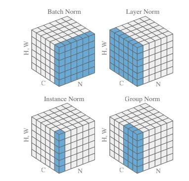


- **批量归一化**动机

  1. 训练深层神经网络并不容易，尤其是在较短时间内使它们收敛

  2. 数据输入在最低部，损失梯度从输出传到输入。底部的层训练较慢。

     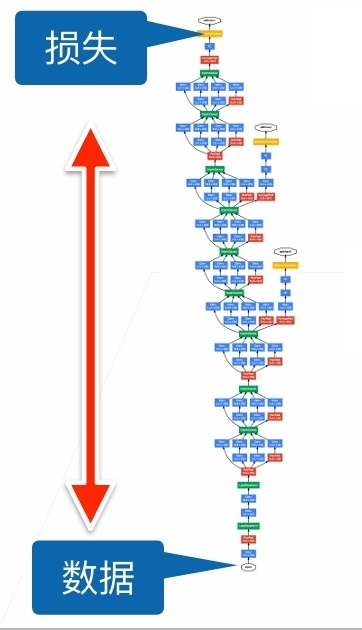

  3. 数据预处理的方式通常会对最终结果产生巨大影响，其中**标准化输入特征**的做法是，**使其平均值为0，方差为1**。

  4. 深度神经网络里中间层(比如多层感知机，卷积神经网络等)的输出变量，**可能具有更广的变化范围**，批量规范化的发明者非正式地假设，这些变量分布中的这种偏移可能会**阻碍网络的收敛**

  5. 最初论文是想通过批量归一化减少内部协变量转移。后续论文指出，它可能是通过在每个批量里加入噪音来控制模型复杂度。所谓**噪音就是计算的均值$\mu_\beta$和方差$\sigma_\beta$**，因为每个批量是随机的。
     $$
     \hat{x_i}=\gamma\frac{x_i-\mu_\beta}{\sigma_\beta}+\beta
     $$

  6. **批量规范没必要和丢弃法（dropout）混合使用**

  7. 批量规范化层在”训练模式“（通过小批量统计数据规范化）和“预测模式”（通过数据集统计规范化）中的**功能不同**。 在训练过程中，我们无法得知使用整个数据集来估计平均值和方差，所以只能根据每个小批次的平均值和方差不断训练模型。 而在预测模式下，可以根据整个数据集精确计算批量规范化所需的平均值和方差。

  

  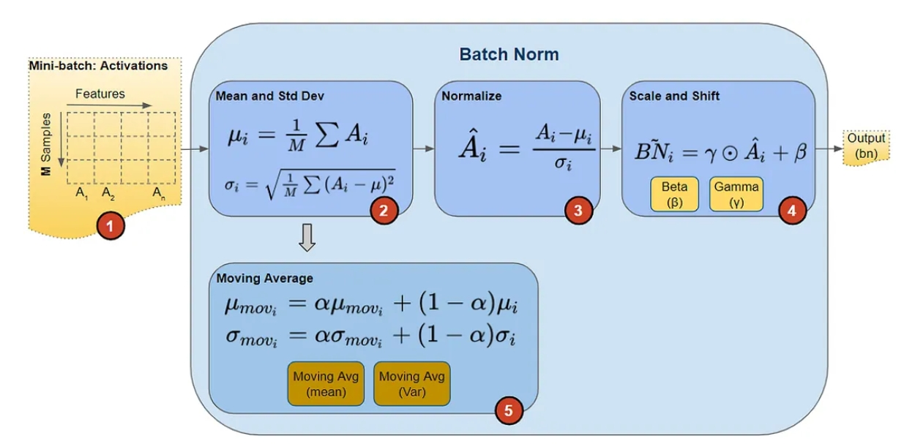

  **批量规范化代码实现：**

  ```python
  import torch
  from torch import nn
  from d2l import torch as d2l
  
  #批量归一化计算函数
  def batch_norm(X,            #输入数据
                 gamma, 		 #参数
                 beta,  		 #参数
                 moving_mean,	 #预测阶段的均值，来自整个数据集 
                 moving_var,   #预测阶段的方差，~
                 eps,          #超参数
                 momentum
                ):
      
      # 通过is_grad_enabled来判断当前模式是训练模式还是预测模式
      if not torch.is_grad_enabled():
          # 如果是在预测模式下，直接使用传入的移动平均所得的均值和方差
          X_hat = (X - moving_mean) / torch.sqrt(moving_var + eps)
      else:
          assert len(X.shape) in (2, 4)#2d是全连接层，4d是卷积
          if len(X.shape) == 2:
              # 使用全连接层的情况，计算特征维上的均值和方差
              mean = X.mean(dim=0)
              var = ((X - mean) ** 2).mean(dim=0)
          else:
              # 使用二维卷积层的情况，计算通道维上（axis=1）的均值和方差。
              # 这里我们需要保持X的形状以便后面可以做广播运算
              mean = X.mean(dim=(0, 2, 3), keepdim=True)
              var = ((X - mean) ** 2).mean(dim=(0, 2, 3), keepdim=True)
          # 训练模式下，用当前的均值和方差做标准化
          X_hat = (X - mean) / torch.sqrt(var + eps)
          
          # 更新移动平均的均值和方差，作为预测阶段的均值和方差
          moving_mean = momentum * moving_mean + (1.0 - momentum) * mean
          moving_var = momentum * moving_var + (1.0 - momentum) * var
          
      Y = gamma * X_hat + beta  # 缩放和移位
      return Y, moving_mean.data, moving_var.data
  
  class BatchNorm(nn.Module):
      # num_features：完全连接层的输出数量或卷积层的输出通道数。
      # num_dims：2表示完全连接层，4表示卷积层
      def __init__(self, num_features, num_dims):
          super().__init__()
          if num_dims == 2:
              shape = (1, num_features)
          else:
              shape = (1, num_features, 1, 1)
              
          # 参与求梯度和迭代的拉伸和偏移参数，分别初始化成1和0
          self.gamma = nn.Parameter(torch.ones(shape))
          self.beta = nn.Parameter(torch.zeros(shape))
          # 非模型参数的变量初始化为0和1
          self.moving_mean = torch.zeros(shape)
          self.moving_var = torch.ones(shape)
  
      def forward(self, X):
          # 如果X不在内存上，将moving_mean和moving_var
          # 复制到X所在显存上
          if self.moving_mean.device != X.device:
              self.moving_mean = self.moving_mean.to(X.device)
              self.moving_var = self.moving_var.to(X.device)
          # 保存更新过的moving_mean和moving_var
          Y, self.moving_mean, self.moving_var = batch_norm(
              X, self.gamma, self.beta, self.moving_mean,
              self.moving_var, eps=1e-5, momentum=0.9)
          return Y
  ```

要点：

1. 计算均值和方差
   $$
   \mu_{\beta}=\frac{1}{m}\sum_{i=1}^mx_i \\
   \sigma_\beta^2=\frac{1}{m}\sum_{i=1}^m(x_i-\mu_\beta)^2+\epsilon
   $$

2. 调整分布
   $$
   \hat{x_i}=\gamma\frac{x_i-\mu_\beta}{\sigma_\beta}+\beta
   $$
   其中 $\gamma$和$\beta$分别是缩放因子（scale）和偏移因子（shift），是**可学习的参数**

   

3. batch norm：

   - 输入可能是1D、2D、3D数据（都要加上额外的batch和channel维度），**计算均值和方差的维度其实不仅仅是batch，而是除了channel维度以外的所有维度**
   - 正因为batch参与计算均值和方差，所以训练和推理阶段的计算不一样，在 pytorch 中 `model.eval()` 确保在评估模型中设置模型，因此 BN 层利用它来使用根据训练数据预先计算的固定均值和方差。
   - BN 在每次训练迭代中计算批量统计数据（小批量均值和方差），因此在训练时需要更大的批量大小，以便能够有效地逼近小批量的总体均值和方差。这使得 BN 更难训练网络用于对象检测、语义分割等应用，因为它们通常使用高输入分辨率（通常大至 1024x 2048），并且较大批量的训练在计算上不可行。
   - BN 不能很好地与 RNN 配合使用。问题是 RNN 与之前的时间戳有循环连接，并且需要为 BN 层中的每个时间步设置单独的 β 和 γ，这反而会增加额外的复杂性，并使 BN 与 RNN 一起使用变得更加困难。
   - 适合处理图像

   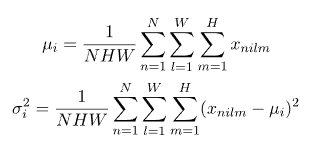

4. layer norm：

   - **计算均值和方差的维度是除了batch以外的所有维度**
   - 适合处理序列数据，通过**消除对批次的依赖**克服了 BN 的缺点，并且也更容易应用于 RNN。

5. instance norm：

   - **计算均值和方差的维度是除了batch和channel以外的所有维度**

   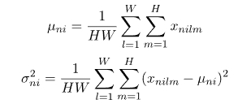

6. group norm：

   - **计算均值和方差的维度是除了batch和channel以外的所有维度，多个组一起计算**

### 3.3.8 encoder和decoder之间的注意力


3个要点：

1. 编码器第最后一层transformer块的输出序列$\pmb{y_1},...,\pmb{y_n}$作为key和value
2. 解码器的输入序列的每一个token分别作为query
3. **解码器不同的transformer块选择的key和value，都是编码器的最后一层transformer块的输出**

## 3.4 pytorch中的transformer

参考：

1. [Language Translation with `nn.Transformer` and torchtext](https://pytorch.org/tutorials/beginner/translation_transformer.html#)

### 3.4.1 多头注意力

```python
torch.nn.MultiheadAttention(embed_dim, 
                            num_heads, 
                            dropout=0.0, 
                            bias=True, 
                            add_bias_kv=False, 
                            add_zero_attn=False, 
                            kdim=None, 
                            vdim=None, 
                            batch_first=False, 
                            device=None, 
                            dtype=None)
forward(query, 
        key, 
        value, 
        key_padding_mask=None, 
        need_weights=True, 
        attn_mask=None, 
        average_attn_weights=True, 
        is_causal=False)
```

- 初始化参数

  `embed_dim`：两个设置：**输入query和输出特征的维度**。并且如果`kdim`和`vdim`不指定，那么有kdim = vdim = embed_dim

  `num_heads`:并行注意头的数量

  `dropout`：Dropout 概率，范围[0,1)   默认值： `0.0` （无丢失）。

  `bias`：是否有偏置，默认False

  `add_bias_kv`：在计算键（key）和值（value）时是否添加额外的偏置。默认为 False。

  `add_zero_attn`：

  `kdim`：key的维度，默认是None，意味着`kdim=embed_dim`

  `vdim`：value的维度，默认是None，意味着`vdim=embed_dim`

  `batch_first`：如果 `True` ，则输入和输出张量提供为 (batch, seq_, feature)。默认值： `False` 

  `device`：设备`device = torch.device('cuda' if torch.cuda.is_available() else 'cpu')`

  `dtype`：数据类型

  

- 前向运算参数

  `query`：query张量数据，维度顺序受`batch_first`影响。`batch_first=True`形状是$(N,L,E_q)$，其中$N$是批量，$L$是query的数量，$E_q$是维度，必须有$E_q=embed\_dim$

  `key`：类似query。key张量数据，维度顺序受`batch_first`影响。`batch_first=True`形状是$(N,S,E_k)$，其中$N$是批量，$S$是key的数量，$E_k$是维度，必须有$E_k=kdim$

  `value`：类似query

  `key_padding_mask`： **作用是屏蔽key中的填充位置。形状固定： $(N,S)$**，其中$S$是key序列长度，有两种掩码：**二进制掩码和浮点数掩码**。

  - 二进制掩码

    张量内元素数值是`True`或者`False`，其中`True`表示该位置应该屏蔽

  - 浮点数掩码

    张量内元素数值是`0`或者`-inf`(负无穷大)，浮点数掩码的做法是将掩码张量与注意力权重逐元素相加（掩码张量会进行广播机制扩展），可想而知，`-inf`表示该位置应该屏蔽

    **key_padding_mask形状固定 $(N,S)$，每行表示一个key，在相应位置设置掩码屏蔽**

    ```python
    '''
    假设N=4,S=15，4个序列的有效长度分别是[5,7,9,12]
    两种掩码设置
    '''
    #1.二进制掩码
    import torch
    
    N=4
    S=15
    #朴素的实现
    m=torch.arange(S)
    s=torch.tensor([5,7,9,12]).repeat_interleave(S,dim=0).reshape(N,S)
    key_padding_mask = m>=s
    
    #广播机制的一种实现
    key_padding_mask = torch.arange(S)[None, :] >= torch.tensor([5,7,9,12])[:, None]
    # print(key_padding_mask)
    # print(key_padding_mask.dtype)
    
    
    #2.浮点数掩码
    key_padding_mask=torch.masked_fill(torch.zeros(N,S), key_padding_mask, float('-inf'))
    print(key_padding_mask)
    print(key_padding_mask.dtype)
    ```

    

  `attn_mask`：**作用是自注意力中屏蔽未来位置。形状规定：$(L,S)$或者$(N⋅num\_heads,L,S)$**，其中$N$是批量大小，$L$是query序列长度，$S$是key序列长度。如果形状是2D内部会进行广播机制。同样有两种掩码方式，和`key_padding_mask`相同。

  3个要点：

  1. **注意力机制中，本质是一个token（query）和一个序列（key）计算注意力权重，注意力权重再和另一个序列（value）计算得到一个特征值（很多地方称为上下文）。query是一个token，key和value是多个token组成的序列。多头注意力是并行地执行了$N*L$个query的注意力操作。**
  2. **所以其实不管是key_padding_mask还是attn_mask，如果要给每一个query设置key的屏蔽位置，其实它们的形状都应该是$(N,L,S)$。如果每个头也要分配，那么形状是$(N⋅num\_heads,L,S)$**
  3. **之所以`key_padding_mask`形状是$(N,S)$，`attn_mask`形状可以是$(L,S)$​，是因为他们的作用决定了很多屏蔽的位置是相同的，源码中才能大量利用广播机制进行扩展。**key_padding_mask掩码，query输入的形状是$(N,L)$，同一行的token作为query，和它们计算的key、value是同一个序列，所以同一行的掩码当然一样。attn_mask掩码，自注意力专属，query、key、value相同。query输入中同一列，是不同序列中的相同位置的token，它们能看到的位置只能是现在和过去。所以同一列的掩码一样。

  **$(L,S)$形状的attn_mask张量，第$i$行是序列中第$i$个token作为query能看到的整个序列的位置。**attn_mask的作用是屏蔽自注意力计算时query的未来位置。**所以如果使用attn_mask张量掩码，那么你的多头注意力的query、key、value一定要是相同的。**假设输入序列的形状都是$(N,L)$，每行代表一个序列，长度是$L$，总共$N$个序列。自注意力是每个序列里的token依次作为query，整个序列作为key和value。不同行（不同序列）里相同位置能看到的有效长度是一样的，所以attn_mask只需要配置一行的掩码，因为每一行的情况都一样。

  attn_mask张量如果是布尔值掩码，它是一个上三角矩阵，对角线以上的所有元素是`True`对角线及对角线以下所有元素是`False`。如果是浮点数掩码，对角线以上所有元素是`-inf`，对角线及对角线以下所有元素是`0`。

  给出query输入的序列长度，掩码配置是固定的，就是一个上三角矩阵，自己配置也很简单。PyTorch提供了配置的接口：`torch.nn.Transformer.generate_square_subsequent_mask`，它是`torch.nn.Transformer`类的一个静态方法，不需要初始化就可以用，参数只有一个，那就是query输入的序列长度。源码如下:

  ```python
  def _generate_square_subsequent_mask(
          sz: int,
          device: torch.device = torch.device(torch._C._get_default_device()),  # torch.device('cpu'),
          dtype: torch.dtype = torch.get_default_dtype(),
  ) -> Tensor:
      r"""Generate a square causal mask for the sequence. The masked positions are filled with float('-inf').
          Unmasked positions are filled with float(0.0).
      """
      return torch.triu(
          torch.full((sz, sz), float('-inf'), dtype=dtype, device=device),
          diagonal=1,
      )
  
      
  #直接调用，输出浮点数掩码
  attn_mask=torch.nn.Transformer.generate_square_subsequent_mask(query.shape[1])
  ```

  `average_attn_weights`：返回的 `attn_weights` 是否在各个头之间进行平均。此标志仅在 need_weights=True 时有效。默认值： `True` 

  `need_weights`：是否返回注意力权重，默认值： `True` 

  `is_causal`：

- 输出

  `attn_output`输出，形状是$(N,L,E_q)$，必有$E_q=embed\_dim$

  `attn_output_weights`：注意力权重。形状 $(N,L,S)$ 或者 $(N,num\_heads,L,S)$，受参数need_weights和average_attn_weights影响。

使用注意：

1. 初始化参数**，`embed_dim`、`kdim`、`vdim`不必相等**，但是，**`embed_dim`必须被`num_heads`整除**，否则报错。
2. 前向运算参数，**`key`和`value`的序列长度`S`必须一致**，`query`的序列长度`L`不必和它们一致。
3. 维度对应关系：$E_q=embed\_dim$，$E_k=kdim$，$E_v=vdim$
4. 初始化参数`kdim`和`vdim`如果不指定，那么有`kdim = vdim = embed_dim`
5. 输出`attn_output`的形状是$(N,L,E_q)$，当然$E_q=embed\_dim$，按照多头注意力原理，输出的形状应该是$(N,L,E_v)$，可能在后面加了一个全连接层。总之，**初始化参数`embed_dim`不仅设置了输入`query`的维度，还设置了输出特征的维度。**
6. 初始化参数`batch_first`只规定了输入`query`、`key`、`value`中批量和序列长度维度顺序。**源码里内部处理还是统一调整序列长度在前。**并且要注意：**这个参数并不影响`key_padding_mask`和`attn_weights`的维度顺序，它们两的维度设置是固定的。**

```python
import torch.nn as nn
import torch

embed_dim=32
num_heads=2
kdim=16
vdim=14
S=18
L=20
N=64
mha=nn.MultiheadAttention(embed_dim=embed_dim,num_heads=num_heads,kdim=kdim,vdim=vdim,batch_first=True)

query=torch.rand(N, L, embed_dim)
key=torch.rand(N, S,kdim)
value=torch.rand(N, S,vdim)

attn_output,attn_output_weights=mha(query,key,value)
print(attn_output.shape)
#torch.Size([64, 20, 32])
print(attn_output_weights.shape)
#torch.Size([64, 20, 18])
```

### 3.4.2 编码器

```python
torch.nn.TransformerEncoder(encoder_layer, 
                            num_layers, 
                            norm=None, 
                            enable_nested_tensor=True, 
                            mask_check=True)
forward(src, 
        mask=None, 
        src_key_padding_mask=None, 
        is_causal=None)
```

- 初始化

  **encoder_layer** –`TransformerEncoderLayer() `类的实例（必需）。

  **num_layers** – 编码器中子编码器层的数量（必需）。

  **norm** – 层归一化组件（可选）

  **enable_nested_tensor** – 如果为 True，输入将自动转换为嵌套张量（并在输出时转换回来）。当填充率较高时，这将提高 TransformerEncoder 的整体性能。默认值： `True` （启用）

- 前向函数

  **src** (Tensor) – 编码器的序列（必需）

  **mask** (Optional [Tensor]) –src 序列的掩码（可选）,屏蔽未来位置，一般不需要

  **src_key_padding_mask** (Optional [Tensor]) – 每批次 src 键的掩码（可选）

  **is_causal** (Optional [bool]) –如果指定，则将因果掩码应用为 `mask` 。默认值： `None` ；尝试检测因果掩模。警告： `is_causal` 提供了 `mask` 是因果掩码的提示。提供不正确的提示可能会导致不正确的执行，包括向前和向后兼容性。

```python
torch.nn.TransformerEncoderLayer(d_model, 
                                 nhead, 
                                 dim_feedforward=2048, 
                                 dropout=0.1, 
                                 activation=<function relu>, 
                                 layer_norm_eps=1e-05, 
                                 batch_first=False, 
                                 norm_first=False, 
                                 bias=True, 
                                 device=None, 
                                 dtype=None)
forward(src, 
        src_mask=None, 
        src_key_padding_mask=None, 
        is_causal=False)
```

- 初始化参数

  **d_model** (int) – 模型输出维度

  **nhead** (int)–注意力头数量

  **dim_feedforward** (int)– 前馈网络模型的维度（默认=2048）

  **dropout** (float) – 丢失值（默认=0.1）

  **activation** (Union [str, Callable[[Tensor], Tensor] ]) – 中间层的激活函数，可以是字符串（“relu”或“gelu”）或一元可调用函数。默认值：relu

  **layer_norm_eps** (float) – 层归一化分量中的 eps 值（默认=1e-5）

  **batch_first** (bool) – 如果 `True` ，则输入和输出张量提供为 (batch, seq, feature)。默认值： `False` （序列、批次、特征）

  **norm_first** (bool) –  如果 `True` ，则层规范分别在注意力和前馈操作之前完成。不然后面就完事了。默认值： `False` （之后）

  **bias** (bool) –  如果设置为 `False` , `Linear` 和 `LayerNorm` 层将不会学习附加偏差。默认值： `True` 

- 前向函数

  **src**  (Tensor) – 编码器层的序列（必需）

  **src_mask** (可选[Tensor]) – src 序列的掩码（可选）

  **src_key_padding_mask** (可选[Tensor]) – 每批次 src 键的掩码（可选）

  **is_causal**(bool) – 如果指定，则将因果掩码应用为 `src mask` 。默认值： `False` 。警告： `is_causal` 提供了 `src_mask` 是因果掩码的提示。提供不正确的提示可能会导致不正确的执行，包括向前和向后兼容性。

### 3.4.3 解码器

### 3.4.4 transformer

# 4. BERT

参考：

1. https://paddlepedia.readthedocs.io/en/latest/tutorials/pretrain_model/bert.html

Bidirectional Encoder Representations from Transformers

基于transformer编码器的双向表示

- 定位

  BERT与其说是一种模型或者架构，更准确是一种**自然语言处理任务中的一种解决方案**

  核心思想：**预训练通用模型+微调下游任务**

  创新点：带掩码的语言模型

- [ELMo](https://arxiv.org/pdf/1802.05365.pdf)和[GPT](https://www.mikecaptain.com/resources/pdf/GPT-1.pdf)的局限性

  1. ELMo模型的思路是，预训练得到一个**特征表达**，特征（预训练部分模型结构**冻结**了）和下游任务的输入一起放到下游任务模型中。ELMo预训练模型是基于RNN，**并行度和下游模型兼容调整差了一些**。

  2. GPT的思路，同样是预训练一个通用模型，下游任务只需要调整输出层，模型参数用预训练模型，训练下游任务只需要**微调**。

     问题在于：**预训练模型的目标函数都是基于语言模型，但标准的语言模型预测是单向的**，简单说就是计算自注意力的时候，query不能看到未来位置的key。

     这种从左到右的架构，在句子级别的任务中是不合理的（比如**情感分析**），还比如一个token级别的任务(比如**QA任务**)，也是可能看完整个句子再去选答案。

     **某些任务中（比如情感分析，QA任务），双向(未来)信息很重要**
     
     **某些任务看到未来信息不合理，比如生成任务，所有GPT的解决方案对于下游任务是生成类更有效。**

  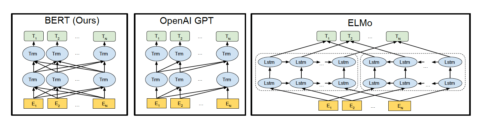

- 创新：**带掩码的语言模型**（masked language model）

  双向信息+自注意力

  **完形填空**

- BERT的**预训练-微调**思路

  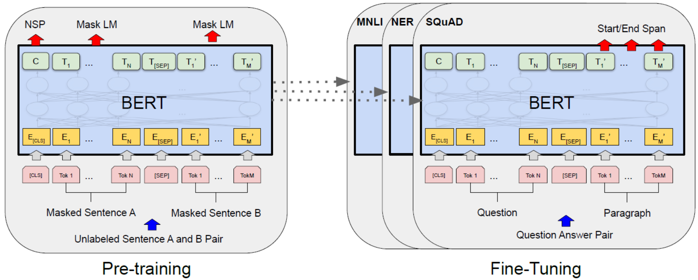

  BERT的解决方案两个阶段：

  1. 预训练pre-training

     在无标签的大数据集上训练一个通用模型，方法有两种

     - MLM：masked language model，单词级别任务，**双向信息的掩码语言模型**
     - NSP：Next Sentence Prediction，句子级别任务，判断句子B是否是句子A的下文

  2. 微调训练fine-tune

     **根据不同的下游任务调整预训练模型结构的输出层，然后以预训练模型参数初始化下游任务的模型，微调训练**

- 启发

  在NLP领域，**有标签的相对小的数据集**上的训练模型，以及，**没有标签的大量数据集训练**的模型效果更好。

## 4.1 BERT通用设计

网络架构是transformer的encoder，用来提取特征


三个超参数设置，两个版本：

1. **Base**: blocks = 12, hidden size = 768, heads = 12,  

   parameters = 110M

2. **Large**: blocks = 24, hidden size = 1024, heads = 16 ,  

   parameter = 340M

### 4.1.1 embedding层


要点：

1. Position Embeddings：位置编码不再是transformer中基于三角函数的固定编码，而是通过参数学习

2. Token Embeddings：**每个样本是一个句子对序列（两个句子）**

   CLS开始，SEP分开两个句子，结尾也有一个SEP。**这两个两个特殊token都有特别的用处**

   - CLS，classification，这个位置的特征用于分类模型。最后一层这个位置对应的向量可以作为**整句话的语义表示**，因为与文本中已有的其它词相比，这个无明显语义信息的符号会更“公平”地融合文本中各个词的语义信息，从而更好的表示整句话的语义。 
     1. **在预训练的nsp任务中，就是利用cls对应位置输出的特征去预测两个句子是否相邻。**
     2. 下游认为是分类任务时，也是利用它对应位置输出的特征预测。
   - SEP，separate，和Segment Embeddings一起区分不同句子

3. Segment Embeddings：片段嵌入，用于区分token是属于哪个句子。因为预训练任务不光有语言模型，还可以完成以两个句子为输入的分类任务。

构建输入句子对：

```python
# 合并句子对
# 添加segmnt：用0和1区分不同句子
def get_tokens_and_segments(tokens_a, tokens_b=None):
    tokens = ['<cls>'] + tokens_a + ['<sep>']
    # 0和1分别标记片段A和B
    segments = [0] * (len(tokens_a) + 2)
    if tokens_b is not None:
        tokens += tokens_b + ['<sep>']
        segments += [1] * (len(tokens_b) + 1)
    return tokens, segments
```

模型是trransformer的encoder部分：

```python
class BERTEncoder(nn.Module):
    """BERT编码器"""
    def __init__(self, vocab_size, num_hiddens, norm_shape, ffn_num_input,
                 ffn_num_hiddens, num_heads, num_layers, dropout,
                 max_len=1000, key_size=768, query_size=768, value_size=768,
                 **kwargs):
        super(BERTEncoder, self).__init__(**kwargs)
        self.token_embedding = nn.Embedding(vocab_size, num_hiddens)
        self.segment_embedding = nn.Embedding(2, num_hiddens)
        self.blks = nn.Sequential()
        for i in range(num_layers):
            #从d2l中引入transformer块
            self.blks.add_module(f"{i}", d2l.EncoderBlock(
                key_size, query_size, value_size, num_hiddens, norm_shape,
                ffn_num_input, ffn_num_hiddens, num_heads, dropout, True))
            
        # 在BERT中，位置嵌入是可学习的，因此我们创建一个足够长的位置嵌入参数
        self.pos_embedding = nn.Parameter(torch.randn(1, max_len,
                                                      num_hiddens))

    def forward(self, tokens, segments, valid_lens):
        # 在以下代码段中，X的形状保持不变：（批量大小，最大序列长度，num_hiddens）
        #===================embedding层三部分==========================
        X = self.token_embedding(tokens) + self.segment_embedding(segments)
        X = X + self.pos_embedding.data[:, :X.shape[1], :]
        for blk in self.blks:
            X = blk(X, valid_lens)
        return X
```

### 4.1.2 分词token化

参考：

- [三种级别的token：字母，单词，子词](https://towardsdatascience.com/word-subword-and-character-based-tokenization-know-the-difference-ea0976b64e17)
- [字节对编码（Byte Pair Encoding）](https://zh.d2l.ai/chapter_natural-language-processing-pretraining/subword-embedding.html#byte-pair-encoding)
- [Byte-Pair Encoding: Subword-based tokenization algorithm](https://towardsdatascience.com/byte-pair-encoding-subword-based-tokenization-algorithm-77828a70bee0)
- [WordPiece: Subword-based tokenization algorithm](https://towardsdatascience.com/wordpiece-subword-based-tokenization-algorithm-1fbd14394ed7)
- [Summary of the tokenizers](https://huggingface.co/transformers/tokenizer_summary.html)

要点：

- 英语里的token粒度其实有三种：**char/字符、word/单词、subword/子词**
- 字符级别的token没有语义，单词级别的token，并且序列会很长。在大量词汇量时，词表会很大（百万级），模型参数集中在输入输出的嵌入层
- 子词级别的token是单词和字符之间的方案。简单思想是：**一些罕见的单词可以拆开作为token（比如"annoyingly" 可能被认为是一个罕见的单词，可以分解为 "annoying" 和 "ly"），一些变形词(比如：helps，helped，helping)也应该拆分**。
- 大多数在英语中获得最先进结果的模型都使用某种子词toekn算法。一些常见的基于子字的token算法包括 BERT 和 DistilBERT 使用的 **WordPiece**、XLNet 和 ALBERT 使用的 **Unigram** 以及 GPT-2 和 RoBERTa 使用的 **Bye-Pair Encoding**。
- **可以固定词表大小**

子词token的原则：

- 不要将频繁使用的单词拆分为较小的子单词
- 将罕见单词拆分为更小的有意义的子词

三种子词的分词方法：

1. [Byte Pair Encoding (BPE)](https://arxiv.org/pdf/1508.07909.pdf)
2. [WordPiece](https://arxiv.org/pdf/1609.08144v2.pdf)
3. [Unigram](https://arxiv.org/pdf/1804.10959.pdf)

#### 4.1.2.1 Bye-Pair Encoding

参考：

1. [很棒的博文附代码：Byte Pair Encoding](https://leimao.github.io/blog/Byte-Pair-Encoding/)
2. [可能不准确：字节对编码（Byte Pair Encoding）](https://zh.d2l.ai/chapter_natural-language-processing-pretraining/subword-embedding.html#byte-pair-encoding)

要点：

1. 基于子词的分词方法
2. 需要数据集中学习如何分词token

从数据集中学习token流程：

1. 思路是构建**一个语料库**的词典，key是语料文本，value是频率。通过语料库构建一个**词表**。
2. 初始化语料库，**先将数据集所有文本按照单词分割，然后在每个单词后面加一个特殊的结束单位</w>**，语料库变成了：{'word_1</w>' : freq_1, ... , 'word_n</w>' : freq_n}
3. 语料库的处理还没结束，还有一个操作：**将每个单词拆分为符号（字母）**，这样语料库变成了：{'w o r d _ 1 </w>' : freq_1, ... , 'w o r d _ n </w>' : freq_n}，这样一来，语料库的最小粒度是：字母和特殊标志</w>
4. 语料库的初始处理结束，通过语料库构建一个**词表**。具体做法就是：**将语料库里所有的最小粒度当成token，词表就是这些不重复token组成的集合**
5. 初始化语料库和词表结束，接下来是学习token过程，有个基本前提：**将语料库里所有的最小粒度当成token**，学习过程是：统计语料库中**出现频率最高的连续token(最小粒度)对**
6. 将统计的出现频率最高的连续token对合并，假如统计的token对是**o和r**，合并后的语料库变成了：{'w **or** d _ 1 </w>' : freq_1, ... , 'w **or** d _ n </w>' : freq_n}，注意token对合并了，频率其实没变，这时候**语料库的最小粒度开始变化了**
7. 按照4中相同的方法，**基于新的语料库更新词表**
8. 重复5、6、7操作：**统计出现频率最高的token对，合并，更新词表**，直到**达到设定的词表大小**，或者**统计出现频率最高的token对的频数是1**，学习过程结束。

代码：

- 构建**初始化语料库**

  1. 以单词分割
  2. 单词后面加</w>
  3. 将每个单词分为字母

  ```python
  import os
  import re
  import collections
  import time
  
  data_dir='./../data'
  token_freqs_init = collections.defaultdict(int)
  with open(os.path.join(data_dir, 'AllAroundTheMoon.txt'), 'r',encoding='utf-8') as f:
      #一次性多行读取，list，每个元素是一行str
      lines = f.readlines()
      for line in lines:
          #用空格分割单词
          words=re.sub('[^A-Za-z]+', ' ', line).strip().lower().split()
          for word in words:
              #每个单词分割成字母，用空格分割开
              #在每个单词后面加</w>特殊标志
              token_freqs_init[' '.join(list(word)) + ' </w>'] += 1
  
  print(token_freqs_init)
  ```

- 基于语料库构建词表

  ```python
  # 初始化symbols
  def update_symbols(token_freqs):
      symbols = set()
      for tokens in token_freqs.keys():
          token_list = tokens.split()
          for token in token_list:
              symbols.add(token)
      return symbols
  ```

- 统计语料库出现频率最高的token对

  ```python
  #获取最高频率的连续字符对和freq
  def get_max_freq_pair_and_freq(token_freqs):
      pairs = collections.defaultdict(int)
      for token, freq in token_freqs.items():
          symbols = token.split()
          for i in range(len(symbols) - 1):
              # “pairs”的键是两个连续符号的元组
              pairs[symbols[i], symbols[i + 1]] += freq
  
      max_freq_pair = max(pairs, key=pairs.get)
      pair_freq = pairs[max_freq_pair]
      return max_freq_pair,pair_freq  # 具有最大值的“pairs”键和最高频数
  ```

- 合并语料库中出现最高频率token对（顺便更新词表）

  ```python
  def merge_symbols(max_freq_pair, token_freqs):
      new_token_freqs = dict()
      symbols = set()
      for tokens, freq in token_freqs.items():
          #合并最高频率字符对
          new_tokens = tokens.replace(' '.join(max_freq_pair),
                                    ''.join(max_freq_pair))
          #替换后的文本频率
          new_token_freqs[new_tokens] = freq
  
          #更新symbols
          token_list = new_tokens.split()
          for token in token_list:
              symbols.add(token)
      
      return new_token_freqs,symbols
  ```

- 循环迭代

  ```python
  #迭代
  def iterative_corpus_with_freq(token_freqs, symbols, max_symbols_size):
      max_freq_pair, freq = get_max_freq_pair_and_freq(token_freqs)
      while not (len(symbols) == max_symbols_size or freq==1):
          token_freqs ,symbols = merge_symbols(max_freq_pair,token_freqs)
          max_freq_pair, freq = get_max_freq_pair_and_freq(token_freqs)
      return token_freqs,symbols
  
  symbols_init=update_symbols(token_freqs_init)
  print(symbols_init)
  
  #学习完的语料库和词表
  token_freqs,symbols = iterative_corpus_with_freq(token_freqs_init,symbols_init,10000)
  ```

**编码与解码**

非常重要，前面的工作是从数据集中学到了一个词表。那么**怎么使用学习到的词表**？

编码就是给定一个文本，对文本分词token化，其中token的依据就是学习到的词表，具体流程如下：

==待续，有两种说法==

1. [引用动手学深度学习](https://zh.d2l.ai/chapter_natural-language-processing-pretraining/subword-embedding.html#byte-pair-encoding)

   ```python
   def segment_BPE(tokens, symbols):
       outputs = []
       for token in tokens:
           start, end = 0, len(token)
           cur_output = []
           # 具有符号中可能最长子字的词元段
           while start < len(token) and start < end:
               if token[start: end] in symbols:
                   cur_output.append(token[start: end])
                   start = end
                   end = len(token)
               else:
                   end -= 1
           if start < len(token):
               cur_output.append('[UNK]')
           outputs.append(' '.join(cur_output))
       return outputs
   ```

2. https://leimao.github.io/blog/Byte-Pair-Encoding/

   ```python
   def tokenize_word(string, sorted_tokens, unknown_token='</u>'):
       
       if string == '':
           return []
       if sorted_tokens == []:
           return [unknown_token]
   
       string_tokens = []
       for i in range(len(sorted_tokens)):
           token = sorted_tokens[i]
           token_reg = re.escape(token.replace('.', '[.]'))
   
           matched_positions = [(m.start(0), m.end(0)) for m in re.finditer(token_reg, string)]
           if len(matched_positions) == 0:
               continue
           substring_end_positions = [matched_position[0] for matched_position in matched_positions]
   
           substring_start_position = 0
           for substring_end_position in substring_end_positions:
               substring = string[substring_start_position:substring_end_position]
               string_tokens += tokenize_word(string=substring, sorted_tokens=sorted_tokens[i+1:], unknown_token=unknown_token)
               string_tokens += [token]
               substring_start_position = substring_end_position + len(token)
           remaining_substring = string[substring_start_position:]
           string_tokens += tokenize_word(string=remaining_substring, sorted_tokens=sorted_tokens[i+1:], unknown_token=unknown_token)
           break
       return string_tokens
   ```

#### 4.1.2.2 Unigram

#### 4.1.2.3 WordPiece

## 4.2 预训练任务

核心：

1. 大量无标签数据集
   - [BooksCorpus](https://www.cv-foundation.org/openaccess/content_iccv_2015/papers/Zhu_Aligning_Books_and_ICCV_2015_paper.pdf)，400M
   - **English Wikipedia**，2500M，只提取文本段落，忽略标题，表格，列表。为了提取长连续序列，使用文档级语料库，而不是随机句子级语料库。
2. 文本双向信息

### 4.2.1 MLM

带掩码的**语言模型**

masked language model

BERT思路提过，标准语言模型任务不允许看到未来！**未来信息在一些任务中很重要**，为了看到未来，所以设计了完形填空任务（带掩码的语言模型）

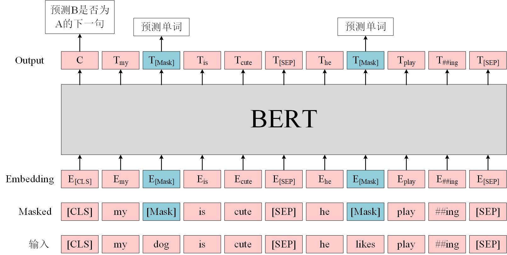

形象理解就是：**完形填空**。**两个句子组成的句子对，随机掩码一部分token，然后在输出去预测。**

具体步骤是：

1. 输入序列（两个句子）中有**15%**的token被随机mask处理
2. 被选择mask处理的token，处理方法：
   - **80%**的可能性被直接替换为[mask]，例如，“this movie is great”变为“this movie is<mask>”
   - **10%**的可能性被替换为其他任意token（单词），例如，“this movie is great”变为“this movie is drink”
   - **10%**的可能性保持不变

必须要知道的是：**在微调任务（下游任务）中，不存在mask处理的，更不存在mask这种标记。**

BERT设计序列中token**先15%概率可能被mask处理，然后再设置3种概率对应3中mask办法。**原因有两方面的考虑：

1. 微调任务是没有<mask>标记的，如果设计方案是：只要token被选中mask处理，并且处理方法只要一种就是token别替换为<mask>，这样的话，预训练任务和微调任务的数据太不一样了。BERT的3中mask方法，可以使得，在20%情况下，没有<mask>标记。
2. 如果句子中的某个Token 100%都会被mask掉，那么在微调的时候模型就会有一些没有见过的单词。（**这里其实涉及训练数据处理，每个迭代周期，选择被mask的数据是否变化，如果变化就没有这个问题。但是一般都是提前预处理好数据，哪些数据被mask，mask方法如何在每个迭代周期不变。**）至于单词带来的负面影响，因为一个单词被随机替换掉的概率只有15%*10% =1.5%，这个负面影响其实是可以忽略不计的。更重要的是，**被随机选择15%的词当中以10%的概率用任意词替换去预测正确的词，相当于文本纠错任务，为BERT模型赋予了一定的文本纠错能力**。

构建模型：transformer后面的部分

```python
#其实就是预测掩码的位置
class MaskLM(nn.Module):
    """BERT的掩蔽语言模型任务"""
    def __init__(self, vocab_size, num_hiddens, num_inputs=768, **kwargs):
        super(MaskLM, self).__init__(**kwargs)
        self.mlp = nn.Sequential(nn.Linear(num_inputs, num_hiddens),
                                 nn.ReLU(),
                                 nn.LayerNorm(num_hiddens),
                                 nn.Linear(num_hiddens, vocab_size))
	
    #pred_positions是掩码位置索引
    def forward(self, X, pred_positions):
        # X是BERTEncoder的编码结果，形状（批量大小，最大序列长度，num_hiddens）
        # pred_positions是用于预测的token位置，形状：(批量大小,掩码数量)
        num_pred_positions = pred_positions.shape[1]
        pred_positions = pred_positions.reshape(-1)
        batch_size = X.shape[0]
        batch_idx = torch.arange(0, batch_size)
        # 假设batch_size=2，num_pred_positions=3
        # 那么batch_idx是np.array（[0,0,0,1,1,1]）
        batch_idx = torch.repeat_interleave(batch_idx, num_pred_positions)
        
        #pytorch里的高级索引方法
        #这里X是3d张量
        #batch_idx, pred_positions都是1d张量，并且形状一样
        #其中batch_indx其实指示的是pred_positions中对应位置数值在X中0维的索引
        #batch_indx[i]里的索引指示的是pred_positions[i]的值是属于0维中索引
        masked_X = X[batch_idx, pred_positions]
        masked_X = masked_X.reshape((batch_size, num_pred_positions, -1))
        mlm_Y_hat = self.mlp(masked_X)
        return mlm_Y_hat
```

### 4.2.2 NSP

下一个句子预测

Next Sentence Prediction

判断句子B是否是句子A的下文。如果是的话输出`IsNext`，否则输出`NotNext`。

训练数据的生成方式是从平行语料中随机抽取的连续两句话，其中50%保留抽取的两句话，它们符合IsNext关系，另外50%的第二句话是随机从预料中提取的，它们的关系是NotNext的。

但是要注意：**用于最后判断两个句子是否上下文关系的特征，不是句子对全部的特征，而是特殊词元“<cls>”的对应位置的特征。BERT认为“<cls>特征已经对输入的两个句子进行了编码。**

**依然保留掩码**

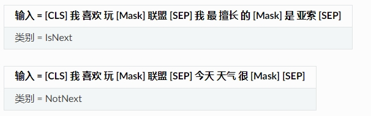

```python
class NextSentencePred(nn.Module):
    """BERT的下一句预测任务"""
    def __init__(self, num_inputs, **kwargs):
        super(NextSentencePred, self).__init__(**kwargs)
        self.output = nn.Linear(num_inputs, 2)
	
    #一定要注意这里的X，不是transformer的encoder输出
    #而是encoder输出里<cls>位置的特征，就是encoded_X[:, 0, :])
    def forward(self, X):
        # X的形状：(batch_size,num_hiddens)
        return self.output(X)
```

注意：在此后的研究（论文《Crosslingual language model pretraining》等）中发现，NSP任务可能并不是必要的，消除NSP损失在下游任务的性能上能够与原始BERT持平或略有提高。这可能是由于Bert以单句子为单位输入，模型无法学习到词之间的远程依赖关系。针对这一点，后续的RoBERTa、ALBERT、spanBERT都移去了NSP任务。

**两个预训练任务具体情况**

```python
#@save
class BERTModel(nn.Module):
    """BERT模型"""
    def __init__(self, vocab_size, num_hiddens, norm_shape, ffn_num_input,
                 ffn_num_hiddens, num_heads, num_layers, dropout,
                 max_len=1000, key_size=768, query_size=768, value_size=768,
                 hid_in_features=768, mlm_in_features=768,
                 nsp_in_features=768):
        super(BERTModel, self).__init__()
        # transformer的encoder部分，多了emebedding层
        self.encoder = BERTEncoder(vocab_size, num_hiddens, norm_shape,
                    ffn_num_input, ffn_num_hiddens, num_heads, num_layers,
                    dropout, max_len=max_len, key_size=key_size,
                    query_size=query_size, value_size=value_size)
        
        #nsp任务中对<cls>特征处理
        self.hidden = nn.Sequential(nn.Linear(hid_in_features, num_hiddens),
                                    nn.Tanh())
        self.mlm = MaskLM(vocab_size, num_hiddens, mlm_in_features)
        self.nsp = NextSentencePred(nsp_in_features)

    def forward(self, tokens, segments, valid_lens=None,
                pred_positions=None):
        encoded_X = self.encoder(tokens, segments, valid_lens)
        if pred_positions is not None:
            #========提供掩码位置索引信息，提取对应位置特征用于预测====================
            #pred_positions是掩码位置索引
            mlm_Y_hat = self.mlm(encoded_X, pred_positions)
        else:
            mlm_Y_hat = None
        #======================nsp中是去cls特征预测========================
        # 用于下一句预测的多层感知机分类器的隐藏层，0是“<cls>”标记的索引
        nsp_Y_hat = self.nsp(self.hidden(encoded_X[:, 0, :]))
        return encoded_X, mlm_Y_hat, nsp_Y_hat
```

### 4.2.3 预训练的数据处理

3个要点：

1. 部分函数`d2l.tokenize`，`d2l.Vocab`
2. 很关键，BERT预训练的数据处理在训练之前固定，在每个迭代周期都是一样的。所以如果一个token是15%概率要被mask处理，并且mask处理方法只有一种就是用<mask>标记替换。那么这些被选中mask的token，在微调的时候，模型可能从来没见过。
3. 预训练两个任务的输入数据token句子对是一样的，不同的是模型的输出层以及label。所以，nsp任务的句子对中的token也被mask处理。
4. 代码

```python
import os
import random
import torch
from d2l import torch as d2l

d2l.DATA_HUB['wikitext-2'] = (
    'https://s3.amazonaws.com/research.metamind.io/wikitext/'
    'wikitext-2-v1.zip', '3c914d17d80b1459be871a5039ac23e752a53cbe')

def _read_wiki(data_dir):
    """读数据，预处理

    Parameters
    ----------
    data_dir : _type_
        文件路径
    Returns
    -------
    2d list
       元素是list，是每一行文本，每一行每句话分割开
    """
    file_name = os.path.join(data_dir, 'wiki.train.tokens')
    with open(file_name, 'r') as f:
        lines = f.readlines()
    # 大写字母转换为小写字母
    paragraphs = [line.strip().lower().split(' . ')
                  for line in lines if len(line.split(' . ')) >= 2]
    random.shuffle(paragraphs)
    return paragraphs

# nsp任务
def _get_next_sentence(sentence, next_sentence, paragraphs):
    if random.random() < 0.5:
        is_next = True
    else:
        # paragraphs是三重列表的嵌套
        next_sentence = random.choice(random.choice(paragraphs))
        is_next = False
    return sentence, next_sentence, is_next

# 合并句子对
# 添加segmnt：用0和1区分不同句子
def get_tokens_and_segments(tokens_a, tokens_b=None):
    tokens = ['<cls>'] + tokens_a + ['<sep>']
    # 0和1分别标记片段A和B
    segments = [0] * (len(tokens_a) + 2)
    if tokens_b is not None:
        tokens += tokens_b + ['<sep>']
        segments += [1] * (len(tokens_b) + 1)
    return tokens, segments

def _get_nsp_data_from_paragraph(paragraph, paragraphs, vocab, max_len):
    """从语料库的每一行（段落）中准备nsp任务数据

    Parameters
    ----------
    paragraph : 2d list
        语料库中每一段落数据，可能有多个句子，每个元素代表一个句子，粒度是单词级别token
    paragraphs : 3d list
        语料库，里面元素是一个段落文本，就是paragraph
    vocab : _type_
        词表，提供token和索引的双向映射
    max_len : int
        两个句子的最大长度

    Returns
    -------
    nsp_data_from_paragraph ：list
        当前段落里，所有两两相邻句子组成的句子对数据，里面的元素是一个tuple
        tuple里的数据是：（token组成的句子对， 标记不同句子的segment（元素是0和1）， 两个句子是否相邻的标签）
    """
    nsp_data_from_paragraph = []
    for i in range(len(paragraph) - 1):
        tokens_a, tokens_b, is_next = _get_next_sentence(
            paragraph[i], paragraph[i + 1], paragraphs)
        # 考虑1个'<cls>'词元和2个'<sep>'词元
        if len(tokens_a) + len(tokens_b) + 3 > max_len:
            continue
        tokens, segments = get_tokens_and_segments(tokens_a, tokens_b)
        nsp_data_from_paragraph.append((tokens, segments, is_next))
    return nsp_data_from_paragraph

# mlm任务
def _replace_mlm_tokens(tokens, candidate_pred_positions, num_mlm_preds,
                        vocab):
    """对一个输入句子对进行掩码处理
        1. 提供句子对中所有可以被掩码token的位置列表，其实就是出去特殊token后的整个句子对的所有位置
        2. 打乱候选位置列表，然后前15%的位置会被mask处理
        3.总共有三种mask方法，不同的概率，方法是产生一个随机值来代表概率

    Parameters
    ----------
    tokens : list
        token组成的句子对
    candidate_pred_positions : list
        可能会被mask的所有token的位置列表
        特殊标记'<cls>', '<sep>'不参与mask
    num_mlm_preds : int
        需要mask的数量
    vocab : _type_
        词表

    Returns
    -------
    mlm_input_tokens : list
        mask处理以后的token组成的句子对
    pred_positions_and_labels : list
        里面的元素是tuple：记录哪些token被mask
        （被掩码过的token的位置，正确token）
    """
    # 为遮蔽语言模型的输入创建新的词元副本，其中输入可能包含替换的“<mask>”或随机词元
    mlm_input_tokens = [token for token in tokens]

    pred_positions_and_labels = []
    #===========先打乱可能mask的token位置列表，排在前面15%的会被mask========================
    # 打乱后用于在遮蔽语言模型任务中获取15%的随机词元进行预测
    random.shuffle(candidate_pred_positions)
    for mlm_pred_position in candidate_pred_positions:
        if len(pred_positions_and_labels) >= num_mlm_preds:
            break
        masked_token = None
        # 80%的时间：将词替换为“<mask>”词元
        if random.random() < 0.8:
            masked_token = '<mask>'
        else:
            # 10%的时间：保持词不变
            if random.random() < 0.5:
                masked_token = tokens[mlm_pred_position]
            # 10%的时间：用随机词替换该词
            else:
                masked_token = random.choice(vocab.idx_to_token)

        #更改        
        mlm_input_tokens[mlm_pred_position] = masked_token
        #里面的元素是tuple：（正确token的位置，正确token）
        pred_positions_and_labels.append(
            (mlm_pred_position, tokens[mlm_pred_position]))
    return mlm_input_tokens, pred_positions_and_labels


def _get_mlm_data_from_tokens(tokens, vocab):
    """对一个输入句子对进行掩码处理

    Parameters
    ----------
    tokens : list
        token组成的句子对
    vocab : _type_
        词表

    Returns
    -------
    vocab[mlm_input_tokens] : list
        mask处理以后的token的索引组成的句子对
    pred_positions : list
        里面的元素是被掩码过的token的位置
    vocab[mlm_pred_labels] : list
    记录哪些token被mask
    里面的元素是被掩码替换的正确token的索引
    """
    #可能会被mask的token位置列表
    candidate_pred_positions = []
    # tokens是一个字符串列表
    for i, token in enumerate(tokens):
        # 在遮蔽语言模型任务中不会预测特殊词元
        if token in ['<cls>', '<sep>']:
            continue
        candidate_pred_positions.append(i)

    # 遮蔽语言模型任务中预测15%的随机词元
    num_mlm_preds = max(1, round(len(tokens) * 0.15))
    mlm_input_tokens, pred_positions_and_labels = _replace_mlm_tokens(
        tokens, candidate_pred_positions, num_mlm_preds, vocab)
    
    pred_positions_and_labels = sorted(pred_positions_and_labels,
                                       key=lambda x: x[0])
    pred_positions = [v[0] for v in pred_positions_and_labels]
    mlm_pred_labels = [v[1] for v in pred_positions_and_labels]
    return vocab[mlm_input_tokens], pred_positions, vocab[mlm_pred_labels]

#填充操作
def _pad_bert_inputs(examples, max_len, vocab):
    max_num_mlm_preds = round(max_len * 0.15)
    all_token_ids, all_segments, valid_lens,  = [], [], []
    all_pred_positions, all_mlm_weights, all_mlm_labels = [], [], []
    nsp_labels = []
    for (token_ids, pred_positions, mlm_pred_label_ids, segments,
         is_next) in examples:
        #填充
        all_token_ids.append(torch.tensor(token_ids + [vocab['<pad>']] * (
            max_len - len(token_ids)), dtype=torch.long))
        
        #=========用0填充==================
        all_segments.append(torch.tensor(segments + [0] * (
            max_len - len(segments)), dtype=torch.long))
        
        # valid_lens不包括'<pad>'的计数
        valid_lens.append(torch.tensor(len(token_ids), dtype=torch.float32))

        #这里的填充纯粹是考虑可能是计算掩码token数量四舍五入的误差导致的
        #用0填充意味着填充位置是cls
        all_pred_positions.append(torch.tensor(pred_positions + [0] * (
            max_num_mlm_preds - len(pred_positions)), dtype=torch.long))
        
        # 填充词元的预测将通过乘以0权重在损失中过滤掉
        all_mlm_weights.append(
            torch.tensor([1.0] * len(mlm_pred_label_ids) + [0.0] * (
                max_num_mlm_preds - len(pred_positions)),
                dtype=torch.float32))
        
        all_mlm_labels.append(torch.tensor(mlm_pred_label_ids + [0] * (
            max_num_mlm_preds - len(mlm_pred_label_ids)), dtype=torch.long))
        
        nsp_labels.append(torch.tensor(is_next, dtype=torch.long))
        
    return (all_token_ids, all_segments, valid_lens, all_pred_positions,
            all_mlm_weights, all_mlm_labels, nsp_labels)


class _WikiTextDataset(torch.utils.data.Dataset):
    def __init__(self, paragraphs, max_len):
        #
        # 输入paragraphs[i]是list，代表一个段落，以句子为单位分割，元素是一个句子，里面是字符串
        # 而输出paragraphs[i]是代表段落的句子列表，其中每个句子都是词元列表

        #分词，
        # paragraphs是3d 列表
        # 第一层元素是每个段落，还是list，里面有多个句子
        # 第二层元素是每个句子，还是list，里面有很多token
        # 第三层元素是token
        paragraphs = [d2l.tokenize(
            paragraph, token='word') for paragraph in paragraphs]
        
        #paragraphs铺平为2d列表，里面每个list是一个句子，以及分词过了
        sentences = [sentence for paragraph in paragraphs
                     for sentence in paragraph]
        
        #创建词表
        self.vocab = d2l.Vocab(sentences, min_freq=5, reserved_tokens=[
            '<pad>', '<mask>', '<cls>', '<sep>'])
        
        # 获取下一句子预测任务的数据
        #example里的元素是tuple：（token组成的句子对， 标记不同句子的segment（元素是0和1）， 两个句子是否相邻的标签）
        examples = []
        for paragraph in paragraphs:
            examples.extend(_get_nsp_data_from_paragraph(
                paragraph, paragraphs, self.vocab, max_len))
            
        # 获取遮蔽语言模型任务的数据
        #example里的元素是tuple：
        #（mask处理以后的token的索引组成的句子对， 被掩码过的token的位置列表，被掩码替换的正确token的索引列表，
        #    标记不同句子的segment（元素是0和1）， 两个句子是否相邻的标签）
        examples = [(_get_mlm_data_from_tokens(tokens, self.vocab)
                      + (segments, is_next))
                     for tokens, segments, is_next in examples]
        # 填充输入
        (self.all_token_ids, self.all_segments, self.valid_lens,
         self.all_pred_positions, self.all_mlm_weights,
         self.all_mlm_labels, self.nsp_labels) = _pad_bert_inputs(
            examples, max_len, self.vocab)

    def __getitem__(self, idx):
        return (self.all_token_ids[idx], self.all_segments[idx],
                self.valid_lens[idx], self.all_pred_positions[idx],
                self.all_mlm_weights[idx], self.all_mlm_labels[idx],
                self.nsp_labels[idx])

    def __len__(self):
        return len(self.all_token_ids)
    
# 加载WikiText-2数据集
def load_data_wiki(batch_size, max_len):
    
    num_workers = d2l.get_dataloader_workers()
    data_dir = d2l.download_extract('wikitext-2', 'wikitext-2')
    #paragraphs是一个2d列表，每一行文本以句子为单位分割
    paragraphs = _read_wiki(data_dir)
    train_set = _WikiTextDataset(paragraphs, max_len)
    train_iter = torch.utils.data.DataLoader(train_set, batch_size,
                                        shuffle=True, num_workers=num_workers)
    return train_iter, train_set.vocab

batch_size, max_len = 512, 64
train_iter, vocab = load_data_wiki(batch_size, max_len)

for (tokens_X, segments_X, valid_lens_x, pred_positions_X, mlm_weights_X,
     mlm_Y, nsp_y) in train_iter:
    print(tokens_X.shape, segments_X.shape, valid_lens_x.shape,
          pred_positions_X.shape, mlm_weights_X.shape, mlm_Y.shape,
          nsp_y.shape)
    break
```

### 4.2.4 预训练

要点：

1. 两个预训练任务一起训练，**BERT预训练的最终损失是遮蔽语言模型损失和下一句预测损失的和**
2. 填充操作
3. 预训练BERT之后，可以用它来表示单个文本、文本对或其中的任何词元（encoder输出，不包括预训练任务的输出层）

## 4.3 下游任务微调

要点：

1. **BERT对每个token返回抽取了上下文信息的特征向量**
2. **即使下游任务各不相同，使用BERT微调时，都只需要增加输出层**
3. **根据任务的不同，使用哪些token的BERT特征也会不一样**

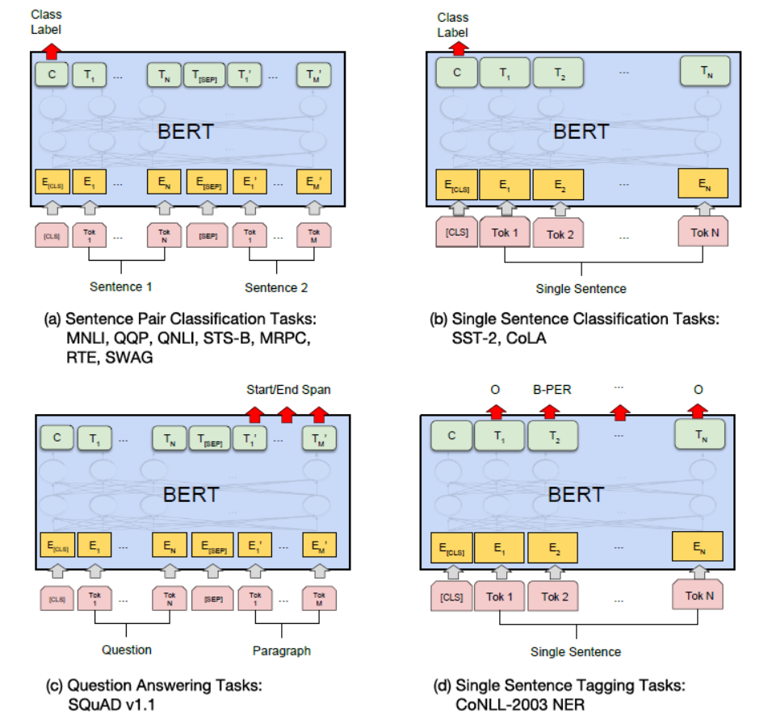

### 4.3.1 句子分类

都是将<cls>对应的特征输入到全连接层

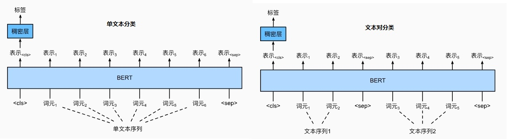

### 4.3.2 命名实体识别（文本标注）

任务描述：text tagging，词元级任务，每个词元token都被分配了一个词性标记（例如，形容词和限定词）。模型去识别句子中每个token的词性

方法：将非特殊词元（<cls>和<sep>）都放进全连接层分类

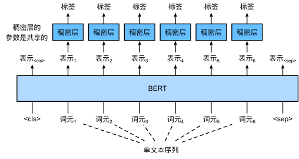

### 4.3.3 问题回答

任务描述：给定一个问题和一段描述文字，从描述文字中找出片段作为问题的答案

方法：对描述文字中每个词元token预测它是不是**开头或者结尾**

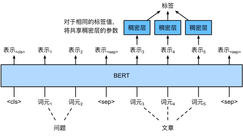

## 4.4 论文梳理

1. 动机

   - ELMo和GPT的局限性
   - GPT的思路很棒——**大数据集无监督预训练，下游任务数据集微调**。但是效果不那么好，因为预训练只利用了单向信息（自注意力屏蔽未来信息）。想证明**双向信息很重要**。
   - ELMo的问题是模型基于RNN（双向），并行度和兼容下游任务不太好，并且预训练得到一个**特征表达**，特征（预训练部分模型结构**冻结**了）和下游任务的输入一起放到下游任务模型中。这种思路称为**feature-based**，不是微调。
   - BERT是为了结合两者的有点：双向信息和微调

2. 继续GPT**预训练+微调**的思路，**为了利用双向信息，设计了一个带掩码语言模型的预训练任务。为了解决句子级别的任务，设计了一个预测下一个句子的预训练任务**

3. 预训练：

   - MLM，带掩码的语言模型
   - NSP，下一个句子预测
   - 两个预训练任务是一起训练的
   - 预训练数据集是无标签的文本库，[BooksCorpus](https://www.cv-foundation.org/openaccess/content_iccv_2015/papers/Zhu_Aligning_Books_and_ICCV_2015_paper.pdf)，400M。**English Wikipedia**，2500M。注意数据集是比GPT大的。

4. 实验：

   它在 11 项自然语言处理任务上获得了最好的表现（state-of-the-art），包括：

   - [GLUE](https://arxiv.org/pdf/1804.07461.pdf)（ General Language Understanding Evaluation） ，句子层面任务

     **分数**提高到 80.5%（绝对提高 7.7%，相比GPT）

     [GLUE Benchmark](https://gluebenchmark.com/leaderboard/)

     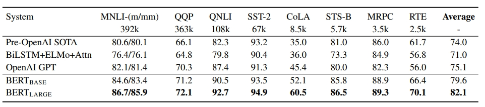

   - MultiNLI]准确率提高到 86.7%（绝对提高 4.6%）

   - [SQuAD v1.1](https://arxiv.org/abs/1606.05250)，Standford Question Answering Dataset。给一段描述文字，问一个问题，摘录答案。--> 判断答案的开始和结尾。

     问答测试 F1 提高到 93.2（绝对提高 1.5 分）

   - SQuAD v2.0，Situations With Adversarial Generations。数据集包含 113k 个句子对。判断两个句子之间的关系。给定一个句子，任务是在四个选项中选择最合理的延续。

      测试 F1 提高到 83.1。

5. 结论：

   在NLP领域，**没有标签的大量数据集训练**的模型效果 > **有标签的相对小的数据集**上的训练模型效果

## 4.5 新手问题：为什么BERT预训练模型最多只能输入512个词？

这是因为在BERT中，Position Embeddings 都是通过学习来得到的。在直接使用Google 的BERT预训练模型时，他们需要配置Position Embeddings**初始化矩阵**的最大长度是512，如果输入的序列长度超过512，**超过的部分没有位置编码。**注意这512的长度还包括[CLS]和[SEP]的标记。

除此之外，词典大小也是固定的

如果有足够的硬件资源自己重新训练BERT，可以更改 BERT config，设置更大max_position_embeddings 和 type_vocab_size值去满足自己的需求
## 4.6借助开源预训练平台微调

提供模型和词典

https://jalammar.github.io/a-visual-guide-to-using-bert-for-the-first-time/

==待续==

# 5.GPT

参考：

1. [What is GPT? Everything you need to know about GPT-3 and GPT-4](https://zapier.com/blog/what-is-gpt/)
2. [GPT-1, GPT-2, GPT-3, InstructGPT / ChatGPT and GPT-4 summary](https://songhuiming.github.io/pages/2023/05/28/gpt-1-gpt-2-gpt-3-instructgpt-chatgpt-and-gpt-4-summary/)
3. [预训练语言模型之GPT-1，GPT-2和GPT-3 - 知乎 (zhihu.com)](https://zhuanlan.zhihu.com/p/350017443)
4. [ChatGPT｜必看 10 篇论文](https://hub.baai.ac.cn/view/24227)

在BERT之前，**提出基于transformer架构，在大规模无监督数据集预训练通用模型，在下游任务数据集微调的思路，并且不依赖针对单独任务的模型设计技巧**。这是一种思路，也是一种研究趋势。

不同点是，GPT的特征网络是transformer的decoder部分，并且同等模型下，GPT-1的表现不如BERT。

## 5.1 GPT-1

参考：

1. [Improving Language Understanding by Generative Pre-Training](https://paperswithcode.com/paper/improving-language-understanding-by)
2. [代码](https://github.com/openai/finetune-transformer-lm)
3. [KiKaBeN - GPT: Generative Pre-Trained Transformer (2018) ](https://kikaben.com/gpt-generative-pre-training-transformer-2018/)

- 动机

  NLP 领域中只有小部分标注过的数据，而有大量的数据是未标注，如何只使用标注数据将会大大影响深度学习的性能。

  为了充分利用大量未标注的原始文本数据，需要利用**无监督学习**来从文本中提取特征，最经典的例子莫过于词嵌入技术。但是词嵌入只能 word-level 级别的任务（同义词等），没法解决句子、句对级别的任务（翻译、推理等）。出现这种问题原因有两个：

  - 不清楚下游任务，所以也就没法针对性的进行优化
  - 就算知道了下游任务，如果每次都要大改模型也会得不偿失

  transformer的优秀表现和高扩展性，GPT 提供了一个解决方案：无监督Pre-training 和 有监督Fine-tuning。

  在Pre-training阶段使用单向 Transformer 学习一个**语言模型**，对句子进行无监督的Embedding。在fine-tuning阶段，根据具体任务对 Transformer 的参数进行微调，目的是在于学习一种通用的 Representation 方法，针对不同种类的任务只需略作修改便能适应。

- 架构

  transformer的decoder，**去掉和encoder连接的多头注意力**，因为根本不需要encoder-decoder attention

  

  组件:

  blocks = 12, hidden size = 768, heads = 12,  

- 预训练

  预训练任务很简单，标准的语言模型（自回归模型）：**前n个token预测下一个token**

  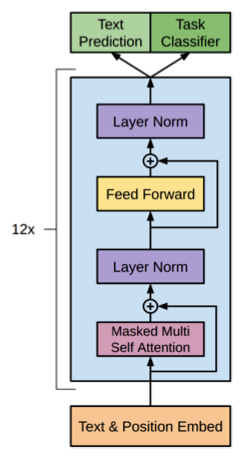

  预训练数据：

  - [BooksCorpus](https://www.cv-foundation.org/openaccess/content_iccv_2015/papers/Zhu_Aligning_Books_and_ICCV_2015_paper.pdf)，400M（BERT也用这个）
  - Word Benchmark，1B

  分词：spaCy tokenizer，bytepair encoding (BPE)，40,000 token

- 下游任务微调

  要点：

  1. 在下游添加全连接层和softmax层

  2. 不同任务，**构建输入不一样，用来预测的特征都是最后一个token的输出**。
     $$
     P(\pmb{y}|\pmb{x^1},...,\pmb{x^m})=softmax(\pmb{h_l^mW_y})
     $$
     其中$\pmb{x^1},...,\pmb{x^m}$是一系列输入，$\pmb{h_l^m}$是transformer提取特征$x^m$对应的位置，$W_y$是全连接层的权重矩阵。

  3. 添加特殊token，比如(`Start, Delim and Extract`)，但预训练没有添加

  4. 除非特别说明，沿用预训练超参数

  5. 大多数，学习率：6.25e-5 ，batch_size： 32 ，线性学习率衰减，正则化系数$\lambda=0.5$

  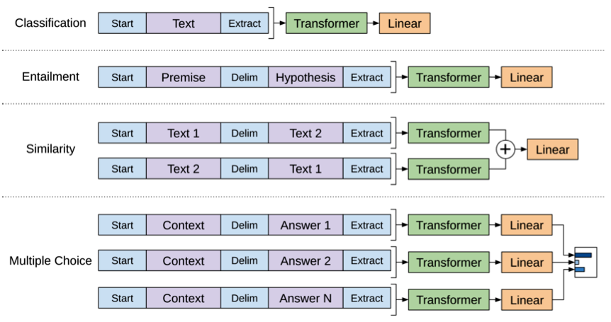

  - 分类Classification：开头和结尾添加特殊标记`Start, Extract`

    添加dropout=0.1

  - 推理Entailment：除了`Start, Extract`，在先验句子和假设句子中间加一个分隔符`Delim`

  - Similarity：对于相似度问题，由于模型是单向的，但相似度与顺序无关，所以要将两个句子顺序颠倒后，把两次输入的结果**相加**来做最后的推测

  - Multiple-Choice：对于问答问题，则是将上下文、问题放在一起与答案分隔开，然后进行预测

- 实验效果

  在所研究的 12 个任务中，有 9 个任务的最新技术水平得到了显着改进。在常识推理（故事完形填空测试）上实现了 8.9% 的绝对改进，在问答 （RACE） 上实现了 5.7% 的绝对改进，在文本蕴涵（MultiNLI）上实现了 1.5% 的绝对改进。

  后来的BERT超过了

## 5.2 GPT-2

参考：

1. [Language Models are Unsupervised Multitask Learners](https://d4mucfpksywv.cloudfront.net/better-language-models/language_models_are_unsupervised_multitask_learners.pdf)
2. [The Illustrated GPT-2 (Visualizing Transformer Language Models)](https://jalammar.github.io/illustrated-gpt2/)
3. [KiKaBeN - GPT-2](https://kikaben.com/gpt-2-2019/)
4. [代码和模型](https://github.com/openai/gpt-2-output-dataset)
5. [openai/gpt-2: Code for the paper "Language Models are Unsupervised Multitask Learners" (github.com)](https://github.com/openai/gpt-2)

核心思想：**zero-shot**

**预训练一个泛化性足够好的语言模型，就足够解决多任务。**

这就是**zero-shot**的概念（GPT-1讨论过），**不用微调，不用训练下游任务**。

当一个语言模型的容量足够大时，它就足以**覆盖所有的有监督任务**，也就是说，**所有的有监督学习都是无监督语言模型的一个子集**。

例如当模型训练完“Micheal Jordan is the best basketball player in the history”语料的语言模型之后，便也学会了(question：“who is the best basketball player in the history ?”，answer:“Micheal Jordan”)的Q&A任务。

综上，GPT-2的核心思想概括为：任何有监督任务都是语言模型的一个子集，当模型的容量非常大且数据量足够丰富时，仅仅靠训练语言模型的学习便可以完成其他有监督学习的任务。

基于这样的考虑，所以相比GPT-1，**GPT-2就是在模型参数和预训练数据上扩展**

GPT-2 的更大模型（2019 年 2 月未发布）拥有 15 亿个参数，是 GPT-1 的 10 倍。

在 40GB 的网络文本上训练模型，并在各种语言建模、阅读理解、问答和摘要基准方面取得了最先进的结果。

- 预训练

  数据集WebText

  - 多个领域的文本数据训练语言模型
  - Common Crawl数据虽然多但质量不高，不要。
  - 从社交媒体平台 **Reddit** 抓取了所有出站链接，这些链接至少收到了 3 个karma。这可以被认为是一个启发式指标，用于衡量其他用户是否认为该链接有趣、有教育意义或只是有趣。就制作了WebText数据集。
  - 包括4500 万个链接的文本子集， 40 GB 的文本。使用了 Dragnet 和 Newspaper内容提取器的组合从网页提取文本。删除维基百科文本。

  模型架构不变，还是GPT-1

  但是**预训练模型的输入有变化**。原因是预训练模型要做的是**zero-shot**，下游任务既没有训练跟没有微调，下游任务的输入必须包含在预训练输入。

  所以预训练语言模型的输入要覆盖所有下游任务的输入输出形式。

  模型从$p(s_n|s_1,...,s_{n-1})$到$p(s_{n−k},...,s_n|s_1,...,s_{n−k−1})$

  具体：$p(output|input,task)$

  举例输入和输出：

  机器翻译任务：(translate to french, english text, french text)

  QA任务：(answer the question, document, question, answer)

  模型：

  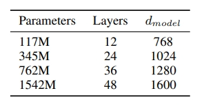

- 效果

  语言模型生成的答案在 CoQA 数据集上达到 55 F1 。在不使用 127,000+ 训练示例的情况下，匹配或超过 4 个基线系统中的 3 个的性能。

  在 8 个测试的语言建模数据集中的 7 个上实现了最先进的结果，但仍未拟合 WebText。

  GPT-2的实验是和其他zero-shot模型结果比较，GPT-2的模型和数据量都很大，相对来说，表现并没有多么优秀。

## 5.3 GPT-3

依然不需要训练更新梯度，不需要微调

对于下游任务，除了zero-shot，还有few-shot，one-shot。

模型越大，实现zero-shot、、、效果更好
