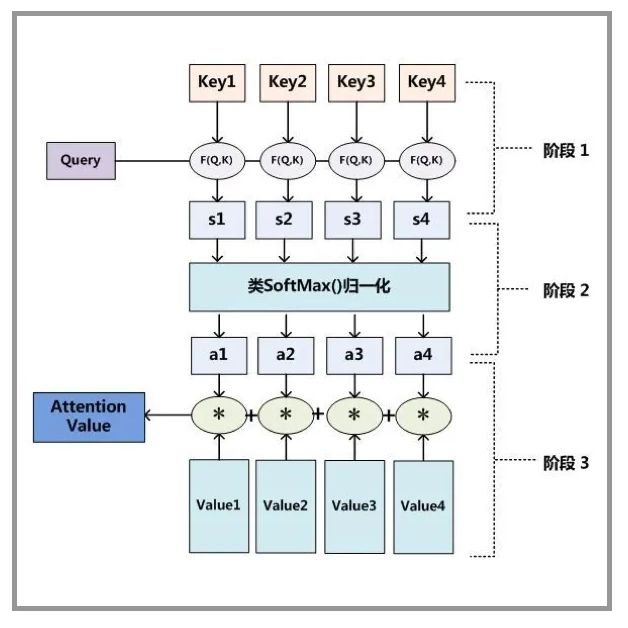
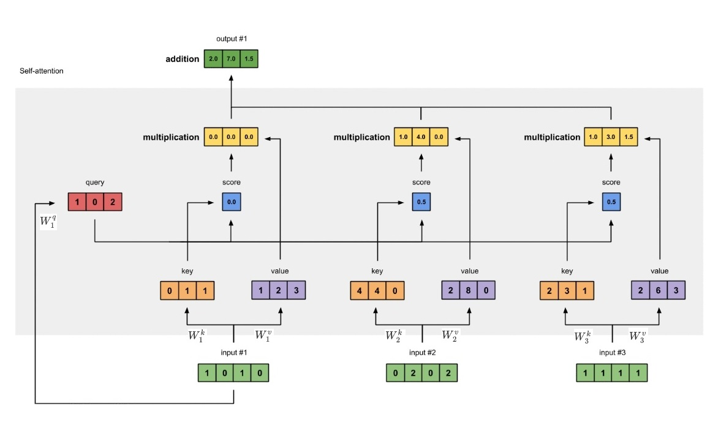
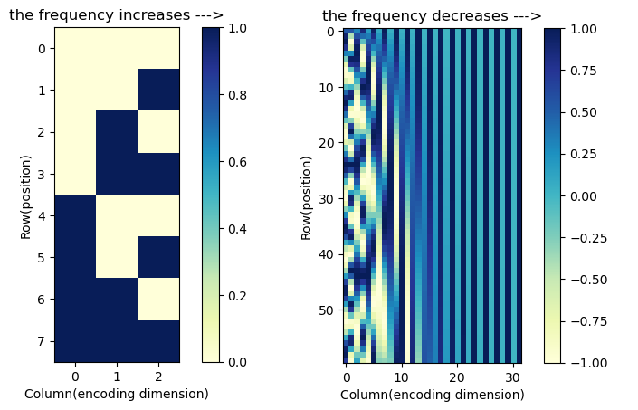
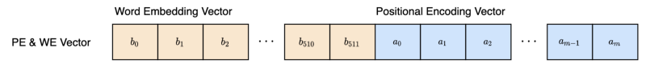
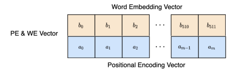

# 1. 注意力机制Attention Mechanism

注意力机制的逻辑是：**从关注全部到关注重点**

什么是重点？重点由什么决定？

心理学之父威廉·詹姆斯，提出**双组件（two-component）的框架**

**注意力的焦点（重点）可以被非自主提示和自主提示引导**

## 1.1 非自主提示和自主提示

非自主提示源于**环境中物体的突出性和意见性**。比如下面的五个物品： 一份报纸、一篇研究论文、一杯咖啡、一本笔记本和一本书。**咖啡杯是红色的，其他全是黑白印刷的**。在没有**内在意志引导**下，**注意力的焦点就会被红色的咖啡杯吸引**。


所谓自主提示，其实就是**内在意志的引导**。渴望获取知识，希望读书，那么注意力的焦点会被书吸引。

与 非自主提示中由于突出性导致的选择不同， 此时选择书是受到了认知和意识的控制，**注意力在基于自主性提示去辅助选择时将更为谨慎**。 主观意愿推动选择的力量也就更强大。


## 1.2 query/key/value框架：自主提示、非自主提示、注意力焦点

1. **value**：代表感官输入，或者说注意力投放的主体，比如：书，咖啡，报纸等
2. **key**：代表非自主提示，每个key和每个value配对，代表非自主提示在value上权重
3. **query**：自主提示，query只有一个

注意力在每个主体（value）上的权重，**通过一个query和多个key的计算得到的**权重，对应到value上，是自主提示和非自主提示共同作用的**注意力权重**


在具体一点，增加两个概念：

1. 注意力评分函数attention scoring function
2. 注意力权重attention weights




**一个query和多个key计算得到多个注意力评分，对应多个value**

注意力评分函数就是输入query和key计算注意力评分的函数
$$
f(\pmb{q},K,V)=softmax(a(\pmb{q},K))V
$$

### 1.2.1 注意力评分函数

有两种：

1. **加型注意力additive attention**
   $$
   a(\pmb{q},\pmb{k_i})=W^{T}_vtanh(W_q\pmb{q}+W_{k,i}\pmb{k_i})
   $$
   一般情况下，$n_k=n_v，n_q=1$

   ```python
   import touch.nn as nn
   
   # 带上了softmax求注意力权重，以及最终求解context
   class AdditiveAttention(nn.Module):
       """加性注意力"""
       def __init__(self, key_size, query_size, num_hiddens, dropout, **kwargs):
           super(AdditiveAttention, self).__init__(**kwargs)
           self.W_k = nn.Linear(key_size, num_hiddens, bias=False)
           self.W_q = nn.Linear(query_size, num_hiddens, bias=False)
           self.w_v = nn.Linear(num_hiddens, 1, bias=False)
           self.dropout = nn.Dropout(dropout)
   	
       # 最终返回的其实是context
       def forward(self, queries, keys, values, valid_lens):
           queries, keys = self.W_q(queries), self.W_k(keys)
           
           # 在维度扩展后，
           # queries的形状：(batch_size，查询的个数，1，num_hidden)
           # key的形状：(batch_size，1，“键－值”对的个数，num_hiddens)
           # 使用广播方式进行求和
           features = queries.unsqueeze(2) + keys.unsqueeze(1)
           
           # 非线性
           features = torch.tanh(features)
           # self.w_v仅有一个输出，因此从形状中移除最后那个维度。
           # scores的形状：(batch_size，查询的个数，“键-值”对的个数)
           scores = self.w_v(features).squeeze(-1)
           
           #scores经过softmax为概率分布才是注意力权重
           self.attention_weights = masked_softmax(scores, valid_lens)
           # values的形状：(batch_size，“键－值”对的个数，值的维度)
           
           # 权重和values矩阵乘以后是context
           return torch.bmm(self.dropout(self.attention_weights), values)
   
   # 形状(batch,num,feature_size) query:(2,1,10)    key:(2,10,2)
   queries, keys = torch.normal(0, 1, (2, 1, 20)), torch.ones((2, 10, 2))
   # value:(2,10,4)
   values = torch.arange(40, dtype=torch.f,loat32).reshape(1, 10, 4).repeat(2, 1, 1)
   valid_lens = torch.tensor([2, 6])
   
   attention = AdditiveAttention(key_size=2, query_size=20, num_hiddens=8,dropout=0.1)
   attention.eval()
   attention(queries, keys, values, valid_lens)
   
   #最终context的输出：(batch,queries_num,feature_value)
   ```

   

2. **缩放点积注意力scaled dot-product attention**
   $$
   a(\pmb{q},\pmb{k_i})=\frac{\pmb{q}^T\pmb{k_i}}{\sqrt{d}}
   $$
   这有要求，**query和key的维度都是d**

   ```python
   # 带上了softmax求注意力权重，以及最终求解context
   # 要求query和key的feature-size相同
   class DotProductAttention(nn.Module):
       """缩放点积注意力"""
       def __init__(self, dropout, **kwargs):
           super(DotProductAttention, self).__init__(**kwargs)
           self.dropout = nn.Dropout(dropout)
   
       # queries的形状：(batch_size，查询的个数，d)
       # keys的形状：(batch_size，“键－值”对的个数，d)
       # values的形状：(batch_size，“键－值”对的个数，值的维度)
       # valid_lens的形状:(batch_size，)或者(batch_size，查询的个数)
       def forward(self, queries, keys, values, valid_lens=None):
           d = queries.shape[-1]
           # 设置transpose_b=True为了交换keys的最后两个维度
           scores = torch.bmm(queries, keys.transpose(1,2)) / math.sqrt(d)
           self.attention_weights = masked_softmax(scores, valid_lens)
           return torch.bmm(self.dropout(self.attention_weights), values)
       
       
   #形状：query:(2,1,2)  key:(2,10,2)  value:(2,10,4)
   #要求：query和key的feature-size相同
   #两个评分函数都要求：num_key=num_value
   queries = torch.normal(0, 1, (2, 1, 2))
   keys = torch.ones((2, 10, 2))
   values = torch.arange(40, dtype=torch.f,loat32).reshape(1, 10, 4).repeat(2, 1, 1)
   valid_lens = torch.tensor([2, 6])
   
   attention = DotProductAttention(dropout=0.5)
   attention.eval()
   attention(queries, keys, values, valid_lens)   
   ```

   

### 1.2.2 注意力权重

对得到的评分(最后一层)进行softmax计算概率分布，才是注意力权重

这里有个细节问题：

在处理文本序列数据的时候，一般有个操作：**文本序列长度本身是不定的，RNN/GNU等其实也是可以处理不定长，但是一般都要求文本序列长度固定。过长的序列会被截断，过短的序列会用零填充**

所以有个问题：**用零填充部分计算的评分，其实不应该参与计算注意力权重的概率分布**

```python
#softmax计算注意力权重
def masked_softmax(X, valid_lens):
    """通过在最后一个轴上掩蔽元素来执行softmax操作"""
    # X:3D张量，valid_lens:1D或2D张量
    if valid_lens is None:
        return nn.functional.softmax(X, dim=-1)
    else:
        shape = X.shape
        if valid_lens.dim() == 1:
            valid_lens = torch.repeat_interleave(valid_lens, shape[1])
        else:
            valid_lens = valid_lens.reshape(-1)
        # 最后一轴上被掩蔽的元素使用一个非常大的负值替换，从而其softmax输出为0
        X = d2l.sequence_mask(X.reshape(-1, shape[-1]), valid_lens,
                              value=-1e6)
        return nn.functional.softmax(X.reshape(shape), dim=-1) 
```


## 1.3 多头注意力：用全连接层在头尾包围多个注意力

多头注意力想法很简单：**query、key、value只计算一个context！**为什么不多来几个？

具体地，**相对单个注意力，额外在前后增加全连接层**

- 加在前面的全连接层：
  $$
  \pmb{h_i}=f(W_i^{(q)}\pmb{q},W_i^{(k)}\pmb{k},W_i^{(v)}\pmb{v})
  $$
  其中，$h_i$是单个注意力头计算的上下文context，函数$f$包括评分函数和注意力权重函数Softmax

  加在前面的全连接层，**其实就是在评分函数和注意力函数之前，给query、key、value加一个全连接层**

- 加在后面的全连接层：
  $$
  W_o\begin{bmatrix} \pmb{h_1} \\ \pmb{h_2} \\ \vdots \\ \pmb{h_h} \end{bmatrix}
  $$
  


- 动机说明

  多个注意力计算考虑的是，每个注意力头计算的注意力权重不太一样，综合多个注意力权重

  

```python
#并发计算

def transpose_qkv(X, num_heads):
    """为了多注意力头的并行计算而变换形状"""
    # 输入X的形状:(batch_size，查询或者“键－值”对的个数，num_hiddens)
    # 输出X的形状:(batch_size，查询或者“键－值”对的个数，num_heads，
    # num_hiddens/num_heads)
    X = X.reshape(X.shape[0], X.shape[1], num_heads, -1)

    # 输出X的形状:(batch_size，num_heads，查询或者“键－值”对的个数,
    # num_hiddens/num_heads)
    X = X.permute(0, 2, 1, 3)

    # 最终输出的形状:(batch_size*num_heads,查询或者“键－值”对的个数,
    # num_hiddens/num_heads)
    return X.reshape(-1, X.shape[2], X.shape[3])


def transpose_output(X, num_heads):
    """逆转transpose_qkv函数的操作"""
    X = X.reshape(-1, num_heads, X.shape[1], X.shape[2])
    X = X.permute(0, 2, 1, 3)
    return X.reshape(X.shape[0], X.shape[1], -1)

#@save
class MultiHeadAttention(nn.Module):
    """多头注意力"""
    def __init__(self, key_size, query_size, value_size, num_hiddens,
                 num_heads, dropout, bias=False, **kwargs):
        super(MultiHeadAttention, self).__init__(**kwargs)
        self.num_heads = num_heads
        self.attention = d2l.DotProductAttention(dropout)
        self.W_q = nn.Linear(query_size, num_hiddens, bias=bias)
        self.W_k = nn.Linear(key_size, num_hiddens, bias=bias)
        self.W_v = nn.Linear(value_size, num_hiddens, bias=bias)
        self.W_o = nn.Linear(num_hiddens, num_hiddens, bias=bias)

    def forward(self, queries, keys, values, valid_lens):
        # queries，keys，values的形状:
        # (batch_size，查询或者“键－值”对的个数，num_hiddens)
        # valid_lens　的形状:
        # (batch_size，)或(batch_size，查询的个数)
        # 经过变换后，输出的queries，keys，values　的形状:
        # (batch_size*num_heads，查询或者“键－值”对的个数，
        # num_hiddens/num_heads)
        queries = transpose_qkv(self.W_q(queries), self.num_heads)
        keys = transpose_qkv(self.W_k(keys), self.num_heads)
        values = transpose_qkv(self.W_v(values), self.num_heads)

        if valid_lens is not None:
            # 在轴0，将第一项（标量或者矢量）复制num_heads次，
            # 然后如此复制第二项，然后诸如此类。
            valid_lens = torch.repeat_interleave(
                valid_lens, repeats=self.num_heads, dim=0)

        # output的形状:(batch_size*num_heads，查询的个数，
        # num_hiddens/num_heads)
        output = self.attention(queries, keys, values, valid_lens)

        # output_concat的形状:(batch_size，查询的个数，num_hiddens)
        output_concat = transpose_output(output, self.num_heads)
        return self.W_o(output_concat)
```

## 1.4 Bahdanau 注意力

Bahdanau 注意力已经不涉及注意力机制本身了，而是**设计一个框架，为seq2seq模型加入注意力。换句话说，所谓Bahdanau 注意力是在seq2seq模型中指明了query，key，value分别是什么**


那么，Bahdanau 注意力其实很简单：

对于`t`时刻的注意力计算，**解码器**在前一时刻(时间步t−1)的**隐状态**$s_{t-1}$是查询query， **编码器所有时间步最后一层隐藏状态**$h_t$既是键key，也是值value。注意力权重和主体(value)计算得到的上下文(context)和嵌入层连接(cat)。

**解码器隐藏状态初始化**，其实没有变化，是普遍seq2seq模型的办法：**编码器隐藏状态最后时刻所有层来初始化解码器**

```python
import torch.nn as nn

#编码器
class Seq2SeqEncoder(nn.Module):
    """用于序列到序列学习的循环神经网络编码器"""
    def __init__(self, 
                 vocab_size,  #词元维度
                 embed_size,  #嵌入维度
                 num_hiddens, #GRU隐藏层维度
                 num_layers,  #GRU层数
                 dropout=0, 
                 **kwargs
                ):
        super(Seq2SeqEncoder, self).__init__(**kwargs)
        # 嵌入层
        self.embedding = nn.Embedding(vocab_size, embed_size)
        self.rnn = nn.GRU(embed_size, 
                          num_hiddens, 
                          num_layers,
                          dropout=dropout
                         )
        
    def forward(self, X, *args):
        # 输出'X'的形状：(batch_size,num_steps,embed_size)
        X = self.embedding(X)
        # 在循环神经网络模型中，第一个轴对应于时间步
        X = X.permute(1, 0, 2)
        # 如果未提及状态，则默认为0
        #==========================keys和values=====================================
        output, state = self.rnn(X)
        # output的形状:(num_steps,batch_size,num_hiddens)最后一层所有时间步的隐藏层：作为keys和values
        # state的形状:(num_layers,batch_size,num_hiddens)最后时间步的所有层的隐藏层:给解码器初始化
        return output, state

#解码器
class Seq2SeqAttentionDecoder(AttentionDecoder):
    def __init__(self, 
                 vocab_size,  #词元维度
                 embed_size,  #嵌入维度
                 num_hiddens, #GRU隐藏层维度
                 num_layers,  #GRU层数
                 dropout=0, 
                 **kwargs
                ):
        super(Seq2SeqAttentionDecoder, self).__init__(**kwargs)
        self.attention = d2l.AdditiveAttention(num_hiddens, num_hiddens, num_hiddens, dropout)
        self.embedding = nn.Embedding(vocab_size, embed_size)
        self.rnn = nn.GRU(
            embed_size + num_hiddens, 
            num_hiddens, 
            num_layers,
            dropout=dropout
        )
        self.dense = nn.Linear(num_hiddens, vocab_size)
        
	# 编码器最后时间步的所有层的隐藏层给解码器初始化enc_outputs=Seq2SeqEncoder().forward(x)[1]
    def init_state(self, enc_outputs, enc_valid_lens, *args):
        # outputs的形状为(batch_size，num_steps，num_hiddens).
        # hidden_state的形状为(num_layers，batch_size，num_hiddens)
        outputs, hidden_state = enc_outputs
        return (outputs.permute(1, 0, 2), hidden_state, enc_valid_lens)

    def forward(self, X, state):
        # enc_outputs的形状为(batch_size,num_steps,num_hiddens).
        # hidden_state的形状为(num_layers,batch_size,
        # num_hiddens)
        enc_outputs, hidden_state, enc_valid_lens = state
        # 输出X的形状为(num_steps,batch_size,embed_size)
        X = self.embedding(X).permute(1, 0, 2)
        outputs, self._attention_weights = [], []
        for x in X:
            #==========================query========================
            #第一个初始query其实来自编码器的最后时刻最后一层的隐藏状态,
            #因为这个隐藏状态本身是给解码器初始化,最后解码器还是作为query
            query = torch.unsqueeze(hidden_state[-1], dim=1)# query的形状为(batch_size,1,num_hiddens)
            # context的形状为(batch_size,1,num_hiddens)
            context = self.attention(
                query, enc_outputs, enc_outputs, enc_valid_lens)
            # 在特征维度上连结
            x = torch.cat((context, torch.unsqueeze(x, dim=1)), dim=-1)
            # 将x变形为(1,batch_size,embed_size+num_hiddens)
            #=====================query===============================================
            #后面的解码器隐藏层会更新，再用来作为query，并且，这里hidden_state是编码器的输出，确实作为解码器的初始化
            out, hidden_state = self.rnn(x.permute(1, 0, 2), hidden_state)
            outputs.append(out)
            self._attention_weights.append(self.attention.attention_weights)
        # 全连接层变换后，outputs的形状为
        # (num_steps,batch_size,vocab_size)
        outputs = self.dense(torch.cat(outputs, dim=0))
        return outputs.permute(1, 0, 2), [enc_outputs, hidden_state,
                                          enc_valid_lens]

    @property
    def attention_weights(self):
        return self._attention_weights
   
class EncoderDecoder(nn.Block):
    """编码器-解码器架构的基类"""
    def __init__(self, encoder, decoder, **kwargs):
        super(EncoderDecoder, self).__init__(**kwargs)
        self.encoder = encoder
        self.decoder = decoder

    def forward(self, enc_X, dec_X, *args):
        enc_outputs = self.encoder(enc_X, *args)
        dec_state = self.decoder.init_state(enc_outputs, *args)
        return self.decoder(dec_X, dec_state)
```

```python
encoder = Seq2SeqEncoder(vocab_size=10, embed_size=8, num_hiddens=16,num_layers=2)
encoder.eval()
decoder = Seq2SeqAttentionDecoder(vocab_size=10, embed_size=8, num_hiddens=16,num_layers=2)
decoder.eval()

X = torch.zeros((4, 7), dtype=torch.long)  # (batch_size,num_steps)
#编码器的输出给解码器初始化
state = decoder.init_state(encoder(X), None)
output, state = decoder(X, state)
output.shape, len(state), state[0].shape, len(state[1]), state[1][0].shape
```

# 2. 自注意力

参考：

1. [transformer开山之作：Attention Is All You Need](https://arxiv.org/abs/1706.03762)
2. [自注意力和位置编码 ](https://zh-v2.d2l.ai/chapter_attention-mechanisms/self-attention-and-positional-encoding.html)

- 什么是自注意力？自注意力和注意力有什么关系？

自注意力也不复杂，简单说，**自注意力是基于注意力的机制(query,key,value,评分函数，注意力权重)来构建一种处理序列数据的基础网络，它和卷积神经网络CNNs、循环神经网络RNN是一个级别的网络。**

- 那自注意力如何作为一个基础网络处理序列数据？

可以说，注意力是帮助找到重点。通过query和key来计算注意力权重，最后乘以value，得到的是什么？**得到的是一种上下文信息，也就是value中各元素的重要性**

那么是不是可以说，**借助注意力的机制，来计算序列数据中每个词的重要性**，这已经很接近自注意力。

- 关键问题：**自注意力借助注意力机制处理序列数据，query，key，value分别是什么？**

直接给出答案：**序列数据中所有单词既是key也是value，序列中单个单词依次作为query。当然不是直接当成key、value、query，需要在前面加上全连接层。至于注意力评分函数和计算注意力权重的方法，没有变化。**
$$
\pmb{h_i}=a(W_i^q\pmb{x_i},W^k_{1-t}X_1^t)(W^v_{1-t}X_1^t)
$$
其中$h_i$是t个序列$X_1^t$中第i个单词$\pmb{x_i}$作为query，整个序列所有单词作为key和value，计算得到的**编码(上下文)**

下图，第二个单词作为query


下图：自注意力动图


下图：第一个单词作为query



## 2.1 比较卷积神经网络、循环神经网络和自注意力

参考：

1. [Computational Complexity of Self-Attention in the Transformer Model](https://stackoverflow.com/questions/65703260/computational-complexity-of-self-attention-in-the-transformer-model)

很关键的一点：在自注意力，所有**查询query、键key和值value**都源自同一个句子。与 RNN 和 CNN 相比，Self-attention 可以很好地处理大范围的依赖性。

除此之外，**自注意力操作可以并行运行，比 RNN 单元等顺序处理快得多**。

分三个方面比较

1. 计算复杂度：**执行(运算)次数**，用于衡量算法运行时间随输入规模增加而增加的程度的度量（越小越好）
2. 并行度：同时执行运算的数量（越大越好）
3. 最长路径：序列信息全部传递需要的执行次数，**这个指标衡量网络学习序列长范围依赖关系的能力。**（越小越好）

- RNN
  $$
  \pmb{H_t}=\phi(W_{xt}\pmb{x_t}+W_{hh}\pmb{H_{t-1}}+\pmb{b_h})
  $$
  假设序列长度是n，单词的词元维度是d。每个单词的计算量包括两个全连接层，一个逐元素相加，就是$2d^2+d$，总共的计算就是$nd(2d+1)$（忽略激活函数计算）。**计算复杂度用于衡量算法运行时间随输入规模增加而增加的程度的度量**。这里的计算复杂度其实是$O(nd^2)$

  RNN没有并行度可言，按照训练计算是它的固有属性。并行度是$o(1)$

  最长路径来说，传递整个序列所有信息，那必须等到RNN运行完，所以最长路径是$O(n)$

- CNN

  注意：**1d卷积`nn.Conv1d`处理序列文本，卷积是在时间步上滑动。**

  序列长度是n，卷积核长度是k，假设，输入输出的维度都是d。

  那么就是说，**每个卷积核有d层，需要d个卷积核。**卷积核形状是k在时间步n上滑动，一般来说时间步是不变的，所以需要滑动n下。那么计算量是：$nkd^2$，计算复杂度就是$O(knd^2)$

  卷积的计算是可以同时进行的，并行度是$O(n)$

  最长路径，序列长度为n的文本，卷积核是k，传递完所有信息需要执行$\frac{n}{k}$，最长路径是$O(n/k)$

- Self-attention

  再写一遍单个单词计算编码
  $$
  \pmb{h_i}=a(W_i^q\pmb{x_i},W^k_{1-t}X_1^t)(W^v_{1-t}X_1^t)
  $$
  注意，序列所有单词作为key和value，前面的全连接层是只有一次，也就是后续每个查询计算的key和value是共享的。

  全连接层输出query、key和value计算次数是：$3nd^2$。

  query和key计算评分，假设是没有参数的点积注意力评分函数。那么一个query和n个key之间计算分数的计算次数是$nd$（忽略$\sqrt{d}$是1次）,之后分数要进行softmax计算次数是n，之后再将权重和value求和计算次数是2n，那么，一个query和n个key之间计算context的计算次数是：$nd+3n$，序列中每个单词都会作为query，那么所有序列求context的计算次数是：$n(nd+3d)$

  综合两个，其实计算复杂度是：$O(nd^2)+O(n^2d)$

  并行度：$O(n)$

  最长路径：自注意力传递序列全部信息其实只需要一次执行，$O(1)$

|     网络层     |    计算复杂度     | 并行度 | 最长路径 |
| :------------: | :---------------: | :----: | :------: |
|      RNN       |     $O(nd^2)$     | $O(1)$ |  $O(n)$  |
|      CNN       |    $O(knd^2)$     | $O(n)$ | $O(n/k)$ |
| Self-Attention | $O(nd^2)+O(n^2d)$ | $O(n)$ |  $O(1)$  |

**总结：自注意力有两个很优秀的地方**

- 并行度高，在TPU上训练和推理速度优势明显
- 最长路径小，可以很好的捕捉学习序列长范围的依赖关系

但是有个大问题是：计算复杂度：$O(nd^2)+O(n^2d)$，对序列的长度会很敏感，当要处理的序列很长的时候，计算复杂度很高，模型参数很大。这就是所谓的**大型语言模型**（Large Language Model）

## 2.2 位置编码Positional Encoding

参考：

1. [Transformer’s Positional Encoding](https://kikaben.com/transformers-positional-encoding/#how-to-visualize-positional-encoding)

### 2.2.1 为什么需要位置编码？

再强调一下自注意力是怎么回事：**序列数据中所有单词既是key也是value，序列中单个单词依次作为query。**

这样会带来很优秀的并行度和最长路径，这是自注意力很棒的地方。但是，这样真的能行吗？

是不是有个很重要的东西被忽略了：**序列顺序（位置）**

再看看RNN是怎么处理序列的，它是按照顺序处理的，**序列的顺序对RNN来说不是问题**，但是也因为按顺序处理，最大长度是n，意味着很容易忽略序列长范围下的依赖关系，也就是忘记很久之前的信息。CNN处理序列数据是滑动卷积核，也是按照顺序处理的，序列顺序对CNN也不是问题。

那么自注意力怎么处理顺序呢？

自注意力其实没有处理顺序信息的机制，基于query计算key评分，跟顺序没有任何关系

**那么简单说，处理序列顺序的机制就是位置编码**


### 2.2.2位置编码是怎么处理序列顺序的？

在论文里其实提到了

> Since our model contains no recurrence and no convolution, in order for the model to make use of the order of the sequence, we must inject some information about the relative or absolute position of the tokens in the sequence. 
>
> —[Attention Is All You Need](https://arxiv.org/abs/1706.03762)

**需要一种机制来标记序列的位置或者相对位置。标记机制就是编码。**

**位置编码就是给序列每个位置一个标记(编码)**

关于位置编码如何处理序列顺序，完整解决方案应该包括两个方面：

1. 如何设计编码
2. 编码和序列数据如何结合

- **如何设计编码？**

一个朴素的想法：编码，最先想到的一定是**二进制**。假设，序列长度是10，词元维度是3，3位编码其实不够$(2^3=8)$，也就是说，位置编码需要4位，序列数据本身只有3维。如果真的这样设计，其实会影响编码和序列数据结合的设计。

| 位置 |  1   |  2   |  3   |  4   |  5   |  6   |  7   |  8   |  9   |  10  |
| :--: | :--: | :--: | :--: | :--: | :--: | :--: | :--: | :--: | :--: | :--: |
| 编码 | 0001 | 0010 | 0011 | 0100 | 0101 | 0110 | 0111 | 1000 | 1001 | 1010 |

二进制编码问题在哪？两点：一是这样的编码很稀疏，有点浪费内存。二是编码位数$s$会被序列长度$n$限制$(2^s>n)$。换句话说，编码位数的选择一定要覆盖序列里每一个单词。编码位数受限序列长度，会产生结果：编码位数$s$和词元维度$d$不一样，进而影响两者结合方法。

抛砖引玉，直接给编码设计方案：
$$
p_{i,2j}=sin(\frac{i}{10000^{2j/d}})\\
p_{i,2j+1}=cos(\frac{i}{10000^{2j/d}})
$$
其中，$i$是行，也就是编码标记序列中第$i$个单词。$j$是列，也就是编码第$j$维。$d$是序列数据中词元本身的维度

那么，$p_{i,2j}$编码标记的是序列数据的第在$i$个单词的第$2j$维(偶数维)，同样的，$p_{i,2j+1}$编码标记的是序列数据的第在$i$个单词的第$2j+1$维(奇数维)。注意啊，**这种编码设计方法其实可以保证编码维度$s$可以和词元维度$d$相同的，或者说，无论词元维度d是多少，这种编码方法设计的标记维度都可以等于d，很灵活。**

编码设计方法给出来了，讨论一下为什么这样设计

编码的合理性，应该考虑一个问题：**规律性，或者说周期性**



左图是二进制编码，从上到下是编码数值，从左到右是编码数值的位，明显可以看出不同数值在相同的位上是有周期性的，并且频率从左到右在增加。

右图是自注意力设计的编码，从上到下是编码数值（位置），从左到右是编码数值的位（维度），同样提现出周期性，在不同位置的同一个维度上具备周期，从左到右周期在减小。

```python
import torch

#注意vocab_size为偶数
def positionalEncoder(sentence_len,vocab_size):
    p=torch.zeros((sentence_len,vocab_size))
    
    #行
    rows=torch.arange(1,sentence_len+1,dtype=torch.float32).reshape(-1,1)
    #列的一半
    index=torch.arange(0,vocab_size+2,2,dtype=torch.float32)
    columns=torch.pow(10000,index/vocab_size).repeat(sentence_len).reshape(sentence_len,-1)
    
    #广播机制
    p[:,0::2]=torch.sin(rows/columns)[:,1:]
    p[:,1::2]=torch.cos(rows/columns)[:,:-1]

    return p
```

- **编码和序列数据如何结合**

三种想法：

1. 并行连接

   

2. 串行连接

   

3. 逐元素相加

   

选择哪一种？

答案是第三种**逐元素相加**。

其实前面两种也是可以的，或许效果会更好。使用两个向量的串联，该模型可以看到独立于词嵌入的位置编码向量，这可能使学习（优化）变得更容易。

最大的问题是计算复杂度，前面已经提过自注意力的计算复杂度：$O(n^2d)+O(nd^2)$无论怎么串联，计算复杂度增加很大。

### 2.2.3相对位置编码

relative positional encoding

 参考：

1. [Self-Attention with Relative Position Representations]([1803.02155v2.pdf (arxiv.org)](https://arxiv.org/pdf/1803.02155v2.pdf))
2. [Relative Positional Encoding - Jake Tae](https://jaketae.github.io/study/relative-positional-encoding/)
3. [让研究人员绞尽脑汁的Transformer位置编码 - 科学空间|Scientific Spaces (kexue.fm)](https://kexue.fm/archives/8130)

不是简单地将语义嵌入与绝对位置嵌入相结合，而是在注意力计算期间将相对位置信息动态添加到键和值中。简单说，编码矩阵不是直接和token的embedding相加，而是在计算注意力机制的时候添加。

绝对位置编码：
$$
\begin{align*}
    &\pmb{q_i}=(\pmb{x_i}+\pmb{p_i})W_q \tag{1}\\
    &\pmb{k_j}=(\pmb{x_j}+\pmb{p_j})W_k \tag{2}\\
    &\pmb{v_j}=(\pmb{x_j}+\pmb{p_j})W_v \tag{3}\\
    &a_{i,j}=softmax(a(\pmb{q_i},\pmb{k_j})) \tag{4}\\
    &\pmb{o_j}=\sum_ja_{i,j}\pmb{v_j} \tag{5}\\
\end{align*}
$$
其中，自注意力评分函数：
$$
\begin{align*}
a(\pmb{q_i},\pmb{k_j})
&=\frac{(\pmb{x_i}+\pmb{p_i})W_qW_k^T(\pmb{x_j}+\pmb{p_j})^T}{\sqrt{d}}\\
&=\frac{(\pmb{x_i}W_q+\pmb{p_i}W_q)(W_k^T\pmb{x_j}^T+W_k^T\pmb{p_j}^T)}{\sqrt{d}}
\end{align*}
$$
修改注意力评分函数：
$$
\begin{align*}   &a(\pmb{q_i},\pmb{k_i})=\frac{\pmb{x_i}W_q(\pmb{x_j}W_k+\pmb{R_{i,j}^k})^T}{\sqrt{d}}\\
\end{align*}
$$
输出：
$$
\pmb{o_j}=\sum_ja_{i,j}(\pmb{v_j}+\pmb{R_{i,j}^v})
$$
==待续==

```python
class RelativeGlobalAttention(nn.Module):
    def __init__(self, d_model, num_heads, max_len=1024, dropout=0.1):
        super().__init__()
        # 取商和余
        d_head, remainder = divmod(d_model, num_heads)
        if remainder:
            raise ValueError(
                "incompatible `d_model` and `num_heads`"
            )
        self.max_len = max_len
        self.d_model = d_model
        self.num_heads = num_heads
        self.key = nn.Linear(d_model, d_model)
        self.value = nn.Linear(d_model, d_model)
        self.query = nn.Linear(d_model, d_model)
        self.dropout = nn.Dropout(dropout)
        self.Er = nn.Parameter(torch.randn(max_len, d_head))
        self.register_buffer(
            "mask", 
            torch.tril(torch.ones(max_len, max_len))#下三角为1
            .unsqueeze(0).unsqueeze(0)
        )
        # self.mask.shape = (1, 1, max_len, max_len)

    
    def forward(self, x):
        # x.shape == (batch_size, seq_len, d_model)
        batch_size, seq_len, _ = x.shape
        
        if seq_len > self.max_len:
            raise ValueError(
                "sequence length exceeds model capacity"
            )
        
        k_t = self.key(x).reshape(batch_size, seq_len, self.num_heads, -1).permute(0, 2, 3, 1)
        # k_t.shape = (batch_size, num_heads, d_head, seq_len)
        v = self.value(x).reshape(batch_size, seq_len, self.num_heads, -1).transpose(1, 2)
        q = self.query(x).reshape(batch_size, seq_len, self.num_heads, -1).transpose(1, 2)
        # shape = (batch_size, num_heads, seq_len, d_head)
        
        start = self.max_len - seq_len
        Er_t = self.Er[start:, :].transpose(0, 1)
        # Er_t.shape = (d_head, seq_len)
        QEr = torch.matmul(q, Er_t)
        # QEr.shape = (batch_size, num_heads, seq_len, seq_len)
        Srel = self.skew(QEr)
        # Srel.shape = (batch_size, num_heads, seq_len, seq_len)
        
        QK_t = torch.matmul(q, k_t)
        # QK_t.shape = (batch_size, num_heads, seq_len, seq_len)
        attn = (QK_t + Srel) / math.sqrt(q.size(-1))
        mask = self.mask[:, :, :seq_len, :seq_len]
        # mask.shape = (1, 1, seq_len, seq_len)
        attn = attn.masked_fill(mask == 0, float("-inf"))
        # attn.shape = (batch_size, num_heads, seq_len, seq_len)
        attn = F.softmax(attn, dim=-1)
        out = torch.matmul(attn, v)
        # out.shape = (batch_size, num_heads, seq_len, d_head)
        out = out.transpose(1, 2)
        # out.shape == (batch_size, seq_len, num_heads, d_head)
        out = out.reshape(batch_size, seq_len, -1)
        # out.shape == (batch_size, seq_len, d_model)
        return self.dropout(out)
        
    
    def skew(self, QEr):
        # QEr.shape = (batch_size, num_heads, seq_len, seq_len)
        padded = F.pad(QEr, (1, 0))
        # padded.shape = (batch_size, num_heads, seq_len, 1 + seq_len)
        batch_size, num_heads, num_rows, num_cols = padded.shape
        reshaped = padded.reshape(batch_size, num_heads, num_cols, num_rows)
        # reshaped.size = (batch_size, num_heads, 1 + seq_len, seq_len)
        Srel = reshaped[:, :, 1:, :]
        # Srel.shape = (batch_size, num_heads, seq_len, seq_len)
        return Srel
```


# 3. pytorch实现

## 3.12 带掩码的softmax

在处理文本序列数据的时候，一般有个操作：**文本序列长度本身是不定的，RNN/GNU等其实也是可以处理不定长，但是一般都要求文本序列长度固定。过长的序列会被截断，过短的序列会用零填充**

所以有个问题：**用零填充部分计算的logits，其实不应该参与计算概率分布**

```python
#在序列中屏蔽不相关的项
def sequence_mask(X, valid_len, value=0):
    '''
    X是2d数据
    valid是1d数据，指定X中有效数据的长度，每一行有效长度，用value值取代非有效区
    '''
    maxlen = X.size(1)
    #广播机制比较
    mask = torch.arange((maxlen), dtype=torch.float32)[None, :] < valid_len[:, None]
    X[~mask] = value
    return X

# 对x的最后一个轴执行softmax
def masked_softmax(X, valid_lens):
    """
    通过在最后一个轴上掩蔽元素来执行softmax操作
    X:3D张量(batch_size,num,logits)
    valid_lens:指示了每个logits的长度，1D或2D张量
    标准来说valid_lens的形状应该和X除了logits外相同，是2D
    这段代码实现，valid_lens可以缺省，只写每个batch的有效长度，自动复制。也就是1d
    """
    if valid_lens is None:
        return nn.functional.softmax(X, dim=-1)
    else:
        shape = X.shape
        #这种情况是valid_lens缺省了
        if valid_lens.dim() == 1:
            valid_lens = torch.repeat_interleave(valid_lens, shape[1])
        else:
            valid_lens = valid_lens.reshape(-1)
        # 最后一轴上被掩蔽的元素使用一个非常大的负值替换，从而其softmax输出为0
        X = sequence_mask(X.reshape(-1, shape[-1]), valid_lens,
                              value=-1e6)
        return nn.functional.softmax(X.reshape(shape), dim=-1) 
```


## 3.2 加型注意力additive attention

$$
a(\pmb{q},\pmb{k_i})=W^{T}_vtanh(W_q\pmb{q}+W_{k,i}\pmb{k_i})
$$

在 PyTorch 中，`torch.nn` 模块中没有专门称为 "additive attention" 的内置层

注意：一般情况是一个query和多个keys去计算评分函数

这个`AdditiveAttention`类可以**并行计算多个query的注意力**，并且不止计算评分权重，最终计算了context上下文

```python
# 加型注意力additive attention
class AdditiveAttention(nn.Module):
    """加性注意力"""
    def __init__(self, key_size, query_size, num_hiddens, dropout, **kwargs):
        super(AdditiveAttention, self).__init__(**kwargs)
        self.W_k = nn.Linear(key_size, num_hiddens, bias=False)
        self.W_q = nn.Linear(query_size, num_hiddens, bias=False)
        self.w_v = nn.Linear(num_hiddens, 1, bias=False)
        self.dropout = nn.Dropout(dropout)

    def forward(self, queries, keys, values, valid_lens):
        queries, keys = self.W_q(queries), self.W_k(keys)
        # 在维度扩展后，
        # queries的形状：(batch_size，查询的个数，1，num_hidden)
        # key的形状：(batch_size，1，“键－值”对的个数，num_hiddens)
        # 使用广播方式进行求和
        features = queries.unsqueeze(2) + keys.unsqueeze(1)
        #features形状：(batch_size，查询的个数，“键－值”对的个数，num_hiddens)
        
        features = torch.tanh(features)
        # self.w_v仅有一个输出，因此从形状中移除最后那个维度。
        # scores的形状：(batch_size，查询的个数，“键-值”对的个数)
        scores = self.w_v(features).squeeze(-1)
        self.attention_weights = masked_softmax(scores, valid_lens)
        # values的形状：(batch_size，“键－值”对的个数，值的维度)
        return torch.bmm(self.dropout(self.attention_weights), values)
```

- 初始化

  `key_size`：key维度

  `query_size`:query维度

  `num_hiddens`：隐藏层维度

  `dropout`：神经节点失活比例[0,1)

- 前向运算输入

  `queries`：query数据，形状：**(batch_size,  num_queries,  query_dimension)**

  `keys`：key数据，形状：**(batch_size,  num_keys,  key_dimension)**

  `values`：value数据，形状：**(batch_size,  num_values,  value_dimension)**

  `valid_lens`：标准形状是**(batch_size，num_queries)**，里面的数据是指示keys数据的有效长度

  注意：必须**`num_keys = num_values`**

- 输出：

  `context`：上下文，形状：**(batch_size，num_queries，value_dimension)**

  内部的

  `scores`和`attention_weights`形状：**(batch_size，num_queries，num_keys)**

## 3.3 缩放点积注意力scaled dot-product attention

$$
a(\pmb{q},\pmb{k_i})=\frac{\pmb{q}^T\pmb{k_i}}{\sqrt{d}}
$$

```python
#函数接口
torch.nn.functional.scaled_dot_product_attention(query, 
                                                 key, 
                                                 value, 
                                                 attn_mask=None,
                                                 dropout_p=0.0, 
                                                 is_causal=False, 
                                                 scale=None
                                                )
```

[还给出了实现方法](https://pytorch.org/docs/stable/generated/torch.nn.functional.scaled_dot_product_attention.html#torch.nn.functional.scaled_dot_product_attention)

同样的，torch.nn.functional.scaled_dot_product_attention是**可以分别并行计算多个query的注意力。**

```python
# Efficient implementation equivalent to the following:
def scaled_dot_product_attention(query, key, value, attn_mask=None, dropout_p=0.0, is_causal=False, scale=None) -> torch.Tensor:
    # Efficient implementation equivalent to the following:
    #query和key的数量
    L, S = query.size(-2), key.size(-2)
    #scale_factor：根号维度d
    scale_factor = 1 / math.sqrt(query.size(-1)) if scale is None else scale
    attn_bias = torch.zeros(L, S, dtype=query.dtype)
    if is_causal:
        assert attn_mask is None
        temp_mask = torch.ones(L, S, dtype=torch.bool).tril(diagonal=0)
        attn_bias.masked_fill_(temp_mask.logical_not(), float("-inf"))
        attn_bias.to(query.dtype)

    if attn_mask is not None:
        if attn_mask.dtype == torch.bool:
            attn_mask.masked_fill_(attn_mask.logical_not(), float("-inf"))
        else:
            attn_bias += attn_mask
    attn_weight = query @ key.transpose(-2, -1) * scale_factor
    attn_weight += attn_bias
    attn_weight = torch.softmax(attn_weight, dim=-1)
    attn_weight = torch.dropout(attn_weight, dropout_p, train=True)
    return attn_weight @ value
```

 参数：

`query`：查询张量；形状$(N,...,	L,E)$，其中N是batch_size，L是query数量，E是维度

`key`：查询张量；形状$(N,...,	S,E)$，其中N是batch_size，S是key数量，E是维度

`value`：查询张量；形状$(N,...,	S,E_v)$，其中N是batch_size，S是value数量，$E_v$是维度

`attn_mask`：注意力掩码，跟softmax无关，是添加到注意力上的，形状$(N,...,L,S)$

`dropout_p`：失活比例[0,1)

`is_causal`布尔值，是否屏蔽掩码，如果同时`is_causal=True`和`attn_mask`设置掩码，会报错

`scale`：自定义缩放因子，默认是$\frac{1}{\sqrt{E}}$

输出：

上下文context：形状$(N,...,	L,E_v)$其中N是batch_size，L是query数量，$E_v$是value的维度

```python
# Optionally use the context manager to ensure one of the fused kernels is run
query = torch.rand(32, 8, 128, 64, dtype=torch.float16, device="cuda")
key = torch.rand(32, 8, 128, 64, dtype=torch.float16, device="cuda")
value = torch.rand(32, 8, 128, 64, dtype=torch.float16, device="cuda")
with torch.backends.cuda.sdp_kernel(enable_math=False):
    F.scaled_dot_product_attention(query,key,value)
```

## 3.4 多头注意力


多头注意力4个要点：

1. query、key、value并不是直接计算评分，而是他们三个前面都有一个全连接层。多个注意力头计算的注意力会**并行串联(concat)**，之后再经过全连接层输出。
2. 多头注意力用处很广泛。**可以用来作为自注意力，也可以用来作为encoder-decoder的注意力计算。**你只需要指明`query、key、value`是什么。
3. 多头注意力计算注意力评分的办法是`scaled_dot_product_attention`
4. 所有注意力计算的共同特征：注意力本身是一个query和多个key。这个多头注意力函数可以并行的计算多个query的注意力。最终的输出是**(batch_size, num_queries, num_hidden)**

   ```python
   torch.nn.MultiheadAttention(embed_dim, 
                               num_heads, 
                               dropout=0.0, 
                               bias=True, 
                               add_bias_kv=False, 
                               add_zero_attn=False, 
                               kdim=None, 
                               vdim=None, 
                               batch_first=False, 
                               device=None, 
                               dtype=None
                              )
   ```

- 初始化

  `embed_dim`：嵌入维度，其实就是query、key、value的维度，后面也可以通过`kdim`和`vdim`指定key、value的维度。并且`embed_dim`也是模型输出的维度

  `num_heads`:并行注意头的数量

  `dropout`：Dropout 概率，范围[0,1)   默认值： `0.0` （无丢失）。

  `bias`：是否有偏置，默认False

  `add_bias_kv`：在计算键（key）和值（value）时是否添加额外的偏置。默认为 False。

  `add_zero_attn`：

  `kdim`：key的维度，默认是None，意味着`kdim=embed_dim`

  `vdim`：value的维度，默认是None，意味着`vdim=embed_dim`

  `batch_first`：如果 `True` ，则输入和输出张量提供为 (batch, seq_, feature)。默认值： `False` 

  `device`：设备

  `dtype`：数据类型

  **注意：`embed_dim`必须被`num_heads`整除**

- 前向运算参数

  ```python
  forward(query, 
          key, 
          value, 
          key_padding_mask=None, 
          need_weights=True, 
          attn_mask=None, 
          average_attn_weights=True, 
          is_causal=False
         )
  ```

  `query`：query张量数据，形状是$(L,N,E_q)$，如果初始化`batch_first=True`形状是$(N,L,E_q)$，其中N是批量，L是query的数量，$E_q$是维度，必须有$E_q=embed\_dim$

  `key`：类似query。key张量数据，形状是$(S,N,E_k)$，如果初始化`batch_first=True`形状是$(N,S,E_k)$，其中N是批量，S是key的数量，$E_k$是维度

  `value`：类似query

  `key_padding_mask`： 用于指示哪些位置的 key 应该被忽略的掩码张量，形状为 $(N,S)$或者 `None`。有两种掩码：**二进制掩码和浮点掩码**。二进制掩码尺寸是$(N,S)$，里面的数字是0或者1，表示具体那个位置应该被忽略。

  `need_weights`：

  `attn_mask`：类似`key_padding_mask`

  `average_attn_weights`：如果为 true，则表示返回的 `attn_weights` 应在各个头之间进行平均。否则， `attn_weights` 按头单独提供。请注意，此标志仅在 `need_weights=True` 时有效。默认值： `True` （即各个头的平均权重）

  `is_causal`：

- 输出

  `attn_output`输出，形状是$(N,L,E_q)$，必须有$E_q=embed\_dim$

  `attn_output_weights`：注意力权重。仅在 `need_weights=True` 时返回。如果 `average_attn_weights=True` ，则返回形状$(N,L,S)$ 的平均注意力权重。如果 `average_attn_weights=False` ，返回形状 $(N,num\_heads,L,S)$ 每个头的注意力权重。

使用注意：

1. 初始化参数`embed_dim`必须等于query的维度。`kdim`和`vdim`参数是key和value的维度，如果未指定，则`kdim = vdim = embed_dim`
2. `embed_dim`必须被`num_heads`整除，否则报错
3. 输出`attn_output`的形状是$(N,L,E_q)$，必须有$E_q=embed\_dim$
4. 多头注意力torch.nn.MultiheadAttention的评分函数是缩放点积

## 3.5 自注意力

理解自注意力！

自注意力不需要额外实现，只需要一个能实现注意力机制的网络，自注意力的原理仅仅是提供两点：

1. 位置编码
2. query、key、value分别是什么

## 3.6 位置编码

pytorch有实现自注意力中位置编码的函数或者接口吗

```python
#@save
class PositionalEncoding(nn.Module):
    """位置编码"""
    def __init__(self, num_hiddens, dropout, max_len=1000):
        super(PositionalEncoding, self).__init__()
        self.dropout = nn.Dropout(dropout)
        # 创建一个足够长的P
        self.P = torch.zeros((1, max_len, num_hiddens))
        X = torch.arange(max_len, dtype=torch.float32).reshape(
            -1, 1) / torch.pow(10000, torch.arange(
            0, num_hiddens, 2, dtype=torch.float32) / num_hiddens)
        self.P[:, :, 0::2] = torch.sin(X)
        self.P[:, :, 1::2] = torch.cos(X)

    def forward(self, X):
        X = X + self.P[:, :X.shape[1], :].to(X.device)
        return self.dropout(X)
```

- 初始化：

`num_hiddens`：编码数据的维度

`dropout`：dropout失活比例

`max_len`：序列长度，这个其实不用设置，会根据输入数据的长度来自动截取

- 前向运算参数

  `X`：输入数据，3D，形状是$(N,L,E)$


