# 概述

论文：[Denoising Diffusion Probabilistic Models](https://arxiv.org/abs/2006.11239)

代码：[Denoising Diffusion Probabilistic Model (keras.io)](https://keras.io/examples/generative/ddpm/)

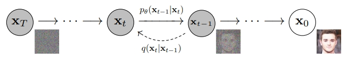

DDPM，Denoising Diffusion Probabilistic Models，去噪扩散概率模型，常说的扩散模型

它是一种生成模型，输入一个随机采样（标准正态分布）噪音，输出一个高质量**合成图像**（训练数据集中的风格）

常见的生成模型有：**变分自编码器(VAE)、对抗生成网络(GAN)、扩散模型、自回归生成网络、基于能量的生成模型，基于流生成模型**

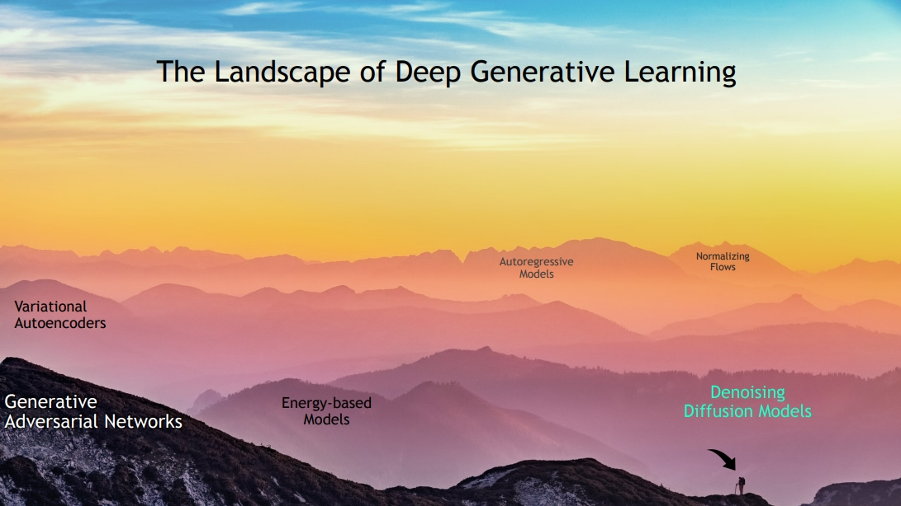

DDPM的核心思想是两个：

- 给图像多次加入噪音$(X_0\rightarrow X_T)$
- 设计模型来预测添加噪音图像里的噪音，通过模型一步步去噪，生成图像$(X_T\rightarrow X_0)$

其中，T是一个超参数，论文设置T=1000

分别对应两个过程：**Forward Process**和**Reverse Process**

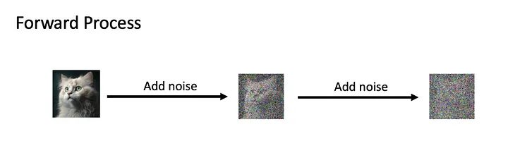

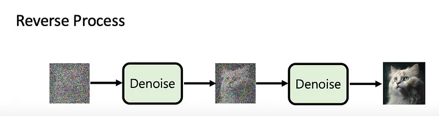

# 1. Forward Process

前向过程很简单，就是给图片加噪音，压根不需要模型

一个朴素的想法：高斯分布采样，然后噪音数据加到图片上，伪代码：

```python
noise = torch.normal(mean=0, std=1, size=(height, width, channel))
x_1 = x_0 + noise
```

需要多次加噪音，那多次采样再加上去不就行了嘛

可以是可以，有点浪费计算资源了。有没有办法**一次性采样，等效于多次采样**？

看看论文里的思路：

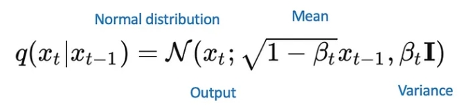

论文里将每次加噪音的过程看成是正态分布采样：均值是$\sqrt{1-\beta_t}x_{t-1}$，方差是$\beta_tI$

这种操作不可微，并且实现起来也挺麻烦。论文介绍了一个**Reparameterization trick**的方法，如果对VAE很熟悉，应该对这种方法不陌生，VAE里也用到了这种方法，同样是解决随机采样不可微的问题。具体做法就是：

均值是$\sqrt{1-\beta_t}x_{t-1}$，方差是$\beta_tI$的正态分布采样不可微，转换为关于**标准正态分布的线性表达式**：$\sqrt{\beta_t}\epsilon+\sqrt{1-\beta_t}x_{t-1}$，其中$\epsilon$是标准正态分布，这个表达式操作终于可微了。那么这种转换是等效的吗？

实际上是有依据的，可以证明：**对于标准正态分布采样$\pmb{\epsilon}$，$\pmb{z}=\pmb{u}+\pmb{\delta}\pmb{\epsilon}$ 同样是服从正态分布$N(\pmb{u},\pmb{\delta}^2)$**


这个技巧很重要，它提供了一个事实：**关于标准正态分布的线性表达式同样可以看成一个（非标准）正态分布，非标准正态分布可以看成标准正态分布的线性表达式**

那么论文里添加噪音的方法，可以写成：
$$
x_t=\sqrt{1-\beta_t}x_{t-1}+\sqrt{\beta_t}\epsilon_t \quad\epsilon_t\sim(0,1) \tag{1}
$$
其中$x_t$是第t次添加噪音处理后的图像

公式1其实就是一开始伪代码中添加噪音的办法，除此之外，还给噪音和待添加噪音的图像各给一个权重：$\sqrt{\beta_t}$和$\sqrt{1-\beta_t}$

继续最开始的思考：有没有办法**一次性采样，等效于多次采样**？

有，玄机就藏在：**每次添加噪音都是正态分布采样，并且每次正态分布都相互独立**

有个结论：**相互独立的正态分布之和，同样服从正态分布，且均值（和方差）等于独立分布均值（方差）之和**，这里就不手写证明了，直接从书上截图：

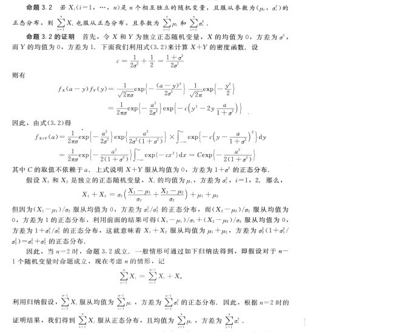

有了等效多次正态分布的理论基础，将公式1展开，试图寻找$x_t$和$x_0$之间的关系：
$$
\begin{align*}
x_t & = \sqrt{1-\beta_t}x_{t-1}+\sqrt{\beta_t}\epsilon_t \\
&=\sqrt{1-\beta_t}(\sqrt{1-\beta_{t-1}}x_{t-2}+\sqrt{\beta_{t-1}}\epsilon_{t-1})+\sqrt{\beta_t}\epsilon_t \\
&=\quad ... \\
&=(\sqrt{1-\beta_t}...\sqrt{1-\beta_1})x_0+(\sqrt{1-\beta_t}...\sqrt{1-\beta_2})\sqrt{\beta_1}\epsilon_1 \\
&\quad +(\sqrt{1-\beta_t}...\sqrt{1-\beta_3})\sqrt{\beta_2}\epsilon_2+...+\sqrt{1-\beta_t}\sqrt{\beta_{t-1}}\epsilon_{t-1}+\sqrt{\beta_t}\epsilon_t \\ 
\end{align*}\tag{2}
$$
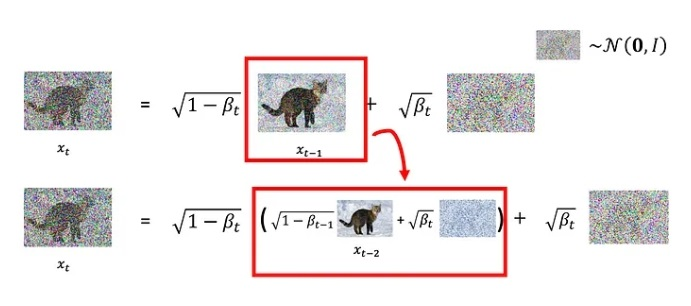

$x_t$展开之后分为两部分：原始图像$x_0$和t次随机采样（正态分布）

这t次正态分布随机采样相互独立，**均值都是0，方差是它们在公式2中系数的平方**。那么它们可以等效为一次正态分布采样，**均值依然是0，方差是t次采样系数的平方和**

假设，t次正态分布采样的方差和为$\sigma^2$，公式2可以写成：
$$
x_t=(\sqrt{1-\beta_t}...\sqrt{1-\beta_1})x_0+\sigma\epsilon \tag{3}
$$
再次观察公式2等式右边的系数，这里有两个精心设计：

1. 每次添加噪音的时候，噪音和添加噪音图像之间的权重（$\sqrt{\beta_t}$和$\sqrt{1-\beta_t}$）平方和等于1

2. **t次随机采样的系数与$x_0$的系数平方和也为1**：
   $$
   \begin{align*}
   &\quad(1-\beta_t)...(1-\beta_1)+(1-\beta_t)...(1-\beta_2)\beta_1+(1-\beta_t)...(1-\beta_3)\beta_2+...+(1-\beta_t)\beta_{t-1}+\beta_t\\
   &=(1-\beta_t)...(1-\beta_2)(1-\beta_1+\beta_1)+(1-\beta_t)...(1-\beta_3)\beta_2+...+(1-\beta_t)\beta_{t-1}+\beta_t\\
   &=(1-\beta_t)...(1-\beta_2)+(1-\beta_t)...(1-\beta_3)\beta_2+...+(1-\beta_t)\beta_{t-1}+\beta_t\\
   &=\quad...\\
   &=1-\beta_t+\beta_t\\
   &=1
   \end{align*}
   $$

那么就是：$(1-\beta_t)...(1-\beta_1)+\sigma^2=1$

设$\alpha_t=1-\beta_t$，公式3变为：
$$
x_t=\sqrt{\alpha_t\alpha_{t-1}...\alpha_1}x_0+\sqrt{1-\alpha_t\alpha_{t-1}...\alpha_1}\epsilon \tag{4}
$$
到此，Forward Process部分就这样了：t次采样得到噪音，等效于一次标准正态分布采样

这里继续论文里的变量标记，设$\bar{\alpha_t}=\prod\limits_{s=1}^t\alpha_s$，所以：
$$
x_t=\sqrt{\bar{\alpha_t}}x_0+\sqrt{1-\bar{\alpha_t}}\epsilon \tag{5}
$$
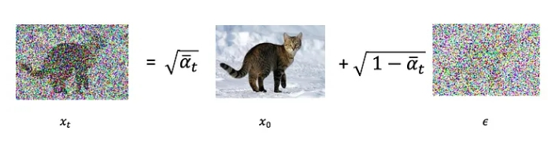

再总结一下变量标记：
$$
\alpha_t=1-\beta_t\\
\bar{\alpha_t}=\prod\limits_{s=1}^t\alpha_s
$$
$\beta_t$究竟是什么呢？

前面提过：**每一次（步）噪音和待添加噪音的图像各给一个权重：$\sqrt{\beta_t}$和$\sqrt{1-\beta_t}$**

论文里提到，随着不断添加噪音，$\beta_t$应该递减，换句话说，**噪音添加的比重会越来越小**

那么每一步$\beta_t$究竟怎么变化呢？作者提出了一种简单的设计：Linear schedule

意思就是，设置一个**上阈值0.02**和**下阈值0.0001**，$\beta_1$到$\beta_t$线性增加，伪代码：

```python
betas = np.linspace(
            0.0001,
            0.02,
            timesteps
        )
```

想法很简单，有一定的改进空间

# 2. Reverse Process

Reverse Process，也叫去噪过程，真正开始用模型解决问题了

下面给出训练和生成图像的办法：

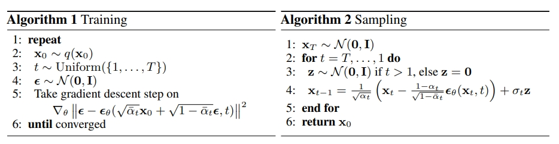

- 训练：
  1. 从数据集里随机抽取一张真实图像$x_0$
  2. 从$[1,T]$**均匀采样**，得到一个t
  3. 标准正态分布随机采样噪音$\epsilon$
  4. 模型记为$\epsilon_\theta$，输入：添加噪音后的图像$x_t$和t，其中$x_t=\sqrt{\bar{\alpha_t}}x_0+\sqrt{1-\bar{\alpha_t}}\epsilon$
  5. 损失函数是：$L=||\epsilon-\epsilon_\theta(x_t,t)||^2$
  6. 迭代1-5训练

T是超参数，设置T=1000。模型预测的是噪音，因为损失函数比较的也是噪音$\epsilon$

模型方面，只有一种模型，输入$x_t$和t，t是随机的，从$[1,T]$**均匀采样**，并不是每一步训练一个模型来预测，那样就太不"efficient training"

- 采样（图像生成）：
  1. 标准正态分布采样作为$x_T$
  2. t=T,...,1（从T依次取到1）
  3. 标准正态分布采样$z$（如果t=1，$z=0$）
  4. $x_{t-1}=\frac{1}{\sqrt{\alpha_t}}(x_t-\frac{1-\alpha_t}{\sqrt{1-\bar{\alpha_t}}}\epsilon_\theta(x_t,t))+\sigma_tz$
  5. 循环2-4，直到得到$x_0$

其中$\sigma_t^2=\frac{1-\bar{\alpha_{t-1}}}{1-\bar{\alpha_t}}\beta_t$，论文里提到实验说明，设置$\sigma_t^2=\beta_t$，两者近似，最终结果也差不多

其实到这里，复现论文里的扩散模型已经一目了然，添加噪音，训练，生成图像，都介绍的很清楚

但不得不说，这个图像生成过程挺费解：有两个正态分布采样：模型$\epsilon_\theta$最开始输入的$x_T$是随机采样纯噪音，这很好理解，但每一步去噪居然还需要再随机采样一个z。这让人不得不发出疑问，这样真的能生成有意义的图像吗？为什么？

简单考虑：生成图像过程是一步步去掉噪音，那不就是$x_t\rightarrow x_{t-1}$吗？把公式1转换一下，不就行了：
$$
x_{t-1}=\frac{x_t-\sqrt{\beta_t}\epsilon_t}{\sqrt{1-\beta_t}} 
$$
然后模型$\epsilon_\theta$是预测噪音，生成图像的时候，每一步给给模型输入（$x_t$,t），预测的噪音代入公式7中的$\epsilon_t$，一步步去噪就可以得到原始图像$x_0$。

这样显然是不行的，原因是**模型$\epsilon_\theta$是预测噪音不假，但并不是预测每一步添加的噪音**。回头看看模型是怎么训练的：每次从$[1,T]$均匀随机采样得到一个t，基于公式5，等效于t次添加噪音得到$x_t$，添加的噪音也不是$\epsilon_t$，而是公式5中的$\epsilon$，损失函数中于模型预测比较的也是$\epsilon$，现在用模型预测结果代替每次添加的噪音$\epsilon_t$，显然是不合理的。

理解论文里生成图像的过程，就是DDPM最具”数学性“的地方。直觉上理解这个模型很有难度，真的不得不动用概率推导

# 3.概率语言下的逻辑

首先，论文将每次添加噪音的过程（$x_{t-1}\rightarrow x_t$），记为条件概率$q(x_t|x_{t-1})$，看成一个正态分布随机采样，均值是$\sqrt{1-\beta_t}x_{t-1}$，方差是$\beta_tI$，就是公式1
$$
q(x_t|x_{t-1})=N(x_t;\sqrt{1-\beta_t}x_{t-1},\beta_tI) \tag{7}
$$
计算后验联合分布：
$$
q(x_{1:T}|x_0)=\prod_{t=1}^{T}q(x_t|x_{t-1}) \tag{8}
$$
这里涉及到**马尔可夫链**应用，简单说，**给定当前状态的情况下，未来状态的概率分布只依赖于当前状态，而不依赖于过去状态的详细历史**，就是：
$$
q(x_t|x_{t-1},...,x_0)=q(x_t|x_{t-1})
$$
按照贝叶斯公式：
$$
q(x_{1:T}|x_0)=\frac{q(x_{0:T})}{q(x_0)}=\frac{q(x_0)\prod_{t=1}^{T}(x_t|x_0,...,x_{t-1})}{q(x_0)}
$$
有了马尔可夫链的方便，就能得到公式8，接下来去看看$q(x_t)$：
$$
q(x_t)=\int q(x_0,x_t)dx_0=\int q(x_0)q(x_t|x_0)dx_0 \tag{9}
$$
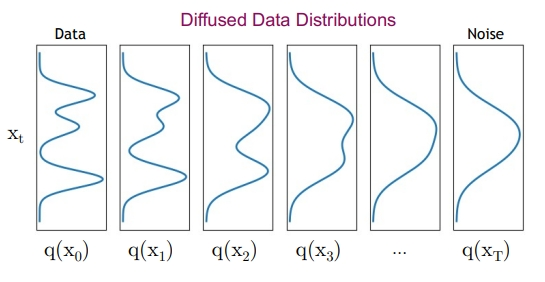

所以扩散过程就是期望：$q(x_T)\approx N(x_T;0,I)$

将降噪过程记作条件概率$q(x_{t-1}|x_t)$，它涉及到一步步生成图像，怎么确认它就太难搞了，所以用模型强大的拟合能力去模拟这个过程

在这之前，有个基本近似过程：**在$\beta_t$很小时，$q(x_{t-1}|x_t)$可以近似为正态分布**

前面提到，一步步给原始图像添加噪音，每一步添加的噪音权重是$\sqrt{\beta_t}$，$\beta_t$逐步递减，最终$q(x_T)\approx N(x_T;0,I)$

所以，**去噪过程用模型来拟合，不再记$q(x_{t-1}|x_t)$，而是用$p_\theta(x_{t-1}|x_t)$,它近似为一个正态分布采样过程**

回头再看，生成图像的方法：
$$
x_{t-1}=\frac{1}{\sqrt{\alpha_t}}(x_t-\frac{1-\alpha_t}{\sqrt{1-\bar{\alpha_t}}}\epsilon_\theta(x_t,t))+\sigma_tz \quad z\sim(0,1)\tag{10}
$$
虽然还是不明白是什么原理，但是现在知道了它是一个正态分布采样，均值是：$\frac{1}{\sqrt{\alpha_t}}(x_t-\frac{1-\alpha_t}{\sqrt{1-\bar{\alpha_t}}}\epsilon_\theta(x_t,t))$，方差：$\sigma_t^2$

到现在为止，将去噪过程近似为正态分布，但是均值和方差为止，记为：
$$
p_\theta(x_{t-1}|x_t)=N(x_{t-1};\mu_\theta(x_t,t),\Sigma_\theta(x_t,t)) \tag{11}
$$
同样应用马尔可夫链计算联合分布：
$$
p_\theta(x_{0:T})=p(x_T)\prod_{t=1}^Tp_\theta(x_{t-1}|x_t) \tag{12}
$$
当然，依然还是有$p(x_T)=N(x_T;0,I)$

接下来确定，**如何使生成的图片尽可能符合训练数据分布**，这也是DDPM的目标

按照极大似然估计方法，其实就是最大化$p_\theta(x_0)$，这里涉及到常说的Evidence Lower Bound (ELBO)，关于它的推理，网上很多：

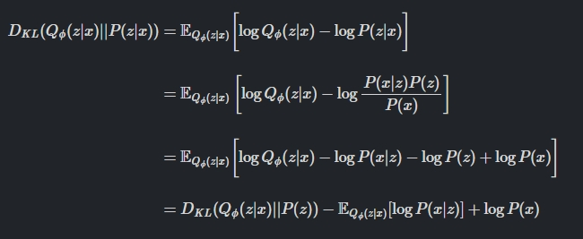

KL散度和交叉熵都是深度学习非常常见的损失函数，这里不多赘述。上面的推导，z是中间变量，用$x_{1:T}$代入；x用$x_0$代入；P用$p_\theta$代入；$Q_\phi$用q代替有：
$$
D_{kl}(q(x_{1:T}|x_0)||p_\theta(x_{1:T}|x_0))=D_{kl}(q(x_{1:T}|x_0)||p_\theta(x_{1:T}))-E_{q(x_{1:T}|x_0)}[\log{p_\theta(x_0|x_{1:T}}]+\log{p_\theta(x_0)} \tag{13}
$$
变换就是：
$$
\log{p_\theta(x_0)}-D_{kl}(q(x_{1:T}|x_0)||p_\theta(x_{1:T}|x_0))=E_{q(x_{1:T}|x_0)}[\log{p_\theta(x_{0:T})}-\log{q(x_{1:T}|x_0)}] \tag{14}
$$
等式右边就是ELBO。$D_{kl}(q(x_{1:T}|x_0)||p_\theta(x_{1:T}|x_0))$是KL散度，它必然是非负的，所以有：
$$
\log{p_\theta(x_0)}\geq E_{q(x_{1:T}|x_0)}[\log{p_\theta(x_{0:T})}-\log{q(x_{1:T}|x_0)}] \tag{15}
$$
最大化$p_\theta(x_0)$，等效于最小化$-\log{p_\theta(x_0)}$：
$$
-\log{p_\theta(x_0)}\leq E_q[-log\frac{p_\theta({x_{0:T}})}{q(x_{1:T}|x_0)}]=E_q[-\log{p(x_T)}-\sum_{t\geq 1}\log{\frac{p_\theta(x_{t-1}|x_t)}{q(x_t|x_{t-1})}}]=L \tag{16}
$$
直接给出论文里的推导：

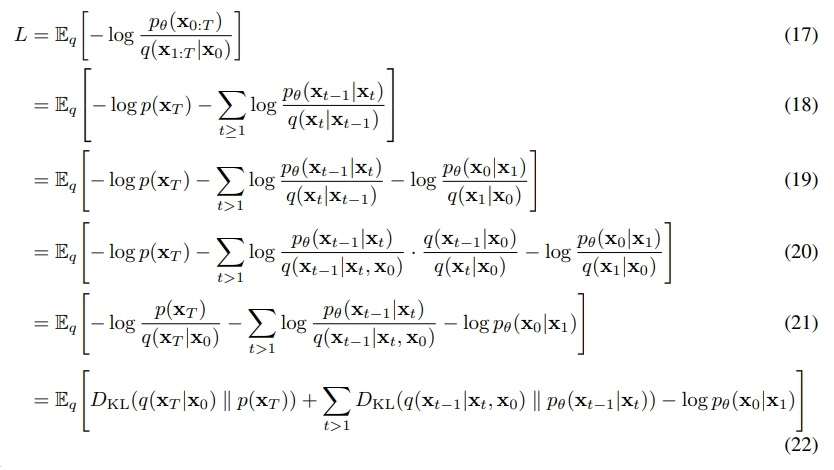

其中19-20的推导，就是：
$$
q(x_t|x_{t-1})=\frac{q(x_{t-1}|x_t,x_0)q(x_t|x_0)}{q(x_{t-1}|x_0)} \tag{23}
$$
第一眼看到$q(x_{t-1}|x_t,x_0)$，还以为是$x_{t-1}|x_t$和$x_0$的联合分布，有点见笑了。但其实是$x_{t-1}$和$x_t,x_0$的条件概率。

这样其实$q(x_t|x_{t-1})$可以写成$q(x_t|x_{t-1},x_0)$，因为$x_t$是$x_0$一步步添加噪音得到的，所以就有：
$$
q(x_t|x_{t-1})=q(x_t|x_{t-1},x_0)=\frac{q(x_0,x_{t-1},x_t)}{q(x_{t-1},x_0)}=\frac{q(x_{t-1}|x_t,x_0)q(x_t,x_0)}{q(x_{t-1},x_0)} \tag{24}
$$
由公式23推导到公式24，就很简单了

公式22，优化$L$最小化，其实可以当做模型损失函数了。观察一下：$D_{KL}(q(x_{t-1}|x_t,x_0)||p_\theta(x_{t-1}|x_t))$，KL散度最小化就是$p_\theta(x_{t-1}|x_t)$分布逼近$q(x_{t-1}|x_t,x_0)$

捋一下思路：去噪过程$q(x_{t-1}|x_t)$很难确定，所以用模型$p_\theta(x_{t-1}|x_t)$去模拟，经过马尔可夫链、极大似然估计、ELBO等一顿推导，最后得出结论：$p_\theta(x_{t-1}|x_t)$分布逼近$q(x_{t-1}|x_t,x_0)$

那么$q(x_{t-1}|x_t,x_0)$可以处理了吗？确实可以，这里直接给出已有博主推导：

https://zhuanlan.zhihu.com/p/650394311

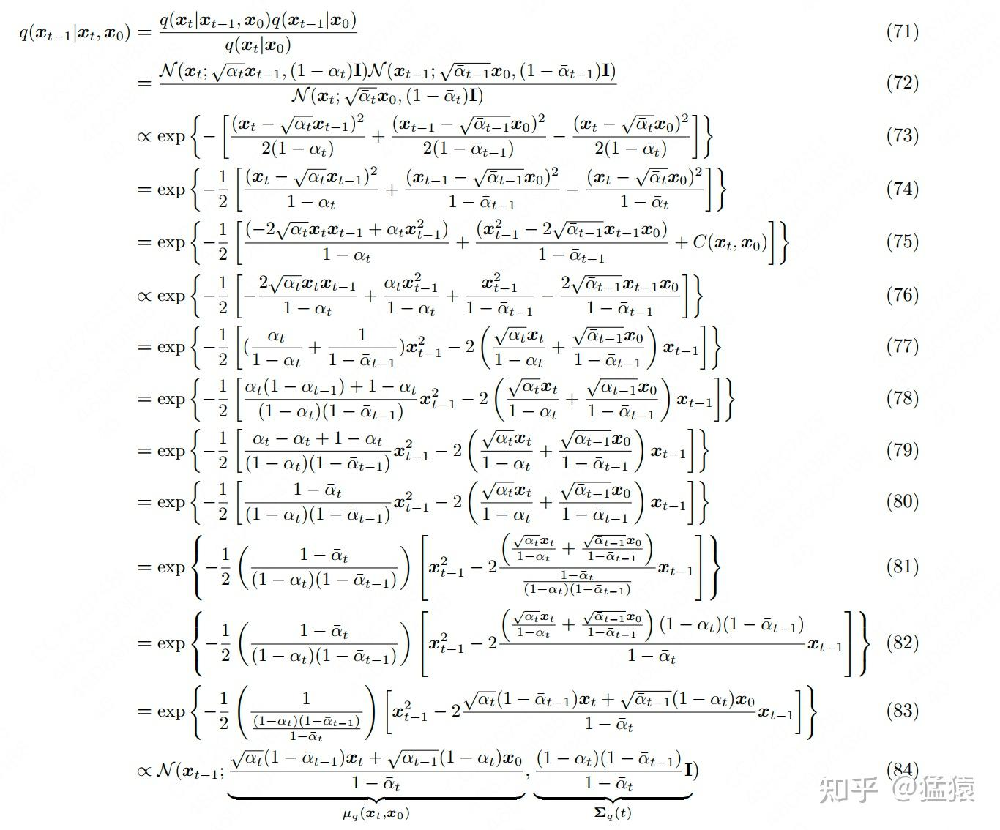

$q(x_{t-1}|x_t,x_0)$同样是正态分布，均值$\bar{\mu_t}(x_t,x_0)$，方差是$\bar{\beta_t}$:
$$
\bar{\mu_t}(x_t,x_0)=\frac{\sqrt{\bar{\alpha_{t-1}}}\beta_t}{1-\bar{\alpha_t}}x_0+\frac{\sqrt{\alpha_t}(1-\bar{\alpha_{t-1}})}{1-\bar{\alpha_t}}x_t \tag{25}
$$

$$
\bar{\beta_t}=\frac{1-\bar{\alpha_{t-1}}}{1-\bar{\alpha_t}}\beta_t \tag{26}
$$

将公式5变形：$x_0=\frac{x_t-\sqrt{1-\bar{\alpha_t}}\epsilon}{\sqrt{\bar{\alpha_t}}}$代入公式25，得到：
$$
\bar{\mu_t}(x_t,x_0)=\frac{1}{\sqrt{\alpha_t}}(x_t-\frac{1-\alpha_t}{\sqrt{1-\bar{\alpha_t}}}\epsilon) \tag{27}
$$
$p_\theta(x_{t-1}|x_t)$分布逼近$q(x_{t-1}|x_t,x_0)$，意味着公式11中$p_\theta(x_{t-1}|x_t)$正态分布的均值和方差可以确定了。训练过程中，$\epsilon_\theta(x_t,t)$预测的正是$\epsilon$，那么将$\epsilon_\theta(x_t,t)$代入公式27，就可以得到最终的去噪正态分布的均值：
$$
\mu_\theta(x_t,t)=\frac{1}{\sqrt{\alpha_t}}(x_t-\frac{1-\alpha_t}{\sqrt{1-\bar{\alpha_t}}}\epsilon_\theta(x_t,t)) \tag{28}
$$

$$
\Sigma_\theta(x_t,t)=\frac{1-\bar{\alpha_{t-1}}}{1-\bar{\alpha_t}}\beta_t \tag{29}
$$

公式28、29、11解释了生成图像的方法，再写一遍就是：
$$
x_{t-1}=\frac{1}{\sqrt{\alpha_t}}(x_t-\frac{1-\alpha_t}{\sqrt{1-\bar{\alpha_t}}}\epsilon_\theta(x_t,t))+\sigma_tz \quad z\sim(0,1) \tag{10}
$$
到这里其实还少了损失函数：
$$
L_{T-1}=D_{KL}(q(x_{t-1}|x_t,x_0)||p_\theta(x_{t-1}|x_t)) \tag{30}
$$
$p_\theta(x_{t-1}|x_t)$和$q(x_{t-1}|x_t,x_0)$都是正态分布，可以计算：

参考：https://blog.csdn.net/int_main_Roland/article/details/124650909
$$
L_{T-1}=\frac{1}{2\sigma_t^2}||\bar{\mu_t}(x_t,x_0)-\mu_\theta(x_t,t)||^2 \tag{30}
$$
将公式27、28代入，损失函数可以写成：
$$
L_{T-1}=\frac{\beta_t^2}{2\sigma_t^2\alpha_t(1-\bar{\alpha_t})}||\epsilon-\epsilon_\theta(\sqrt{\bar{\alpha_t}}x_0+\sqrt{1-\bar{\alpha_t}}\epsilon,t)||^2+C \tag{31}
$$
论文里提到：设置$\lambda_t=\frac{\beta_t^2}{2\sigma_t^2\alpha_t(1-\bar{\alpha_t})}=1$可以提高生成图像的质量

至此，图像添加噪音的公式5，模型训练公式31，图像逐步生成公式10推导完成

# 4. 模型架构

主要架构是U-Net，它最开始是为生物医学图像分割开发，架构如下图：


U-Net网络整个架构并不复杂，就是一个下采样和上采样的过程。下采样用标准CNN就可以（图中是用最大池化层实现，红色箭头部分），控制尺寸在减小，通道增加。上采样（图中青色箭头部分）则是尺寸增加，通道数减小，一般用转置卷积（`torch.nn.ConvTranspose2d`）或者插值等上采样操作（`torch.nn.Upsample`）。当然上下采样过程中还有尺寸变化不大的卷积操作，也就是图中蓝色箭头部分。

其中最显著的操作应该还是图中灰色箭头部分：copy and crop，其实就是将下采样部分的feature map和上采样部分的feature map连接，连接方式是在**通道轴上concat**

输入图像的尺寸需要根据训练数据集尺寸自行调整。必须要说明的是：DDPM的模型是$\epsilon_\theta(x_t,t)$，在U-Net架构的基础上，需要**额外添加时间步t的输入通道**

具体模型设计办法如下：

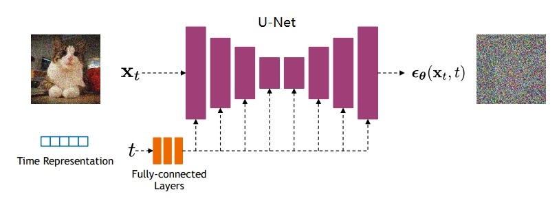

图上只有两个细节：

1. time representation：可以是正弦位置嵌入或随机傅里叶特征。可以类比transformer中的固定位置编码，但两者不是一回事，time representation本质来说是特征，不是编码。可以设计如下：
   $$
   f_{i=0:d/2-1}=t(i-\frac{\log{10000}}{d/2-1})
   $$
   其中d是特征的维度，i取值：$[0,d/2-1]$，表示一半的特征维度取值，为什么是一半？因为还有在此基础上，加上正弦和余弦操作，然后将它们concat连接起来：
   $$
   r=concat(\sin({f_{i=0:d/2-1}}),\cos({f_{i=0:d/2-1}}))
   $$

2. 时间特征输入通道和图像特征通道连接方法：

   就是图中虚线箭头部分：很简单，**就是一个逐元素相加**。并且观察图示，时间特征和每一个feature map都相加了。当然这需要保证**时间特征维度和图像特征的通道数是相同的**，至于时间特征和图像特征的batch、higth、width三个维度不一致，没有关系，时间特征在这三个维度上都是1，借助广播机制就可以相加。换句话说，和图像特征相加的时间步特征，在batch、higth、width三个维度都是一样的。

   除此之外，其中还有一个细节，图像特征和时间特征相加以后的混合特征和图像特征有一个残差连接，这应该算是U-Net为了网络加深的一个做法。简单说就是：`i+CNN(i+t)`，其中i和t分别是图像和时间特征

最后可能还有一个有意思的细节：就是DDPM在U-Net网络提取特征过程中加入了**自注意力机制**

具体加在哪里？上面所说**时间特征和图像特征相加，然后混合特征再和图像特征残差连接，自注意力机制就加在残差连接之后**

具体怎么实现自注意力？或者说query、key、value是什么？

这里和vision transformer不一样，它对feature map并没有分块，而是将**混合特征的每个通道向量当做一个query、key、value**，假设混合特征的形状是：$(b,h,w,c)$，`einsum`可以给出最直观操作示范：

```python
q = layers.Dense(units)(inputs)
k = layers.Dense(units)(inputs)
v = layers.Dense(units)(inputs)

# 自注意力
attn_score = tf.einsum("bhwc, bHWc->bhwHW", q, k) * scale
attn_score = tf.reshape(attn_score, [batch_size, height, width, height * width])

attn_score = tf.nn.softmax(attn_score, -1)
attn_score = tf.reshape(attn_score, [batch_size, height, width, height, width])

proj = tf.einsum("bhwHW,bHWc->bhwc", attn_score, v)
```