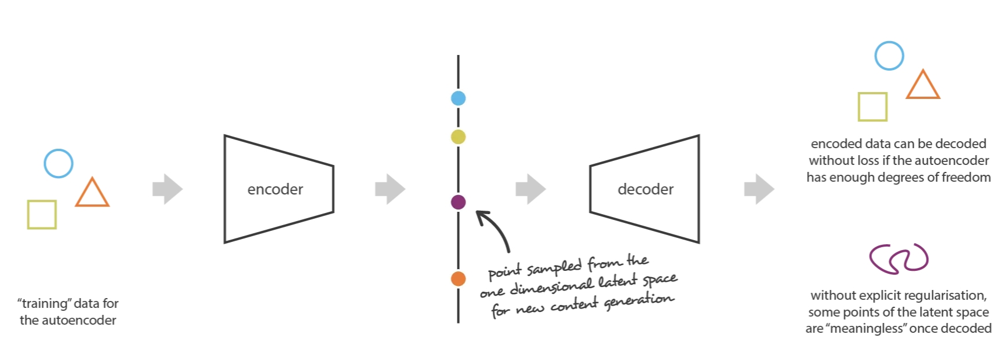
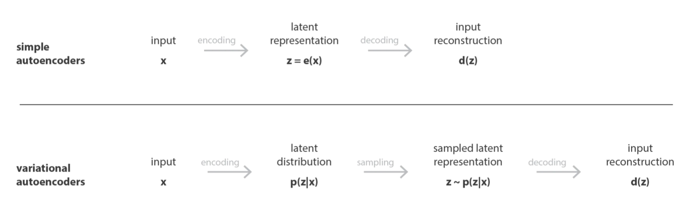
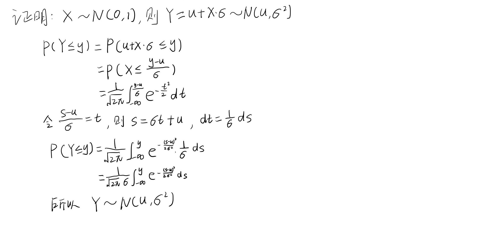
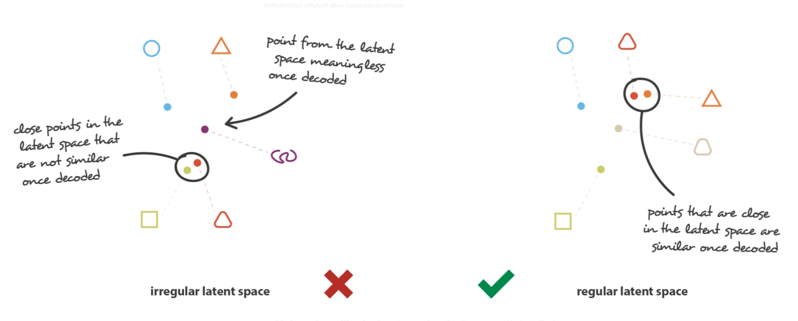
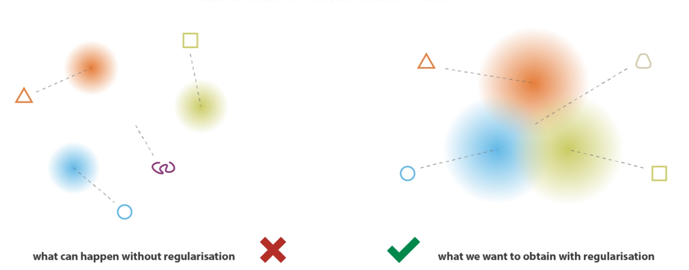

# 1. Auto-Encoder自编码器

参考：

1. [KiKaBeN - Autoencoder --- KiKaBeN - 自动编码器](https://kikaben.com/how-to-reduce-image-noises-by-autoencoder/)
2. [自动编码器：各种各样的自动编码器，附代码](https://keras-cn.readthedocs.io/en/latest/legacy/blog/autoencoder/)
3. [deep-learning/python/autoencoder_noise_reduction.ipynb at master · naokishibuya/deep-learning · GitHub](https://github.com/naokishibuya/deep-learning/blob/master/python/autoencoder_noise_reduction.ipynb)

- 概述

  - 对数据先**降维**再**还原**。降维和还原的两个过程也叫**编码**和**解码**。
  - 自编码器很简单，包括编码器和解码器，对数据进行运算。基本结构不限制，**全连接层和卷积网络都可以**。

  

- 应用

  - 数据去噪（**训练阶段：输入带噪音的图片，输出为原始照片**）
  - 数据降维，从而可视化

- **损失函数：二元交叉熵**

  - 公式
    $$
    L=-\frac{1}{N}\sum_{i=1}^{N}[y_ilog(p_i)+(1-y_i)log(1-p_i)]
    $$
    其中，$N$是样本数，$y_i$是第i个样本的所属类别，$p_i$是第i个样本的预测值。

    需要说明的是，**一个样本指的是什么？**对图片来说，**是一张图片？还是图片上的一个像素？**正确答案是，**一个样本代表图片上的一个像素**。理解这一点很重要，就会明白二元交叉熵和(多分类)交叉熵的关系，以及二元交叉熵的计算要求。

  - **二元交叉熵**和**(多分类)交叉熵**本质上并没有区别，都是在**计算随机变量的交叉熵**。**多分类交叉熵**：
    $$
    L=-\frac{1}{N}\sum_{i=1}^{N}\sum_{c=1}^{K}y_{ic}log(p_{ic})
    $$
    其中，$N$是样本数，$K$是类别数。$y_{ic}$是第i个样本在c类别上的真实值。$p_{ic}$是第i个样本是c类的概率预测值。在图片分类中，**多类别交叉熵的一个样本**是指，**一张图片经过softmax计算的所有预测(logits)。**

    在机器学习处理中，一般将$\pmb{y_i}$写成一个k维向量，只有正确类别的元素为1，其他为0。而$p_i$一般是也经过`softmax`归一化的k维向量，每一个元素代表对应类别的概率预测值。 

    **熵和交叉熵都是是随机变量的概念**，计算交叉熵需要取到随机变量的所有取值。对于二元交叉熵，一个样本代表一个随机变量，只有两个取值，都要计算交叉熵。对于多分类交叉熵，随机变量的所有取值是`softmax`输出的所有`logits`。

  - 二元交叉熵的真实类别$y_i$必须是[0,1]

  - pytorch中

    1. 二元交叉熵：

       ```python
       # 初始化
       criterion = torch.nn.BCELoss(
           weight=None, 
           size_average=None, 
           reduce=None, 
           reduction='mean'
       )
       # 运算
       loss = criterion(model_outputs, targets)
       
       ===================================================================
       
       # 初始化
       criterion = torch.nn.BCEWithLogitsLoss(
           weight=None, 
           size_average=None, 
           reduce=None, 
           reduction='mean', 
           pos_weight=None
       )
       # 运算
       loss = criterion(model_outputs, targets)
       
       '''
       如果model_outputs和targets的尺寸是(batch,channel,higth,width)
       对二元交叉熵而言，样本个数是：b*c*h*w
       
       注意：
       1. nn.BCEWithLogitsLoss和nn.BCELoss不一样的地方在于，nn.BCEWithLogitsLoss不需要应用 sigmoid 函数到模型的输出，它会在内部自己计算 sigmoid 和二元交叉熵损失。nn.BCELoss则要求输入的模型的输出必须经过 sigmoid 函数处理。换言之，如果你的模型损失函数是多分类交叉熵，选择nn.BCEWithLogitsLoss，其实并不需要在模型后面加入sigmoid层。但如果选择nn.BCELoss一定要在模型中加入sigmoid层，确保模型输出取值在(0,1)。
       
       2.两者都要求输入中的target中数值必须在[0,1],model_outputs和targets的尺寸必须一致
       '''
       ```

       

    2. 多分类交叉熵：

       ```python
       #初始化
       criterion = torch.nn.CrossEntropyLoss(
           weight=None, 
           size_average=None, 
           ignore_index=-100, 
           reduce=None, 
           reduction='mean', 
           label_smoothing=0.0
       )
       #运算
       loss = criterion(model_outputs, targets)
       
       '''
       一般多分类模型的输出model_outputs和targets的尺寸是(batch,labels_num)
       这里的多分类交叉熵的样本数是：b
       
       注意：
       1. 计算损失的时候，并不要求model_outputs中每个样本数据中logits取值范围在(0,1)并且和为1。没有这样的原因是nn.CrossEntropyLoss会在内部自动应用 softmax 操作。换言之，如果你的模型损失函数是多分类交叉熵，其实并不需要在模型后面加入softmax层。
       2.targets可以有两种形式。
       第一种形式是(batch,labels_num),代表batch个数据，label_num个类别。大多数情况下，某一个正确类别的位置是1，其他为1。这种形式下，model_outputs和targets尺寸一致。
       第二种形式是：直接给出类别索引。尺寸就是一维向量：(batch,)里面每个数据是代表相对应batch样本正确类别的缩影。比如batch=5，label_num=3,labels_num可能为[0,2,0,1,0]
       '''
       ```

# 2. 工程上精妙，数学推理严谨的VAE

- 参考
  1. [Variational autoencoders. --- 变分自动编码器。 (jeremyjordan.me)](https://www.jeremyjordan.me/variational-autoencoders/)
  2. [Intuitively Understanding Variational Autoencoders | by Irhum Shafkat | Towards Data Science](https://towardsdatascience.com/intuitively-understanding-variational-autoencoders-1bfe67eb5daf)
  3. https://kikaben.com/vae-2013/
  4. [机器学习方法—优雅的模型（一）：变分自编码器（VAE） - 知乎 (zhihu.com)](https://zhuanlan.zhihu.com/p/348498294)
  5. [Understanding Variational Autoencoders (VAEs) | by Joseph Rocca | Towards Data Science --- 了解变分自编码器 (VAE) |作者：约瑟夫·罗卡 |走向数据科学](https://towardsdatascience.com/understanding-variational-autoencoders-vaes-f70510919f73)
  6. [Diffusion Models vs. GANs vs. VAEs: Comparison of Deep Generative Models | by Ainur Gainetdinov | Towards AI --- 扩散模型、GAN 与 VAE：深度生成模型的比较 |作者：艾努尔·盖内迪诺夫 |迈向人工智能](https://pub.towardsai.net/diffusion-models-vs-gans-vs-vaes-comparison-of-deep-generative-models-67ab93e0d9ae)
  7. [Probability Interview Questions In Data Analysts’ Real Life | by Kseniia Baidina | Oct, 2023 | Towards Data Science --- 数据分析师现实生活中的概率面试问题 |通过 Kseniia Baidina | 2023 年 10 月 |走向数据科学](https://towardsdatascience.com/probability-interview-questions-in-real-life-of-data-analysts-0c8b5953abd8)

## 2.1 工程角度的 VAE

### 动机

  - 传统自编码器是对数据降维再还原，本质是复制数据

  - 一个想法：**能否把自编码器直接当做生成模型**？

    具体一点，**对于编码器和解码器之间的潜在变量z，我们自己输入数据代替潜在变量z给解码器，解码器输出图片数据？**

### 产生代替潜在变量的数据

**随机生成数据(向量)当做潜在变量输入给解码器，能产生有意义的图片吗？**

也许能！毕竟在传统的自编码器中，**每次输入图片得到的每一次潜在变量是什么并不清楚？**

那现在随机生成数据当做潜在变量，本质是碰运气的行为



但是先等等，刚刚说的随机生成数据是什么意思？就是**随机采样**！**但随机采样有个前提：你有数据的概率分布**。比如你要随机生成正态分布、均匀分布或者指数分布数据，你首先要知道概率密度函数才能采样。

[[MCMC(一)蒙特卡罗方法 ](https://www.cnblogs.com/pinard/p/6625739.html)

### 随机采样代替潜在变量

我们希望自己生成数据代替潜在变量，然后输入给解码器得到有意义的图片，生成的方法是**随机采样**，但就有个基本前提：**已知潜在变量的概率分布**

一般随机采样，最常见的概率分布是**高斯分布(当然还有很多其他分布，理论上是都可以的)，给定高斯分布(正态分布)采样数据作为潜在变量输入到解码器**。再复杂一点，潜在变量是多维向量，采样过程应该是**多维高斯采样**。

随之而来的问题：我们用高斯分布采样数据代替潜在变量输入给解码器希望生成有意义的图片。可关键是，**在自编码器的架构中，真正的潜在变量是输入图片给编码器输出的，真正的潜在变量是我们随机采样选择的分布（比如高斯分布）吗？**如果编码器输出的潜在变量不是高斯分布，咱们用采样的高斯分布数据代替潜在变量，那不是自说自话吗？

所以解决问题的关键是：**编码器输出的潜在变量服从的分布，随机采样数据作为解码器的输入的分布，如何保证两者相同？**

### **编码器输出的分布**

随机采样数据的分布理论上可以随意选择，那么如何控制编码器输出的潜在变量表示一个分布，并且分布和随机采样分布一致？

值得注意的是，传统自编码器输出的潜在变量是一个低维向量，换句话说是固定的数值，根本不是概率分布。以常见的正态分布举例，需要知道**均值和方差**才能说知道概率分布。再复杂一点，对于多维正态分布，需要知道**均值向量和协方差矩阵**

于是又出现了新问题：**如何控制编码器输出的是概率分布而不是固定数值？**

一个很棒的思路是：**编码器输出的是概率分布的参数（比如均值和方差），而不是概率分布的具体指。**

这样编码器的设计思路就出现了



### 变分自编码器网络设计


**变分自编码器**网络设计，相比传统自编码器有两点变化：

1. **训练阶段**：编码器输出的潜在向量不再是固定值，而是概率分布参数(**具体是正态分布的均值和方差**)，之后基于参数进行**随机采样**数据输入到解码器。
2. 生成图像的过程不再是输入原始图片到编码器，解码器输出重构图片。而是：**从标准正态分布随机采样输入到解码器，解码器输出随机有意义的图片**

但是这样又会有两个问题：

1. 训练阶段需要根据编码器输出的概率分布参数随机采样，在网络的前向传播时没问题，但是**在反向传播时需要计算梯度**，怎么计算？似乎无法计算
2. **训练阶段是根据编码器输出的参数随机采样作为潜在变量，生成阶段是直接从预定的分布(标准正态分布)随机采样代替潜在变量**，如何保证两者采样是相同？这个问题一直存在，它是保证在生成阶段，**用预定分布的采样数据代替潜在变量输入给解码器能输出有意义图片的关键**。

### 潜在变量分布损失函数

如何度量两个概率分布的相似性？两个选择：

1. 交叉熵
   $$
   H(P,Q)=-\sum_{i=1}^{n}p(x_i)log(q(x_i))
   $$

2. KL散度(相对熵)
   $$
   D_{KL}(P||Q)=H(P,Q)-H(P)=-\sum_{i=1}^{n}p(x_i)log(q(x_i))-(-\sum_{i=1}^{n}p(x_i)log(p(x_i)))
   $$
   其中，$x_{1:n}$是样本点所有的可能，或者说是随机变量的所有取值。**累加和积分是等价的**。

理论来说，其实两者都可以选择，并不绝对(个人理解)，选择原则有：

- 计算代价，那种相似度量的计算代价下有哪一种
- 如果真实分布P是变化的(**比如知识蒸馏**)，选择KL散度

选择交叉熵还是KL散度？可以计算一下

再啰嗦一下，我们是度量哪两个分布：**一是预设的标准正态分布，而是编码器输出的均值和方差，随机采样的正态分布。**

注意一下细节：

1. 为什么预设的分布选择标准正态分布，其实已经说过，都是为了减小计算代价。预设分布是标准正态分布，编码器输出的参数是正态分布，**这样设计都是为了计算量的考虑，并没有理论上的为什么**。理论上，选择其他分布也可以。
2. 预设的标准正态分布，以及，编码器输出的均值和方差随机采样分布，**是多维的，并且是独立分布**。多维是为了增加复杂度，避免欠拟合。各维度独立分布的原因其实很简单，还是计算代价。

那么$P\sim N(\pmb{0},\pmb{I})$ ，$Q\sim N(\pmb{u},\pmb{\delta}^2)$

已经假设多元正态分布各分量独立，因此只需要推导一**元正态分布**的情形即可：

- **KL散度**

  参考：[正态分布的KL散度-CSDN博客](https://blog.csdn.net/int_main_Roland/article/details/124650909)
  $$
  \begin{align*} KL(P||Q)
  &=\int \frac{1}{\sqrt{2π}}e^{-x^2/2}\log{\frac{e^{-x^2/2}/\sqrt{2π}}{e^{-(x-u)^2/2\delta^2}/(\sqrt{2π}\delta)}}dx\\
  &=\int \frac{1}{\sqrt{2π}}e^{-x^2/2}\log{\{ \delta ·\exp{\left[ \frac{1}{2}(\frac{(x-u)^2}{\delta^2}-x^2) \right]} \}}dx\\
  &=\frac{1}{2}\int \frac{1}{\sqrt{2π}}e^{-x^2/2} \left[\log{\delta^2}+\frac{(x-u)^2}{\delta^2}-x^2 \right]dx \\
  &=\frac{1}{2}\{\log{\delta^2}+\frac{E_{N(0,1)}\left[(X-u)^2\right]}{\delta^2}-E_{N(0,1)}(X^2)\}
  \end{align*}
  $$

  $$
  \begin{align*} KL(Q||P)
  &=\int \frac{1}{\sqrt{2π}\delta}e^{-(x-u)^2/2\delta^2}\log{\frac{e^{-(x-u)^2/2\delta^2}/(\sqrt{2π}\delta)}{e^{-x^2/2}/\sqrt{2π}}}dx\\
  &=\int \frac{1}{\sqrt{2π}\delta}e^{-(x-u)^2/2\delta^2}\log{\{ \frac{1}{\delta} ·\exp{\left[ \frac{1}{2}(x^2-\frac{(x-u)^2}{\delta^2}) \right]} \}}dx\\
  &=\frac{1}{2}\int \frac{1}{\sqrt{2π}\delta}e^{-(x-u)^2/2\delta^2} \left[-\log{\delta^2}+x^2-\frac{(x-u)^2}{\delta^2} \right]dx \\
  &=\frac{1}{2}\{-\log{\delta^2}+E_{N(u,\delta)}(X^2)-\frac{E_{N(u,\delta)}\left[(X-u)^2\right]}{\delta^2}-\}
  \end{align*}
  $$

  对于期望和方差有
  $$
  E(X^2)=E(X)^2+D(X)
  $$
  所以可以继续计算上述KL散度
  $$
  KL(P||Q)=\frac{1}{2}(\log{\delta^2}+\frac{u^2+1}{\delta^2}-1)
  $$

  $$
  KL(Q||P)=\frac{1}{2}(-\log{\delta^2}+u^2+\delta^2-1)
  $$

- 交叉熵
  $$
  \begin{align*} H(P,Q)
  &=\int \frac{1}{\sqrt{2π}}e^{-x^2/2}\log{\left[\frac{1}{\sqrt{2π}\delta}e^{-(x-u)^2/2\delta^2}\right]}dx\\
  &=\int \frac{1}{\sqrt{2π}}e^{-x^2/2} \left[-\frac{1}{2}\log{(2π\delta^2)}-\frac{(x-u)^2}{2\delta^2} \right]dx \\
  &=-\frac{1}{2}\{\log{(2π\delta^2)}+\frac{E_{N(0,1)}\left[(X-u)^2\right]}{\delta^2}\}\\
  &=-\frac{1}{2}\{\log{(2π\delta^2)}+\frac{u^2+1}{\delta^2}   \}
  \end{align*}
  $$

  $$
  \begin{align*} H(Q,P)
  &=\int \frac{1}{\sqrt{2π}\delta}e^{-(x-u)^2/2\delta^2}\log{\left[\frac{1}{\sqrt{2π}}e^{-x^2/2}\right]}dx\\
  &=\int \frac{1}{\sqrt{2π}\delta}e^{-(x-u)^2/2\delta^2} \left[-\frac{1}{2}\log{(2π)}-\frac{1}{2}x^2 \right]dx \\
  &=-\frac{1}{2}\{\log{(2π)}+E_{N(u,\delta)}(X^2)\}\\
  &=-\frac{1}{2}\{\log{(2π)}+u^2+\delta^2\}
  \end{align*}
  $$

  理论上说这四个损失函数都可以，其实使用**推导出的解析形式（Closed-form）的KL散度公式**计算损失，比通过采样估算KL散度收敛更快、更稳定。

### reparameterization trick (重参数化技巧)

前面有一个核心工程痛点尚未解决：

> 训练阶段需要根据编码器输出的概率分布参数随机采样，在网络的前向传播时没问题，但是**在反向传播时需要计算梯度**，怎么计算？

**问题详解**：
正常的神经网络计算图是连贯的，梯度可以像水流一样反向流淌。
但在 VAE 中，我们在中间插入了一个**随机采样 (Sampling)** 操作：$z \sim N(\mu, \sigma^2)$。
**随机采样是不可导的！** 梯度传到这就断了，因为你没法对一个“掷骰子”的行为求导。这意味着梯度流不到编码器，编码器的参数没法更新。

**解决方案：重参数化 (Reparameterization)**
我们玩一个数学魔术，把随机性从网络的主路径上**剥离**出去。

1.  **原始操作**（梯度阻断）：
    直接从 $N(\mu, \sigma^2)$ 采样 $z$。
    $$ z = \text{RandomSample}(\mu, \sigma^2) $$

2.  **重参数化操作**（梯度畅通）：
    - 先从标准正态分布采样一个噪音 $\epsilon \sim N(0, 1)$。注意：$\epsilon$ 是独立的，跟网络参数无关。
    - 然后通过公式构造 $z$：
    $$ z = \mu + \sigma \cdot \epsilon $$

**为什么这样就行了？**
看公式 $z = \mu + \sigma \cdot \epsilon$：
- 对于 $\mu$ 和 $\sigma$ 来说，这就是一个简单的加法和乘法运算（线性变换）。
- $\epsilon$ 在这里仅仅被看作一个**常数输入**（对于反向传播来说）。
- 所以，梯度 $\frac{\partial L}{\partial \mu}$ 和 $\frac{\partial L}{\partial \sigma}$ 可以畅通无阻地传回来！

**代码实现**：
```python
def reparameterize(self, mu, logvar):
    """
    mu: 均值 (Batch_size, Latent_dim)
    logvar: 对数方差，网络通常输出 log(sigma^2) 以保证数值稳定性
    """
    std = torch.exp(0.5 * logvar)  # 既然输出的是 log(sigma^2)，那标准差就是 exp(0.5 * log_var)
    eps = torch.randn_like(std)    # 从标准正态分布采样 epsilon
    return mu + eps * std          # z = mu + sigma * epsilon
```



### 重构损失

问题基本都解决了，重构损失就是解码器输出的重构图片和原始图片之间的误差。

可以选择：

- MSE均方差损失
- BCE二元交叉熵损失

### 一个理解角度

为了保证**潜在变量输入给解码器生成的数据是有意义的图片**，可以通过两个属性表达

1. 连续性：潜在空间中的**两个接近点在解码后不应给出两个完全不同的内容**
2. 完整性： 从潜在空间采样的点一旦解码应该给出“有意义的”内容



满足这两个属性的办法就是，**对编码器返回的分布均值进行正则化，强制分布接近标准正态分布。**



## 2.2 数学推理 - 给直觉补一张“合法性证书”

其实看完2.1节的部分，动手能力强一点，已经可以动手训练一个VAE，得到一个“还不错”的生成模型，因为模型结构和损失函数都有了。**从直觉上来看，模型结构设计和损失函数完全说得通！**

直觉上， VAE 就是“AutoEncoder + KL正则项”，很合理啊。但是够了吗？会不会有这样的疑问：

> **为什么 Loss 是直接相加？** 为什么不是乘法，或者加个系数？

**题外话：工程 Trick 和 数学证明**

确实，在深度学习领域，很多时候是先有工程 Trick，好用，然后数学家再跟进补全理论。
VAE 的作者（Kingma 和 Welling）其实是正统的贝叶斯学派出身，他们做了很硬核的工作，实现了工程与数学推理的完美结合。他们通过数学推导证明了：**要最大化生成真实图片的概率，损失函数必须是 MSE + KL，而且系数必须是 1:1。**

但故事没结束。尽管 VAE 推理完美，但在实战中遇到两个尴尬问题：

 1. **KL 消失（Posterior Collapse）**：Decoder 太强，直接忽略潜在变量 $z$，导致 $z$ 失去意义。
2. **重构模糊**：KL 正则太强，Latent Space 被压缩过狠，生成的图总是糊的。

 于是 **DeepMind** 这帮工程狠人出手了，提出了 **$\beta$-VAE**。

 他们简单粗暴地给 KL 项加了一个系数 $\beta > 1$（比如 $\beta=10$），强迫模型重视 KL。
 结果发现了惊人的 **解耦（Disentanglement）** 现象：

- $z_1$ 变大，物体颜色变了。
 - $z_2$ 变大，方向变了。

 原本的 VAE 像一个乱七八糟的控制台，旋钮纠缠不清；$\beta$-VAE 就像一个标记得清清楚楚的控制台。
 虽然这打破了原版 VAE 严谨的数学下界，但换来了极强的可解释性和控制力。这也说明，**即便是完美无瑕的理论，在工程实践面前，依然有优化的空间，不要迷信权威。**

这一章我们不搞枯燥的数学堆砌，而是像侦探一样，去寻找那个“不得不这么做”的理由。

### 我们的终极目标：上帝视角 $P(x)$

想象一下，如果此时此刻我们掌握了生成所有真实图片的上帝规则——概率分布 $P(x)$。
这里的 $x$ 是图片（比如 784维向量），$P(x)$ 是一个联合概率密度函数。

- 一张真实图片（猫、狗、房子），$P(x)$ 很高。
- 乱码噪音，$P(x)$ 极低。

如果我们有了这个 $P(x)$，生成新图片简直易如反掌：**直接从这个分布里采样就行了！**

但问题是：**上帝没把 $P(x)$ 的公式告诉我们。**
所以我们的任务是：**训练一个神经网络（参数 $\theta$），让它代表的模型分布 $P_\theta(x)$ 尽可能逼近真实的 $P(x)$。**

数学上，这叫**最大化对数似然 (Log-Likelihood)**：
$$ \text{Target: } \max_{\theta} \log P_\theta(x) $$

### 遇到的那堵墙：积分难算

我们现在的目标很明确：调整参数 $\theta$，最大化模型生成真实数据 $x$ 的概率 $\log P_\theta(x)$。

但是，我们的模型是基于隐变量 $z$ 构建的（生成过程是 $z \to x$）。根据概率论，要算出单独的 $P_\theta(x)$（边缘概率），必须把所有可能的 $z$ 都考虑进去：

$$ P_\theta(x) = \int P_\theta(x|z) P(z) dz $$

看看这个公式里的三项：
1.  $P(z)$：**很简单**。这是我们预设的先验分布，通常就是标准正态分布 $N(0, I)$。我们想采多少就采多少。
2.  $P_\theta(x|z)$：**很简单**。这就是我们的**解码器 (Decoder)**。
    - 给定一个 $z$，神经网络算出 $\mu, \sigma$。
    - 然后我们就能算出 $x$ 在这个分布下的概率密度值（这就是算一次前向传播）。
3.  $\int ... dz$：**那堵墙在这里！**
    - $z$ 是高维连续变量，可能有无穷多种取值。
    - 我们不可能穷举所有可能的 $z$，算出它们生成 $x$ 的概率，然后加起来。
    - 这个积分在数学上叫 **Intractable（难处理的）**，根本算不出数值。

**结论**：
虽然我们知道目标是最大化 $\log P_\theta(x)$，但因为这个积分算不出来，我们甚至连 $\log P_\theta(x)$ 等于几都不知道，更别提求导优化了。
所以，**直接最大化 $\log P_\theta(x)$ 此路不通**。

### 救兵 VI：ELBO 推导 (无中生有术)

既然 $P_\theta(x)$ 算不出来，我们能不能找个**替身**？
我们引入一个新的分布 $q(z|x)$（这就是我们的**编码器**），用来近似那个算不出来的后验分布。

现在，请欣赏数学上的“无中生有”魔术：

我们想求 $\log P_\theta(x)$，虽然它跟 $z$ 没直接关系，但我们可以强行把 $z$ 扯进来：

1.  **利用全概率公式**（积分为1）：
    $$ \log P_\theta(x) = \int q(z|x) \cdot \log P_\theta(x) dz $$
    *(注意：因为 $\log P_\theta(x)$ 对积分变量 $z$ 来说是常数，所以可以直接乘进去，$\int q(z|x)dz = 1$)*

2.  **利用贝叶斯公式** ($P_\theta(x) = P_\theta(x,z) / P_\theta(z|x)$)：
    $$ \log P_\theta(x) = \int q(z|x) \cdot \log \left( \frac{P_\theta(x, z)}{P_\theta(z|x)} \right) dz $$

3.  **无中生有**（分子分母同乘 $q(z|x)$）：
    $$ \log P_\theta(x) = \int q(z|x) \cdot \log \left( \frac{P_\theta(x, z)}{q(z|x)} \cdot \frac{q(z|x)}{P_\theta(z|x)} \right) dz $$

4.  **拆分** ($\log AB = \log A + \log B$)：
    $$ \log P_\theta(x) = \underbrace{\int q(z|x) \log \left( \frac{P_\theta(x, z)}{q(z|x)} \right) dz}_{\text{ELBO (证据下界)}} + \underbrace{\int q(z|x) \log \left( \frac{q(z|x)}{P_\theta(z|x)} \right) dz}_{\text{KL散度 (KL} \ge 0)} $$

**结论**：
$$ \log P_\theta(x) = \text{ELBO} + \text{KL散度} $$

因为 KL 散度永远非负，所以：
$$ \log P_\theta(x) \ge \text{ELBO} $$

**核心逻辑：目标最大化$$ \log P_\theta(x)$$，为什么最大化 ELBO 就够了？**

一个非常“杠精”的问题：**如果仅仅因为 ELBO 是下界，我们垫高下界（ELBO）并不一定能保证天花板（$\log P_\theta(x)$）也跟着升高，万一垫高下届ELBO的时候，KL变小了，导致期望最大化的天花板纹丝不动？**


这里其实是一个**双人配合（联合优化）**的过程。别忘了，VAE 里有两个神经网络：
- **$\theta$**：解码器（Decoder）的参数。
- **$\phi$**：编码器（Encoder）的参数（也就是决定 $q$ 分布的参数）。

**特别提示：关于 $\theta$ 的身份误区**

可能会疑惑：*“我们一开始说要训练一个神经网络 $P_\theta(x)$，这里的 $\theta$ 难道不是指整个 VAE（编码器+解码器）的参数吗？”*

**不是的！**

*   **我们的初心**：我们只想要一个能生成图片的模型（生成器）。如果上帝直接给了公式，我们根本不需要编码器！
*   **主角**：**解码器 (Decoder)** 才是真正的生成模型，它模拟了从隐变量 $z$ 到图片 $x$ 的生成过程。所以 **$\theta$ 专指解码器参数**。
*   **配角**：**编码器 (Encoder)** 只是我们为了解决积分算不出来的问题，请来的“救兵”（或者说是工具人）。它的参数 $\phi$ 只是为了辅助计算 ELBO 而存在的。

搞清楚这一点，你就会明白为什么 $P_\theta(x)$ 只跟解码器有关了。

**结论**：
$$ \log P_\theta(x) = \text{ELBO} + \text{KL散度} $$

因为 KL 散度永远非负，所以：
$$ \log P_\theta(x) \ge \text{ELBO} $$

**核心逻辑：为什么最大化 ELBO 就够了？**

这是 VAE 理论中最核心、也最容易让人困惑的地方。我们想要最大化 $\log P_\theta(x)$，但只能算得动 $\text{ELBO}$。我们来看公式：

$$ \log P_\theta(x) = \text{ELBO} + KL(q(z|x) || P_\theta(z|x)) $$

当我们最大化 ELBO 时，其实是在同时进行两个层面的优化（这也是为什么需要同时训练编码器和解码器）：

1.  **对于解码器 ($\theta$)**：
    ELBO 中的重构项 $E_q[\log P_\theta(x|z)]$ 直接衡量了生成数据的能力。**最大化这一项，就是直接在提升 $\log P_\theta(x)$**。简单说，生成得越像，概率 $P_\theta(x)$ 越高。

2.  **对于编码器 ($\phi$)**：
    ELBO 中的正则项对应着减小 KL 散度。注意，这里的 KL 散度不仅仅是正则，它还控制着**下界的紧致程度 (Tightness)**。
    *   如果下界太松（Gap 太大），推高下界可能对天花板影响不大。
    *   但通过优化编码器，我们让 $q(z|x)$ 逼近真实的后验 $P_\theta(z|x)$，这使得 $KL \to 0$。
    *   当 $KL \approx 0$ 时，$\text{ELBO} \approx \log P_\theta(x)$。此时，**优化 ELBO 就几乎等价于优化 $\log P_\theta(x)$**。

所以，VAE 的训练策略是**双管齐下**：一边努力提升生成能力（推高值），一边努力让近似推断变准（拉近距离）。最终的结果就是 $\log P_\theta(x)$ 被有效地最大化了。

### 见证奇迹：拆解 ELBO

现在我们只盯着 ELBO 看：
$$ \text{ELBO} = \int q(z|x) \log \left( \frac{P_\theta(x, z)}{q(z|x)} \right) dz $$

再次利用 $\log(A/B) = \log A - \log B$ 和 $P_\theta(x,z) = P_\theta(x|z)P(z)$ 把它拆开：

$$
\begin{aligned}
\text{ELBO} &= \int q(z|x) \left[ \log P_\theta(x|z) + \log P(z) - \log q(z|x) \right] dz \\
&= \underbrace{\int q(z|x) \log P_\theta(x|z) dz}_{\text{第一部分}} + \underbrace{\int q(z|x) \left[ \log P(z) - \log q(z|x) \right] dz}_{\text{第二部分}}
\end{aligned}
$$

**第一部分：重构项**
$$ E_{z \sim q} [\log P_\theta(x|z)] $$
这就是直觉里的**重构误差**！
- 如果假设 $P_\theta(x|z)$ 是高斯分布 $\rightarrow$ 推导出来就是 **MSE Loss**。
- 如果假设 $P_\theta(x|z)$ 是伯努利分布 $\rightarrow$ 推导出来就是 **BCE Loss**。
所以，工程上选 MSE 还是 BCE，本质上是你对数据分布做了不同的假设。

**第二部分：正则项**
$$ - \int q(z|x) \log \frac{q(z|x)}{P(z)} dz = - D_{KL}(q(z|x) || P(z)) $$
这就是直觉里的 **KL 散度**！
它强迫编码器的输出分布 $q(z|x)$ 接近先验分布 $P(z)$（通常是标准正态分布）。

### 最终结论

$$ \text{Loss} = - \text{ELBO} = \underbrace{-\text{Reconstruction Term}}_{\text{MSE / BCE}} + \underbrace{\text{KL Divergence}}_{\text{KL}} $$

这就解释了开头的问题：
1.  **为什么要相加？** 因为数学推导出来它们就是 1:1 的关系。
2.  **为什么要正态分布？** 因为这会让 KL 项的计算变得非常简单（有解析解）。

至此，直觉和数学完美闭环。
