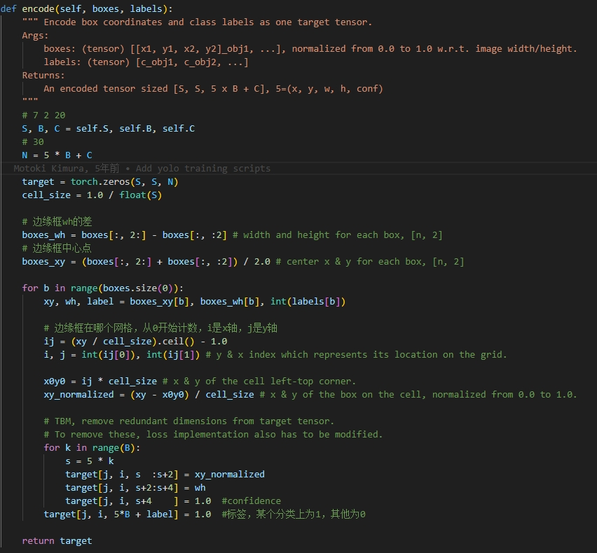

# 1. 概述

目标检测，Object Detection，对图像中的一个或多个对象进行**定位和分类**

输入：包含一个或多个对象的图像，例如照片

输出：一个或多个边界框（例如，由点、宽度和高度定义）以及每个边界框的类标签

# 2. two-stage算法

R-CNN系列，意思是：**Regions** with CNN Features，或者Region-Based Convolutional Neural Network，核心思想是Regions，**区域**

总结：先产生候选区域，然后再进行CNN分类

## 2.1 R-CNN

三个组件：

1. **Region Proposal**：（生成）候选区域。生成并提取类别无关的候选区域，例如候选边界框。
2. **Feature Extractor**：特征提取器。从每个候选区域中提取特征，例如使用深度卷积神经网络。
3. **Classifier**：分类器。将特征分类为已知类别之一，例如线性 SVM 分类器模型。

- 生成候选区域的算法是：*selective search*，选择性搜索算法
- 特征提取器：AlexNet
- 分类器：线性 SVM，**为每个已知类别训练一个 SVM**

注意：特征提取器输入，是原始图片**裁剪缩放后的候选区域部分**（相同的尺寸）。

缺点：

1. 检测速度（很）慢：selective search算法生成候选区域慢，重复提取特征慢。
2. 需要对区域提取算法（选择性搜索算法）生成的**每个候选区域进行基于 CNN 的特征提取**
3. 论文描述了，对图像大约2000个候选区域进行了特征提取
4. 三个组件分开训练操作

## 2.2 Fast R-CNN

改进：

1. 增加一个**RoI Pooling**层（Region of Interest Pooling Layer）：对不同尺寸的区域特征进行**池化**后，尺寸一致，可以输入到全连接层
2. 特征提取器输入的不再是裁剪缩放的候选区域图片，而是**原始图片**，所有只有一次特征提取。

注意：Region Proposal算法任然是*selective search*，选择性搜索算法，速度慢

**Fast R-CNN的特征提取是针对整个图像进行的**，而不是针对每个候选区域单独进行的（R-CNN）。RoI池化层的作用是将不同大小的候选区域映射到固定大小的特征图上，从而使得特征提取和后续分类和回归操作可以在整个图像的特征图上进行共享和并行计算，提高了模型的效率和速度。

Fast R-CNN 比 R-CNN 更准确

## 2.3 faster R-CNN

参考：

[一文读懂Faster RCNN - 知乎 (zhihu.com)](https://zhuanlan.zhihu.com/p/31426458)

[Faster R-CNN 解释物体检测任务 |纸空间博客 --- Faster R-CNN Explained for Object Detection Tasks | Paperspace Blog](https://blog.paperspace.com/faster-r-cnn-explained-object-detection/)

改进：

- 增加一个RPN网络（Region Proposal Network），区域候选网络。用于提出区域以及该区域中要考虑的对象类型的卷积神经网络。
- RPN是一个全卷积网络，可生成各种尺度和长宽比的候选区域。
- 引入了**锚框**的概念

流程：

1. 原始图片输入给conv layers，特征提取，输出是featre map。输入图片尺寸：M\*N，输出特征尺寸：**(M/16)\*(N/16)**

2. featural map输入给RPN网络，先是经过一个3\*3卷积层（不改变尺寸），然后分两路经过1\*1卷积（分别是18层和36层），判断和修正(M/16)\*(N/16)/*9个候选区域

   

   注意：

   - RPN网络并不是要从feature map里裁剪出候选区域，然后操作。而是直接对feature map进行卷积操作。
   - 下图中，256-d就是3\*3卷积层，256个卷积核，feature map输入输出尺寸不变，还是(M/16)\*(N/16)
   - 分两路的1\*1卷积层的数目分别为18和36，那么输出分别是(M/16)\*(N/16)\*18和(M/16)\*(N/16)\*36
   - 18和36的取值原因是：特征提取器输出尺寸是(M/16)\*(N/16)，**每个像素点生成9个锚点**，因为设置3种尺寸和3种长宽比。那么总共有**(M/16)\*(N/16)\*9个锚点，也就是(M/16)\*(N/16)\*18个候选区域**。
   - RPN网络就是判断(M/16)\*(N/16)\*18个候选区域是否是目标框，所以需要输出(M/16)\*(N/16)\*18来判断。还需要回归计算(M/16)\*(N/16)\*18个候选区域的坐标，所以需要输出(M/16)\*(N/16)\*36来判断。

   

   anchors生成候选区域：

   - feature map尺寸是(M/16)\*(N/16)，每个像素点生成9个锚点，映射回原始图片作为候选区域。所以有(M/16)\*(N/16)\*9个候选区域

     

   - 所以anchors生成候选区域的方法是固定的，也就是锚点机制，生成的初始化候选区域并不准确。

   - 候选区域生成跟RPN是没有关系的，RPN网络的作用是去判断和修正这些初始化候选区域。

3. 继续流程，经过RPN网络判断和修正(M/16)\*(N/16)/*9个候选区域，**Proposal Layer**根据判断是positive anchors的框，以及修正后的坐标，计算精准的proposal特征（从feature map中裁剪）。还有细节：

   - 根据positive softmax scores（(M/16)\*(N/16)/*18）由大到小排序anchors，取topN

   - 剔除尺寸非常小的positive anchors

   - 对剩余的positive anchors进行**NMS**（**nonmaximum suppression**），之后得到positive和negative anchors的坐标，再计算出**proposal feature maps**

     - 多个候选目标框（bounding boxes），其中一些可能对同一目标进行了重复检测或者是对同一个目标的不同部分进行了检测。为了减少重复的检测结果并提高检测准确度，需要使用NMS进行后处理
     - NMS的基本思想是在所有检测结果中，选择得分最高的边界框作为最终的检测结果，同时删除与该边界框重叠程度高于某个阈值的其他边界框。这样做的目的是尽可能地保留重要的目标检测结果，同时删除重叠较多的检测结果。

     NMS步骤：

     1. 对所有的检测结果按照其得分进行排序，从高到低。
     2. 选择得分最高的边界框作为输出的第一个检测结果。
     3. 计算剩余边界框与已选择的边界框的交并比（IoU）。
     4. 删除与已选择边界框重叠程度高于某个阈值的其他边界框。
     5. 重复步骤2到4，直到所有的边界框都被处理完毕。

   - 继续流程，有了判断和修正后的proposal feature maps，输入给ROI pooling，统一尺寸，之后输入给分类和回归

# 3. one-stage算法

在一些**实时**的目标检测需求的场景中，R-CNN 系列算法终归是有所欠缺。因而一步走（one-stage）算法便应运而生了，其中以 yolo 算法系列为代表，演绎了一种端到端的深度学习系统的实时目标检测效果。 yolo 算法系列的主要思想就是直接从输入图像得到目标物体的类别和具体位置，**不再像 R-CNN 系列那样产生候选区域**。这样做的直接效果便是快。

## 3.1 SSD

Single Shot MultiBox Detector

模型架构

3个要点：

1. **采用多尺度特征图用于检测**

   所谓多尺度特征图检测，其实就是不同层的feature map用于检测。CNN网络一般前面的特征图比较大，后面会逐渐采用stride=2的卷积或者pool来降低特征图大小。这样做的好处是**比较大的特征图来用来检测相对较小的目标，而小的特征图负责检测大目标**

2. **采用卷积进行检测**

   - 卷积操作后的输出分别对应框的分类和坐标
   - 对于每个单元的每个先验框，其都输出一套独立的检测值，对应一个边界框，主要分为两个部分。第一部分是各个类别的置信度或者评分，值得注意的是SSD将背景也当做了一个特殊的类别，如果检测目标共有 c个类别，SSD其实需要预测 c+1 个置信度值，其中第一个置信度指的是不含目标或者属于背景的评分。在预测过程中，置信度最高的那个类别就是边界框所属的类别。
   - 每个单元设置的先验框数目记为 k，每个单元共需要 (c+4)k个预测值。由于SSD采用卷积做检测，所以就需要 (c+4)k 个卷积核完成这个特征图的检测过程

3. 设置先验框

   - 不同层的特征图设置先验框
   - 借鉴了Faster R-CNN中anchor的理念，每个单元设置尺度或者长宽比不同的先验框，预测的边界框（bounding boxes）是以这些先验框为基准的，在一定程度上减少训练难度。
   - 不同层设置的先验框数目不一样

SSD300一共可以预测：$38*38*4+19*19*6+10*10*6+5*5*6+3*3*4+1*1*4=8732$

先验框匹配原则：

确定训练图片中的ground truth（真实目标）与哪个先验框来进行匹配，与之匹配的先验框所对应的边界框将负责预测它。

在Yolo中，ground truth的中心落在哪个单元格，该单元格中与其IOU最大的边界框负责预测它。但是在SSD中却完全不一样，SSD的先验框与ground truth的匹配原则主要有两点：

1. 对于图片中每个ground truth，找到与其**IOU最大的先验框**，该先验框与其匹配
2. 对于剩余的未匹配先验框，若某个ground truth的 IOU 大于某个阈值（一般是0.5），那么该先验框也与这个ground truth进行匹配（这样做是考虑，很多先验框会是负样本，正负样本极其不平衡）

## 3.2 YOLO

要点：

1. YOLO算法的核心思想是将目标检测问题统一为回归问题
2. 整个网络没有特别的设计，CNN和全连接层。输入图片，输出张量：(7, 7, 30)
3. 所以关键在于：**输出张量(7, 7, 30)对应的target是什么？**

设计思路：

- 将输入图片分为S\*S个网格，对应的，网络输出张量(7, 7, 30)，S=7

- 可以将输出张量(7, 7, 30)对应到划分的网格，总共7\*7个网格，每个网格预测一个目标。**一个目标包括2个BBox和20个类别，一个BBox包括五个数据：四个位置信息和一个confidence信息。**所以**一个网格有30个数据需要回归**。

- 每个BBox都有一个confidence信息：
  $$
  confidence = P_r(Object)*IOU_{pred}^{truth}
  $$

网络输出的target：

1. 将输入图片分为S\*S个网格，**图片中目标在哪个网格，那么在输出张量(7, 7, 30)中对应的网格的target，就是ground truth计算的数据。**

2. 一个目标有2个BBox，它们的target是一样的

   

