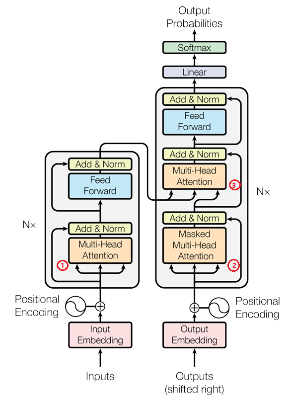
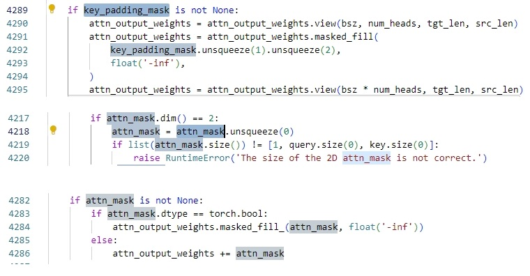
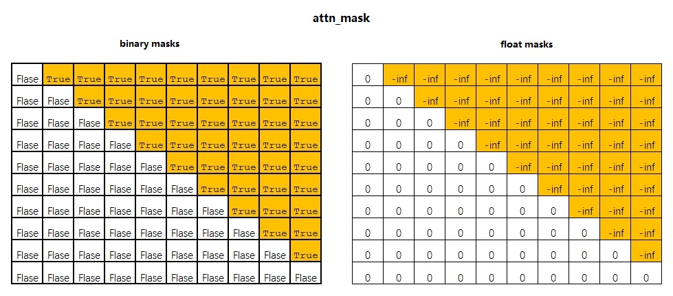

最经在看PyTorch官网上的一篇基于`nn.TransformerEncoder`接口构建语言模型的教程，正好涉及了自注意力掩码的配置，拔出萝卜带出泥，详细研究了一下`nn.MultiheadAttention`的这两个参数

https://pytorch.org/tutorials/beginner/transformer_tutorial.html

先给出结论：

1. **key_padding_mask**的作用是屏蔽计算注意力时key的填充位置。填充的操作主要在seq2seq任务中，虽然RNNs和自注意力都可以处理不定长序列，但是几乎所有seq2seq网络为了计算成本，都设计成了固定序列长度。所以对于一个文本序列，一定会有一个截断或者填充的操作。填充的数据是无效的，不应该参与计算注意力权重，这部分的屏蔽依靠的就是key_padding_mask张量。

2. **attn_mask**的作用是屏蔽自注意力计算时query的未来位置。原因是自注意力本质是序列中每个token依次作为query，整个序列本身作为key和value，基于注意力机制来处理序列数据。如果仅仅是提取序列的特征，比如transformer中编码器，那是没有问题的。

   但如果提取序列数据中特征然后去执行预测任务（比如语言模型），序列中所有的token都参与了每个query计算的特征，然后用这个特征去预测下一个时刻的token。等于说你拿未来数据参与计算的特征来预测未来，这是很不合理的，transformer解码器中带掩码多头注意力就是如此。这部分的屏蔽依靠的就是attn_mask张量。

为了避免歧义，所说的query、key、value是注意力机制本身的三个概念。query是一个token，key和value是多个token组成的序列。多头注意力的输入数据用query输入、key输入、value输入来指代，它们都是3D张量。（带批量维度）

所以，对transformer而言，有三个地方用到了注意力机制。一是编码器的自注意力，用到的掩码当然是key_padding_mask，因为数据集中序列不固定，网络要求固定。二是解码器中的掩码自注意力，两种掩码其实都会用到。三是编码器和解码器连接的注意力机制，它的query是带解码器掩码多头注意力的输出序列里的每一个token，key和value是编码器最后一层transformer块的输出序列，这样一分析，用到的掩码当然是key_padding_mask。



再说一下怎么根据自己的序列和任务来配置掩码

[多头注意力nn.MultiheadAttention的API文档](https://pytorch.org/docs/stable/generated/torch.nn.MultiheadAttention.html#torch.nn.MultiheadAttention)的介绍很有限，只能得到两方面信息：

1. `key_padding_mask`的形状固定： $(N,S)$，`attn_mask`：的形状：$(L,S)$或者$(N⋅num\_heads,L,S)$，其中$N$是批量大小，$L$是query序列长度，$S$是key序列长度。
2. 两种配置掩码的方法：二进制（布尔值）掩码和浮点数掩码。

追溯源码到函数`torch.nn.funtional.multi_head_attention_forward`，它是PyTorch 用 C++ 加速实现的一个函数，在安装的库文件里找不到源文件。在网上可以找到源文件实现细节。[multi_head_attention_forward源文件](https://github.com/pytorch/pytorch/blob/dc4db95540da06623c747bf0f2bf9f4af3d2925a/torch/nn/functional.py#L4026)

源码中的关键操作有三处：



**发现一个bug：对于key_padding_mask张量，其实没有关于浮点数掩码的处理逻辑，但是API文档里介绍两者都支持浮点数掩码和布尔值掩码。所以这里有些不理解，欢迎大佬解惑**

解释上面三处的操作：

1. `key_padding_mask`形状是$(N,S)$，注意力权重`attn_output_weights`形状是$(bsz * num\_heads, tgt\_len, src\_len)$，其实就是$(N⋅num\_heads,L,S)$（源码里：`assert list(attn_output_weights.size()) == [bsz * num_heads, tgt_len, src_len]`），这里key_padding_mask先增加两个维度，之后利用广播机制扩展再屏蔽。

   可以很清楚的看出来，$(N,S)$形状的key_padding_mask张量每一行里的元素，`True`代表该位置应该屏蔽，每一行前n个`False`，就代表这一行作为key的序列有效长度是n。`-inf`和`0`是浮点数掩码，`-inf`是负无穷，它会和注意力权重逐元素相加（`attn_mask`里的逻辑），所以说掩码张量中取值为`-inf`的位置会被屏蔽。（正如我提到的bug，在源码里似乎没有浮点数掩码处理的逻辑，目前我也不清楚怎么回事）。key_padding_mask掩码很简单，也很符合直觉，这个API设计还是很合理的。

2. `attn_mask`如果是2D，形状：$(L,S)$，会先增加1维。注意力权重`attn_output_weights`形状还是$(N⋅num\_heads,L,S)$，依然会在第0维度进行广播机制扩展。

3. $(L,S)$形状的attn_mask张量，第$i$行是序列中第$i$个token作为query能看到的整个序列的位置。这听起来很费解。解释一下，再次强调，attn_mask的作用是屏蔽自注意力计算时query的未来位置。**所以如果使用attn_mask张量掩码，那么你的多头注意力的query、key、value一定要是相同的。**

   假设输入序列的形状都是$(N,L)$，每行代表一个序列，长度是$L$，总共$N$个序列。自注意力是每个序列里的token依次作为query，整个序列作为key和value。不同行（不同序列）里相同位置能看到的有效长度是一样的，所以attn_mask只需要配置一行的掩码，因为每一行的情况都一样。

   再回头看，$(L,S)$形状的attn_mask张量，第$i$行是序列中第$i$个token作为query能看到的整个序列的位置。它的特殊作用决定了$L=S$，并且掩码张量也是固定的：第$i$行是序列中第$i$个token作为query能看到的整个序列的位置，那序列第$i$个token能看到的位置当然就是前$i$个token，你只能看到你现在和过去。

   所以attn_mask张量如果是布尔值掩码，它是一个上三角矩阵，对角线以上的所有元素是`True`对角线及对角线以下所有元素是`False`。如果是浮点数掩码，对角线以上所有元素是`-inf`，对角线及对角线以下所有元素是`0`。

   

注意力机制中，本质是一个token（query）和一个序列（key）计算注意力权重，注意力权重再和另一个序列（value）计算得到一个特征值（很多地方称为上下文）。query是一个token，key和value是多个token组成的序列。多头注意力是并行地执行了$N*L$个query的注意力操作。

所以其实不管是key_padding_mask还是attn_mask，如果要给每一个query设置key的屏蔽位置，其实它们的形状都应该是$(N,L,S)$。如果每个头也要分配，那么形状是$(N⋅num\_heads,L,S)$

之所以`key_padding_mask`形状是$(N,S)$，`attn_mask`形状可以是$(L,S)$，是因为他们的作用决定了很多屏蔽的位置是相同的，源码中才能大量利用广播机制进行扩展。

key_padding_mask掩码，query输入的形状是$(N,L)$，同一行的token作为query，和它们计算的key、value是同一个序列，所以同一行的掩码当然一样。

attn_mask掩码，自注意力专属，query、key、value相同。query输入中同一列，是不同序列中的相同位置的token，它们能看到的位置只能是现在和过去。所以同一列的掩码一样。

总结：PyTorch设计的API，key_padding_mask理解简单，但需要灵活配置。attn_mask理解有些费解，但是形式固定，配置简单（它们直接提供了接口）

#### 配置掩码

##### key_padding_mask

```python
'''
假设N=4,S=15，4个序列的有效长度分别是[5,7,9,12]
两种掩码设置方法：
'''
import torch

N=4
S=15
#1.二进制掩码
key_padding_mask = torch.arange(S)[None, :] >= torch.tensor([5,7,9,12])[:, None]

#2.浮点数掩码
key_padding_mask=torch.masked_fill(torch.zeros(N,S), key_padding_mask, float('-inf'))
```

##### attn_mask

给出query输入的序列长度，掩码配置是固定的，就是一个上三角矩阵，自己配置也很简单。PyTorch提供了配置的接口：`torch.nn.Transformer.generate_square_subsequent_mask`，它是`torch.nn.Transformer`类的一个静态方法，不需要初始化就可以用，参数只有一个，那就是query输入的序列长度。源码如下:

```python
def _generate_square_subsequent_mask(
        sz: int,
        device: torch.device = torch.device(torch._C._get_default_device()),  # torch.device('cpu'),
        dtype: torch.dtype = torch.get_default_dtype(),
) -> Tensor:
    r"""Generate a square causal mask for the sequence. The masked positions are filled with float('-inf').
        Unmasked positions are filled with float(0.0).
    """
    return torch.triu(
        torch.full((sz, sz), float('-inf'), dtype=dtype, device=device),
        diagonal=1,
    )

    
#直接调用，输出浮点数掩码
attn_mask=torch.nn.Transformer.generate_square_subsequent_mask(query.shape[1])
```