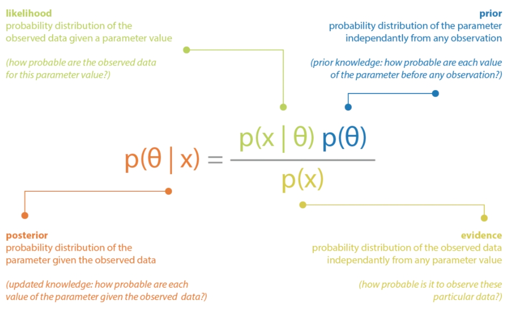

# 1. Auto-Encoder自编码器

参考：

1. [KiKaBeN - Autoencoder --- KiKaBeN - 自动编码器](https://kikaben.com/how-to-reduce-image-noises-by-autoencoder/)
2. [自动编码器：各种各样的自动编码器，附代码](https://keras-cn.readthedocs.io/en/latest/legacy/blog/autoencoder/)
3. [deep-learning/python/autoencoder_noise_reduction.ipynb at master · naokishibuya/deep-learning · GitHub](https://github.com/naokishibuya/deep-learning/blob/master/python/autoencoder_noise_reduction.ipynb)

- 概述

  - 对数据先**降维**再**还原**。降维和还原的两个过程也叫**编码**和**解码**。
  - 自编码器很简单，包括编码器和解码器，对数据进行运算。基本结构不限制，**全连接层和卷积网络都可以**。

  

- 应用

  - 数据去噪（**训练阶段：输入带噪音的图片，输出为原始照片**）
  - 数据降维，从而可视化

- **损失函数：二元交叉熵**

  - 公式
    $$
    L=-\frac{1}{N}\sum_{i=1}^{N}[y_ilog(p_i)+(1-y_i)log(1-p_i)]
    $$
    其中，$N$是样本数，$y_i$是第i个样本的所属类别，$p_i$是第i个样本的预测值。

    需要说明的是，**一个样本指的是什么？**对图片来说，**是一张图片？还是图片上的一个像素？**正确答案是，**一个样本代表图片上的一个像素**。理解这一点很重要，就会明白二元交叉熵和(多分类)交叉熵的关系，以及二元交叉熵的计算要求。

  - **二元交叉熵**和**(多分类)交叉熵**本质上并没有区别，都是在**计算随机变量的交叉熵**。**多分类交叉熵**：
    $$
    L=-\frac{1}{N}\sum_{i=1}^{N}\sum_{c=1}^{K}y_{ic}log(p_{ic})
    $$
    其中，$N$是样本数，$K$是类别数。$y_{ic}$是第i个样本在c类别上的真实值。$p_{ic}$是第i个样本是c类的概率预测值。在图片分类中，**多类别交叉熵的一个样本**是指，**一张图片经过softmax计算的所有预测(logits)。**

    在机器学习处理中，一般将$\pmb{y_i}$写成一个k维向量，只有正确类别的元素为1，其他为0。而$p_i$一般是也经过`softmax`归一化的k维向量，每一个元素代表对应类别的概率预测值。 

    **熵和交叉熵都是是随机变量的概念**，计算交叉熵需要取到随机变量的所有取值。对于二元交叉熵，一个样本代表一个随机变量，只有两个取值，都要计算交叉熵。对于多分类交叉熵，随机变量的所有取值是`softmax`输出的所有`logits`。

  - 二元交叉熵的真实类别$y_i$必须是[0,1]

  - pytorch中

    1. 二元交叉熵：

       ```python
       # 初始化
       criterion = torch.nn.BCELoss(
           weight=None, 
           size_average=None, 
           reduce=None, 
           reduction='mean'
       )
       # 运算
       loss = criterion(model_outputs, targrts)
       
       ===================================================================
       
       # 初始化
       criterion = torch.nn.BCEWithLogitsLoss(
           weight=None, 
           size_average=None, 
           reduce=None, 
           reduction='mean', 
           pos_weight=None
       )
       # 运算
       loss = criterion(model_outputs, targrts)
       
       '''
       如果model_outputs和targrts的尺寸是(batch,channel,higth,width)
       对二元交叉熵而言，样本个数是：b*c*h*w
       
       注意：
       1. nn.BCEWithLogitsLoss和nn.BCELoss不一样的地方在于，nn.BCEWithLogitsLoss不需要应用 sigmoid 函数到模型的输出，它会在内部自己计算 sigmoid 和二元交叉熵损失。nn.BCELoss则要求输入的模型的输出必须经过 sigmoid 函数处理。换言之，如果你的模型损失函数是多分类交叉熵，选择nn.BCEWithLogitsLoss，其实并不需要在模型后面加入sigmod层。但如果选择nn.BCELoss一定要在模型中加入sigmoid层，确保模型输出取值在(0,1)。
       
       2.两者都要求输入中的target中数值必须在[0,1],model_outputs和targrts的尺寸必须一致
       '''
       ```

       

    2. 多分类交叉熵：

       ```python
       #初始化
       criterion = torch.nn.CrossEntropyLoss(
           weight=None, 
           size_average=None, 
           ignore_index=-100, 
           reduce=None, 
           reduction='mean', 
           label_smoothing=0.0
       )
       #运算
       loss = criterion(model_outputs, targrts)
       
       '''
       一般多分类模型的输出model_outputs和targets的尺寸是(batch,labels_num)
       这里的多分类交叉熵的样本数是：b
       
       注意：
       1. 计算损失的时候，并不要求model_outputs中每个样本数据中logits取值范围在(0,1)并且和为1。没有这样的原因是nn.CrossEntropyLoss会在内部自动应用 softmax 操作。换言之，如果你的模型损失函数是多分类交叉熵，其实并不需要在模型后面加入softmax层。
       2.targrts可以有两种形式。
       第一种形式是(batch,labels_num),代表batch个数据，label_num个类别。大多数情况下，某一个正确类别的位置是1，其他为1。这种形式下，model_outputs和targrts尺寸一致。
       第二种形式是：直接给出类别索引。尺寸就是一维向量：(batch,)里面每个数据是代表相对应batch样本正确类别的缩影。比如batch=5，label_num=3,labels_num可能为[0,2,0,1,0]
       '''
       ```

# 2. Variational Auto-Encoder变分自编码器

- 参考
  1. [Variational autoencoders. --- 变分自动编码器。 (jeremyjordan.me)](https://www.jeremyjordan.me/variational-autoencoders/)
  2. [Intuitively Understanding Variational Autoencoders | by Irhum Shafkat | Towards Data Science](https://towardsdatascience.com/intuitively-understanding-variational-autoencoders-1bfe67eb5daf)
  3. https://kikaben.com/vae-2013/
  4. [机器学习方法—优雅的模型（一）：变分自编码器（VAE） - 知乎 (zhihu.com)](https://zhuanlan.zhihu.com/p/348498294)
  5. [Understanding Variational Autoencoders (VAEs) | by Joseph Rocca | Towards Data Science --- 了解变分自编码器 (VAE) |作者：约瑟夫·罗卡 |走向数据科学](https://towardsdatascience.com/understanding-variational-autoencoders-vaes-f70510919f73)
  6. [Diffusion Models vs. GANs vs. VAEs: Comparison of Deep Generative Models | by Ainur Gainetdinov | Towards AI --- 扩散模型、GAN 与 VAE：深度生成模型的比较 |作者：艾努尔·盖内迪诺夫 |迈向人工智能](https://pub.towardsai.net/diffusion-models-vs-gans-vs-vaes-comparison-of-deep-generative-models-67ab93e0d9ae)
  7. [Probability Interview Questions In Data Analysts’ Real Life | by Kseniia Baidina | Oct, 2023 | Towards Data Science --- 数据分析师现实生活中的概率面试问题 |通过 Kseniia Baidina | 2023 年 10 月 |走向数据科学](https://towardsdatascience.com/probability-interview-questions-in-real-life-of-data-analysts-0c8b5953abd8)
- 动机
  - 传统自编码器是对数据降维再还原，本质是复制数据
  - 一个想法：**能否把自编码器直接当做生成模型**？具体一点，**对于编码器和解码器之间的潜在变量z，我们自己输入数据代替潜在变量z给解码器，解码器输出图片数据？**

## 2.1产生代替潜在变量的数据

**随机生成数据(向量)当做潜在变量输入给解码器，能产生有意义的图片吗？**也许能！毕竟在传统的自编码器中，**每次输入图片得到的每一次潜在变量是什么并不清楚？**

那现在随机生成数据当做潜在变量，本质是碰运气的行为


但是先等等，刚刚说的随机生成数据是什么意思？就是**随机采样**！**但随机采样有个前提：你有数据的概率分布**。比如你要随机生成正态分布、均匀分布或者指数分布数据，你首先要知道概率密度函数才能采样。

[[MCMC(一)蒙特卡罗方法 ](https://www.cnblogs.com/pinard/p/6625739.html)

## 2.2 随机采样代替潜在变量

我们希望自己生成数据代替潜在变量，然后输入给解码器得到有意义的图片，生成的方法是**随机采样**，但就有个基本前提：**已知潜在变量的概率分布**

一般随机采样，最常见的概率分布是**高斯分布(当然还有很多其他分布，理论上是都可以的)，给定高斯分布(正态分布)采样数据作为潜在变量输入到解码器**。再复杂一点，潜在变量是多维向量，采样过程应该是**多维高斯采样**。

随之而来的问题：我们用高斯分布采样数据代替潜在变量输入给解码器希望生成有意义的图片。可关键是，**在自编码器的架构中，真正的潜在变量是输入图片给编码器输出的，真正的潜在变量是我们随机采样选择的分布（比如高斯分布）吗？**如果编码器输出的潜在变量不是高斯分布，咱们用采样的高斯分布数据代替潜在变量，那不是自说自话吗？

所以解决问题的关键是：**编码器输出的潜在变量服从的分布，随机采样数据作为解码器的输入的分布，如何保证两者相同？**

## 2.3 **编码器输出的分布**

随机采样数据的分布理论上可以随意选择，那么如何控制编码器输出的潜在变量表示一个分布，并且分布和随机采样分布一致？

值得注意的是，传统自编码器输出的潜在变量是一个低维向量，换句话说是固定的数值，根本不是概率分布。以常见的正态分布举例，需要知道**均值和方差**才能说知道概率分布。再复杂一点，对于多维正态分布，需要知道**均值向量和协方差矩阵**

于是又出现了新问题：**如何控制编码器输出的是概率分布而不是固定数值？**

一个很棒的思路是：**编码器输出的是概率分布的参数（比如均值和方差），而不是概率分布的具体指。**

这样编码器的设计思路就出现了


## 2.4 变分自编码器网络设计


**变分自编码器**网络设计，相比传统自编码器有两点变化：

1. **训练阶段**：编码器输出的潜在向量不再是固定值，而是概率分布参数(**具体是正态分布的均值和方差**)，之后基于参数进行**随机采样**数据输入到解码器。
2. 生成图像的过程不再是输入原始图片到编码器，解码器输出重构图片。而是：**从标准正态分布随机采样输入到解码器，解码器输出随机有意义的图片**

但是这样又会有两个问题：

1. 训练阶段需要根据编码器输出的概率分布参数随机采样，在网络的前向传播时没问题，但是**在反向传播时需要计算梯度**，怎么计算？似乎无法计算
2. **训练阶段是根据编码器输出的参数随机采样作为潜在变量，生成阶段是直接从预定的分布(标准正态分布)随机采样代替潜在变量**，如何保证两者采样是相同？这个问题一直存在，它是保证在生成阶段，**用预定分布的采样数据代替潜在变量输入给解码器能输出有意义图片的关键**。

## 2.5 潜在变量分布损失函数

如何度量两个概率分布的相似性？两个选择：

1. 交叉熵
   $$
   H(P,Q)=-\sum_{i=1}^{n}p(x_i)log(q(x_i))
   $$

2. KL散度(相对熵)
   $$
   D_{KL}(P||Q)=H(P,Q)-H(P)=-\sum_{i=1}^{n}p(x_i)log(q(x_i))-(-\sum_{i=1}^{n}p(x_i)log(p(x_i)))
   $$
   其中，$x_{1:n}$是样本点所有的可能，或者说是随机变量的所有取值。**累加和积分是等价的**。

理论来说，其实两者都可以选择，并不绝对(个人理解)，选择原则有：

- 计算代价，那种相似度量的计算代价下有哪一种
- 如果真实分布P是变化的(**比如知识蒸馏**)，选择KL散度

选择交叉熵还是KL散度？可以计算一下

再啰嗦一下，我们是度量哪两个分布：**一是预设的标准正态分布，而是编码器输出的均值和方差，随机采样的正态分布。**

注意一下细节：

1. 为什么预设的分布选择标准正态分布，其实已经说过，都是为了减小计算代价。预设分布是标准正态分布，编码器输出的参数是正态分布，**这样设计都是为了计算量的考虑，并没有理论上的为什么**。理论上，选择其他分布也可以。
2. 预设的标准正态分布，以及，编码器输出的均值和方差随机采样分布，**是多维的，并且是独立分布**。多维是为了增加复杂度，避免欠拟合。各维度独立分布的原因其实很简单，还是计算代价。

那么$P\sim N(\pmb{0},\pmb{I})$ ，$Q\sim N(\pmb{u},\pmb{\delta}^2)$

已经假设多元正态分布各分量独立，因此只需要推导一**元正态分布**的情形即可：

- **KL散度**

  参考：[正态分布的KL散度-CSDN博客](https://blog.csdn.net/int_main_Roland/article/details/124650909)
  $$
  \begin{align*} KL(P||Q)
  &=\int \frac{1}{\sqrt{2π}}e^{-x^2/2}\log{\frac{e^{-x^2/2}/\sqrt{2π}}{e^{-(x-u)^2/2\delta^2}/(\sqrt{2π}\delta)}}dx\\
  &=\int \frac{1}{\sqrt{2π}}e^{-x^2/2}\log{\{ \delta ·\exp{\left[ \frac{1}{2}(\frac{(x-u)^2}{\delta^2}-x^2) \right]} \}}dx\\
  &=\frac{1}{2}\int \frac{1}{\sqrt{2π}}e^{-x^2/2} \left[\log{\delta^2}+\frac{(x-u)^2}{\delta^2}-x^2 \right]dx \\
  &=\frac{1}{2}\{\log{\delta^2}+\frac{E_{N(0,1)}\left[(X-u)^2\right]}{\delta^2}-E_{N(0,1)}(X^2)\}
  \end{align*}
  $$

  $$
  \begin{align*} KL(Q||P)
  &=\int \frac{1}{\sqrt{2π}\delta}e^{-(x-u)^2/2\delta^2}\log{\frac{e^{-(x-u)^2/2\delta^2}/(\sqrt{2π}\delta)}{e^{-x^2/2}/\sqrt{2π}}}dx\\
  &=\int \frac{1}{\sqrt{2π}\delta}e^{-(x-u)^2/2\delta^2}\log{\{ \frac{1}{\delta} ·\exp{\left[ \frac{1}{2}(x^2-\frac{(x-u)^2}{\delta^2}) \right]} \}}dx\\
  &=\frac{1}{2}\int \frac{1}{\sqrt{2π}\delta}e^{-(x-u)^2/2\delta^2} \left[-\log{\delta^2}+x^2-\frac{(x-u)^2}{\delta^2} \right]dx \\
  &=\frac{1}{2}\{-\log{\delta^2}+E_{N(u,\delta)}(X^2)-\frac{E_{N(u,\delta)}\left[(X-u)^2\right]}{\delta^2}-\}
  \end{align*}
  $$

  对于期望和方差有
  $$
  E(X^2)=E(X)^2+D(X)
  $$
  所以可以继续计算上述KL散度
  $$
  KL(P||Q)=\frac{1}{2}(\log{\delta^2}+\frac{u^2+1}{\delta^2}-1)
  $$

  $$
  KL(Q||P)=\frac{1}{2}(-\log{\delta^2}+u^2+\delta^2-1)
  $$

- 交叉熵
  $$
  \begin{align*} H(P,Q)
  &=\int \frac{1}{\sqrt{2π}}e^{-x^2/2}\log{\left[\frac{1}{\sqrt{2π}\delta}e^{-(x-u)^2/2\delta^2}\right]}dx\\
  &=\int \frac{1}{\sqrt{2π}}e^{-x^2/2} \left[-\frac{1}{2}\log{(2π\delta^2)}-\frac{(x-u)^2}{2\delta^2} \right]dx \\
  &=-\frac{1}{2}\{\log{(2π\delta^2)}+\frac{E_{N(0,1)}\left[(X-u)^2\right]}{\delta^2}\}\\
  &=-\frac{1}{2}\{\log{(2π\delta^2)}+\frac{u^2+1}{\delta^2}   \}
  \end{align*}
  $$

  $$
  \begin{align*} H(Q,P)
  &=\int \frac{1}{\sqrt{2π}\delta}e^{-(x-u)^2/2\delta^2}\log{\left[\frac{1}{\sqrt{2π}}e^{-x^2/2}\right]}dx\\
  &=\int \frac{1}{\sqrt{2π}\delta}e^{-(x-u)^2/2\delta^2} \left[-\frac{1}{2}\log{(2π)}-\frac{1}{2}x^2 \right]dx \\
  &=-\frac{1}{2}\{\log{(2π)}+E_{N(u,\delta)}(X^2)\}\\
  &=-\frac{1}{2}\{\log{(2π)}+u^2+\delta^2\}
  \end{align*}
  $$

  理论上说这四个损失函数都可以，经过试验发现：**标准正态分布在后计算KL散度和交叉熵，收敛更快。**

## 2.6 reparameterization trick

前面有一个问题尚未解决：

> 训练阶段需要根据编码器输出的概率分布参数随机采样，在网络的前向传播时没问题，但是**在反向传播时需要计算梯度**，怎么计算？似乎无法计算

解决的办法是reparameterization trick，简单说，编码器输出的均值$\pmb{u}$和方差$\pmb{\delta}^2$参数，基于参数进行正态分布采样，这个过程无法反向传播，但是可以对这个过程进行一个**转换**：先标准正态分布采样$\pmb{\epsilon}$，之后有$\pmb{z}=\pmb{u}+\pmb{\delta}\odot \pmb{\epsilon}$，其中$\odot$是逐元素相乘相乘。

可以证明：转换操作：$\pmb{z}=\pmb{u}+\pmb{\delta}\odot \pmb{\epsilon}$ 同样是服从正态分布$N(\pmb{u},\pmb{\delta}^2)$


## 2.7 重构损失

问题基本都解决了，重构损失就是解码器输出的重构图片和原始图片之间的误差。

可以选择：

- MSE均方差损失
- BSE二元交叉熵损失

## 2.8 一个理解角度

为了保证**潜在变量输入给解码器生成的数据是有意义的图片**，可以通过两个属性表达

1. 连续性：潜在空间中的**两个接近点在解码后不应给出两个完全不同的内容**
2. 完整性： 从潜在空间采样的点一旦解码应该给出“有意义的”内容


满足这两个属性的办法就是，**对编码器返回的分布均值进行正则化，强制分布接近标准正态分布。**


# 3. variational inference变分推理

目前个人理解，VI和VAE关系不大

参考：

1. [如何简单易懂地理解变分推断(variational inference)？ - 知乎 (zhihu.com)](https://www.zhihu.com/question/41765860)
2. [Bayesian inference problem, MCMC and variational inference | by Joseph Rocca | Towards Data Science --- 贝叶斯推理问题、MCMC 和变分推理 |作者：约瑟夫·罗卡 |走向数据科学](https://towardsdatascience.com/bayesian-inference-problem-mcmc-and-variational-inference-25a8aa9bce29)
3. [论文Variational Inference: A Review for Statisticians](https://arxiv.org/abs/1601.00670)

## 3.1 Statistical inference统计推理

统计推理是根据观察到的内容来了解没有观察到的东西，换句话说，它是根据总体或样本中某些观察到的变量得出结论（例如关于总体中的某些潜在变量（通常是原因）的准时估计、置信区间或分布估计）的过程。

- **贝叶斯推理**

贝叶斯推理是在贝叶斯公式基础上的一种统计推理方法。其核心概念有：**后验概率，先验概率，似然，数据**。基本思想是，**每次记录新观察数据时，都会更新之前由概率分布建模的先验概率，计算出后验概率。**
$$
p(\pmb{\theta}|\pmb{x})=p(\pmb{\theta})·\frac{p(\pmb{x}|\pmb{\theta})}{p(\pmb{x})}\tag{1}
$$


在贝叶斯推理中，**将未知量的估计都归为后验概率的计算** 

然后贝叶斯推理中，有个很棘手的计算困难的问题：

分子部分：第一项$p(\pmb{\theta})$是先验概率，可以假设是高斯分布，在贝叶斯统计中，后验概率就是基于数据对先验概率的修正，所以先验概率假设高斯分布是合理的。第二项$p(\pmb{x}|\pmb{\theta})$是似然概率，就是$\pmb{\theta}$的条件下$\pmb{x}$的概率。如果是机器学习网络模型，似然$p(\pmb{x}|\pmb{\theta})$是网络的logit输出。而如果知道$\pmb{x}$的概率分布类型，只是参数$\pmb{\theta}$未知，仍然可以写出$p(\pmb{x}|\pmb{\theta})$的表达式。总之，**在许多情况下，先验和似然是明确已知的**

分母部分：$p(\pmb{x})$​是观察数据的边缘概率分布。对于离散数据，可以用**全概率公式**。对于连续数据，可以用积分的办法，两者本质是一样的
$$
p(\pmb{x})=\int p(\pmb{\theta})·p(\pmb{x}|\pmb{\theta}) \, d\pmb{\theta}=\int p(\pmb{\theta},\pmb{x}) \, d\pmb{\theta} \tag{2}
$$
难以计算表现在两方面：

1. 大多数情况，上述积分运算无法封闭形式给出
2. 指数级别的计算时间复杂度

解决方法有两种：

1. Markov Chains Monte Carlo sampling methods **马尔可夫链蒙特卡洛采样方法**
2. variational inference 变分推理

## 2.2 计算$p(\pmb{x})$
