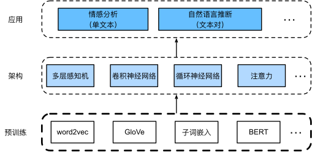
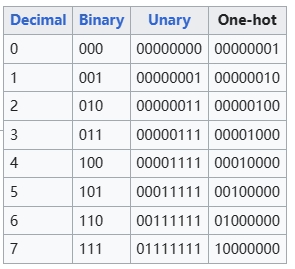
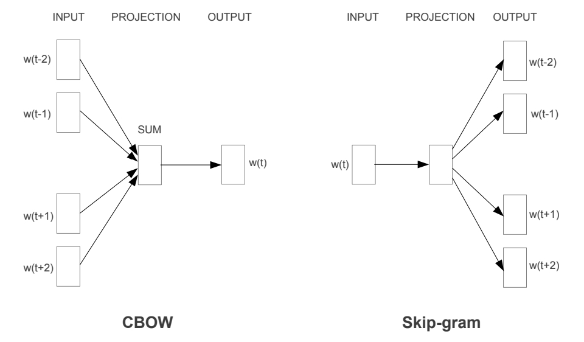
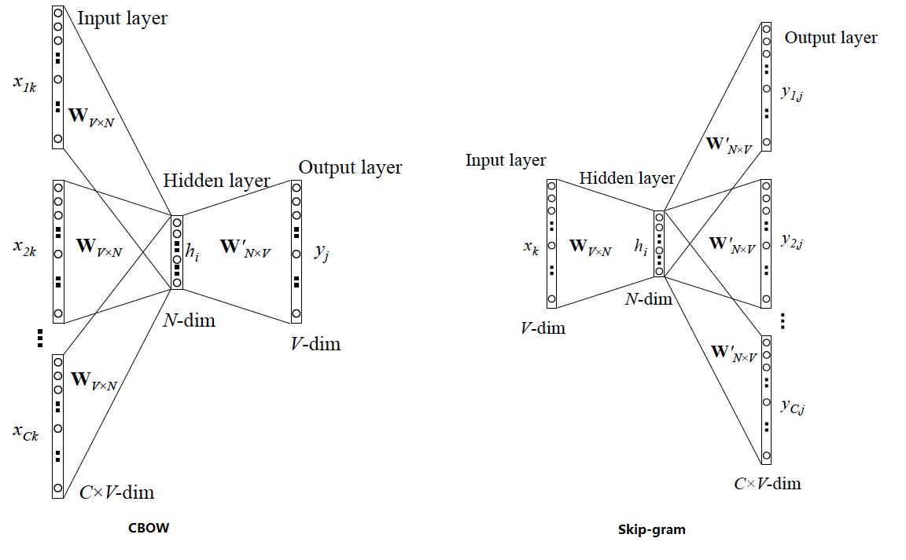
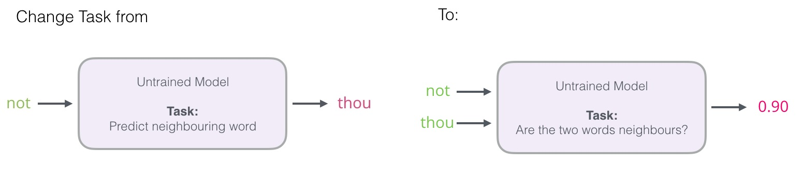
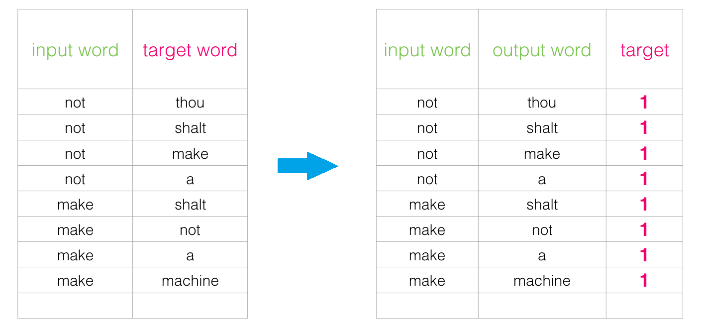
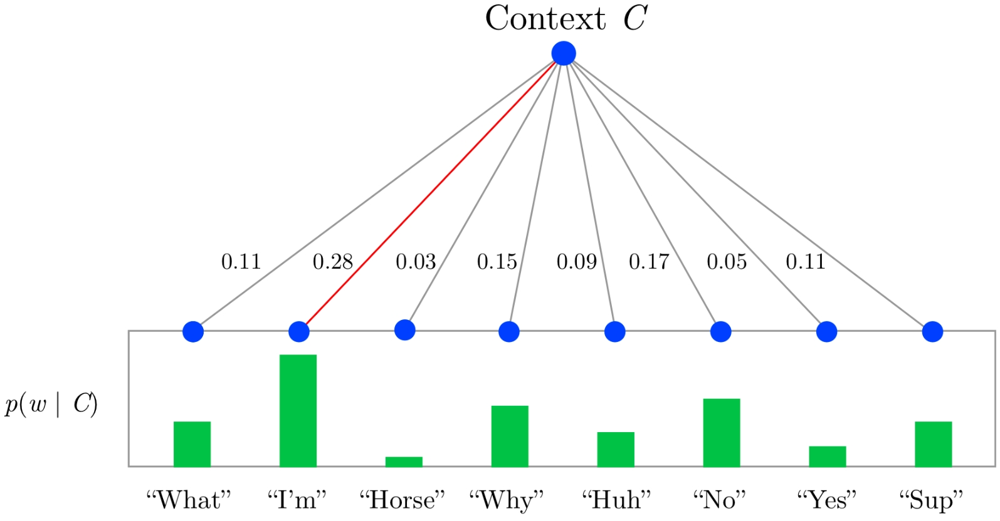
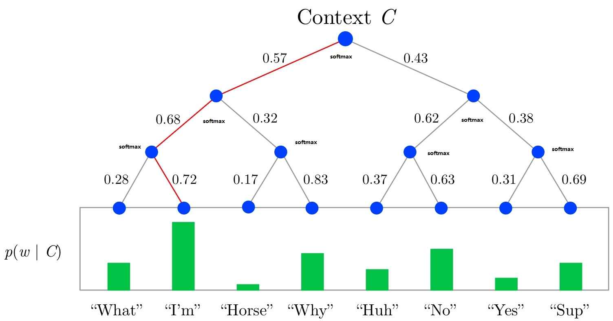
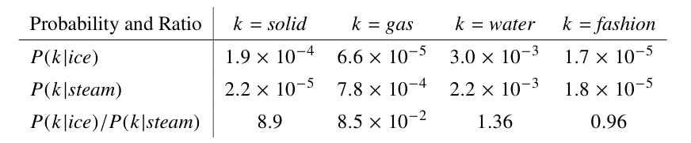
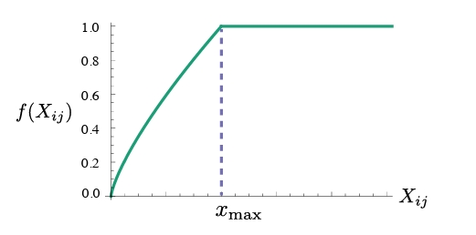

# 概述

词嵌入，word  embeddings，用向量表示一个词word，本质是量化文本（word）的方法

比如50个特征的向量：


要点：

1. 具备相似性的自然语言，它们的词嵌入在某些维度也具备相似性

2. 词嵌入可以通过计算两个向量的夹角余弦值，度量词嵌入的相似度

3. 预训练好的文本表示（词嵌入），可以放入各种深度学习架构，应用不同的自然语言任务

   

4. 使用word2vec、GloVec、子词嵌入模型预训练的词嵌入是固定的，无论上下文如何。例如：

   *go to the bank to deposit some money*和*go to the bank to sit down*中bank的词嵌入是一样的。

5. 基于Transformer编码器的更深的自监督模型BERT预训练的词嵌入可以适用不同的上下文

# 1. One-Hot

假设词典中不同词的数量（词典大小）为N，每个词对应一个从0到N-1的不同整数（索引）。创建了一个全为0的长度为N的向量，并将位置i的元素设置为1。



问题：

1. 向量之间的夹角余弦值都为0，无法度量相似度
2. 向量稀疏，存储浪费

# 2. word2vec

参考：

1. [The Illustrated Word2vec](https://jalammar.github.io/illustrated-word2vec/)
2. [HierarchicalSoftmax代码实现](https://github.com/leimao/Two-Layer-Hierarchical-Softmax-PyTorch/blob/master/utils.py)
3. [论文：Distributed representations of words and phrases and their compositionality](https://proceedings.neurips.cc/paper/2013/file/9aa42b31882ec039965f3c4923ce901b-Paper.pdf)
4. [论文：Efficient estimation of word representations in vector space](https://arxiv.org/pdf/1301.3781.pdf)

网络架构：

1. Skip-gram： Continuous Skip-gram Model

2. CBOW：Continuous Bag-of-Words Model

   

   

   要点：

   1. token输入到网络的编码，本质其实还是one-hot编码。**自然语言处理中文本第一步普遍的量化处理**
   2. 模型的直接任务其实不是获得word embeddings，而是一个词预测多个词（skip-gram），或者多个词预测一个词（CBOW）。训练完得到模型的权重。
   3. word embeddings并不是模型的最终输出，而是网络中**隐藏层的输出**。

- Skip-gram

  1. 跳元模型Skip-gram假设**一个词**可以用来在文本序列中**生成其周围的单词**

  2. 以文本序列为例：`the man loves his son`，选择中心词`love`，窗口为2，跳元模型考虑生成上下文词`the`、`man`、`him`、`son`的条件概率：
     $$
     p(the,man,his,son|loves)
     $$

  3. 假设上下文词是在给定中心词的情况下**独立生成**的，上面的条件概率还可以写成：
     $$
     p(the|loves)\cdot p(man|loves)\cdot p(his|loves)\cdot p(son|loves)
     $$

- CBOW

  1. *连续词袋*（CBOW）模型类似于跳元模型。与跳元模型的主要区别在于，连续词袋模型假设**中心词是基于其在文本序列中的周围上下文词生成的**

下面是优化部分：参考：[论文：Distributed representations of words and phrases and their compositionality](https://proceedings.neurips.cc/paper/2013/file/9aa42b31882ec039965f3c4923ce901b-Paper.pdf)

## 2.1 softmax计算代价

当文本中token数量巨大时（词表vocab中token是单词级别，英语中有多少单词？**数百万**），softmax的计算代价很大

**针对Skip-gram模型**，两种解决办法：

1. 负采样

   - 不是简单的优化，而是直接对模型架构修改

   - 将原始架构中的语言模型转换为逻辑回归（二分类）模型。**模型任务不一样了**。

     

   - 数据集也变化

     

   - 引入负样本：**从词汇表中随机抽取单词**，并保证负样本单词不是窗口内的正样本单词

     

   - 训练细节

     1. 初始化两个矩阵：两个矩阵 - 一个 `Embedding` 矩阵和一个 `Context` 矩阵，形状都是`(vocab_size, embedding_size)`

        

     2. 每个训练步骤中，采用一个正样本及其相关的负样本。从 `Embedding` 矩阵中查找中心词，从 `Context` 矩阵中查找上下文词（即使这两个矩阵都嵌入了词汇表中的每个单词）。

        

     3. 计算内积作为相似度，再经过sigmoid运算作为概率。与标签（0|1）计算交叉熵损失，梯度下降算法去调整`Embedding` 矩阵和`Context` 矩阵里的数值。

   - 两个超参数：窗口大小和负样本数量（负样本数量是正样本多少倍）

     [论文：Dependency-Based Word Embeddings](https://levyomer.files.wordpress.com/2014/04/dependency-based-word-embeddings-acl-2014.pdf)

     [Word2Vec: Effect of window size used](https://stackoverflow.com/questions/22272370/word2vec-effect-of-window-size-used)

2. 分层softmax（hierarchical softmax）

本质是计算更小的softmax。softmax函数功能是将logits计算得到概率，**概率之和为1**。

softmax 函数视为一棵树，其中根节点是隐藏层输出logits，叶子是每个单词的概率。



分层 Softmax 使用多层树计算叶子的值，要评估给定单词的概率，请计算到该节点的路径上每条边的概率的乘积：



**本质是一个softmax分为多个softmax**

## 2.2 下采样Subsampling

文本数据通常有`the`、`a`和`in`等高频词：它们在非常大的语料库中甚至可能出现数十亿次。然而，这些词经常在上下文窗口中与许多不同的词共同出现，提供的有用信息很少。简单说，有些单词频繁出现，用处很小。

下采样就是人为手段去抑制这类高频词。[论文](https://proceedings.neurips.cc/paper/2013/file/9aa42b31882ec039965f3c4923ce901b-Paper.pdf)里提供了很棒的思路：数据集中的每个单词$w_i$被丢弃的概率：
$$
P(w_i)=max(1-\sqrt{\frac{t}{f(w_i)}},0)
$$

```python
import collections

def count_corpus(tokens):
    """统计词元的频率
    基于collections.Counter


    Parameters
    ----------
    tokens : 1D列表或2D列表
        文本数据，内部每行一个list

    Returns
    -------
    dict
        token：频数
    """
    # 这里的tokens是1D列表或2D列表
    if len(tokens) == 0 or isinstance(tokens[0], list):
        # 将词元列表展平成一个列表
        tokens = [token for line in tokens for token in line]
    return collections.Counter(tokens)


def subsample(sentences, vocab):
    """下采样

    Parameters
    ----------
    sentences : 2D list
        文本序列，每行一个内部list
    vocab : Vocab
        词典类示例，提供token和索引的双向映射

    Returns
    -------
    _type_
        _description_
    """
    # 排除未知词元'<unk>'
    sentences = [[token for token in line if vocab[token] != vocab.unk]
                 for line in sentences]
    #统计每个token的频数
    counter = count_corpus(sentences)
    num_tokens = sum(counter.values())

    # 如果在下采样期间保留词元，则返回True
    def keep(token):
        #丢弃公式
        return(random.uniform(0, 1) <
               math.sqrt(1e-4 / counter[token] * num_tokens))

    return ([[token for token in line if keep(token)] for line in sentences],
            counter)
```

# 2.GloVe

论文： [GloVe: Global Vectors for Word Representation](https://nlp.stanford.edu/pubs/glove.pdf)

参考：

1. [Review — GloVe: Global Vectors for Word Representation](https://sh-tsang.medium.com/review-glove-global-vectors-for-word-representation-8b237446a134)
2. [pytorch-glove可以看其他的实现](https://github.com/noaRricky/pytorch-glove)
3. [参考代码： an implementation of GloVe(Global Vectors for Word Representation)](https://github.com/noaRricky/pytorch-glove)
4. https://github.com/hans/glove.py
5. [Stanford’s GloVe Implementation using Python](https://datamahadev.com/stanfords-glove-implementation-using-python/)
6. https://cs.gmu.edu/~kosecka/cs747/NegarNegati_GloVe.pdf

- 动机

  word2vec模型是基于固定窗口的局部上下文信息训练。**GloVe模型试图利用全局上下文信息**

- 词-词共现计数矩阵（全局）Matrix of word-word co-occurrence counts

  比如文本：`I love NLP. I love to make videos.`，矩阵如下：

  |        |  I   | love | NLP  |  to  | make | videos |  .   |
  | :----: | :--: | :--: | :--: | :--: | :--: | :----: | :--: |
  |   I    |  0   |  2   |  0   |  0   |  0   |   0    |  0   |
  |  love  |  2   |  0   |  1   |  1   |  0   |   0    |  0   |
  |  NLP   |  0   |  1   |  0   |  0   |  0   |   0    |  1   |
  |   to   |  0   |  1   |  0   |  0   |  1   |   0    |  0   |
  |  make  |  0   |  0   |  0   |  1   |  0   |   1    |  0   |
  | videos |  0   |  0   |  0   |  0   |  1   |   0    |  1   |
  |   .    |  0   |  0   |  1   |  0   |  0   |   1    |  0   |

  3个概念：

  1. 矩阵元素$x_{ij}$是词$j$在词$i$所有上下文中出现的次数
  2. $x_i$是出现在词$i$上下文中所有词的次数之和：$x_i=\sum_kx_{ik}$
  3. $p_{ij}=p(j|i)=x_{ij}/{x_i}$是词$j$出现在词$i$上下文中的概率

  一个角度理解：

  

  在词`ice`（冰）和`steam`（蒸汽）中计算词`solid`（固体）、`gas`（气体）、`water`（水）、`fashion`（时尚）出现的概率。但是，**只有它们的比值才能抵消非相关词的噪音**。比值远大于1说明和`ice`更相关。远小于1说明和`steam`更相关。

  **词向量学习应该是共现概率的比率，而不是概率本身。**

- 模型的数学形式和推导：
  $$
  F(\pmb{w_i},\pmb{w_j},\pmb{\hat{w_k}})=\frac{p_{ik}}{p_{jk}} \tag{1}
  $$
  其中$w$是词向量，$\hat w$是单独的上下文词向量，变换
  $$
  F((\pmb{w_i}-\pmb{w_j})^T\pmb{\hat{w_k}})=\frac{p_{ik}}{p_{jk}} \tag{2}
  $$
  对于词-词共现矩阵，词和上下文词之间的区别是任意的，两者应该可以自由交换，所以有：
  $$
  F((\pmb{w_i}-\pmb{w_j})^T\pmb{\hat{w_k}})=\frac{F(\pmb{w_i^T}\pmb{\hat{w_k}})}{F(\pmb{w_j^T}\pmb{\hat{w_k}})}
  $$
  则有：
  $$
  F(\pmb{w_i^T}\pmb{\hat{w_k}})=p_{ik}=\frac{x_{ik}}{x_i}
  $$
  求解：
  $$
  \pmb{w_i^T}\pmb{\hat{w_k}}=log(p_{ik})=log(x_{ik})-log(x_i)
  $$
  其实这里已经可以构建模型了，这个模型提出时间是2014，算力有限。继续简化

  考虑右边除了$log(x_i)$就是**对称的**，并且和$k$是无关的，因此可以用偏置$b_i$代替，最后再加一个偏置$b_k$恢复**对称性**。那么，$\pmb{w_i^T}\pmb{\hat{w_j}}+b_i+\hat{b_j}=log(x_{ij})$

  最后的模型的损失函数：
  $$
  J=\sum_{i,j=1}^Vf(x_{ij})(\pmb{w_i^T}\pmb{\hat{w_j}}+b_i+\hat{b_j}-log(x_{ij}))^2
  $$
  $V$是词表的大小

  $f(x_{ij})$解决的问题是：$x_{ij}$可能为0的情况，$log(x_ij)$会发散。

  $f(x_ij)$应该满足：

  1. $f(0)=0$，为了保证$\lim_{{x \to a}}f(x)log^2x$有限
  2. $f(x)$应该非递减，以便罕见的共现不会过分加权。
  3. 对于较大的x值，$f(x)$ 应该相对较小，这样频繁的共现就不会过重。

  所以设计：
  $$
  f(x) = 
  \begin{cases}
    (x/x_{max})^{\alpha}, & \text{if } x < x_{max} \\
    1 & \text{otherwise} 
  \end{cases}
  $$
  设置$x_max=100,\alpha=3/4$

  

# 3. fastText

# 4. BERT

# 5. GPT