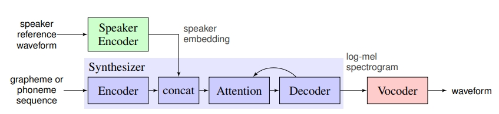
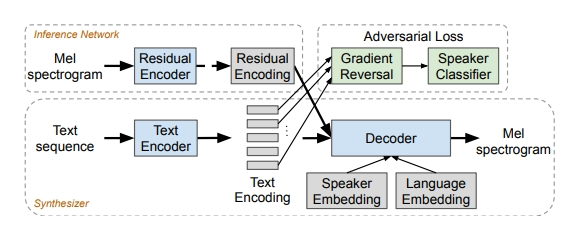
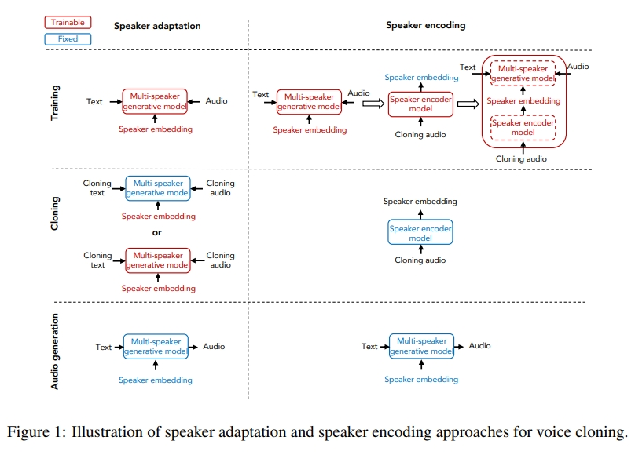
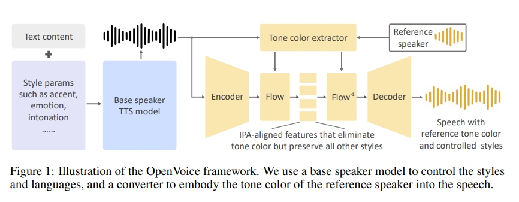

1. [2018]Transfer Learning from Speaker Verification to Multispeaker Text-To-Speech Synthesis

   

   三部分：

   - 说话人编码网络
   - seq2seq语言合成网络
   - 自回归声码器

   a zero-shot learning setting

2. [2019]Learning to Speak Fluently in a Foreign Language: Multilingual Speech Synthesis and Cross-Language Voice Cloning

   - multispeaker, multilingual

   -  transfer voices across languages， e.g. **synthesize fluent Spanish speech** using an English speaker’s voice，without training on any bilingual or parallel examples.无需双语训练

   - 远亲语言有效

   - 关键：

     1. 因素输入表示
     2. 对抗性损失函数，鼓励说话人身份表示和语言内容分开

   - 对每种语言的多个说话人训练

   - 合成说话人的多种语言

     

3. [2018]Neural Voice Cloning with a Few Samples

   - 从极少量的音频样本中学习并合成特定人的声音

   - 两种方法：

     - Speaker adaptation：based on fine-tuning a multi-speaker generative model.
     - Speaker encoding： based on training a separate model to directly **infer a new speaker embedding**, which will be applied to a multi-speaker generative model.

     

4. [2018]Style Tokens: Unsupervised Style Modeling, Control and Transfer in End-to-End Speech Synthesis

   - The embeddings are trained with no explicit labels

   

5. [2023]OpenVoice: Versatile Instant Voice Cloning

   -  instant voice cloning（实时）：少量样本，无需多余训练，Zero-shot TTS
   - requires only a short audio clip
   - generate speech in multiple languages
   - 灵活的风格控制Flexible Voice Style Control：情绪，口音，语调，节奏，暂停，音色
   - 零样本跨语言声音克隆Zero-Shot Cross-Lingual Voice Cloning
   - 分解为更易于实现的子任务：
     - 基础说话者TTS模型：
     - 
     - 控制风格参数和语言
     - 音色转换器：将基础说话者的音色转换为参考说话者的音色

   

6. [2023] Neural codec language models are zero-shot text to speech synthesizers

   - 微软，闭源

7. [2023]Voicebox: Text-Guided Multilingual Universal Speech Generation at Scale

   - meta，闭源

8. [2023]CoquiAI. Xtts taking text-to-speech to the next level

9. [2022]Yourtts: Towards zero-shot multi-speaker tts and zero-shot voice conversion for everyone