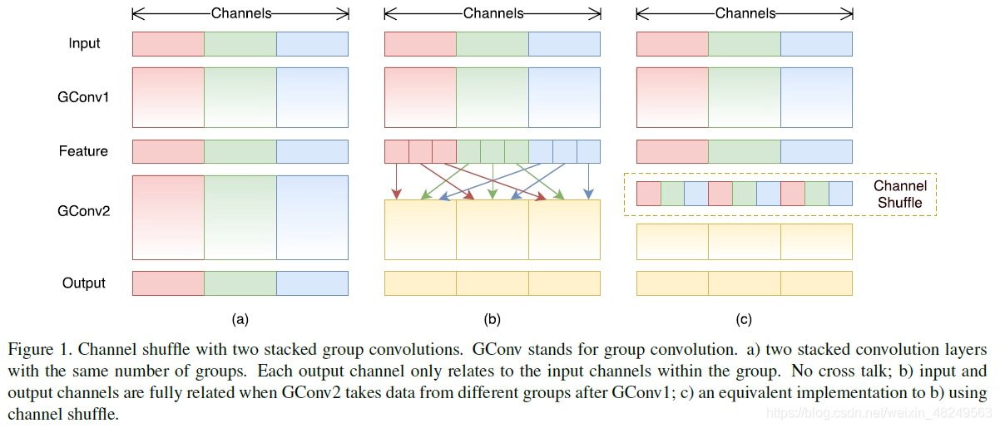
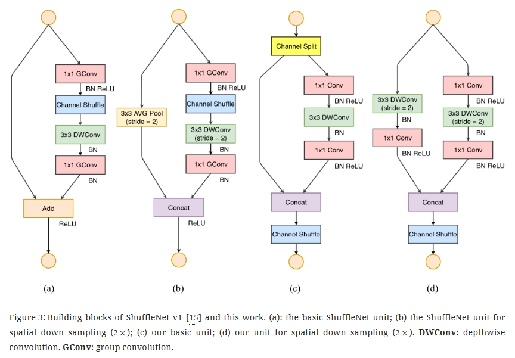
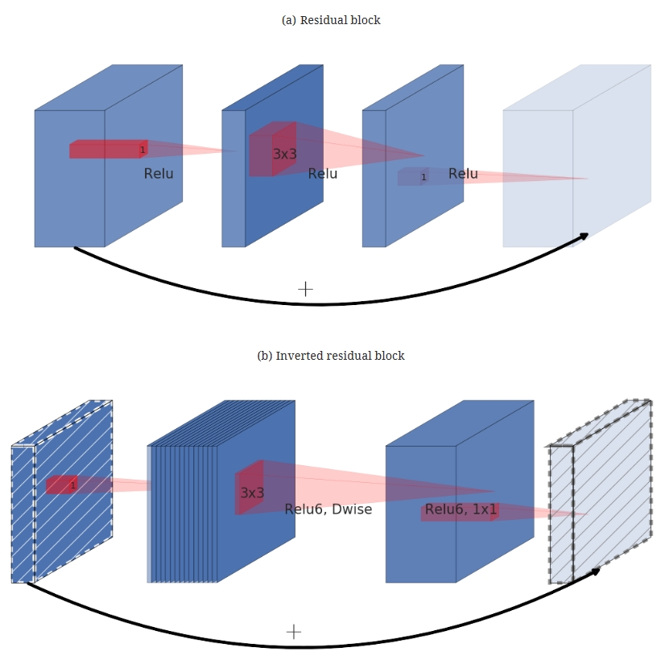

很棒的专栏：

[模型压缩与部署 - 知乎 (zhihu.com)](https://www.zhihu.com/column/c_1607487303357775872)

# 1. SqueezeNet

参考：

[SqueezeNet详解 - 知乎 (zhihu.com)](https://zhuanlan.zhihu.com/p/49465950)

[SqueezeNet：释放边缘计算潜力的关键 |通过数据猎人| SFU 专业计算机科学 |中等的 --- SqueezeNet: The Key to Unlocking the Potential of Edge Computing | by Data Hunters | SFU Professional Computer Science | Medium](https://medium.com/sfu-cspmp/squeezenet-the-key-to-unlocking-the-potential-of-edge-computing-c8b224d839ba)

论文：

[[1602.07360\] SqueezeNet: AlexNet-level accuracy with 50x fewer parameters and <0.5MB model size (arxiv.org)](https://arxiv.org/abs/1602.07360)

压缩策略：

1. 将 3×3 卷积替换成 1×1 卷积：通过这一步，一个卷积操作的参数数量减少了9倍；
2. 减少 3×3 卷积的通道数：一个 3×3 卷积的计算量是 3×3×M（其中 M， N 分别是输入Feature Map和输出Feature Map的通道数），作者认为这样一个计算量过于庞大，因此希望将 M ， N 减小以减少参数数量；
3. 将降采样后置：作者认为较大的Feature Map含有更多的信息，因此将降采样往分类层移动。注意这样的操作虽然会提升网络的精度，但是它有一个非常严重的缺点：即会增加网络的计算量。

网络架构：

- 核心是Fire模块和CNN

- Fire模块，包括三个：

  - squeeze部分：1\*1
  - expand1x1
  - expand3x3

  其中expand1x1和expand3x3的输出cat

  

推理速度：

# 2. ShuffleNet V1

参考：

[轻量化网络系列 | 解读ShuffleNet V1-V2_shufflenet原文-CSDN博客](https://blog.csdn.net/weixin_48249563/article/details/110222269)

论文：

[[1707.01083\] ShuffleNet: An Extremely Efficient Convolutional Neural Network for Mobile Devices (arxiv.org)](https://arxiv.org/abs/1707.01083)

Channel Shuffle for Group Convolutions，组卷积的通道混洗

背景：

- 与 MobileNet V1 所提实验结论相类似，ShuffleNet V1 也发现 1x1 卷积将会耗费了大量的计算时间，为此 ShuffleNet V1 提出逐点群卷积来减少计算时间，但逐点群卷积存在不同组间的信息无法进行交互的问题，因此文章还提出通道混洗的操作来帮助信息流通。（ ShuffleNet V1 很多结构设计思想在 ShuffleNet V2 中被推翻，通道混洗操作被保留）
- 文章发现，诸如 Xception 和 ResNeXt 等 SOTA 的网络基础结构，在小型网络中效率很低，原因在于其中的 1x1 卷积占用了大量的算力资源，对此提出逐点群卷积以减少 1x1 卷积的计算复杂度。这里的逐点群卷积类似于 AlexNet 中的分组卷积，不同的是二者所使用的卷积核大小不同，ShuffleNet V1 使用 1x1 大小的卷积核，而 AlexNet 使用 5x5 或 3x3 大小的卷积核。

核心操作：

1. **Pointwise Group Convolution（逐点群卷积）**：减少 1x1 卷积的计算复杂度
2. **Channel Shuffle（通道混洗）**：解决不同组间的信息无法进行交互的问题

通道混洗：

1. 假设输入特征图的通道数为 c ，将通道分为 g 组（组数 g 可以控制逐点卷积的稀疏连接），每组内包含 n 个通道，即 c = g × n ，在通道方向上可重组为一个 g × n 的矩阵
2. 对 g × n 的矩阵进行转置，得到 n × g的新矩阵；
3. 在 n × g n×gn×g 的新矩阵行方向上进行展平操作，以 n 为距离进行重新分组，得到混洗后的输出通道。

简单说就是在数据的通道维度上交换位置：

- (batch, channels, height, width) -> (batch, group_channels, num_groups, height, width)
- permute(0, 2, 1, 3, 4)
- (batch, group_channels, num_groups, height, width) -> (batch,  num_groups, group_channels, height, width)
- (batch,  num_groups, group_channels, height, width) -> (batch, channels, height, width) 

# 3. ShuffleNet V2

参考：

[轻量级网络论文-ShuffleNetv2 详解 - 知乎 (zhihu.com)](https://zhuanlan.zhihu.com/p/359470360)

论文：

[[1807.11164\] ShuffleNet V2: Practical Guidelines for Efficient CNN Architecture Design (arxiv.org)](https://arxiv.org/abs/1807.11164)

背景贡献

- **看到了 GPU 访存带宽（内存访问代价 MAC）对于模型推理时间的影响，而不仅仅是模型复杂度，也就是 FLOPs 和参数量 Params 对于推理时间的影响**
- **提出了 `4` 个轻量级网络设计的原则和一个新颖的 卷积 `block` 架构-`ShuffleNet v2`**

基本概念：

- MAC：Memory Access Cost，内存访问代价，内存访问次数
- FLOPs：浮点计算次数

高效网络的4个原则（Efficient CNN Architecture Design）：

参考：[ShufflenetV2_高效网络的4条实用准则 - 知乎 (zhihu.com)](https://zhuanlan.zhihu.com/p/42288448)

1. G1：同样大小的通道数可以最小化 `MAC`

2. G2：太多的分组卷积会增加 MAC

3. G3：网络碎片化会减少并行度

   

4. G4：逐元素的操作不可忽视

   逐元素算子包括 `ReLU`、`AddTensor`、`AddBias` 等，它们的 `FLOPs` 相对较小，但是 `MAC` 较大。特别地，我们把 `depthwise convolution` 当作一个 逐元素算子（element-wise operator），因为它的 `MAC/FLOPs` 的比值也较高

ShuffleNet V2核心操作

(a)是shufflet net v1 block、(b)是shufflet net v1 下采样block（stride=2）

(a)是shufflet net v2 block、(b)是shufflet net v2 下采样block（stride=2）

- **通道拆分Channel Split**

  目标：**保持大量且同样宽的通道，同时没有密集卷积（1x1卷积），也没有太多的分组**

  将输入特征图的 c个通道切分成 (`split`) 两个分支 (`branches`)：$(c-c')$ 个通道和 $c'$个通道。根据 **G3** 网络碎片尽可能少，其中一个分支保持不变（shortcut connection），另外一个分支包含三个通道数一样的卷积来满足 **G1**。和 v1 不同，v2 block 的两个 1×1 卷积**不再使用分组卷积**，一部分原因是为了满足 **G2**，另外一部分原因是一开始的通道切分 （`split`）操作已经完成了分组效果

  不再使用add逐元素操作，而是concat操作

- **通道混洗Channel Shuffle**

# 4. MobileNet V1

参考：

[轻量级网络论文-MobileNetv1 详解 - 知乎 (zhihu.com)](https://zhuanlan.zhihu.com/p/359497513)

论文：

[[1704.04861\] MobileNets: Efficient Convolutional Neural Networks for Mobile Vision Applications (arxiv.org)](https://arxiv.org/abs/1704.04861)

背景贡献：

`MobileNet` 论文的主要贡献在于提出了一种**深度可分离卷积架构（DW+PW 卷积）**，先通过理论证明这种架构比常规的卷积计算成本 **FLOPs**（`Mult-Adds`）更小，然后通过分类、检测等多种实验证明模型的有效性。

核心操作：

- Depthwise Conv

  简单说，就是分组卷积，分组数g，特征通道输入$c_1$，输出$c_2$，$g=c_1=c_2$

  一个卷积核只负责一个通道，**一个通道只能被一个卷积核卷积**（不同的通道采用不同的卷积核卷积），也就是输入通道、输出通道和分组数相同的特殊分组卷积

- Pointwise Conv

  `Depthwise` 卷积的问题在于它让每个卷积核单独对一个通道进行计算，但是**各个通道的信息没有达到交换**，从而在网络后续信息流动中会**损失通道之间的信息**，因此论文中就加入了 `Pointwise` 卷积操作，来进一步融合通道之间的信息。`PW` 卷积是一种特殊的常规卷积，卷积核的尺寸为 1×1 

  

# 5. MobileNet V2

参考：

[【轻量级网络】MobileNet-v2详解_mobilenetv2-CSDN博客](https://blog.csdn.net/Roaddd/article/details/111416386)

[详解MobileNetV2 - 知乎 (zhihu.com)](https://zhuanlan.zhihu.com/p/98874284)

论文：

[[1801.04381\] MobileNetV2: Inverted Residuals and Linear Bottlenecks (arxiv.org)](https://arxiv.org/abs/1801.04381)

**MobileNet-v1存在的问题：**
Depthwise convolution确实是大大**降低了计算量**，Depthwise+Pointwise的结构在性能上也能接近普通卷积。但是在实际应用时我们发现**Depthwsie部分的kernel比较容易训废掉**，训练完之后发现Depthwise训出来的kernel有不少是空的。因为depthwise每个kernel_dim相对于普通卷积要小得多，过小的kernel_dim加上ReLU的激活影响下，使得输出神经元很容易变为0，所以就学废了。ReLU对于0的输出梯度为0，所以一旦陷入0输出，就没法恢复了。

核心思想：

- **Inverted residual block**
- **Linear Bottleneck**

**比较两种block：**

1. **Original residual block**：reduce – transfer – expand （中间窄两头宽）

   1x1卷积（**降通道**）过ReLU -> 3x3卷积过ReLU -> 1x1卷积（**升通道**）过ReLU恢复通道 + **并和输入相加**。

   **中间的3x3卷积的输入通道降下来，计算量不会太大**。所以**Residual block是中间窄两头宽（通道数）**。

2. **Inverted residual block**：expand – transfer – reduce （中间宽两头窄）

   1x1卷积（**升通道**）过ReLU -> 3x3Depthwise卷积过ReLU -> 1x1卷积（**降通道**）过ReLU恢复通道 + **并和输入相加**

   中间3x3卷积的输入输出通道随便上升了，但是它是Depthwise，计算量很小，所以通道数可以多一点，效果更好，所以通过1x1卷积先提升通道数，再Depthwise3x3卷积，最后用1x1卷积降低通道数。两端的通道数都很小，所以1x1卷积升通道和降通道计算量都并不大，而中间的通道数虽然多，但是Depthwise 的卷积计算量也不大。

**Linear Bottleneck**：

Bottleneck结构其实就是一种特殊的残差连接，1x1卷积（**降通道**）过ReLU -> 3x3卷积过ReLU -> 1x1卷积（**升通道**）过ReLU恢复通道 + **并和输入相加**。

**Original bottlenecks**：Elementwise + with ReLU at end of a bottleneck，其实就是逐元素相加，并且带上ReLU非线性激活函数

**Linear bottlenecks**：Elementwise + with NO ReLU at the end of a bottleneck，其实就是单纯的逐元素相加

论文中对这块的描述比较晦涩难懂，其实大致意思就是：我们在**设计网络结构的时候，想要减少运算量，就需要尽可能将网络维度设计的低一些，但是维度如果低的话，ReLU激活函数可能会滤除很多有用信息。**而ReLU对于没有滤除的部分，即非零的部分的作用是一个线性分类器。既然在低维空间中使用ReLU做激活变换会丢失很多信息，论文针对这个问题在Bottleneck末尾使用linear bottleneck(即不使用ReLU激活，做了线性变换)来代替原本的非线性激活变换。
实验证明，**使用linear bottleneck可以防止非线性破坏太多信息。**

**Inverted Residual + Linear Bottleneck**

# 6. GhostNet

参考：

[GhostNet网络详解_ghostnet网络结构-CSDN博客](https://blog.csdn.net/STATEABC/article/details/124186897)

[超级详细易懂的GhostNet解析-CSDN博客](https://blog.csdn.net/qq_50489856/article/details/123845657)

论文：

[[1911.11907\] GhostNet: More Features from Cheap Operations (arxiv.org)](https://arxiv.org/abs/1911.11907)

动机：

- **特征图中的冗余性**是一些成功CNN网络的一个重要特征，丰富甚至冗余的信息通常保证了对输入数据的全面理解。例如，ResNet-50生成的输入图像的一些特征图，并且存在**许多相似的特征图对**，就像彼此之间的**幽灵**一样。

  

- 特征图中的冗余（ghost maps）可能是一个成功的深度神经网络的一个重要特征。**我们不是避免冗余的特征映射，而是倾向于接受它们，但以一种低成本高效益的方式。**

**模型压缩（性能通常取决于给定的预训练模型）**：

- pruning connection: 连接剪枝，剪掉一些不重要的神经元连接
- channel pruning: 通道剪枝，剪掉一些无用的通道
- model quantization: 模型量化，在具有离散值的神经网络中对权重或激活函数进行压缩和计算加速
- tensor decomposition: 张量分解，通过利用权重的冗余性和低秩性来减少参数或计算
- knowledge distillation: 知识蒸馏， 利用大模型教小模型，提高小模型的性能

紧凑模型设计（虽然这些模型在很少的FLOPs下获得了良好的性能，但**特征映射之间的相关性和冗余性**并未得到很好的利用。）：

1. **Xception**: depthwise conv operation
2. **MobileNet v1-v3**： depthwise separable conv、 inverted residual block、**AutoML technology**
3. **ShuffleNet v1-v2**： channel shuffle operation、channel split

**Ghost module**：

- 1\*1普通卷积
- $\Phi $是**深度可分离卷积**depthwise
- **Identity**是concat

**Ghost Bottlenecks**：

# 7. PPLCNet

参考：

[PPLCNet：CPU 端强悍担当，吊打现有主流轻量型网络，百度提出 CPU 端的最强轻量型架构-极市开发者社区 (cvmart.net)](https://www.cvmart.net/community/detail/5624)

[PP-LCNet 原理解析_pp-lcnet pytorch-CSDN博客](https://blog.csdn.net/ooooocj/article/details/131061279)

论文：

[[2109.15099v1\] PP-LCNet: A Lightweight CPU Convolutional Neural Network (arxiv.org)](https://arxiv.org/abs/2109.15099v1)

