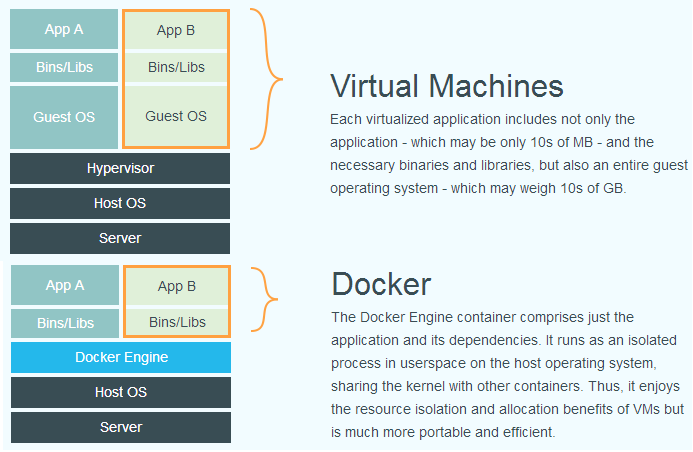

[前言 · Docker -- 从入门到实践 (docker-practice.github.io)](https://docker-practice.github.io/zh-cn/)

模拟完全相同的本地开发环境

开发人员可以通过 [Dockerfile](https://docker-practice.github.io/zh-cn/image/dockerfile) 来进行镜像构建，并结合 [持续集成(Continuous Integration)](https://en.wikipedia.org/wiki/Continuous_integration) 系统进行集成测试。

运维人员则可以直接在生产环境中快速部署该镜像，甚至结合 [持续部署(Continuous Delivery/Deployment)](https://en.wikipedia.org/wiki/Continuous_delivery) 系统进行自动部署。

使用 [`Dockerfile`](https://docker-practice.github.io/zh-cn/image/build.html) 使镜像构建透明化，不仅仅开发团队可以理解应用运行环境，也方便运维团队理解应用运行所需条件，帮助更好的生产环境中部署该镜像。

...

# 1. 概述

- **资源虚拟化**

  - 包括：**虚拟机和容器**

  - 虚拟化是一个过程，在这个过程中，**RAM、CPU、磁盘或网络**等**系统单一资源**可以“虚拟化”，并表示为多个资源

    

    注意：

    - Guest OS是客户操作系统
    - Host OS是主机操作系统

  - 区别很简单：

    - 虚拟机应用不就包括程序本身和依赖项，还**包括操作系统**
    - Docker容器引擎仅仅包括程序和依赖性

    Docker 容器内的**客户操作系统类型通常与宿主操作系统相同**，或者至少在内核级别兼容。

- **什么是容器（Container）？**

  - 容器是一个软件单元，它将**应用程序**及其**运行所需的所有组件（如库、运行时环境、系统工具等）**和功能放在一起。
  - 大多数现代应用程序由多个容器组成，每个容器执行特定的功能。

- **什么是虚拟机（Virtual Machine）？**

  - 物理计算机上创建一个虚拟的硬件平台，每个虚拟机都包含了完整的**操作系统、应用程序**以及**必要的系统资源**，如**内存、CPU和存储空间**
  - 虚拟机可以通过**虚拟化软件（如 VMware、VirtualBox、Hyper-V 等）来创建和管理**。
  - 虚拟机在**云计算**中发挥着至关重要的作用
  - 虚拟机软件创建的虚拟机实际上是在**物理计算机上利用其硬件资源来模拟出的虚拟计算环境。当虚拟机软件关闭虚拟机时，虚拟机所使用的硬件资源会被释放并返回给物理计算机**
  - 虚拟机优点包括：
    1. 硬件隔离
    2. 灵活
    3. 可移植

- **Docker是什么？**
  
  - 容器化平台，开发人员可以将应用程序及其所有依赖项打包到一个称为容器的轻量级、独立和可移植的单元中。
  
  - 这些容器可以**在任何支持 Docker 的环境中运行**，比如：**开发人员的笔记本电脑、数据中心的物理服务器，或者云中的虚拟机**
  - Docker 的核心组件包括 ：
    - **Docker 引擎**：一个轻量级的运行时环境，用于**创建和管理容器**
    - **Docker 镜像**：一个只读模板，其中包含了运行应用程序所需的所有文件和依赖项，**描述了容器的内容和环境**。
    - **Docker 容器**：Docker 镜像的运行实例，可以被启动、停止、删除和移动

# 2. 基本概念

## 2.1 镜像（Image）

- **Docker 镜像** 是一个**特殊的文件系统**，除了提供：
  1. 容器**运行时**所需的**程序、库、资源、配置**等文件外，
  2. 还包含了一些为**运行时**准备的一些**配置参数（如匿名卷、环境变量、用户等）**。
- **镜像 不包含任何动态数据，其内容在构建之后也不会被改变**。

Docker 镜像的核心机制—**多层存储**，简单理解就是：

- docker镜像包含程序运行时的配置、资源等，它是**一层层构建，前一层是后一层的基础**
- 类似搭积木，当需要添加新功能或改变应用程序时，只需要在现有积木上添加新的积木
- **每一层构建完以后不会再改变，后一层上的任何改变只发生在自己这一层**
- **删除前一层文件的操作，实际不是真的删除前一层的文件，而是仅在当前层标记为该文件已删除**

## 2.2 容器（Container）

- 镜像（`Image`）和容器（`Container`）的关系，就像是面向对象程序设计中的**类和实例一样**
- 镜像是静态的定义，容器是镜像运行时的实体
- 容器可以被创建、启动、停止、删除、暂停等

## 2.3 仓库（Repository）

- Docker仓库，就是一种**集中的存储、分发镜像的服务**

- 一个 **Docker Registry** 中可以包含多个 **仓库**（`Repository`）

- 注意： **Docker Registry** 和**仓库**（`Repository`）不是一个概念

- 每个仓库可以包含多个 **标签**（`Tag`），**每个标签对应一个镜像**

- 通常，一个仓库会包含**同一个软件不同版本的镜像**，而标签就常用于对应该软件的各个版本

- Docker 仓库通常分为两种类型：

  - **公共仓库（Public Repository）**：Docker Hub 是最常见的公共 Docker 仓库，它包含了数量庞大的公共镜像，涵盖了各种不同的应用程序、服务和操作系统发行版。任何人都可以在 Docker Hub 上创建账户，并上传、分享自己的镜像，也可以浏览和下载其他人分享的镜像。
  - **私有仓库（Private Repository）**：除了公共仓库外，还有一些企业或团队可能需要自己的私有 Docker 仓库，用于存储和管理他们内部开发的镜像。一些常见的私有 Docker 仓库包括 Docker Trusted Registry (DTR)、Amazon Elastic Container Registry (ECR)、Google Container Registry (GCR) 等。私有仓库通常提供更严格的访问控制和安全性，以确保镜像的保密性和可靠性。

- 从仓库下载镜像方法：

  1. 公共仓库：

     ```bash
     docker pull [选项] [Docker Registry 地址[:端口号]/]仓库名[:标签]
     ```

  2. 私有仓库：

     - 登陆私有仓库

       `docker login my.private.registry.com`

     - 下载镜像

       `docker pull [选项] [Docker Registry 地址[:端口号]/]仓库名[:标签]`

# 3. 安装Docker

## 3.1 ubuntu

**安装：**

- **apt方式安装**，需要先安装依赖：

  1. `apt-transport-https`：这个软件包允许 `apt` **命令通过 HTTPS 协议下载软件包**。因为 Docker 官方的 APT 仓库是通过 HTTPS 提供的，所以这个包是必需的。
  2. `ca-certificates`：这个软件包包含了一些**根证书**，用于**验证 HTTPS 连接的安全性**。当通过 HTTPS 下载 Docker 软件包时，这些根证书将会被用于验证服务器的身份。
  3. `curl`：这是一个用于**在命令行中传输数据的工具**。在这个上下文中，`curl` 将用于从 Docker 官方网站下载 GPG 密钥。
  4. `gnupg`：GnuPG 是一个**用于加密和签名数据的工具**。在这个上下文中，`gnupg` 将被用于验证下载的软件包的真实性。
  5. `lsb-release`：这个软件包提供了一个**用于查询系统版本信息的命令行工具**。在这个上下文中，`lsb-release` 可能用于检查系统版本，以便选择适当的 Docker 软件包。

  ```bash
  # 卸载旧版本
  sudo apt-get remove docker docker-engine docker.io
  # 更新本地ubuntu系统的软件包列表
  sudo apt-get update
  
  # 安装一些在 Ubuntu 系统中使用 Docker 时所需的依赖软件包： 
  sudo apt-get install apt-transport-https ca-certificates curl gnupg lsb-release
  
  # 下载Docker 的 GPG 密钥，并安装到系统
  curl -fsSL https://mirrors.aliyun.com/docker-ce/linux/ubuntu/gpg | sudo gpg --dearmor -o /usr/share/keyrings/docker-archive-keyring.gpg
  
  # 向 sources.list 中添加 Docker 软件源
  echo \
    "deb [arch=amd64 signed-by=/usr/share/keyrings/docker-archive-keyring.gpg] https://mirrors.aliyun.com/docker-ce/linux/ubuntu \
    $(lsb_release -cs) stable" | sudo tee /etc/apt/sources.list.d/docker.list > /dev/null
  
  # 安装docker
  sudo apt-get update
  sudo apt-get install docker-ce docker-ce-cli containerd.io docker-compose-plugin
  ```

**启动：**

```bash
# 启动
sudo systemctl enable docker
sudo systemctl start docker
```

**建立 docker 用户组：**

- 简单说，只有 **`root` 用户**和 **`docker` 组的用户**才可以访问 Docker 引擎的 Unix socket，而`docker` 命令会使用 [Unix socket](https://en.wikipedia.org/wiki/Unix_domain_socket) 与 Docker 引擎通讯。
- 出于安全考虑，一般 Linux 系统上不会直接使用 `root` 用户，不可能每次使用命令前面都带上`sudo`。
- 这时候就考虑：**将当前用户添加到 Docker 用户组**

```bash
# 建立 docker 组
sudo groupadd docker

# 将当前用户加入 docker 组
sudo usermod -aG docker $USER
```

**运行示例容器：**

hello-world" 的 Docker 镜像

如果本地没有名为 "hello-world" 的 Docker 镜像，Docker 将会从 Docker Hub（或者其他配置的镜像仓库）中下载 "hello-world" 镜像。

```bash
# rm意味着容器运行结束后自动删除容器
docker run --rm hello-world
```

**查看宿主机运行的容器：**

`docker ps`

**查看宿主机容器，包括结束但是没有删除的：**

`docker ps -a`

**查看本地镜像：**

`docker images`

**删除容器：**

```bash
# 容器已经结束
docker rm <容器ID或者容器名称>

# 容器还在运行
docker stop <容器ID或者容器名称>
```

**删除镜像：**

注意需要先**停止正在运行依赖待删除镜像的容器**

```bash
docker rmi <镜像ID或者镜像名称>

docker rmi <镜像1ID或者镜像1名称> <镜像2ID或者镜像2名称> <镜像3ID或者镜像3名称> ...

```

## 3.2 windows

注意，**在 Windows 上运行 Docker 有两种主要的方式**：

1. **Docker Desktop for Windows：** Docker Desktop for Windows 是一种适用于 Windows 系统的 Docker 应用程序，它可以直接在 Windows 上运行 Docker 引擎。使用 Docker Desktop，可以在 Windows 上轻松地创建、管理和运行容器，而无需额外安装虚拟机或 Linux 子系统。
2. **WSL 2 与 Docker Desktop 结合使用：**可以选择将 WSL 2 与 Docker Desktop 结合使用。在这种情况下，Docker Desktop 将在 WSL 2 中运行，并直接使用 WSL 2 内核来执行 Docker 引擎。这种方式能够提供更好的性能和集成，特别是在 Windows 10 的最新版本中，WSL 2 已经成为默认的 WSL 版本。

**如果直接在 Windows 上使用 Docker Desktop for Windows 运行 Docker，那么应该选择适用于 Windows 平台的 Docker 镜像**

**如果 WSL 中运行 Docker，实际上是在 Linux 子系统中运行 Docker 引擎。因此，应该下载适用于 Linux 平台的 Docker 镜像。**

## 3.3 配置Docker Registry镜像加速器

 https://docker-practice.github.io/zh-cn/install/mirror.html

# 4. 基本命令

**运行示例容器：**

hello-world" 的 Docker 镜像

如果本地没有名为 "hello-world" 的 Docker 镜像，Docker 将会从 Docker Hub（或者其他配置的镜像仓库）中下载 "hello-world" 镜像。

```bash
# rm意味着容器运行结束后自动删除容器
docker run --rm hello-world
```

**查看宿主机运行的容器：**

`docker ps`

**查看宿主机容器，包括结束但是没有删除的：**

`docker ps -a`

**查看本地镜像：**

`docker images`

**删除容器：**

```bash
# 容器已经结束
docker rm <容器ID或者容器名称>

# 容器还在运行
docker stop <容器ID或者容器名称>
```

**删除镜像：**

注意需要先**停止正在运行依赖待删除镜像的容器**

```bash
docker rmi <镜像ID或者镜像名称>

docker rmi <镜像1ID或者镜像1名称> <镜像2ID或者镜像2名称> <镜像3ID或者镜像3名称> ...
```